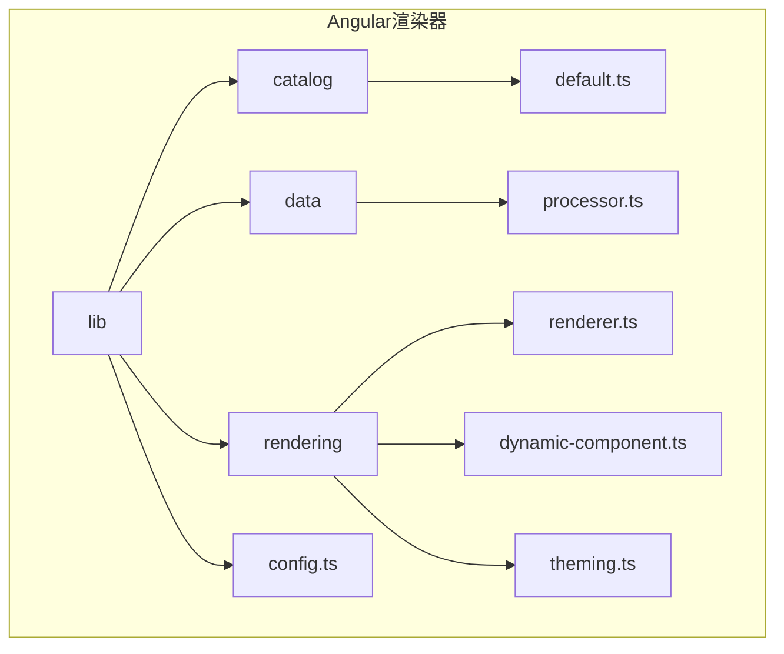
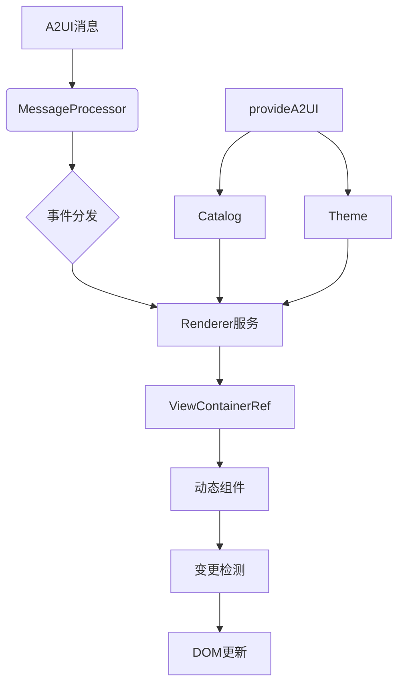
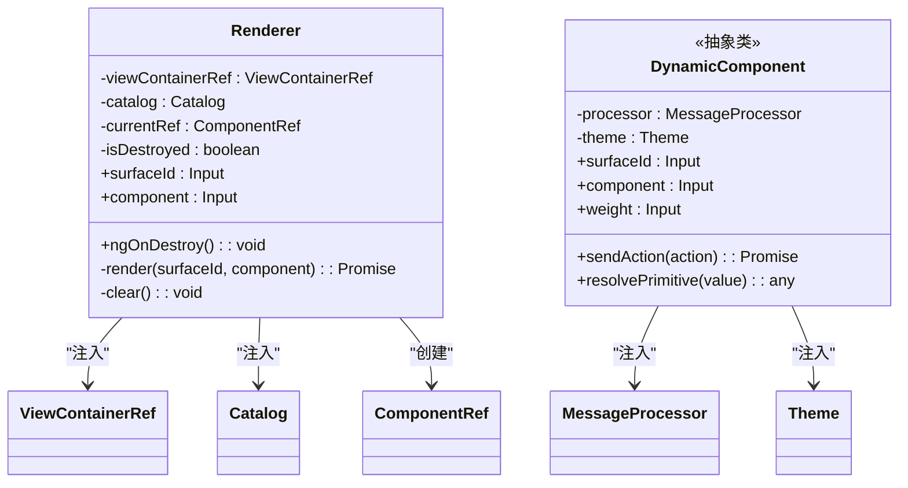
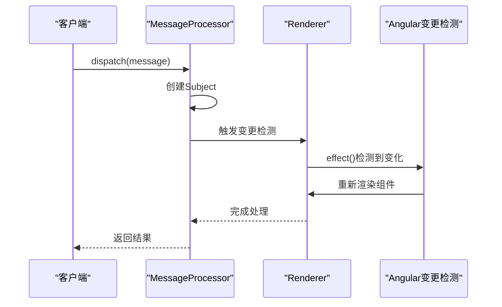
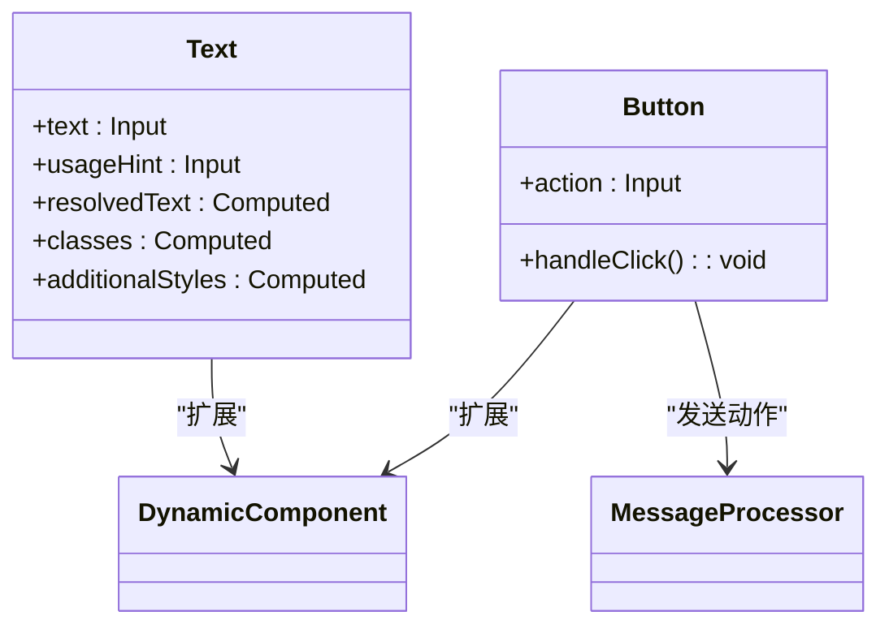
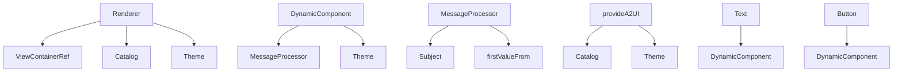
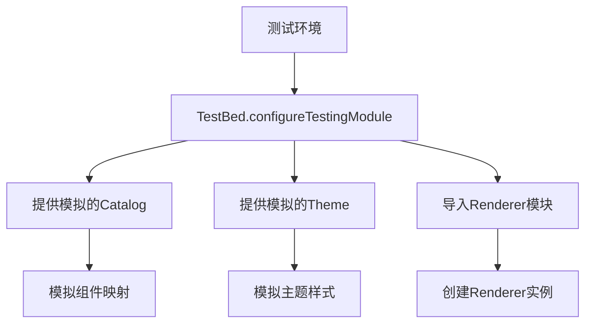

# Angular渲染器API

<cite>
**本文档中引用的文件**  
- [config.ts](file://renderers/angular/src/lib/config.ts)
- [renderer.ts](file://renderers/angular/src/lib/rendering/renderer.ts)
- [processor.ts](file://renderers/angular/src/lib/data/processor.ts)
- [default.ts](file://renderers/angular/src/lib/catalog/default.ts)
- [dynamic-component.ts](file://renderers/angular/src/lib/rendering/dynamic-component.ts)
- [text.ts](file://renderers/angular/src/lib/catalog/text.ts)
- [button.ts](file://renderers/angular/src/lib/catalog/button.ts)
- [theming.ts](file://renderers/angular/src/lib/rendering/theming.ts)
- [index.ts](file://renderers/angular/src/lib/rendering/index.ts)
- [index.ts](file://renderers/angular/src/lib/data/index.ts)
- [public-api.ts](file://renderers/angular/src/public-api.ts)
</cite>

## 目录
1. [简介](#简介)
2. [项目结构](#项目结构)
3. [核心组件](#核心组件)
4. [架构概述](#架构概述)
5. [详细组件分析](#详细组件分析)
6. [依赖分析](#依赖分析)
7. [性能考虑](#性能考虑)
8. [故障排除指南](#故障排除指南)
9. [结论](#结论)

## 简介
本文档提供了A2UI Angular渲染器的完整API参考。该渲染器是一个用于将A2UI消息协议转换为Angular组件树的库，支持动态组件渲染、数据绑定和事件处理。它通过`provideA2UI()`注入器函数配置，使用`Renderer`服务进行核心渲染操作，并通过`MessageProcessor`处理A2UI消息与Angular变更检测周期的集成。

## 项目结构
Angular渲染器模块位于`renderers/angular`目录下，采用标准的Angular库结构。核心功能分布在`lib`目录的多个子模块中，包括渲染、数据处理、目录和配置。



**Diagram sources**
- [config.ts](file://renderers/angular/src/lib/config.ts)
- [renderer.ts](file://renderers/angular/src/lib/rendering/renderer.ts)
- [processor.ts](file://renderers/angular/src/lib/data/processor.ts)

**Section sources**
- [config.ts](file://renderers/angular/src/lib/config.ts)
- [renderer.ts](file://renderers/angular/src/lib/rendering/renderer.ts)
- [processor.ts](file://renderers/angular/src/lib/data/processor.ts)

## 核心组件
本节详细分析Angular渲染器的核心组件，包括`provideA2UI()`注入器函数、`Renderer`服务和`MessageProcessor`类。

**Section sources**
- [config.ts](file://renderers/angular/src/lib/config.ts#L20-L25)
- [renderer.ts](file://renderers/angular/src/lib/rendering/renderer.ts#L39-L110)
- [processor.ts](file://renderers/angular/src/lib/data/processor.ts#L27-L48)

## 架构概述
Angular渲染器采用基于依赖注入和响应式编程的架构，将A2UI消息协议与Angular的变更检测机制无缝集成。



**Diagram sources**
- [config.ts](file://renderers/angular/src/lib/config.ts#L20-L25)
- [renderer.ts](file://renderers/angular/src/lib/rendering/renderer.ts#L39-L110)
- [processor.ts](file://renderers/angular/src/lib/data/processor.ts#L27-L48)

## 详细组件分析
本节深入分析Angular渲染器的关键组件，包括配置、渲染、数据处理和组件实现。

### provideA2UI注入器函数
`provideA2UI()`是一个环境提供者函数，用于配置A2UI渲染器的全局设置。它接受一个包含目录和主题的配置对象，并通过Angular的依赖注入系统提供这些服务。

```mermaid
classDiagram
class provideA2UI {
+provideA2UI(config : {catalog : Catalog, theme : Theme}) : EnvironmentProviders
}
class Catalog {
<<interface>>
+[key : string] : ComponentConfig | ComponentType
}
class Theme {
<<interface>>
+components : ComponentThemes
+markdown : MarkdownTheme
+additionalStyles? : AdditionalStyles
}
provideA2UI --> Catalog : "使用"
provideA2UI --> Theme : "使用"
```

**Diagram sources**
- [config.ts](file://renderers/angular/src/lib/config.ts#L20-L25)
- [theming.ts](file://renderers/angular/src/lib/rendering/theming.ts#L20-L23)

#### 配置选项
`provideA2UI()`函数支持以下配置选项：

- **defaultCatalog**: 默认组件目录，定义了A2UI组件类型到Angular组件的映射
- **eventHandler**: 事件处理程序，用于处理用户交互事件
- **dataModelTransform**: 数据模型转换器，用于在渲染前转换数据模型

**Section sources**
- [config.ts](file://renderers/angular/src/lib/config.ts#L20-L25)
- [default.ts](file://renderers/angular/src/lib/catalog/default.ts#L24-L186)

### Renderer服务
`Renderer`服务是Angular渲染器的核心，负责将A2UI组件节点渲染为Angular组件实例。



**Diagram sources**
- [renderer.ts](file://renderers/angular/src/lib/rendering/renderer.ts#L39-L110)
- [dynamic-component.ts](file://renderers/angular/src/lib/rendering/dynamic-component.ts#L29-L101)

#### renderSurface方法
`renderSurface()`方法（在代码中通过`render()`私有方法实现）负责渲染表面组件。它使用Angular的`ViewContainerRef`动态创建组件，并通过`effect()`响应式系统监听输入变化。

**Section sources**
- [renderer.ts](file://renderers/angular/src/lib/rendering/renderer.ts#L73-L103)

#### updateComponent方法
`updateComponent()`方法（通过输入属性自动触发）利用Angular的响应式系统自动更新组件。当`surfaceId`或`component`输入发生变化时，`effect()`会自动调用`render()`方法重新渲染组件。

**Section sources**
- [renderer.ts](file://renderers/angular/src/lib/rendering/renderer.ts#L51-L55)

### MessageProcessor类
`MessageProcessor`类负责处理A2UI消息与Angular变更检测周期的集成。



**Diagram sources**
- [processor.ts](file://renderers/angular/src/lib/data/processor.ts#L27-L48)
- [renderer.ts](file://renderers/angular/src/lib/rendering/renderer.ts#L51-L55)

#### A2UI消息转换
`processor.ts`中的`MessageProcessor`类将A2UI消息转换为Angular的变更检测周期。它使用`Subject`和`firstValueFrom`来处理异步边界，确保消息处理与Angular的变更检测机制正确同步。

**Section sources**
- [processor.ts](file://renderers/angular/src/lib/data/processor.ts#L27-L48)

### 组件实现示例
以`Text`和`Button`组件为例，展示如何实现A2UI组件。



**Diagram sources**
- [text.ts](file://renderers/angular/src/lib/catalog/text.ts#L58-L138)
- [button.ts](file://renderers/angular/src/lib/catalog/button.ts#L46-L57)

## 依赖分析
Angular渲染器的依赖关系清晰，采用分层架构设计。



**Diagram sources**
- [renderer.ts](file://renderers/angular/src/lib/rendering/renderer.ts#L40-L42)
- [dynamic-component.ts](file://renderers/angular/src/lib/rendering/dynamic-component.ts#L30-L31)
- [processor.ts](file://renderers/angular/src/lib/data/processor.ts#L28)
- [config.ts](file://renderers/angular/src/lib/config.ts#L22-L23)

**Section sources**
- [renderer.ts](file://renderers/angular/src/lib/rendering/renderer.ts#L17-L31)
- [dynamic-component.ts](file://renderers/angular/src/lib/rendering/dynamic-component.ts#L19-L21)
- [processor.ts](file://renderers/angular/src/lib/data/processor.ts#L19)
- [config.ts](file://renderers/angular/src/lib/config.ts#L18)

## 性能考虑
为了优化Angular渲染器的性能，建议采用以下策略：

1. **OnPush变更检测策略**: 由于渲染器使用`effect()`进行响应式更新，建议在宿主组件中使用OnPush策略以减少不必要的变更检测。
2. **大型组件树的懒加载**: 通过动态导入实现组件的懒加载，如`default.ts`中所示，使用`import('./component').then()`语法。
3. **避免不必要的重新渲染**: `Renderer`服务在重新渲染前会调用`clear()`方法销毁现有组件，确保内存的有效管理。
4. **样式注入优化**: 全局样式只注入一次，通过静态变量`hasInsertedStyles`确保不会重复注入。

**Section sources**
- [renderer.ts](file://renderers/angular/src/lib/rendering/renderer.ts#L60-L65)
- [default.ts](file://renderers/angular/src/lib/catalog/default.ts#L48)

## 故障排除指南
本节提供常见问题的解决方案和测试建议。

### 模拟和注入Renderer服务
在测试环境中，可以通过以下方式模拟和注入`Renderer`服务：



**Section sources**
- [renderer.ts](file://renderers/angular/src/lib/rendering/renderer.ts#L39-L110)
- [config.ts](file://renderers/angular/src/lib/config.ts#L20-L25)

### 常见问题
1. **组件未渲染**: 检查`Catalog`配置是否正确，确保组件类型在目录中定义。
2. **样式丢失**: 确认全局样式已正确注入，检查`Renderer.hasInsertedStyles`的值。
3. **事件未处理**: 验证`MessageProcessor`是否正确注入，检查`dispatch()`方法的调用。

## 结论
A2UI Angular渲染器提供了一个强大而灵活的框架，用于将A2UI消息协议集成到Angular应用中。通过`provideA2UI()`函数的配置、`Renderer`服务的动态渲染和`MessageProcessor`的消息处理，开发者可以轻松实现复杂的UI渲染逻辑。建议在实际使用中结合OnPush策略和懒加载技术，以获得最佳性能表现。