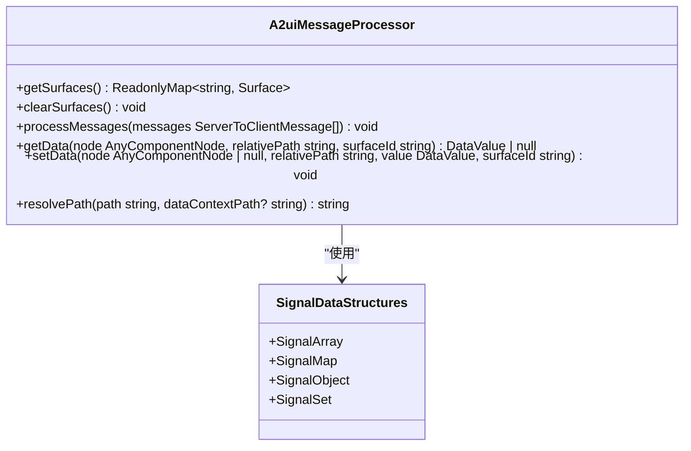
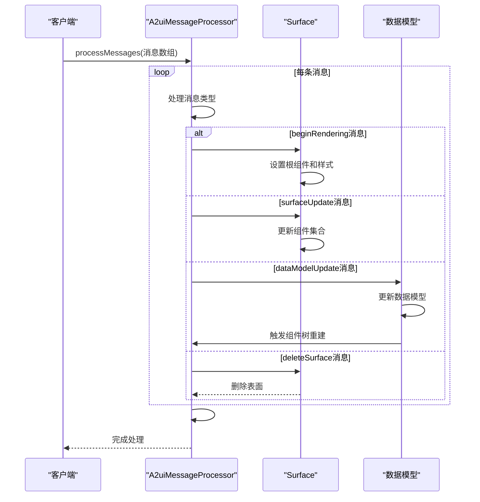
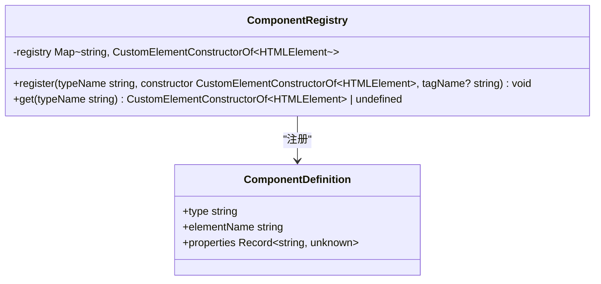
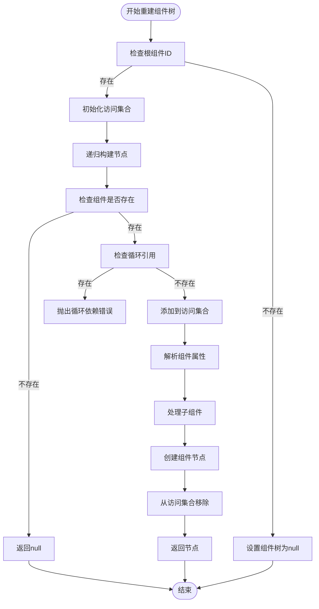
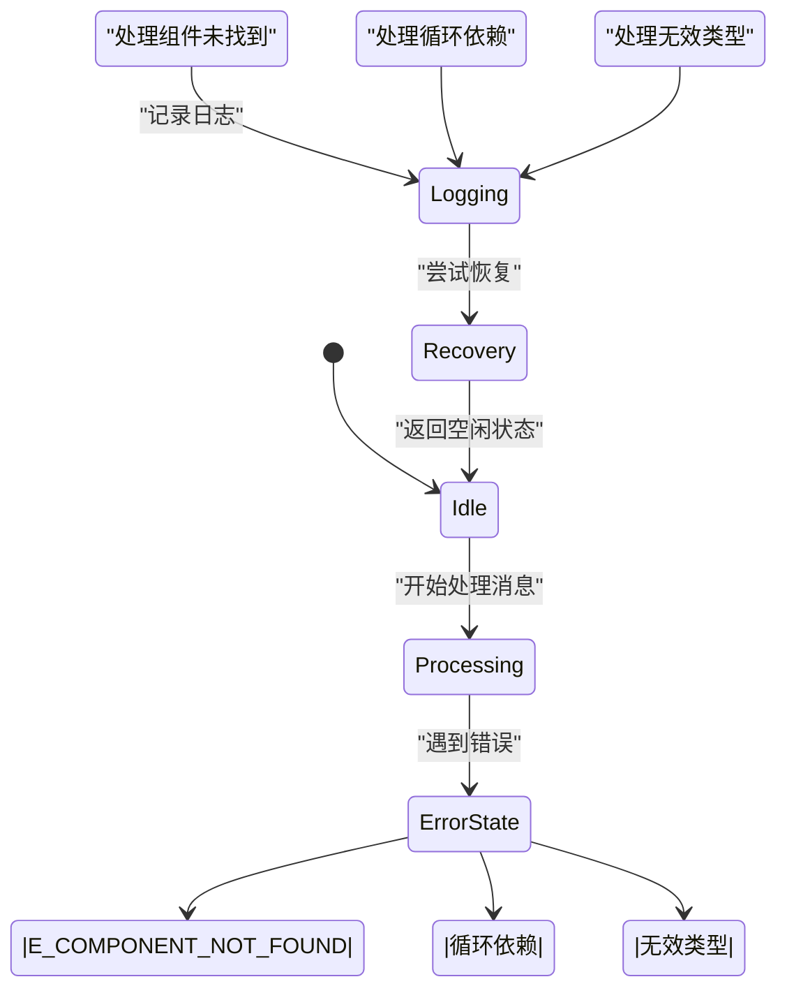

# Lit渲染器API

<cite>
**本文档中引用的文件**  
- [core.ts](file://renderers/lit/src/0.8/core.ts)
- [signal-model-processor.ts](file://renderers/lit/src/0.8/data/signal-model-processor.ts)
- [model-processor.ts](file://renderers/lit/src/0.8/data/model-processor.ts)
- [component-registry.ts](file://renderers/lit/src/0.8/ui/component-registry.ts)
- [types.ts](file://renderers/lit/src/0.8/types/types.ts)
- [components.ts](file://renderers/lit/src/0.8/types/components.ts)
- [ui.ts](file://renderers/lit/src/0.8/ui/ui.ts)
</cite>

## 目录
1. [简介](#简介)
2. [核心组件](#核心组件)
3. [工厂函数配置](#工厂函数配置)
4. [消息处理机制](#消息处理机制)
5. [组件注册系统](#组件注册系统)
6. [增量更新算法](#增量更新算法)
7. [错误处理与调试](#错误处理与调试)
8. [结论](#结论)

## 简介
Lit渲染器是A2UI协议的实现，用于处理从服务器到客户端的消息流，并将其转换为可渲染的UI组件树。该系统基于Lit框架构建，支持响应式更新和自定义组件扩展。渲染器通过消息处理器解析A2UI消息，管理数据模型，并与Lit Signals集成实现高效的UI更新。

## 核心组件

Lit渲染器的核心功能由几个关键组件构成：消息处理器、数据模型、组件注册表和UI组件库。消息处理器负责解析和处理A2UI消息流，数据模型存储和管理应用状态，组件注册表管理自定义组件的注册和查找，UI组件库提供标准的UI组件实现。

**Section sources**
- [core.ts](file://renderers/lit/src/0.8/core.ts#L17-L35)
- [types.ts](file://renderers/lit/src/0.8/types/types.ts#L17-L533)

## 工厂函数配置

### createSignalA2uiMessageProcessor工厂函数
`createSignalA2uiMessageProcessor`工厂函数用于创建一个与Lit Signals集成的消息处理器实例。该函数返回一个配置了响应式数据结构的消息处理器，能够自动触发UI更新。

**Diagram sources**
- [signal-model-processor.ts](file://renderers/lit/src/0.8/data/signal-model-processor.ts#L24-L30)
- [model-processor.ts](file://renderers/lit/src/0.8/data/model-processor.ts#L64-L87)

#### 参数配置
`createSignalA2uiMessageProcessor`函数的配置参数定义了数据结构的构造函数，这些构造函数来自`signal-utils`库，确保数据变更能够触发响应式更新。

- **initialDataModel**: 初始数据模型配置，指定使用`SignalMap`作为Map构造函数，`SignalArray`作为Array构造函数，`SignalObject`作为Object构造函数，`SignalSet`作为Set构造函数。
- **catalog**: 组件目录，通过组件注册表管理，包含所有可用组件的定义。
- **eventHandler**: 事件处理程序，通过消息处理器的事件系统实现，监听用户交互事件并触发相应的处理逻辑。

**Section sources**
- [signal-model-processor.ts](file://renderers/lit/src/0.8/data/signal-model-processor.ts#L17-L31)
- [core.ts](file://renderers/lit/src/0.8/core.ts#L23-L24)

## 消息处理机制

### A2uiMessageProcessor类
`A2uiMessageProcessor`类是Lit渲染器的核心，负责处理A2UI消息流并维护UI状态。该类实现了`MessageProcessor`接口，提供了一系列方法来处理不同类型的消息。

**Diagram sources**
- [model-processor.ts](file://renderers/lit/src/0.8/data/model-processor.ts#L97-L123)
- [model-processor.ts](file://renderers/lit/src/0.8/data/model-processor.ts#L449-L463)

#### processMessage方法
`processMessage`方法（实际为`processMessages`）是消息处理器的主要入口点，负责处理一批A2UI消息。该方法按顺序处理每条消息，根据消息类型调用相应的处理方法：

1. **beginRendering消息**: 开始渲染一个新的UI表面，设置根组件ID和样式。
2. **surfaceUpdate消息**: 更新组件集合，添加或修改组件定义。
3. **dataModelUpdate消息**: 更新数据模型，根据路径设置新的数据值。
4. **deleteSurface消息**: 删除指定的UI表面。

处理完所有消息后，处理器会重建组件树，确保UI与最新的状态保持同步。

**Section sources**
- [model-processor.ts](file://renderers/lit/src/0.8/data/model-processor.ts#L97-L123)
- [types.ts](file://renderers/lit/src/0.8/types/types.ts#L294-L299)

## 组件注册系统

### componentRegistry.register方法
`componentRegistry.register`方法用于注册自定义组件，使其能够在A2UI消息中被引用和实例化。该方法提供了完整的签名和约束条件。

**Diagram sources**
- [component-registry.ts](file://renderers/lit/src/0.8/ui/component-registry.ts#L19-L58)
- [ui.ts](file://renderers/lit/src/0.8/ui/ui.ts#L20-L23)

#### ComponentDefinition接口约束
`ComponentDefinition`接口的字段具有以下约束条件：

- **type**: 组件类型名称，必须是字母数字字符（a-zA-Z0-9），用于在A2UI消息中引用组件。
- **elementName**: 自定义元素名称，如果未指定，则默认为`a2ui-custom-{typeName.toLowerCase()}`。
- **properties**: 组件属性集合，包含组件的所有可配置属性。

注册过程包括验证类型名称的合法性，检查构造函数是否已注册，以及在自定义元素注册表中定义新的元素名称。

**Section sources**
- [component-registry.ts](file://renderers/lit/src/0.8/ui/component-registry.ts#L28-L31)
- [component-registry.ts](file://renderers/lit/src/0.8/ui/component-registry.ts#L34-L50)

## 增量更新算法

### 组件树Diffing策略
Lit渲染器的增量更新算法基于组件树的diffing策略，通过智能重建组件树来最小化DOM操作。算法的核心是`#rebuildComponentTree`方法，它递归地构建组件树并解析属性值。

**Diagram sources**
- [model-processor.ts](file://renderers/lit/src/0.8/data/model-processor.ts#L449-L463)
- [model-processor.ts](file://renderers/lit/src/0.8/data/model-processor.ts#L474-L715)

#### 性能优化机制
增量更新算法包含多个性能优化机制：

1. **循环引用检测**: 使用`visited`集合跟踪已访问的节点，防止无限递归。
2. **路径规范化**: 将点符号和括号符号的路径转换为一致的斜杠分隔格式。
3. **惰性解析**: 只在需要时解析属性值，避免不必要的计算。
4. **批量更新**: 一次性处理多条消息，减少组件树重建的次数。

这些优化确保了即使在处理复杂UI结构时，渲染器也能保持高性能。

**Section sources**
- [model-processor.ts](file://renderers/lit/src/0.8/data/model-processor.ts#L456-L457)
- [model-processor.ts](file://renderers/lit/src/0.8/data/model-processor.ts#L354-L363)

## 错误处理与调试

### 错误代码与处理建议
Lit渲染器定义了多种错误情况及其处理建议：

- **E_COMPONENT_NOT_FOUND**: 当引用的组件ID不存在时抛出。建议检查组件注册表，确保所有引用的组件都已正确注册。
- **循环依赖错误**: 当组件树中存在循环引用时抛出。建议检查组件的父子关系，避免形成闭环。
- **无效类型名称**: 当组件类型名称包含非字母数字字符时抛出。建议使用符合正则表达式`/^[a-zA-Z0-9]+$/`的名称。

**Diagram sources**
- [model-processor.ts](file://renderers/lit/src/0.8/data/model-processor.ts#L488-L490)
- [component-registry.ts](file://renderers/lit/src/0.8/ui/component-registry.ts#L29-L31)

#### 调试模式配置
通过`debugMode`配置可以启用详细日志，帮助开发者诊断问题。当`debugMode`启用时，渲染器会输出详细的处理日志，包括消息处理步骤、组件树重建过程和错误信息。

**Section sources**
- [model-processor.ts](file://renderers/lit/src/0.8/data/model-processor.ts#L488-L490)
- [component-registry.ts](file://renderers/lit/src/0.8/ui/component-registry.ts#L29-L31)

## 结论
Lit渲染器提供了一套完整的API，用于处理A2UI消息流并渲染响应式UI。通过`createSignalA2uiMessageProcessor`工厂函数，开发者可以轻松创建与Lit Signals集成的消息处理器。`A2uiMessageProcessor`类的`processMessage`方法高效地处理消息流，而`componentRegistry.register`方法提供了灵活的组件扩展机制。增量更新算法通过智能的diffing策略和性能优化确保了高效的UI更新。错误处理和调试功能帮助开发者快速定位和解决问题，确保应用的稳定运行。