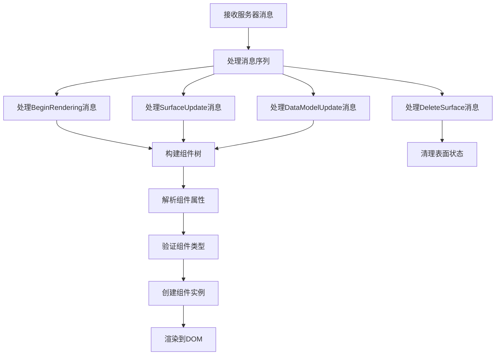

# 渲染器API

<cite>
**本文档中引用的文件**  
- [model-processor.ts](file://renderers/lit/src/0.8/data/model-processor.ts)
- [signal-model-processor.ts](file://renderers/lit/src/0.8/data/signal-model-processor.ts)
- [component-registry.ts](file://renderers/lit/src/0.8/ui/component-registry.ts)
- [core.ts](file://renderers/lit/src/0.8/core.ts)
- [config.ts](file://renderers/angular/src/lib/config.ts)
- [renderer.ts](file://renderers/angular/src/lib/rendering/renderer.ts)
- [dynamic-component.ts](file://renderers/angular/src/lib/rendering/dynamic-component.ts)
- [default.ts](file://renderers/angular/src/lib/catalog/default.ts)
- [types.ts](file://renderers/lit/src/0.8/types/types.ts)
- [client.ts](file://samples/client/lit/contact/client.ts)
- [register-components.ts](file://samples/client/lit/contact/ui/custom-components/register-components.ts)
</cite>

## 目录
1. [简介](#简介)
2. [Lit渲染器API](#lit渲染器api)
3. [Angular渲染器API](#angular渲染器api)
4. [消息处理流程](#消息处理流程)
5. [客户端集成模式](#客户端集成模式)
6. [错误处理与性能优化](#错误处理与性能优化)
7. [常见集成问题解决方案](#常见集成问题解决方案)

## 简介
A2UI渲染器API提供了一套统一的接口，用于在不同前端框架中渲染A2UI协议定义的用户界面。该API支持Lit和Angular两个主要的渲染器实现，允许开发者根据项目需求选择合适的框架。渲染器负责处理来自服务器的UI更新消息，维护数据模型，并将组件树渲染到DOM中。本技术文档详细说明了两个渲染器的公共接口、配置选项和使用方法。

## Lit渲染器API

Lit渲染器提供了基于Web Components的轻量级实现，通过`@a2ui/lit`包暴露核心功能。其主要接口包括消息处理器和组件注册机制。

**Section sources**
- [core.ts](file://renderers/lit/src/0.8/core.ts#L23-L31)
- [model-processor.ts](file://renderers/lit/src/0.8/data/model-processor.ts#L64-L87)
- [signal-model-processor.ts](file://renderers/lit/src/0.8/data/signal-model-processor.ts#L24-L31)
- [component-registry.ts](file://renderers/lit/src/0.8/ui/component-registry.ts#L19-L58)

### A2uiMessageProcessor构造函数
`A2uiMessageProcessor`是Lit渲染器的核心类，负责处理和维护UI状态。其构造函数接受一个配置对象作为参数，允许自定义数据结构的构造函数：

- `mapCtor`: Map构造函数，默认为`Map`
- `arrayCtor`: Array构造函数，默认为`Array` 
- `setCtor`: Set构造函数，默认为`Set`
- `objCtor`: Object构造函数，默认为`Object`

这些配置选项允许开发者集成响应式数据结构，如signal-utils提供的实现。

### createSignalA2uiMessageProcessor函数
`createSignalA2uiMessageProcessor`是一个工厂函数，返回一个使用signal-utils响应式数据结构的`A2uiMessageProcessor`实例。该函数无需参数，自动配置`SignalMap`、`SignalArray`、`SignalObject`和`SignalSet`作为底层数据结构，实现自动更新和响应式渲染。

### 生命周期方法
`A2uiMessageProcessor`提供了以下生命周期方法：

- `processMessages(messages)`: 处理服务器发送的消息数组，更新内部状态
- `getSurfaces()`: 获取所有UI表面的只读映射
- `clearSurfaces()`: 清除所有表面状态
- `getData(node, path, surfaceId)`: 根据组件节点和路径获取数据
- `setData(node, path, value, surfaceId)`: 设置指定路径的数据值
- `resolvePath(path, contextPath)`: 解析相对路径到绝对路径

### componentRegistry.register()方法
`componentRegistry`是全局的组件注册表，用于注册自定义Web Components。`register()`方法接受三个参数：

- `typeName`: 组件类型名称，必须为字母数字组合
- `constructor`: 自定义元素构造函数
- `tagName`: 可选的自定义标签名，若未提供则生成`a2ui-custom-{typeName}`格式的标签名

该方法确保组件在Custom Elements Registry中正确注册，并防止重复注册冲突。

## Angular渲染器API

Angular渲染器提供了基于Angular框架的实现，利用依赖注入和动态组件加载机制。

**Section sources**
- [config.ts](file://renderers/angular/src/lib/config.ts#L20-L25)
- [renderer.ts](file://renderers/angular/src/lib/rendering/renderer.ts#L39-L110)
- [dynamic-component.ts](file://renderers/angular/src/lib/rendering/dynamic-component.ts#L29-L101)
- [default.ts](file://renderers/angular/src/lib/catalog/default.ts#L24-L185)

### provideA2UI()注入器
`provideA2UI()`是一个工厂函数，用于配置A2UI渲染器的依赖注入提供者。它接受一个配置对象作为参数，包含以下属性：

- `catalog`: 组件目录，定义了组件类型到Angular组件的映射
- `theme`: 主题配置，定义了UI样式的外观

该函数返回`EnvironmentProviders`，可在应用的根模块中使用。

### Renderer服务核心方法
`Renderer`是一个指令，负责将A2UI组件渲染为Angular组件。其核心方法包括：

- `render(surfaceId, component)`: 根据组件类型从目录中查找对应的Angular组件，并动态创建实例
- `clear()`: 销毁当前渲染的组件实例
- `ngOnDestroy()`: 清理资源，防止内存泄漏

该指令使用Angular的`effect`系统实现响应式更新，当输入属性变化时自动重新渲染。

### 全局配置项
`config.ts`文件定义了渲染器的全局配置，主要通过`provideA2UI()`函数进行配置。配置项包括组件目录和主题，这些配置通过Angular的依赖注入系统传递给渲染器组件。

## 消息处理流程

消息处理流程是A2UI渲染器的核心机制，负责将服务器发送的原始消息转换为可渲染的UI组件树。



**Diagram sources**
- [model-processor.ts](file://renderers/lit/src/0.8/data/model-processor.ts#L97-L124)
- [model-processor.ts](file://renderers/lit/src/0.8/data/model-processor.ts#L449-L464)

**Section sources**
- [model-processor.ts](file://renderers/lit/src/0.8/data/model-processor.ts#L64-L800)

### 内部机制
`A2uiMessageProcessor`的内部机制基于以下关键步骤：

1. **消息分发**: `processMessages()`方法遍历消息数组，根据消息类型调用相应的处理方法
2. **状态维护**: 维护一个`Map`来存储所有UI表面的状态，包括组件树、数据模型和样式
3. **路径解析**: 实现`resolvePath()`方法，将相对路径解析为绝对路径，支持`/`分隔符和`.`特殊路径
4. **数据绑定**: 通过`getData()`和`setData()`方法实现组件与数据模型的双向绑定
5. **组件树重建**: 在每次状态更新后，调用`#rebuildComponentTree()`方法递归构建组件树，处理模板和显式列表

### 类型约束
消息处理流程中的类型约束确保了数据的一致性和类型安全：

- `ServerToClientMessage`: 服务器到客户端消息的联合类型
- `AnyComponentNode`: 所有可能组件节点的联合类型
- `DataValue`: 数据模型中任何有效JSON值的递归类型
- `ResolvedValue`: 已解析值的递归类型，可能包含组件节点

## 客户端集成模式

A2UI渲染器可以在Lit和Angular应用中以相似的模式集成，利用各自框架的特性。

**Section sources**
- [client.ts](file://samples/client/lit/contact/client.ts#L33-L63)
- [register-components.ts](file://samples/client/lit/contact/ui/custom-components/register-components.ts#L21-L33)
- [canvas-service.ts](file://samples/client/angular/projects/a2a-chat-canvas/src/lib/services/canvas-service.ts#L26-L41)

### TypeScript代码示例
以下是Lit应用中的初始化示例：

```typescript
import { v0_8 } from "@a2ui/lit";
import { registerContactComponents } from "./ui/custom-components/register-components.js";

// 创建消息处理器
const processor = new v0_8.Data.A2uiMessageProcessor();

// 注册自定义组件
registerContactComponents();

// 创建客户端实例
const client = new A2UIClient();

// 处理服务器消息
async function handleMessage() {
  const messages = await client.send(eventMessage);
  processor.processMessages(messages);
}
```

Angular应用中的初始化示例：

```typescript
import { provideA2UI } from '@a2ui/angular';
import { DEFAULT_CATALOG } from '@a2ui/angular/catalog/default';
import { DEFAULT_THEME } from '@a2ui/angular/theme/default';

@NgModule({
  providers: [
    provideA2UI({
      catalog: DEFAULT_CATALOG,
      theme: DEFAULT_THEME
    })
  ]
})
export class AppModule { }
```

### 集成模式
客户端集成遵循以下模式：

1. **初始化**: 创建消息处理器实例并配置必要的依赖
2. **组件注册**: 注册自定义组件到全局注册表
3. **消息处理**: 建立与服务器的通信通道，接收并处理消息
4. **状态同步**: 将处理后的状态同步到UI渲染层
5. **事件反馈**: 捕获用户交互事件并发送回服务器

## 错误处理与性能优化

### 错误处理
A2UI渲染器实现了多层次的错误处理机制：

- **输入验证**: 在`componentRegistry.register()`中验证类型名称的格式
- **循环引用检测**: 在组件树构建过程中检测并抛出循环依赖错误
- **类型检查**: 在组件创建时验证属性类型是否符合预期
- **路径解析容错**: 对无效路径返回null而不是抛出异常

### 性能优化建议
1. **批量消息处理**: 尽可能将多个UI更新合并为单个消息批次处理
2. **选择性更新**: 只在必要时重建组件树，避免不必要的DOM操作
3. **响应式数据**: 使用`createSignalA2uiMessageProcessor`实现细粒度的响应式更新
4. **组件懒加载**: 在Angular渲染器中利用动态导入实现组件的按需加载
5. **内存管理**: 及时清理不再使用的表面状态，防止内存泄漏

## 常见集成问题解决方案

### 组件注册冲突
**问题**: 多次注册同一组件类型导致冲突
**解决方案**: 在注册前检查组件是否已存在，或使用统一的注册入口

### 路径解析错误
**问题**: 相对路径解析结果不符合预期
**解决方案**: 确保数据上下文路径正确设置，使用绝对路径避免歧义

### 样式隔离问题
**问题**: A2UI组件样式影响全局页面样式
**解决方案**: 使用Shadow DOM或CSS作用域确保样式隔离

### 动态组件加载失败
**问题**: Angular中动态组件无法正确加载
**解决方案**: 确保组件已声明在NgModule的entryComponents中，或使用Ivy的惰性加载机制

### 数据绑定延迟
**问题**: 数据更新后UI未及时响应
**解决方案**: 检查消息处理流程是否完整执行，确保调用了`processMessages()`方法