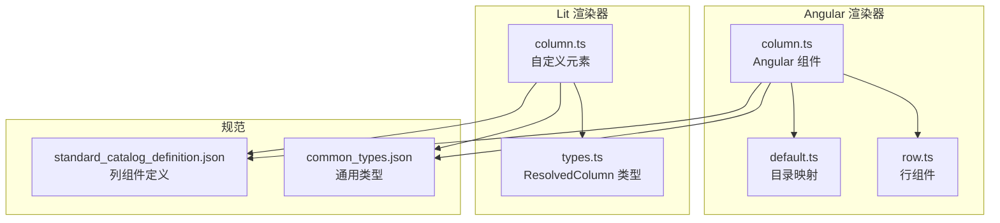
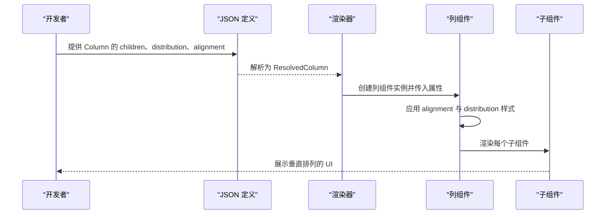
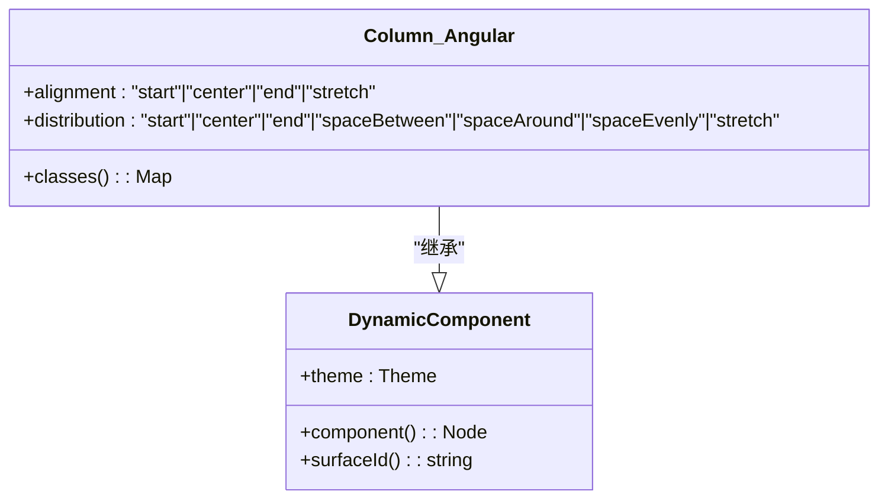
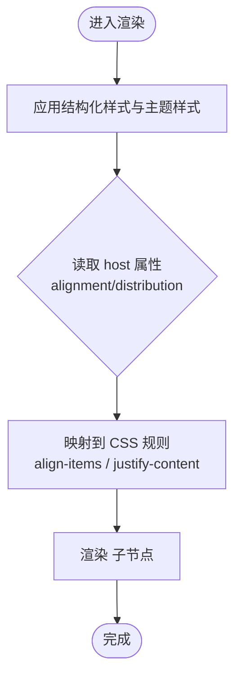
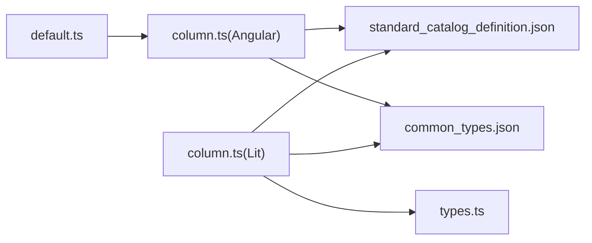

# 列组件 (Column)

<cite>
**本文引用的文件**
- [column.ts（Angular 实现）](file://renderers/angular/src/lib/catalog/column.ts)
- [column.ts（Lit 实现）](file://renderers/lit/src/0.8/ui/column.ts)
- [standard_catalog_definition.json（标准组件定义）](file://specification/0.9/json/standard_catalog_definition.json)
- [common_types.json（通用类型）](file://specification/0.9/json/common_types.json)
- [types.ts（类型定义）](file://renderers/lit/src/0.8/types/types.ts)
- [default.ts（Angular 默认目录映射）](file://renderers/angular/src/lib/catalog/default.ts)
- [library.component.ts（Angular 示例）](file://samples/client/angular/projects/gallery/src/app/features/library/library.component.ts)
- [row.ts（Angular 行组件）](file://renderers/angular/src/lib/catalog/row.ts)
</cite>

## 目录
1. [简介](#简介)
2. [项目结构](#项目结构)
3. [核心组件](#核心组件)
4. [架构总览](#架构总览)
5. [详细组件分析](#详细组件分析)
6. [依赖关系分析](#依赖关系分析)
7. [性能考量](#性能考量)
8. [故障排查指南](#故障排查指南)
9. [结论](#结论)
10. [附录：JSON 定义与示例](#附录json-定义与示例)

## 简介
列组件（Column）是一个布局容器，用于将子组件沿垂直方向（主轴为纵向）进行排列。它通过“分布”（distribution）控制子元素在主轴上的排列方式，“对齐”（alignment）控制子元素在交叉轴上的对齐方式。列组件本身不直接处理用户交互事件，而是承载并渲染其他组件，常用于构建垂直列表、卡片内容区、对话框内容等场景。

## 项目结构
- Angular 渲染器中的列组件位于 catalog 目录，采用动态组件模式，基于主题样式与输入属性生成最终类名。
- Lit 渲染器中的列组件以自定义元素形式存在，通过属性绑定 alignment 与 distribution，并应用结构化样式。
- 标准组件定义中列组件具备 children、distribution、alignment 等属性；通用类型中定义了通用属性与权重（weight）等。

图表来源
- [column.ts（Angular 实现）](file://renderers/angular/src/lib/catalog/column.ts#L1-L97)
- [column.ts（Lit 实现）](file://renderers/lit/src/0.8/ui/column.ts#L1-L104)
- [types.ts（类型定义）](file://renderers/lit/src/0.8/types/types.ts#L477-L487)
- [standard_catalog_definition.json（标准组件定义）](file://specification/0.9/json/standard_catalog_definition.json#L274-L309)
- [common_types.json（通用类型）](file://specification/0.9/json/common_types.json#L70-L80)

章节来源
- [column.ts（Angular 实现）](file://renderers/angular/src/lib/catalog/column.ts#L1-L97)
- [column.ts（Lit 实现）](file://renderers/lit/src/0.8/ui/column.ts#L1-L104)
- [standard_catalog_definition.json（标准组件定义）](file://specification/0.9/json/standard_catalog_definition.json#L274-L309)
- [common_types.json（通用类型）](file://specification/0.9/json/common_types.json#L70-L80)

## 核心组件
- 组件名称：Column
- 组件类型：布局容器
- 主要职责：
  - 垂直排列子组件（主轴为纵向）
  - 通过 distribution 控制主轴分布（如 start/center/end/spaceBetween/spaceAround/spaceEvenly/stretch）
  - 通过 alignment 控制交叉轴对齐（如 start/center/end/stretch）
  - 不触发用户交互事件，仅承载与渲染子组件
- 关键属性（来自标准定义与类型系统）：
  - children（必填）：子组件 ID 列表或模板对象，支持静态列表与数据驱动模板
  - distribution（可选，默认 start）：主轴分布策略
  - alignment（可选，默认 stretch）：交叉轴对齐策略
  - id（通用，必填）：组件实例唯一标识
  - weight（通用，可选）：在 Row/Column 中作为 flex-grow 使用

章节来源
- [standard_catalog_definition.json（标准组件定义）](file://specification/0.9/json/standard_catalog_definition.json#L274-L309)
- [common_types.json（通用类型）](file://specification/0.9/json/common_types.json#L70-L80)
- [types.ts（类型定义）](file://renderers/lit/src/0.8/types/types.ts#L477-L487)

## 架构总览
列组件在不同渲染器中的实现遵循统一的规范，但具体绑定与渲染方式不同：
- Angular：通过 DynamicComponent 扩展，使用输入属性 alignment 与 distribution，结合主题样式生成最终类名，内部循环渲染子组件。
- Lit：通过自定义元素 a2ui-column，使用属性绑定 alignment 与 distribution，应用结构化样式，内部使用 slot 插槽承载子组件。

图表来源
- [column.ts（Angular 实现）](file://renderers/angular/src/lib/catalog/column.ts#L87-L96)
- [column.ts（Lit 实现）](file://renderers/lit/src/0.8/ui/column.ts#L27-L31)
- [types.ts（类型定义）](file://renderers/lit/src/0.8/types/types.ts#L477-L487)

## 详细组件分析

### 属性定义与行为
- children
  - 类型：字符串数组或模板对象
  - 作用：指定列的子组件集合，支持静态 ID 列表或基于数据模型的模板生成
  - 必填性：必填
- distribution
  - 类型：枚举
  - 可选值：start、center、end、spaceBetween、spaceAround、spaceEvenly、stretch
  - 默认值：start
  - 作用：控制子元素在主轴（纵向）上的分布
- alignment
  - 类型：枚举
  - 可选值：start、center、end、stretch
  - 默认值：stretch
  - 作用：控制子元素在交叉轴（横向）上的对齐
- id（通用）
  - 类型：字符串
  - 必填性：必填
  - 作用：组件实例唯一标识
- weight（通用）
  - 类型：数字
  - 作用：在 Row/Column 中作为 flex-grow 使用，控制相对权重

章节来源
- [standard_catalog_definition.json（标准组件定义）](file://specification/0.9/json/standard_catalog_definition.json#L274-L309)
- [common_types.json（通用类型）](file://specification/0.9/json/common_types.json#L70-L80)
- [types.ts（类型定义）](file://renderers/lit/src/0.8/types/types.ts#L477-L487)

### Angular 实现要点
- 输入属性绑定
  - alignment：默认值为 "stretch"
  - distribution：默认值为 "start"
- 样式生成
  - 基于主题组件 Column 的类名与额外样式
  - 动态拼接 align- 与 distribute- 前缀类名
- 子组件渲染
  - 遍历 children 并通过 a2ui-renderer 渲染

图表来源
- [column.ts（Angular 实现）](file://renderers/angular/src/lib/catalog/column.ts#L87-L96)

章节来源
- [column.ts（Angular 实现）](file://renderers/angular/src/lib/catalog/column.ts#L1-L97)
- [default.ts（Angular 默认目录映射）](file://renderers/angular/src/lib/catalog/default.ts#L36-L45)

### Lit 实现要点
- 属性绑定
  - alignment：默认值为 "stretch"
  - distribution：默认值为 "start"
- 样式应用
  - 结构化样式（structuralStyles）与内联样式（additionalStyles.Column）
  - 通过 host 属性选择器与 :host(...) 伪类映射到对应 CSS 规则
- 子组件渲染
  - 使用 <slot> 承载子组件

图表来源
- [column.ts（Lit 实现）](file://renderers/lit/src/0.8/ui/column.ts#L27-L31)
- [column.ts（Lit 实现）](file://renderers/lit/src/0.8/ui/column.ts#L33-L92)
- [column.ts（Lit 实现）](file://renderers/lit/src/0.8/ui/column.ts#L94-L104)

章节来源
- [column.ts（Lit 实现）](file://renderers/lit/src/0.8/ui/column.ts#L1-L104)
- [types.ts（类型定义）](file://renderers/lit/src/0.8/types/types.ts#L477-L487)

### 与 Row 组件的协作（响应式设计）
- Row 与 Column 分别控制水平与垂直方向的布局，二者可嵌套组合形成网格或复杂布局。
- 在响应式设计中，通常将 Row 作为外层容器控制横向分布，Column 作为内层容器控制纵向分布，或反之。
- 两者均支持 alignment 与 distribution，可灵活搭配以实现复杂的对齐与分布需求。

章节来源
- [standard_catalog_definition.json（标准组件定义）](file://specification/0.9/json/standard_catalog_definition.json#L237-L273)
- [row.ts（Angular 行组件）](file://renderers/angular/src/lib/catalog/row.ts#L91-L100)

## 依赖关系分析
- Angular
  - Column 继承 DynamicComponent，依赖主题系统与渲染器指令
  - 默认目录映射将 Column 的 properties 映射为输入属性
- Lit
  - Column 依赖 ResolvedColumn 类型与主题样式结构
  - 通过 host 属性选择器与 CSS 规则实现样式映射

图表来源
- [default.ts（Angular 默认目录映射）](file://renderers/angular/src/lib/catalog/default.ts#L36-L45)
- [column.ts（Angular 实现）](file://renderers/angular/src/lib/catalog/column.ts#L1-L97)
- [column.ts（Lit 实现）](file://renderers/lit/src/0.8/ui/column.ts#L1-L104)
- [types.ts（类型定义）](file://renderers/lit/src/0.8/types/types.ts#L477-L487)
- [standard_catalog_definition.json（标准组件定义）](file://specification/0.9/json/standard_catalog_definition.json#L274-L309)
- [common_types.json（通用类型）](file://specification/0.9/json/common_types.json#L70-L80)

章节来源
- [default.ts（Angular 默认目录映射）](file://renderers/angular/src/lib/catalog/default.ts#L36-L45)
- [column.ts（Angular 实现）](file://renderers/angular/src/lib/catalog/column.ts#L1-L97)
- [column.ts（Lit 实现）](file://renderers/lit/src/0.8/ui/column.ts#L1-L104)
- [types.ts（类型定义）](file://renderers/lit/src/0.8/types/types.ts#L477-L487)
- [standard_catalog_definition.json（标准组件定义）](file://specification/0.9/json/standard_catalog_definition.json#L274-L309)
- [common_types.json（通用类型）](file://specification/0.9/json/common_types.json#L70-L80)

## 性能考量
- 子组件数量较多时，建议合理设置 children 为模板化数据源，避免一次性渲染大量静态节点。
- 在 Angular 中，尽量减少不必要的变更检测开销，确保 children 列表稳定。
- 在 Lit 中，避免频繁修改 alignment 与 distribution 属性，以减少样式重排。
- 合理使用 weight，避免过度 flex 计算导致布局抖动。

## 故障排查指南
- 子组件未显示
  - 检查 children 是否为空或未正确引用子组件 ID
  - 确认子组件是否已注册并在渲染器中可用
- 对齐或分布异常
  - 确认 alignment 与 distribution 的取值是否在允许范围内
  - 在 Lit 中检查 host 属性是否正确传递
- 样式未生效
  - 检查主题配置与 additionalStyles.Column 是否正确
  - 确认 CSS 选择器与类名拼接逻辑是否匹配

## 结论
列组件（Column）是 A2UI 标准组件库中的基础布局容器，通过 distribution 与 alignment 精准控制垂直方向的排列与对齐。其在 Angular 与 Lit 两端的实现保持一致的语义与行为，便于跨框架复用。结合 Row 组件，可构建灵活的网格与响应式布局。在实际开发中，应关注 children 的组织方式、样式与主题配置，以及在大数据量下的性能优化。

## 附录：JSON 定义与示例

### JSON 定义要点（摘自标准定义）
- 组件名称：Column
- 必填属性：component、children
- 可选属性：distribution、alignment
- 其他通用属性：id、weight

章节来源
- [standard_catalog_definition.json（标准组件定义）](file://specification/0.9/json/standard_catalog_definition.json#L274-L309)
- [common_types.json（通用类型）](file://specification/0.9/json/common_types.json#L70-L80)

### 在 Angular 中通过 JSON 定义列布局
- 示例思路
  - 创建一个 Column 节点，设置 children 为若干子组件 ID 数组
  - 设置 alignment 与 distribution 以控制对齐与分布
  - 将该节点加入表面（surface），由渲染器解析并渲染
- 示例参考路径
  - [library.component.ts（Angular 示例）](file://samples/client/angular/projects/gallery/src/app/features/library/library.component.ts#L338-L349)

章节来源
- [library.component.ts（Angular 示例）](file://samples/client/angular/projects/gallery/src/app/features/library/library.component.ts#L338-L349)

### 在 Lit 中通过 JSON 定义列布局
- 示例思路
  - 通过消息处理器与表面更新机制，向渲染器发送包含 Column 的消息
  - Column 的 children、distribution、alignment 将被解析为 ResolvedColumn
  - 渲染器根据属性应用样式并渲染子组件
- 示例参考路径
  - [types.ts（类型定义）](file://renderers/lit/src/0.8/types/types.ts#L477-L487)
  - [column.ts（Lit 实现）](file://renderers/lit/src/0.8/ui/column.ts#L27-L31)

章节来源
- [types.ts（类型定义）](file://renderers/lit/src/0.8/types/types.ts#L477-L487)
- [column.ts（Lit 实现）](file://renderers/lit/src/0.8/ui/column.ts#L27-L31)