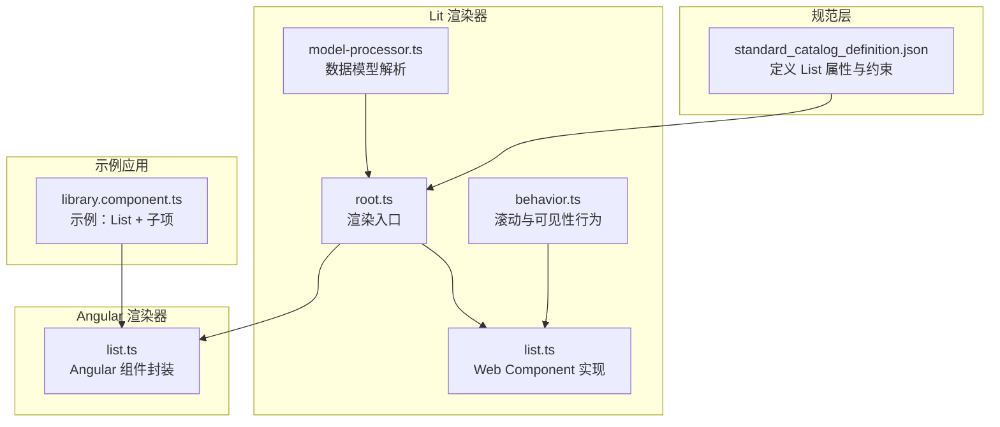
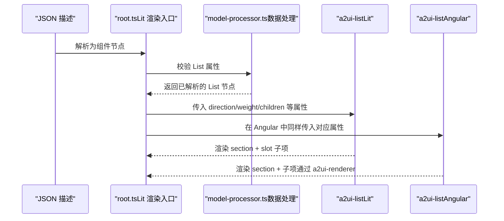
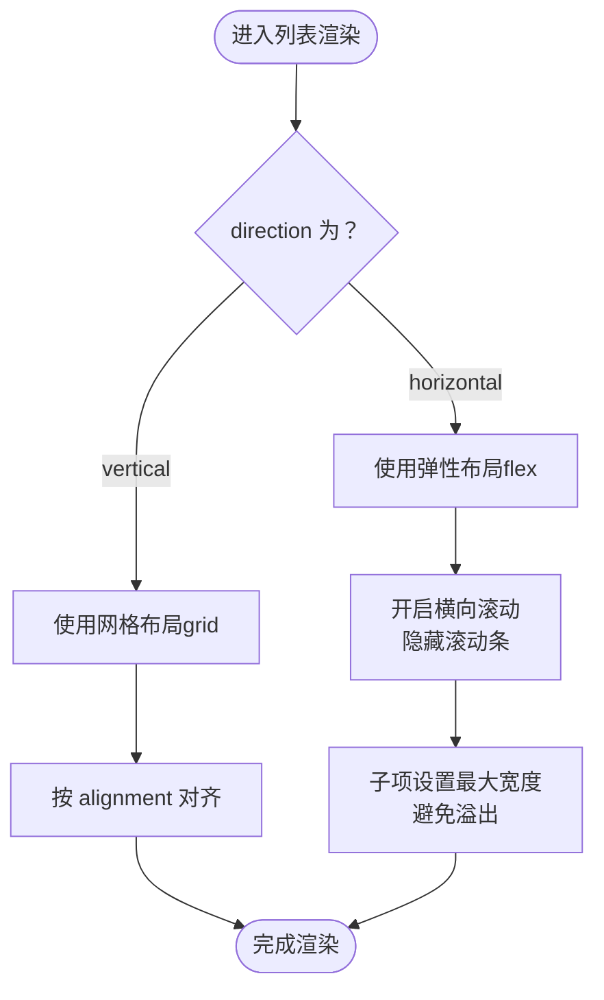
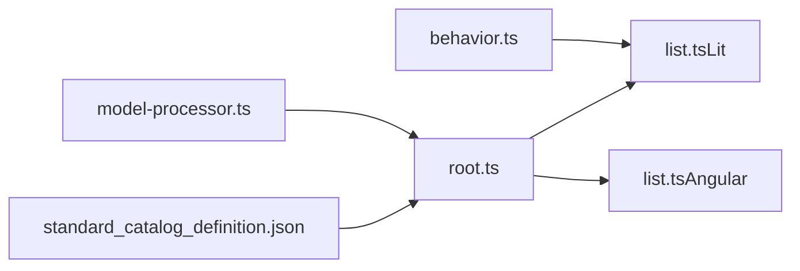

# 列表组件（List）

<cite>
**本文引用的文件**
- [standard_catalog_definition.json](file://specification/0.9/json/standard_catalog_definition.json)
- [list.ts（Lit）](file://renderers/lit/src/0.8/ui/list.ts)
- [root.ts（Lit 渲染入口）](file://renderers/lit/src/0.8/ui/root.ts)
- [model-processor.ts（Lit 数据处理）](file://renderers/lit/src/0.8/data/model-processor.ts)
- [list.ts（Angular）](file://renderers/angular/src/lib/catalog/list.ts)
- [library.component.ts（Angular 示例）](file://samples/client/angular/projects/gallery/src/app/features/library/library.component.ts)
- [behavior.ts（Lit 样式行为）](file://renderers/lit/src/0.8/styles/behavior.ts)
</cite>

## 目录
1. [简介](#简介)
2. [项目结构](#项目结构)
3. [核心组件](#核心组件)
4. [架构总览](#架构总览)
5. [详细组件分析](#详细组件分析)
6. [依赖关系分析](#依赖关系分析)
7. [性能考量](#性能考量)
8. [故障排查指南](#故障排查指南)
9. [结论](#结论)
10. [附录：JSON 定义与示例](#附录json-定义与示例)

## 简介
列表组件用于在 A2UI 中以垂直或水平方向展示一组子项（项目）。它既支持通过 JSON 定义的子组件数组进行声明式渲染，也支持在运行时通过模板机制动态生成子项。该组件在 Lit 和 Angular 双框架下均有实现，并遵循统一的标准目录定义规范，确保跨框架一致性。

## 项目结构
- 标准目录定义位于 specification/0.9/json/standard_catalog_definition.json，其中定义了 List 组件的属性、必填字段以及布局方向等约束。
- Lit 实现位于 renderers/lit/src/0.8/ui/list.ts，负责 Web Components 的渲染与样式。
- Angular 实现位于 renderers/angular/src/lib/catalog/list.ts，负责 Angular 组件封装与主题绑定。
- 渲染入口与数据处理分别位于 renderers/lit/src/0.8/ui/root.ts 与 renderers/lit/src/0.8/data/model-processor.ts，用于将 JSON 描述转换为组件树并挂载到 DOM。
- 示例应用位于 samples/client/angular/projects/gallery/src/app/features/library/library.component.ts，展示了如何在 Angular 中通过 JSON 表达式创建 List 及其子项。

图表来源
- [standard_catalog_definition.json](file://specification/0.9/json/standard_catalog_definition.json#L311-L337)
- [root.ts（Lit 渲染入口）](file://renderers/lit/src/0.8/ui/root.ts#L170-L194)
- [list.ts（Lit）](file://renderers/lit/src/0.8/ui/list.ts#L1-L72)
- [model-processor.ts（Lit 数据处理）](file://renderers/lit/src/0.8/data/model-processor.ts#L598-L636)
- [behavior.ts（Lit 样式行为）](file://renderers/lit/src/0.8/styles/behavior.ts#L1-L55)
- [list.ts（Angular）](file://renderers/angular/src/lib/catalog/list.ts#L1-L63)
- [library.component.ts（Angular 示例）](file://samples/client/angular/projects/gallery/src/app/features/library/library.component.ts#L126-L136)

章节来源
- [standard_catalog_definition.json](file://specification/0.9/json/standard_catalog_definition.json#L311-L337)
- [root.ts（Lit 渲染入口）](file://renderers/lit/src/0.8/ui/root.ts#L170-L194)
- [list.ts（Lit）](file://renderers/lit/src/0.8/ui/list.ts#L1-L72)
- [model-processor.ts（Lit 数据处理）](file://renderers/lit/src/0.8/data/model-processor.ts#L598-L636)
- [behavior.ts（Lit 样式行为）](file://renderers/lit/src/0.8/styles/behavior.ts#L1-L55)
- [list.ts（Angular）](file://renderers/angular/src/lib/catalog/list.ts#L1-L63)
- [library.component.ts（Angular 示例）](file://samples/client/angular/projects/gallery/src/app/features/library/library.component.ts#L126-L136)

## 核心组件
- 组件名称：List
- 组件类型：标准组件（standard catalog）
- 必填属性：
  - children：定义子项集合。支持两种形式：
    - 显式子项数组（固定集合）
    - 模板化子项（基于数据模型动态生成）
  - direction：布局方向，取值为 "vertical" 或 "horizontal"
  - alignment：交叉轴对齐方式，取值为 "start"、"center"、"end"、"stretch"
- 其他通用属性（来自通用类型）：
  - component：组件标识符，固定为 "List"
  - weight：权重，影响布局伸缩（由渲染器读取并应用）
  - id：组件唯一标识（由渲染器读取并应用）
  - slotName：插槽名（由渲染器读取并应用）

章节来源
- [standard_catalog_definition.json](file://specification/0.9/json/standard_catalog_definition.json#L311-L337)
- [root.ts（Lit 渲染入口）](file://renderers/lit/src/0.8/ui/root.ts#L170-L194)

## 架构总览
下面的序列图展示了从 JSON 描述到最终渲染的关键流程，涵盖 Lit 与 Angular 两条路径。

图表来源
- [root.ts（Lit 渲染入口）](file://renderers/lit/src/0.8/ui/root.ts#L170-L194)
- [model-processor.ts（Lit 数据处理）](file://renderers/lit/src/0.8/data/model-processor.ts#L598-L636)
- [list.ts（Lit）](file://renderers/lit/src/0.8/ui/list.ts#L1-L72)
- [list.ts（Angular）](file://renderers/angular/src/lib/catalog/list.ts#L1-L63)

## 详细组件分析

### 属性与作用
- children
  - 类型：对象，包含两种子属性：
    - explicitList：字符串数组，表示固定子项 ID 列表
    - template：对象，包含 componentId（模板组件 ID）与 dataBinding（数据模型路径），用于动态生成子项
  - 作用：定义列表的子项集合；在渲染器中会被转换为实际子组件实例并挂载到列表容器内
- direction
  - 类型：字符串，取值 "vertical" 或 "horizontal"
  - 作用：控制列表项的排列方向；Lit/Angular 实现均会根据该属性切换布局策略
- alignment
  - 类型：字符串，取值 "start"、"center"、"end"、"stretch"
  - 作用：控制交叉轴上的对齐方式；在垂直布局下通常表现为列对齐，在水平布局下表现为行对齐
- weight/slotName/id
  - 由渲染器读取并应用，影响布局伸缩与插槽分配

章节来源
- [standard_catalog_definition.json](file://specification/0.9/json/standard_catalog_definition.json#L311-L337)
- [root.ts（Lit 渲染入口）](file://renderers/lit/src/0.8/ui/root.ts#L170-L194)

### 支持的子组件
- List 本身不直接定义子项内容，而是通过 children 字段引用其他组件（如 Text、Icon、Button 等）作为列表项。
- 在示例应用中，List 的 children 数组包含多个 Text 组件，从而形成一个文本列表。
- 由于 List 是标准组件，其子项可以是任意标准组件或自定义组件（当启用自定义元素时）。

章节来源
- [library.component.ts（Angular 示例）](file://samples/client/angular/projects/gallery/src/app/features/library/library.component.ts#L126-L136)
- [root.ts（Lit 渲染入口）](file://renderers/lit/src/0.8/ui/root.ts#L170-L194)

### 响应式行为
- 垂直方向（vertical）
  - 使用网格布局（grid）展示子项，适合纵向排列与多列自适应
- 水平方向（horizontal）
  - 使用弹性布局（flex）展示子项，支持横向滚动与隐藏滚动条，子项具有最大宽度限制，避免溢出
- 滚动与可见性
  - 列表容器默认开启滚动（overflow: auto），并在水平模式下隐藏滚动条，提升视觉一致性
  - 行为样式由 behavior.ts 提供，包含滚动与透明度等通用行为类

图表来源
- [list.ts（Lit）](file://renderers/lit/src/0.8/ui/list.ts#L1-L72)
- [behavior.ts（Lit 样式行为）](file://renderers/lit/src/0.8/styles/behavior.ts#L1-L55)

章节来源
- [list.ts（Lit）](file://renderers/lit/src/0.8/ui/list.ts#L1-L72)
- [behavior.ts（Lit 样式行为）](file://renderers/lit/src/0.8/styles/behavior.ts#L1-L55)

### 无障碍访问（A11y）
- 角色与语义
  - 当前实现未显式设置 role="list" 或相关列表语义属性。建议在需要时为列表容器添加 role="list"，并在子项上使用 role="listitem"，以增强屏幕阅读器的可理解性。
- 可聚焦性与交互
  - 列表项若包含可交互元素（如按钮、链接），应确保键盘可达与焦点可见性良好。
- 建议实践
  - 为列表容器添加 role="list"，为每个子项添加 role="listitem"
  - 若列表项为可点击导航项，考虑提供 aria-current 或等价状态提示

说明：以上为通用无障碍建议，当前仓库未在 List 组件中实现特定的 ARIA 属性绑定。

### Lit 实现要点
- Web Component 名称：a2ui-list
- 属性：
  - direction：布尔反射属性，决定布局方向
  - theme：主题类名与额外样式映射
- 渲染：
  - 使用 section 容器承载子项
  - 通过 slot 接收子组件
- 样式：
  - 垂直：grid
  - 水平：flex + 横向滚动 + 隐藏滚动条
  - 子项最大宽度限制，避免横向溢出

章节来源
- [list.ts（Lit）](file://renderers/lit/src/0.8/ui/list.ts#L1-L72)

### Angular 实现要点
- 组件选择器：a2ui-list
- 输入属性：
  - direction：双向绑定方向
  - component：当前 List 节点（由渲染器注入）
  - surfaceId：表面 ID（用于渲染器上下文）
- 模板：
  - 通过 a2ui-renderer 渲染每个子项
  - 应用主题类名与额外样式
- 样式：
  - 同 Lit 实现，根据 direction 设置布局与滚动行为

章节来源
- [list.ts（Angular）](file://renderers/angular/src/lib/catalog/list.ts#L1-L63)

### 渲染入口与数据处理
- root.ts 将 JSON 描述转换为组件节点，并为 List 注入 direction、weight、children 等属性
- model-processor.ts 校验 List 的属性是否满足规范要求，否则抛出错误

章节来源
- [root.ts（Lit 渲染入口）](file://renderers/lit/src/0.8/ui/root.ts#L170-L194)
- [model-processor.ts（Lit 数据处理）](file://renderers/lit/src/0.8/data/model-processor.ts#L598-L636)

## 依赖关系分析
- 组件耦合
  - List 与渲染器（root.ts）强耦合，通过属性传递 direction、weight、children 等
  - Lit 与 Angular 实现共享同一规范定义，降低跨框架差异
- 外部依赖
  - Lit 实现依赖 structuralStyles 与主题系统
  - Angular 实现依赖 DynamicComponent 与 Renderer

图表来源
- [standard_catalog_definition.json](file://specification/0.9/json/standard_catalog_definition.json#L311-L337)
- [root.ts（Lit 渲染入口）](file://renderers/lit/src/0.8/ui/root.ts#L170-L194)
- [list.ts（Lit）](file://renderers/lit/src/0.8/ui/list.ts#L1-L72)
- [list.ts（Angular）](file://renderers/angular/src/lib/catalog/list.ts#L1-L63)
- [model-processor.ts（Lit 数据处理）](file://renderers/lit/src/0.8/data/model-processor.ts#L598-L636)
- [behavior.ts（Lit 样式行为）](file://renderers/lit/src/0.8/styles/behavior.ts#L1-L55)

## 性能考量
- 子项数量与渲染
  - 大量子项时，建议使用虚拟滚动或分页加载，减少一次性渲染开销
- 水平滚动列表
  - 横向滚动列表在移动端可能引发滚动性能问题，建议控制单个子项尺寸与数量
- 主题与样式
  - 避免在 List 内频繁切换主题类名，尽量批量更新以减少重排
- 数据绑定
  - 使用模板化子项时，确保 dataBinding 路径稳定，避免深层对象变更导致的重复渲染

## 故障排查指南
- 抛出“无效数据；期望 List”错误
  - 可能原因：children 缺失或格式不符合规范
  - 处理方法：检查 children 是否存在且符合规范；确认 direction/alignment 取值合法
- 子项未显示
  - 可能原因：children 为空或引用的子项 ID 不存在
  - 处理方法：确认 children 数组非空；核对子项 ID 与组件树映射
- 水平列表溢出
  - 可能原因：子项过多或过宽
  - 处理方法：限制子项最大宽度；考虑改为垂直列表或分页

章节来源
- [model-processor.ts（Lit 数据处理）](file://renderers/lit/src/0.8/data/model-processor.ts#L598-L636)
- [root.ts（Lit 渲染入口）](file://renderers/lit/src/0.8/ui/root.ts#L170-L194)

## 结论
列表组件提供了灵活的垂直/水平布局能力，并通过 children 字段支持静态与动态两种子项定义方式。Lit 与 Angular 实现遵循统一规范，保证跨框架一致性。建议在需要时补充无障碍属性（如 role="list"），并结合性能优化策略（如虚拟滚动、分页）提升用户体验。

## 附录：JSON 定义与示例

### JSON 定义要点（摘自标准目录定义）
- 组件：List
- 必填：children
- 可选：direction（默认 vertical）、alignment（默认 start）
- children 支持：
  - explicitList：固定子项 ID 数组
  - template：componentId + dataBinding 动态生成

章节来源
- [standard_catalog_definition.json](file://specification/0.9/json/standard_catalog_definition.json#L311-L337)

### Lit 与 Angular 下通过 JSON 定义列表的示例（路径）
- Angular 示例（Gallery）：创建一个包含多个文本项的垂直列表
  - 示例路径：[library.component.ts](file://samples/client/angular/projects/gallery/src/app/features/library/library.component.ts#L126-L136)
- Lit 渲染入口：将 JSON 描述转换为 a2ui-list 并传入属性
  - 渲染入口路径：[root.ts（Lit 渲染入口）](file://renderers/lit/src/0.8/ui/root.ts#L170-L194)
- 数据校验：model-processor.ts 对 List 属性进行校验
  - 校验路径：[model-processor.ts（Lit 数据处理）](file://renderers/lit/src/0.8/data/model-processor.ts#L598-L636)

### 创建带图标的导航列表（步骤说明）
- 步骤
  - 准备图标与文本组件（如 Icon、Text）
  - 在 children 中引用这些组件 ID，形成列表项
  - 设置 direction 为 "horizontal" 以实现横向导航
  - 如需响应式，保持子项最大宽度限制，避免横向溢出
- 参考
  - 导航示例（Text 列表）：[library.component.ts](file://samples/client/angular/projects/gallery/src/app/features/library/library.component.ts#L126-L136)
  - 水平布局样式：[list.ts（Lit）](file://renderers/lit/src/0.8/ui/list.ts#L1-L72)