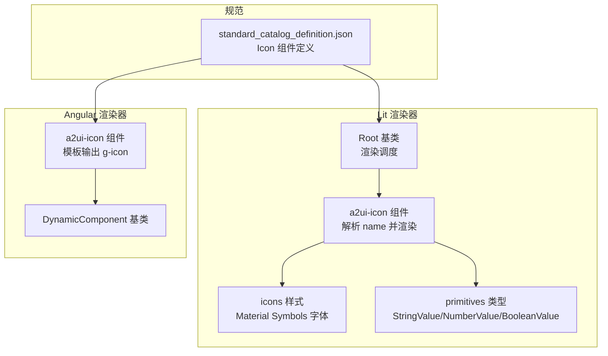
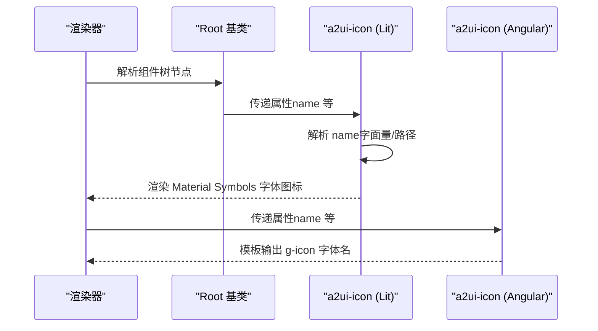
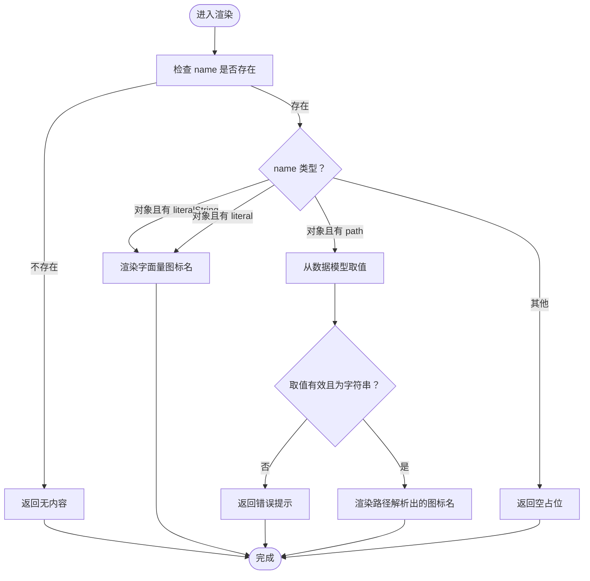
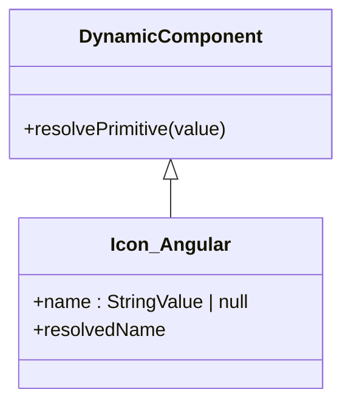
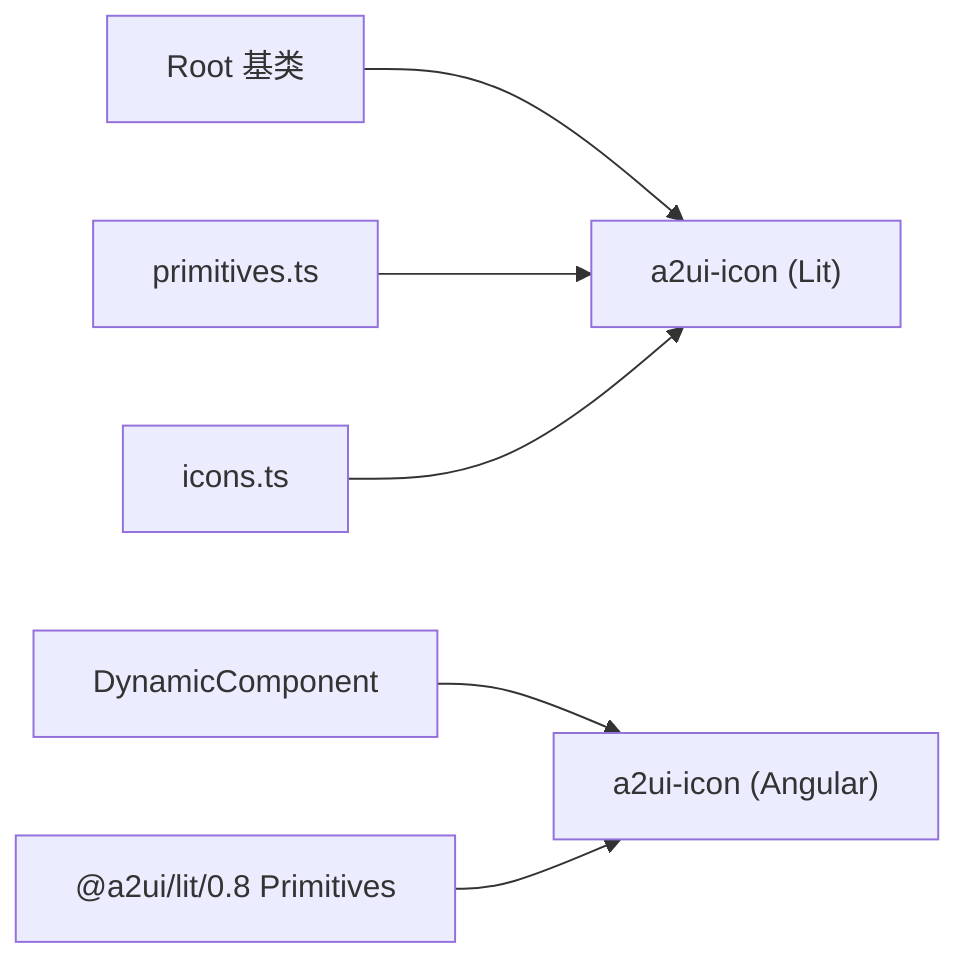

# 图标组件 (Icon)

<cite>
**本文引用的文件**
- [renderers/lit/src/0.8/ui/icon.ts](file://renderers/lit/src/0.8/ui/icon.ts)
- [renderers/lit/src/0.8/styles/icons.ts](file://renderers/lit/src/0.8/styles/icons.ts)
- [renderers/lit/src/0.8/types/primitives.ts](file://renderers/lit/src/0.8/types/primitives.ts)
- [renderers/lit/src/0.8/ui/root.ts](file://renderers/lit/src/0.8/ui/root.ts)
- [renderers/angular/src/lib/catalog/icon.ts](file://renderers/angular/src/lib/catalog/icon.ts)
- [specification/0.9/json/standard_catalog_definition.json](file://specification/0.9/json/standard_catalog_definition.json)
</cite>

## 目录
1. [简介](#简介)
2. [项目结构](#项目结构)
3. [核心组件](#核心组件)
4. [架构总览](#架构总览)
5. [详细组件分析](#详细组件分析)
6. [依赖关系分析](#依赖关系分析)
7. [性能考虑](#性能考虑)
8. [无障碍与可访问性](#无障碍与可访问性)
9. [响应式行为](#响应式行为)
10. [故障排查指南](#故障排查指南)
11. [结论](#结论)
12. [附录：JSON 定义与示例](#附录json-定义与示例)

## 简介
本文件系统化梳理 A2UI 图标组件（Icon）在 Lit 与 Angular 渲染器中的实现与使用方式，覆盖以下关键点：
- 组件职责与渲染流程
- 属性定义与数据绑定（含字符串字面量与路径绑定）
- 图标字体来源（Material Symbols Outlined）
- 在两种框架下的 JSON 定义与使用示例
- 无障碍与可访问性建议
- 响应式行为与主题集成

## 项目结构
图标组件在两个渲染器中分别实现：
- Lit 实现：位于渲染器目录的 UI 层，负责解析 name 属性并渲染 Material Symbols 字体图标。
- Angular 实现：作为动态组件包装，直接输出 Material Symbols 字体名。

图表来源
- [renderers/lit/src/0.8/ui/root.ts](file://renderers/lit/src/0.8/ui/root.ts#L240-L273)
- [renderers/lit/src/0.8/ui/icon.ts](file://renderers/lit/src/0.8/ui/icon.ts#L1-L98)
- [renderers/lit/src/0.8/styles/icons.ts](file://renderers/lit/src/0.8/styles/icons.ts#L1-L61)
- [renderers/lit/src/0.8/types/primitives.ts](file://renderers/lit/src/0.8/types/primitives.ts#L1-L61)
- [renderers/angular/src/lib/catalog/icon.ts](file://renderers/angular/src/lib/catalog/icon.ts#L1-L45)
- [specification/0.9/json/standard_catalog_definition.json](file://specification/0.9/json/standard_catalog_definition.json#L106-L196)

章节来源
- [renderers/lit/src/0.8/ui/root.ts](file://renderers/lit/src/0.8/ui/root.ts#L240-L273)
- [renderers/lit/src/0.8/ui/icon.ts](file://renderers/lit/src/0.8/ui/icon.ts#L1-L98)
- [renderers/lit/src/0.8/styles/icons.ts](file://renderers/lit/src/0.8/styles/icons.ts#L1-L61)
- [renderers/lit/src/0.8/types/primitives.ts](file://renderers/lit/src/0.8/types/primitives.ts#L1-L61)
- [renderers/angular/src/lib/catalog/icon.ts](file://renderers/angular/src/lib/catalog/icon.ts#L1-L45)
- [specification/0.9/json/standard_catalog_definition.json](file://specification/0.9/json/standard_catalog_definition.json#L106-L196)

## 核心组件
- 组件名称：Icon
- 组件类型：标准组件（由规范定义）
- 渲染目标：Material Symbols Outlined 字体图标
- 关键属性：
  - name：图标名称（字符串字面量或数据模型路径）
- 主题集成：通过主题上下文应用样式类与附加样式

章节来源
- [specification/0.9/json/standard_catalog_definition.json](file://specification/0.9/json/standard_catalog_definition.json#L106-L196)
- [renderers/lit/src/0.8/ui/icon.ts](file://renderers/lit/src/0.8/ui/icon.ts#L26-L30)
- [renderers/lit/src/0.8/ui/root.ts](file://renderers/lit/src/0.8/ui/root.ts#L260-L272)

## 架构总览
Lit 渲染器中，Icon 组件继承自 Root 基类，接收来自父级的组件树节点（AnyComponentNode），并通过属性映射将 name 传入组件实例。Angular 渲染器中，Icon 组件继承自 DynamicComponent，直接输出 Material Symbols 字体名。

图表来源
- [renderers/lit/src/0.8/ui/root.ts](file://renderers/lit/src/0.8/ui/root.ts#L240-L273)
- [renderers/lit/src/0.8/ui/icon.ts](file://renderers/lit/src/0.8/ui/icon.ts#L47-L97)
- [renderers/angular/src/lib/catalog/icon.ts](file://renderers/angular/src/lib/catalog/icon.ts#L31-L39)

## 详细组件分析

### Lit 实现（a2ui-icon）
- 继承关系：Root -> a2ui-icon
- 属性
  - name: StringValue | null（支持字面量字符串、路径引用）
- 渲染逻辑
  - 当 name 为 null 或空时，不渲染
  - 支持三种 name 形态：
    - 字面量字符串（literalString 或 literal）
    - 路径引用（path，从数据模型取值）
  - 将驼峰命名转换为下划线小写形式后输出到 span.g-icon
- 样式
  - 使用 Material Symbols Outlined 字体族
  - 提供 filled/filled-heavy 变体类以控制填充与粗细

图表来源
- [renderers/lit/src/0.8/ui/icon.ts](file://renderers/lit/src/0.8/ui/icon.ts#L47-L97)
- [renderers/lit/src/0.8/styles/icons.ts](file://renderers/lit/src/0.8/styles/icons.ts#L1-L61)
- [renderers/lit/src/0.8/types/primitives.ts](file://renderers/lit/src/0.8/types/primitives.ts#L1-L61)

章节来源
- [renderers/lit/src/0.8/ui/icon.ts](file://renderers/lit/src/0.8/ui/icon.ts#L26-L97)
- [renderers/lit/src/0.8/styles/icons.ts](file://renderers/lit/src/0.8/styles/icons.ts#L1-L61)
- [renderers/lit/src/0.8/types/primitives.ts](file://renderers/lit/src/0.8/types/primitives.ts#L1-L61)

### Angular 实现（a2ui-icon）
- 继承关系：DynamicComponent -> a2ui-icon
- 输入属性
  - name: required<StringValue | null>
- 渲染逻辑
  - 计算 resolvedName（解析基础 Primitive）
  - 当 resolvedName 存在时，输出 section 包裹的 span.g-icon

图表来源
- [renderers/angular/src/lib/catalog/icon.ts](file://renderers/angular/src/lib/catalog/icon.ts#L17-L44)

章节来源
- [renderers/angular/src/lib/catalog/icon.ts](file://renderers/angular/src/lib/catalog/icon.ts#L17-L44)

### 规范定义（Icon 组件）
- 组件名称：Icon
- 必填字段：component、name
- name 字段
  - 字符串枚举：预置一组常用图标名
  - 对象形态：支持 path 引用数据模型中的图标名
- 其他通用字段：遵循组件通用规范（如布局、权重等）

章节来源
- [specification/0.9/json/standard_catalog_definition.json](file://specification/0.9/json/standard_catalog_definition.json#L106-L196)

## 依赖关系分析
- Lit
  - a2ui-icon 依赖 Root 基类（主题上下文、信号监听、子组件渲染）
  - a2ui-icon 依赖 primitives 类型（StringValue）
  - a2ui-icon 依赖 icons 样式（Material Symbols 字体）
- Angular
  - a2ui-icon 依赖 DynamicComponent 基类（解析 Primitive）
  - a2ui-icon 依赖 @a2ui/lit/0.8 的 Primitives 类型

图表来源
- [renderers/lit/src/0.8/ui/root.ts](file://renderers/lit/src/0.8/ui/root.ts#L1-L120)
- [renderers/lit/src/0.8/ui/icon.ts](file://renderers/lit/src/0.8/ui/icon.ts#L1-L46)
- [renderers/lit/src/0.8/types/primitives.ts](file://renderers/lit/src/0.8/types/primitives.ts#L1-L61)
- [renderers/lit/src/0.8/styles/icons.ts](file://renderers/lit/src/0.8/styles/icons.ts#L1-L61)
- [renderers/angular/src/lib/catalog/icon.ts](file://renderers/angular/src/lib/catalog/icon.ts#L17-L20)

章节来源
- [renderers/lit/src/0.8/ui/root.ts](file://renderers/lit/src/0.8/ui/root.ts#L1-L120)
- [renderers/lit/src/0.8/ui/icon.ts](file://renderers/lit/src/0.8/ui/icon.ts#L1-L46)
- [renderers/lit/src/0.8/types/primitives.ts](file://renderers/lit/src/0.8/types/primitives.ts#L1-L61)
- [renderers/lit/src/0.8/styles/icons.ts](file://renderers/lit/src/0.8/styles/icons.ts#L1-L61)
- [renderers/angular/src/lib/catalog/icon.ts](file://renderers/angular/src/lib/catalog/icon.ts#L17-L20)

## 性能考虑
- 字面量 vs 路径
  - 字面量渲染无需数据模型查询，开销更低
  - 路径解析需要访问数据模型，建议避免频繁变更
- 渲染条件
  - name 为空时不渲染，减少不必要的 DOM 更新
- 字体加载
  - Material Symbols 字体需按需加载，确保网络可用性与缓存策略

[本节为通用指导，不直接分析具体文件]

## 无障碍与可访问性
- 当前实现未显式设置 aria-* 属性
- 建议
  - 若图标仅作装饰，建议添加 aria-hidden="true"
  - 若图标承载语义信息，建议提供替代文本（aria-label 或通过相邻文本描述）
  - 确保图标与交互元素之间有明确的语义关联

[本节为通用指导，不直接分析具体文件]

## 响应式行为
- 组件容器采用结构性样式，支持 flex 布局与权重变量
- 字体尺寸与行高由样式统一控制，适配不同容器尺寸
- 建议在主题层通过 additionalStyles 为 Icon 配置响应式尺寸与颜色

章节来源
- [renderers/lit/src/0.8/ui/icon.ts](file://renderers/lit/src/0.8/ui/icon.ts#L31-L45)
- [renderers/lit/src/0.8/styles/icons.ts](file://renderers/lit/src/0.8/styles/icons.ts#L26-L60)

## 故障排查指南
- 图标不显示
  - 检查 name 是否为 null 或空
  - 检查字体是否正确加载
- 路径解析失败
  - 确认数据模型中对应路径存在且为字符串
  - 确认组件已注入 processor 与 surfaceId
- 字体样式异常
  - 检查主题上下文是否正确传递
  - 检查额外样式是否覆盖了字体相关属性

章节来源
- [renderers/lit/src/0.8/ui/icon.ts](file://renderers/lit/src/0.8/ui/icon.ts#L47-L97)
- [renderers/lit/src/0.8/ui/root.ts](file://renderers/lit/src/0.8/ui/root.ts#L43-L70)

## 结论
A2UI 图标组件在 Lit 与 Angular 中均以 Material Symbols Outlined 为基础，提供一致的图标渲染体验。Lit 版本支持字面量与路径两种 name 形态，并通过样式类控制填充与粗细；Angular 版本简化为直接输出字体名。结合规范定义与主题系统，图标组件可在多场景下灵活使用并保持良好的可维护性。

[本节为总结，不直接分析具体文件]

## 附录：JSON 定义与示例

### JSON 定义要点（摘自规范）
- 组件：Icon
- 必填字段：component、name
- name 支持：
  - 字符串枚举：预置图标集合
  - 对象：{ path: "..."} 引用数据模型

章节来源
- [specification/0.9/json/standard_catalog_definition.json](file://specification/0.9/json/standard_catalog_definition.json#L106-L196)

### 在 Lit 中通过 JSON 定义图标的步骤
- 在组件树节点中，为 Icon 指定 component 与 name
- name 可为：
  - 字符串字面量（符合枚举值）
  - 对象 { path: "/..."} 引用数据模型中的图标名
- 渲染器会将节点映射到 a2ui-icon 并传入 name 属性

章节来源
- [renderers/lit/src/0.8/ui/root.ts](file://renderers/lit/src/0.8/ui/root.ts#L260-L272)
- [specification/0.9/json/standard_catalog_definition.json](file://specification/0.9/json/standard_catalog_definition.json#L106-L196)

### 在 Angular 中通过 JSON 定义图标的步骤
- 渲染器将节点映射到 a2ui-icon
- 组件输入 name 接收字面量或路径
- 模板输出 span.g-icon，显示对应字体图标

章节来源
- [renderers/angular/src/lib/catalog/icon.ts](file://renderers/angular/src/lib/catalog/icon.ts#L31-L39)
- [specification/0.9/json/standard_catalog_definition.json](file://specification/0.9/json/standard_catalog_definition.json#L106-L196)