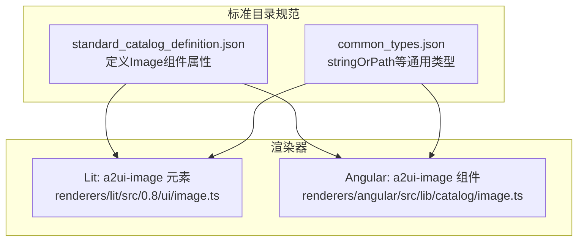
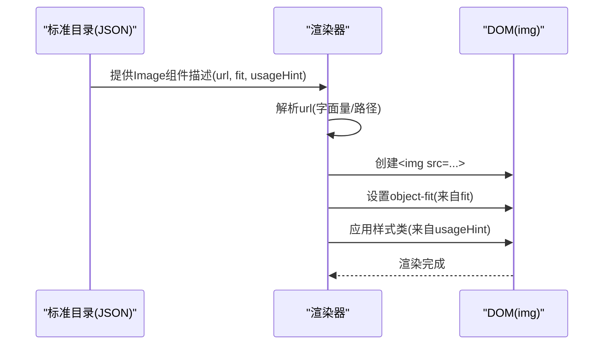
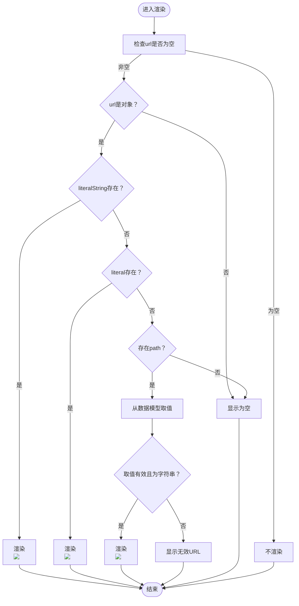
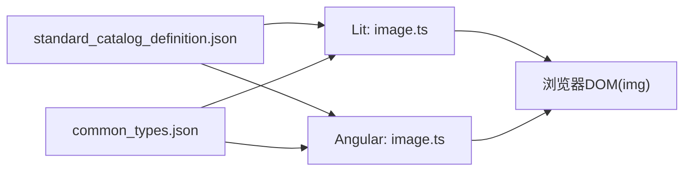

# 图片组件 (Image)

<cite>
**本文引用的文件**
- [renderers/lit/src/0.8/ui/image.ts](file://renderers/lit/src/0.8/ui/image.ts)
- [renderers/angular/src/lib/catalog/image.ts](file://renderers/angular/src/lib/catalog/image.ts)
- [specification/0.9/json/standard_catalog_definition.json](file://specification/0.9/json/standard_catalog_definition.json)
- [specification/0.9/json/common_types.json](file://specification/0.9/json/common_types.json)
- [samples/client/angular/projects/gallery/src/app/features/gallery/gallery.component.ts](file://samples/client/angular/projects/gallery/src/app/features/gallery/gallery.component.ts)
</cite>

## 目录
1. [简介](#简介)
2. [项目结构](#项目结构)
3. [核心组件](#核心组件)
4. [架构总览](#架构总览)
5. [详细组件分析](#详细组件分析)
6. [依赖关系分析](#依赖关系分析)
7. [性能考量](#性能考量)
8. [故障排查指南](#故障排查指南)
9. [结论](#结论)
10. [附录](#附录)

## 简介
本文件面向A2UI标准目录中的“图片”组件，系统性说明其在Lit与Angular渲染器中的实现与用法，以及在标准目录规范中的属性定义。重点覆盖：
- 组件用途：以声明式JSON描述的方式渲染图片，并支持样式与布局提示。
- 属性清单：url、fit、usageHint等，明确类型、取值范围与默认行为。
- 可访问性：alt属性在无障碍中的重要性与建议实践。
- 框架示例：在Lit与Angular中通过JSON定义图片的示例路径。
- 响应式图片：当前实现对srcset/图片集的说明与建议。

## 项目结构
图片组件在两个渲染器中分别实现：
- Lit渲染器：自定义元素 a2ui-image，负责解析url、应用fit与usageHint样式。
- Angular渲染器：组件 a2ui-image，负责解析url与usageHint，输出img标签。

标准目录规范定义了图片组件的属性与约束，common_types.json提供了字符串或路径的通用类型定义。

图表来源
- [renderers/lit/src/0.8/ui/image.ts](file://renderers/lit/src/0.8/ui/image.ts#L1-L118)
- [renderers/angular/src/lib/catalog/image.ts](file://renderers/angular/src/lib/catalog/image.ts#L1-L62)
- [specification/0.9/json/standard_catalog_definition.json](file://specification/0.9/json/standard_catalog_definition.json#L71-L105)
- [specification/0.9/json/common_types.json](file://specification/0.9/json/common_types.json#L7-L20)

章节来源
- [renderers/lit/src/0.8/ui/image.ts](file://renderers/lit/src/0.8/ui/image.ts#L1-L118)
- [renderers/angular/src/lib/catalog/image.ts](file://renderers/angular/src/lib/catalog/image.ts#L1-L62)
- [specification/0.9/json/standard_catalog_definition.json](file://specification/0.9/json/standard_catalog_definition.json#L71-L105)
- [specification/0.9/json/common_types.json](file://specification/0.9/json/common_types.json#L7-L20)

## 核心组件
- 组件名称：Image
- 组件类型：标准目录中的内置组件
- 渲染目标：HTML img元素
- 关键职责：
  - 解析url（支持字面量字符串或数据模型路径）
  - 应用fit（对应CSS object-fit）
  - 应用usageHint（主题样式提示）
  - 在Angular/Lit中分别输出img标签

章节来源
- [specification/0.9/json/standard_catalog_definition.json](file://specification/0.9/json/standard_catalog_definition.json#L71-L105)
- [renderers/lit/src/0.8/ui/image.ts](file://renderers/lit/src/0.8/ui/image.ts#L28-L118)
- [renderers/angular/src/lib/catalog/image.ts](file://renderers/angular/src/lib/catalog/image.ts#L17-L62)

## 架构总览
图片组件在渲染流程中的位置如下：
- 标准目录定义了组件属性与约束
- 渲染器读取组件描述，解析url与样式提示
- 输出img标签，由浏览器渲染

图表来源
- [specification/0.9/json/standard_catalog_definition.json](file://specification/0.9/json/standard_catalog_definition.json#L71-L105)
- [renderers/lit/src/0.8/ui/image.ts](file://renderers/lit/src/0.8/ui/image.ts#L62-L118)
- [renderers/angular/src/lib/catalog/image.ts](file://renderers/angular/src/lib/catalog/image.ts#L38-L62)

## 详细组件分析

### 属性定义与行为
- 组件名：Image
- 必填字段：component、url
- 可选字段：
  - url：字符串或路径（stringOrPath），用于指定图片地址
  - fit：枚举，可选值为contain、cover、fill、none、scale-down，默认fill
  - usageHint：字符串，用于选择主题样式提示，常见值如icon、avatar、smallFeature、mediumFeature、largeFeature、header

类型与默认值来源
- fit默认值：Lit渲染器中通过CSS变量与属性默认值共同决定，默认为fill
- usageHint：用于合并主题样式，渲染器会将其映射到主题Image样式集合

章节来源
- [specification/0.9/json/standard_catalog_definition.json](file://specification/0.9/json/standard_catalog_definition.json#L71-L105)
- [specification/0.9/json/common_types.json](file://specification/0.9/json/common_types.json#L7-L20)
- [renderers/lit/src/0.8/ui/image.ts](file://renderers/lit/src/0.8/ui/image.ts#L36-L38)
- [renderers/lit/src/0.8/ui/image.ts](file://renderers/lit/src/0.8/ui/image.ts#L102-L117)
- [renderers/angular/src/lib/catalog/image.ts](file://renderers/angular/src/lib/catalog/image.ts#L48-L62)

### 渲染流程（Lit）
- url解析：
  - 字面量字符串：直接使用
  - 路径：从数据模型取值，要求返回字符串
- 样式应用：
  - 合并主题Image.all与usageHint对应的样式
  - 通过CSS变量设置object-fit
- DOM输出：生成img标签并包裹于section容器

图表来源
- [renderers/lit/src/0.8/ui/image.ts](file://renderers/lit/src/0.8/ui/image.ts#L62-L118)

章节来源
- [renderers/lit/src/0.8/ui/image.ts](file://renderers/lit/src/0.8/ui/image.ts#L62-L118)

### 渲染流程（Angular）
- 输入：
  - url：字符串或路径
  - usageHint：样式提示
- 处理：
  - 解析url为字符串
  - 合并主题样式（Image.all + usageHint）
- DOM输出：生成img标签并应用样式

章节来源
- [renderers/angular/src/lib/catalog/image.ts](file://renderers/angular/src/lib/catalog/image.ts#L38-L62)

### 可访问性与alt属性
- 规范中未定义alt字段；当前实现亦未在img上绑定alt
- 建议：
  - 对于装饰性图片可省略alt
  - 对于传达关键信息的图片，应在JSON中扩展字段或在主题层提供替代文本策略
  - 若需要alt，请在主题或扩展层补充，避免破坏现有规范

章节来源
- [specification/0.9/json/standard_catalog_definition.json](file://specification/0.9/json/standard_catalog_definition.json#L71-L105)
- [renderers/lit/src/0.8/ui/image.ts](file://renderers/lit/src/0.8/ui/image.ts#L62-L118)
- [renderers/angular/src/lib/catalog/image.ts](file://renderers/angular/src/lib/catalog/image.ts#L38-L62)

### 框架下JSON定义示例（路径）
- Lit示例（Angular画廊示例中使用Image组件）：
  - 示例路径：samples/client/angular/projects/gallery/src/app/features/gallery/gallery.component.ts
  - 示例片段路径：samples/client/angular/projects/gallery/src/app/features/gallery/gallery.component.ts#L41-L77
- Angular示例（同上文件中Image组件的使用）

章节来源
- [samples/client/angular/projects/gallery/src/app/features/gallery/gallery.component.ts](file://samples/client/angular/projects/gallery/src/app/features/gallery/gallery.component.ts#L41-L77)

### 响应式图片（srcset/多分辨率）
- 当前实现未提供srcset或图片集的专用属性
- 建议实践：
  - 在url中使用多分辨率资源或CDN提供的自适应URL
  - 如需更细粒度控制，可在主题或扩展层引入额外属性并在渲染器中处理

章节来源
- [renderers/lit/src/0.8/ui/image.ts](file://renderers/lit/src/0.8/ui/image.ts#L62-L118)
- [renderers/angular/src/lib/catalog/image.ts](file://renderers/angular/src/lib/catalog/image.ts#L38-L62)

## 依赖关系分析
- 标准目录规范
  - Image组件定义位于standard_catalog_definition.json
  - 字符串或路径类型定义位于common_types.json
- 渲染器依赖
  - Lit：Root基类、样式工具、主题样式合并、数据模型处理器
  - Angular：DynamicComponent基类、样式工具、主题样式合并

图表来源
- [specification/0.9/json/standard_catalog_definition.json](file://specification/0.9/json/standard_catalog_definition.json#L71-L105)
- [specification/0.9/json/common_types.json](file://specification/0.9/json/common_types.json#L7-L20)
- [renderers/lit/src/0.8/ui/image.ts](file://renderers/lit/src/0.8/ui/image.ts#L1-L118)
- [renderers/angular/src/lib/catalog/image.ts](file://renderers/angular/src/lib/catalog/image.ts#L1-L62)

章节来源
- [specification/0.9/json/standard_catalog_definition.json](file://specification/0.9/json/standard_catalog_definition.json#L71-L105)
- [specification/0.9/json/common_types.json](file://specification/0.9/json/common_types.json#L7-L20)
- [renderers/lit/src/0.8/ui/image.ts](file://renderers/lit/src/0.8/ui/image.ts#L1-L118)
- [renderers/angular/src/lib/catalog/image.ts](file://renderers/angular/src/lib/catalog/image.ts#L1-L62)

## 性能考量
- 资源加载
  - 使用合适的图片格式与压缩策略
  - 避免过大的初始尺寸，结合fit与容器布局减少重排
- 数据绑定
  - url为路径时，确保数据模型稳定，避免频繁变更导致重复渲染
- 主题样式
  - 合理使用usageHint，减少不必要的样式计算

## 故障排查指南
- 无URL或URL为空
  - 表现：不渲染或显示为空
  - 排查：确认url是否传入、是否为字面量或路径
- 路径取值无效
  - 表现：显示无效URL
  - 排查：确认数据模型中该路径是否存在、类型是否为字符串
- fit未生效
  - 表现：图片未按预期缩放
  - 排查：确认fit取值是否在允许范围内，容器是否有合适尺寸
- usageHint样式未生效
  - 表现：图片未应用期望的主题样式
  - 排查：确认主题中Image.all与usageHint对应的样式是否存在

章节来源
- [renderers/lit/src/0.8/ui/image.ts](file://renderers/lit/src/0.8/ui/image.ts#L62-L118)
- [renderers/angular/src/lib/catalog/image.ts](file://renderers/angular/src/lib/catalog/image.ts#L38-L62)

## 结论
- Image组件通过标准目录定义清晰地表达图片渲染需求，支持字面量与数据模型两种URL来源，并通过fit与usageHint实现灵活的布局与样式控制。
- 当前规范未包含alt属性，建议在扩展层或主题层补充以满足可访问性需求。
- 响应式图片可通过URL侧策略实现，未来可在规范中引入srcset等属性以标准化处理。

## 附录

### 属性对照表
- component：固定为Image
- url：字符串或路径（stringOrPath）
- fit：枚举，可选值contain、cover、fill、none、scale-down，默认fill
- usageHint：字符串，用于选择主题样式提示，常见值icon、avatar、smallFeature、mediumFeature、largeFeature、header

章节来源
- [specification/0.9/json/standard_catalog_definition.json](file://specification/0.9/json/standard_catalog_definition.json#L71-L105)
- [specification/0.9/json/common_types.json](file://specification/0.9/json/common_types.json#L7-L20)
- [renderers/lit/src/0.8/ui/image.ts](file://renderers/lit/src/0.8/ui/image.ts#L36-L38)
- [renderers/lit/src/0.8/ui/image.ts](file://renderers/lit/src/0.8/ui/image.ts#L102-L117)
- [renderers/angular/src/lib/catalog/image.ts](file://renderers/angular/src/lib/catalog/image.ts#L48-L62)

### 框架示例（路径）
- Lit示例（Angular画廊中使用Image组件）：
  - 示例路径：samples/client/angular/projects/gallery/src/app/features/gallery/gallery.component.ts#L41-L77
- Angular示例（同上文件中Image组件的使用）：
  - 示例路径：samples/client/angular/projects/gallery/src/app/features/gallery/gallery.component.ts#L41-L77

章节来源
- [samples/client/angular/projects/gallery/src/app/features/gallery/gallery.component.ts](file://samples/client/angular/projects/gallery/src/app/features/gallery/gallery.component.ts#L41-L77)