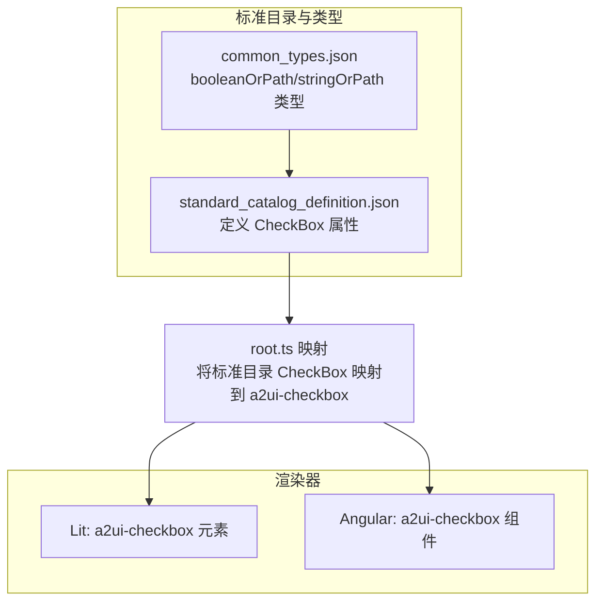
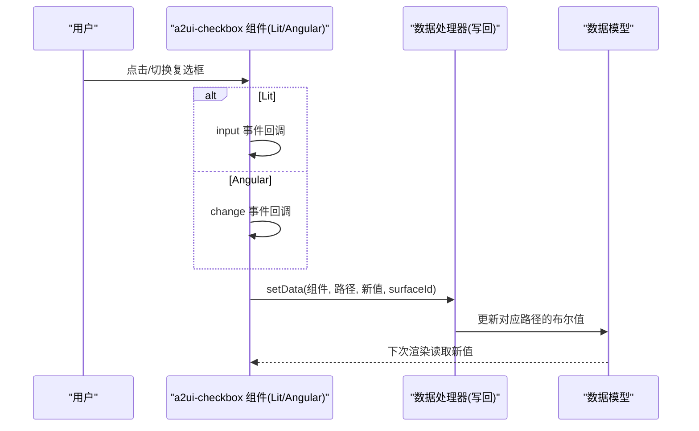
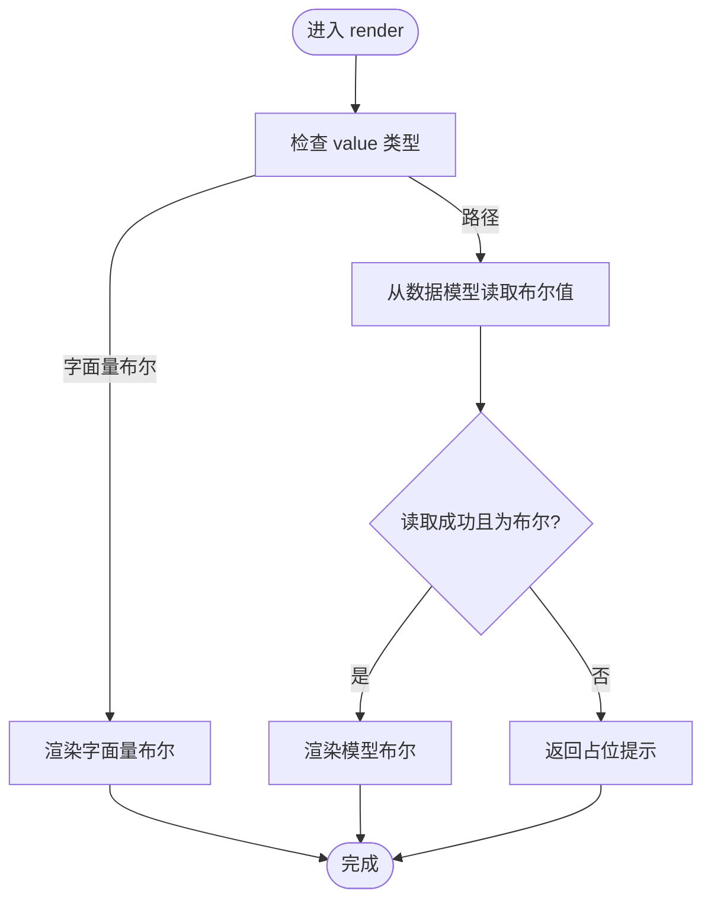
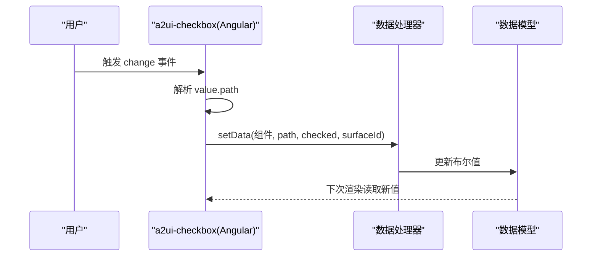
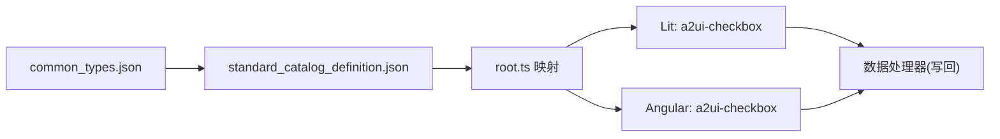

# 复选框组件 (Checkbox)

<cite>
**本文引用的文件**
- [renderers/lit/src/0.8/ui/checkbox.ts](file://renderers/lit/src/0.8/ui/checkbox.ts)
- [renderers/angular/src/lib/catalog/checkbox.ts](file://renderers/angular/src/lib/catalog/checkbox.ts)
- [renderers/lit/src/0.8/ui/root.ts](file://renderers/lit/src/0.8/ui/root.ts)
- [specification/0.9/json/standard_catalog_definition.json](file://specification/0.9/json/standard_catalog_definition.json)
- [specification/0.9/json/common_types.json](file://specification/0.9/json/common_types.json)
- [specification/0.8/json/server_to_client_with_standard_catalog.json](file://specification/0.8/json/server_to_client_with_standard_catalog.json)
</cite>

## 目录
1. [简介](#简介)
2. [项目结构](#项目结构)
3. [核心组件](#核心组件)
4. [架构总览](#架构总览)
5. [详细组件分析](#详细组件分析)
6. [依赖关系分析](#依赖关系分析)
7. [性能考量](#性能考量)
8. [故障排查指南](#故障排查指南)
9. [结论](#结论)
10. [附录](#附录)

## 简介
本文件系统性地介绍 A2UI 复选框组件（CheckBox），聚焦于二元选择（选中/未选中）能力。文档基于仓库中的实现与规范，说明组件在 Lit 与 Angular 渲染器中的行为、数据绑定方式、事件机制、可访问性（与标签关联）以及响应式行为，并给出 JSON 定义示例路径与注意事项。

## 项目结构
- 组件在两个渲染器中分别实现：
  - Lit 实现：自定义元素 a2ui-checkbox，负责渲染输入与标签、处理输入事件并写回数据模型。
  - Angular 实现：组件 a2ui-checkbox，负责渲染输入与标签、处理变更事件并写回数据模型。
- 标准目录定义与通用类型定义位于 specification 目录，明确组件属性与取值范围。
- Lit 渲染器在根节点映射中将标准目录中的 CheckBox 节点渲染为 a2ui-checkbox 元素。

图表来源
- [renderers/lit/src/0.8/ui/root.ts](file://renderers/lit/src/0.8/ui/root.ts#L323-L337)
- [specification/0.9/json/standard_catalog_definition.json](file://specification/0.9/json/standard_catalog_definition.json#L469-L489)
- [specification/0.9/json/common_types.json](file://specification/0.9/json/common_types.json#L35-L48)

章节来源
- [renderers/lit/src/0.8/ui/root.ts](file://renderers/lit/src/0.8/ui/root.ts#L323-L337)
- [specification/0.9/json/standard_catalog_definition.json](file://specification/0.9/json/standard_catalog_definition.json#L469-L489)
- [specification/0.9/json/common_types.json](file://specification/0.9/json/common_types.json#L35-L48)

## 核心组件
- 组件名称：CheckBox
- 功能：提供二元选择（选中/未选中），支持与标签文本关联，支持数据模型绑定与写回。
- 关键属性（来自标准目录定义与实现）：
  - label：字符串或路径，显示在复选框旁的标签文本。类型参考 stringOrPath。
  - value：布尔或路径，当前选中状态（true 表示选中，false 表示未选中）。类型参考 booleanOrPath。
- 事件：change（Angular）或 input（Lit）事件，载荷为新的选中状态（布尔值）。
- 可访问性：输入与标签通过 for/id 关联，确保键盘与屏幕阅读器可用。
- 响应式行为：当 value 为路径时，组件从数据模型读取初始值；用户交互后写回数据模型。

章节来源
- [specification/0.9/json/standard_catalog_definition.json](file://specification/0.9/json/standard_catalog_definition.json#L469-L489)
- [specification/0.9/json/common_types.json](file://specification/0.9/json/common_types.json#L35-L48)
- [renderers/lit/src/0.8/ui/checkbox.ts](file://renderers/lit/src/0.8/ui/checkbox.ts#L26-L33)
- [renderers/angular/src/lib/catalog/checkbox.ts](file://renderers/angular/src/lib/catalog/checkbox.ts#L57-L63)

## 架构总览
Lit 与 Angular 两套实现均遵循“标准目录 -> 渲染器组件”的映射模式：
- 标准目录定义 CheckBox 的 label 与 value 字段；
- 根节点映射将标准目录中的 CheckBox 节点渲染为 a2ui-checkbox；
- 组件内部根据 value 的字面量或路径决定渲染与数据绑定策略；
- 用户交互触发事件，组件写回数据模型。

图表来源
- [renderers/lit/src/0.8/ui/checkbox.ts](file://renderers/lit/src/0.8/ui/checkbox.ts#L91-L100)
- [renderers/angular/src/lib/catalog/checkbox.ts](file://renderers/angular/src/lib/catalog/checkbox.ts#L64-L72)
- [renderers/lit/src/0.8/ui/root.ts](file://renderers/lit/src/0.8/ui/root.ts#L323-L337)

## 详细组件分析

### 属性与类型定义
- label
  - 类型：stringOrPath
  - 含义：复选框旁显示的标签文本，可为字面量字符串或指向数据模型的路径。
  - 默认值：无默认值，必须提供。
- value
  - 类型：booleanOrPath
  - 含义：当前选中状态，true 表示选中，false 表示未选中；可为字面量布尔值或数据模型路径。
  - 默认值：无默认值，必须提供。
- disabled/required
  - 在当前实现与标准目录定义中未发现专用字段。若需要禁用或必填语义，可通过上层布局或样式控制，或在业务逻辑中进行校验。

章节来源
- [specification/0.9/json/standard_catalog_definition.json](file://specification/0.9/json/standard_catalog_definition.json#L469-L489)
- [specification/0.9/json/common_types.json](file://specification/0.9/json/common_types.json#L35-L48)

### 数据绑定与渲染流程（Lit）
- 渲染入口：组件 render 方法根据 value 的类型分支：
  - 字面量布尔：直接渲染；
  - 路径：从数据模型读取布尔值后再渲染；
  - 非布尔或空值：返回占位提示。
- 事件处理：input 事件回调中，将目标值写回数据模型指定路径。
- 标签关联：input 使用固定 id，label 的 for 指向该 id，保证可访问性。

图表来源
- [renderers/lit/src/0.8/ui/checkbox.ts](file://renderers/lit/src/0.8/ui/checkbox.ts#L108-L139)

章节来源
- [renderers/lit/src/0.8/ui/checkbox.ts](file://renderers/lit/src/0.8/ui/checkbox.ts#L26-L33)
- [renderers/lit/src/0.8/ui/checkbox.ts](file://renderers/lit/src/0.8/ui/checkbox.ts#L91-L100)
- [renderers/lit/src/0.8/ui/checkbox.ts](file://renderers/lit/src/0.8/ui/checkbox.ts#L108-L139)

### 数据绑定与渲染流程（Angular）
- 输入属性：value、label 均为 required，内部通过 computed 解析字面量或路径。
- 事件处理：change 事件回调中，若存在路径则调用数据处理器写回布尔值。
- 标签关联：input 与 label 通过唯一 id 关联，保证可访问性。

图表来源
- [renderers/angular/src/lib/catalog/checkbox.ts](file://renderers/angular/src/lib/catalog/checkbox.ts#L57-L73)

章节来源
- [renderers/angular/src/lib/catalog/checkbox.ts](file://renderers/angular/src/lib/catalog/checkbox.ts#L57-L73)

### 事件与载荷
- Lit：input 事件
  - 触发时机：用户更改输入值时。
  - 载荷：事件对象，组件内部从 target 中读取新的布尔值并写回数据模型。
- Angular：change 事件
  - 触发时机：用户更改输入值时。
  - 载荷：事件对象，组件内部从 target 中读取新的布尔值并写回数据模型。

章节来源
- [renderers/lit/src/0.8/ui/checkbox.ts](file://renderers/lit/src/0.8/ui/checkbox.ts#L91-L100)
- [renderers/angular/src/lib/catalog/checkbox.ts](file://renderers/angular/src/lib/catalog/checkbox.ts#L64-L72)

### 可访问性与标签关联
- 输入与标签通过 for/id 关联，确保键盘导航与屏幕阅读器正确识别控件与其标签。
- Lit：input 使用固定 id，label 的 for 指向该 id。
- Angular：input 与 label 通过唯一 id 关联。

章节来源
- [renderers/lit/src/0.8/ui/checkbox.ts](file://renderers/lit/src/0.8/ui/checkbox.ts#L98-L104)
- [renderers/angular/src/lib/catalog/checkbox.ts](file://renderers/angular/src/lib/catalog/checkbox.ts#L28-L40)

### 响应式行为
- 当 value 为路径时，组件会从数据模型读取初始值并在用户交互后写回，从而实现双向数据绑定。
- 当 value 为字面量时，组件仅渲染该值，不进行写回。

章节来源
- [renderers/lit/src/0.8/ui/checkbox.ts](file://renderers/lit/src/0.8/ui/checkbox.ts#L114-L134)
- [renderers/angular/src/lib/catalog/checkbox.ts](file://renderers/angular/src/lib/catalog/checkbox.ts#L60-L63)

### JSON 定义示例（路径）
以下示例展示了如何在 JSON 中定义一个复选框组件。请将以下片段复制到你的组件目录 JSON 中使用。

- 示例路径（Lit/Angular 均可使用）：
  - [示例 JSON（0.9 标准目录）](file://specification/0.9/json/standard_catalog_definition.json#L469-L489)
  - [通用类型定义（booleanOrPath/stringOrPath）](file://specification/0.9/json/common_types.json#L35-L48)
  - [服务端到客户端标准目录（0.8 版本）](file://specification/0.8/json/server_to_client_with_standard_catalog.json#L544-L567)

注意：
- 组件类型字段为 "CheckBox"。
- label 字段支持字面量字符串或路径对象。
- value 字段支持字面量布尔或路径对象。
- 以上示例以 JSON Schema 形式定义，实际使用时请将其嵌入到你的组件目录中。

章节来源
- [specification/0.9/json/standard_catalog_definition.json](file://specification/0.9/json/standard_catalog_definition.json#L469-L489)
- [specification/0.9/json/common_types.json](file://specification/0.9/json/common_types.json#L35-L48)
- [specification/0.8/json/server_to_client_with_standard_catalog.json](file://specification/0.8/json/server_to_client_with_standard_catalog.json#L544-L567)

## 依赖关系分析
- 组件依赖：
  - 标准目录定义：提供 CheckBox 的属性与类型约束。
  - 通用类型：booleanOrPath、stringOrPath。
  - 根节点映射：将标准目录中的 CheckBox 节点映射到 a2ui-checkbox 元素。
  - 数据处理器：负责写回数据模型。
- 渲染器耦合：
  - Lit：自定义元素 a2ui-checkbox，内部处理 input 事件与数据写回。
  - Angular：组件 a2ui-checkbox，内部处理 change 事件与数据写回。

图表来源
- [renderers/lit/src/0.8/ui/root.ts](file://renderers/lit/src/0.8/ui/root.ts#L323-L337)
- [specification/0.9/json/standard_catalog_definition.json](file://specification/0.9/json/standard_catalog_definition.json#L469-L489)
- [specification/0.9/json/common_types.json](file://specification/0.9/json/common_types.json#L35-L48)

章节来源
- [renderers/lit/src/0.8/ui/root.ts](file://renderers/lit/src/0.8/ui/root.ts#L323-L337)
- [specification/0.9/json/standard_catalog_definition.json](file://specification/0.9/json/standard_catalog_definition.json#L469-L489)
- [specification/0.9/json/common_types.json](file://specification/0.9/json/common_types.json#L35-L48)

## 性能考量
- 渲染分支：当 value 为路径时，组件需要从数据模型读取值，建议避免频繁更新导致的重复渲染。
- 事件处理：input/change 事件回调中仅执行必要的写回操作，避免在事件处理中进行重型计算。
- 样式与主题：组件样式采用主题配置，合理组织主题资源可减少重绘开销。

## 故障排查指南
- 无法渲染或显示占位提示
  - 检查 value 是否为布尔字面量或有效路径；若为路径，确认数据模型中对应值为布尔类型。
  - 参考渲染分支逻辑与错误提示位置。
  - 参考路径：[renderers/lit/src/0.8/ui/checkbox.ts](file://renderers/lit/src/0.8/ui/checkbox.ts#L114-L139)
- 事件未写回数据模型
  - 确认 value 提供了 path；Lit 使用 input 事件，Angular 使用 change 事件。
  - 参考事件处理逻辑：
    - [renderers/lit/src/0.8/ui/checkbox.ts](file://renderers/lit/src/0.8/ui/checkbox.ts#L91-L100)
    - [renderers/angular/src/lib/catalog/checkbox.ts](file://renderers/angular/src/lib/catalog/checkbox.ts#L64-L72)
- 标签未正确关联
  - 确认 input 与 label 的 for/id 关联是否一致。
  - 参考：
    - [renderers/lit/src/0.8/ui/checkbox.ts](file://renderers/lit/src/0.8/ui/checkbox.ts#L98-L104)
    - [renderers/angular/src/lib/catalog/checkbox.ts](file://renderers/angular/src/lib/catalog/checkbox.ts#L28-L40)

章节来源
- [renderers/lit/src/0.8/ui/checkbox.ts](file://renderers/lit/src/0.8/ui/checkbox.ts#L91-L100)
- [renderers/lit/src/0.8/ui/checkbox.ts](file://renderers/lit/src/0.8/ui/checkbox.ts#L114-L139)
- [renderers/angular/src/lib/catalog/checkbox.ts](file://renderers/angular/src/lib/catalog/checkbox.ts#L64-L72)
- [renderers/lit/src/0.8/ui/checkbox.ts](file://renderers/lit/src/0.8/ui/checkbox.ts#L98-L104)
- [renderers/angular/src/lib/catalog/checkbox.ts](file://renderers/angular/src/lib/catalog/checkbox.ts#L28-L40)

## 结论
A2UI 复选框组件在 Lit 与 Angular 两端实现了统一的二元选择体验，具备良好的可访问性与响应式行为。通过标准目录定义与通用类型约束，组件在 JSON 层面清晰表达 label 与 value 的取值方式；在渲染器层面，组件负责将用户交互写回数据模型，形成闭环的数据流。对于禁用与必填等需求，可在上层布局或业务逻辑中补充，以满足不同场景的 UI 与交互要求。

## 附录
- 术语说明
  - 字面量：直接在 JSON 中提供的具体值（如字符串、布尔、数字）。
  - 路径：指向数据模型某处的引用，通常以字符串形式表示。
- 相关文件路径
  - Lit 实现：[renderers/lit/src/0.8/ui/checkbox.ts](file://renderers/lit/src/0.8/ui/checkbox.ts)
  - Angular 实现：[renderers/angular/src/lib/catalog/checkbox.ts](file://renderers/angular/src/lib/catalog/checkbox.ts)
  - 标准目录定义：[specification/0.9/json/standard_catalog_definition.json](file://specification/0.9/json/standard_catalog_definition.json)
  - 通用类型定义：[specification/0.9/json/common_types.json](file://specification/0.9/json/common_types.json)
  - 根节点映射：[renderers/lit/src/0.8/ui/root.ts](file://renderers/lit/src/0.8/ui/root.ts)