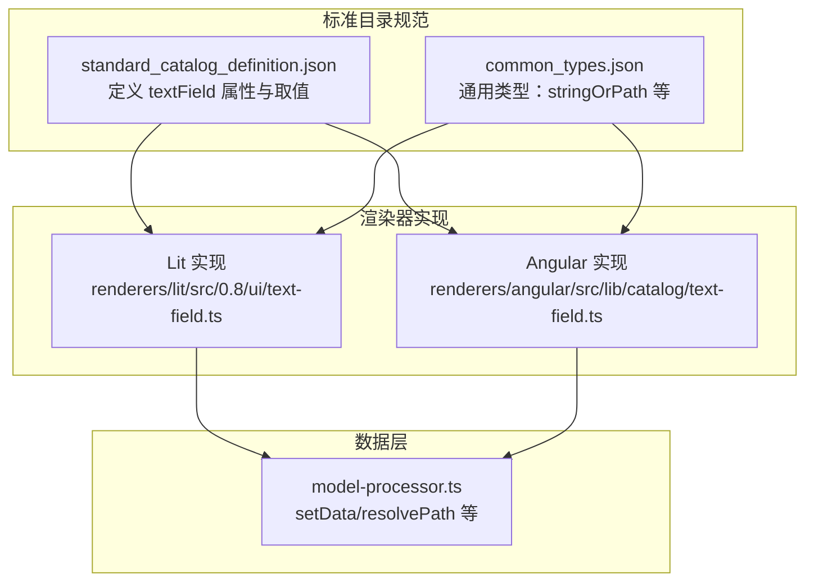
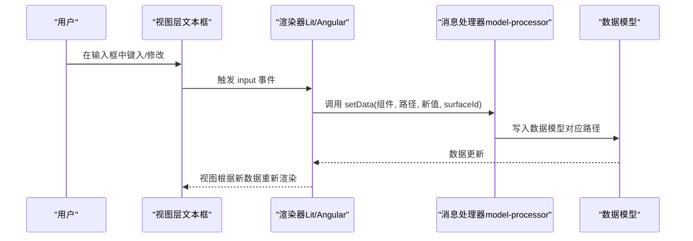
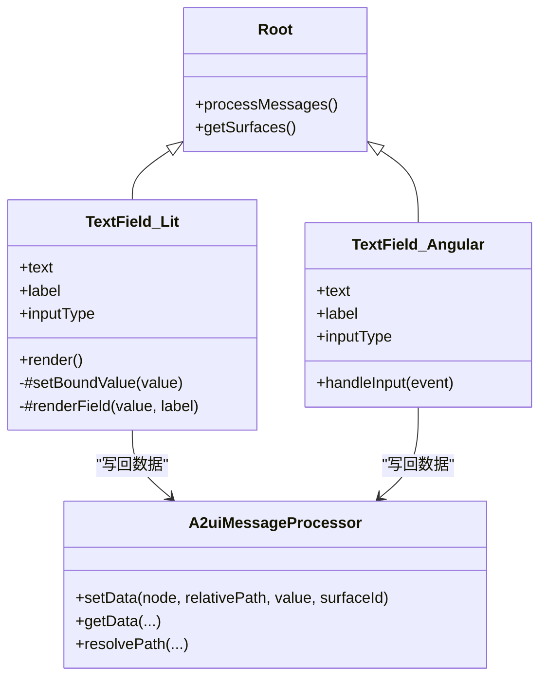
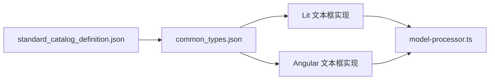

# 文本框组件（Text Field）

<cite>
**本文引用的文件**
- [renderers/lit/src/0.8/ui/text-field.ts](file://renderers/lit/src/0.8/ui/text-field.ts)
- [renderers/angular/src/lib/catalog/text-field.ts](file://renderers/angular/src/lib/catalog/text-field.ts)
- [specification/0.9/json/standard_catalog_definition.json](file://specification/0.9/json/standard_catalog_definition.json)
- [specification/0.9/json/common_types.json](file://specification/0.9/json/common_types.json)
- [renderers/lit/src/0.8/types/components.ts](file://renderers/lit/src/0.8/types/components.ts)
- [renderers/lit/src/0.8/data/model-processor.ts](file://renderers/lit/src/0.8/data/model-processor.ts)
- [samples/client/angular/projects/gallery/src/app/features/library/library.component.ts](file://samples/client/angular/projects/gallery/src/app/features/library/library.component.ts)
</cite>

## 目录
1. [简介](#简介)
2. [项目结构](#项目结构)
3. [核心组件](#核心组件)
4. [架构总览](#架构总览)
5. [详细组件分析](#详细组件分析)
6. [依赖关系分析](#依赖关系分析)
7. [性能考量](#性能考量)
8. [故障排查指南](#故障排查指南)
9. [结论](#结论)
10. [附录](#附录)

## 简介
本文件面向A2UI标准目录中的“文本框”组件（textField），系统性说明其在Lit与Angular渲染器中的实现与使用方式，覆盖属性定义、事件机制、数据绑定、可访问性与响应式行为，并提供基于标准目录规范的JSON定义示例与跨框架集成要点。目标读者既包括前端开发者，也包括对A2UI协议与组件规范感兴趣的非技术读者。

## 项目结构
- 组件规范来自标准目录定义文件，描述了组件的属性、取值范围与必填项。
- 渲染器实现分别位于Lit与Angular目录，负责将标准目录定义映射为实际UI元素。
- 数据模型更新通过消息处理器完成，文本框输入变更会写回数据模型路径。

图表来源
- [renderers/lit/src/0.8/ui/text-field.ts](file://renderers/lit/src/0.8/ui/text-field.ts#L1-L131)
- [renderers/angular/src/lib/catalog/text-field.ts](file://renderers/angular/src/lib/catalog/text-field.ts#L1-L87)
- [specification/0.9/json/standard_catalog_definition.json](file://specification/0.9/json/standard_catalog_definition.json#L491-L521)
- [specification/0.9/json/common_types.json](file://specification/0.9/json/common_types.json#L1-L121)
- [renderers/lit/src/0.8/data/model-processor.ts](file://renderers/lit/src/0.8/data/model-processor.ts#L153-L179)

章节来源
- [renderers/lit/src/0.8/ui/text-field.ts](file://renderers/lit/src/0.8/ui/text-field.ts#L1-L131)
- [renderers/angular/src/lib/catalog/text-field.ts](file://renderers/angular/src/lib/catalog/text-field.ts#L1-L87)
- [specification/0.9/json/standard_catalog_definition.json](file://specification/0.9/json/standard_catalog_definition.json#L491-L521)
- [specification/0.9/json/common_types.json](file://specification/0.9/json/common_types.json#L1-L121)
- [renderers/lit/src/0.8/data/model-processor.ts](file://renderers/lit/src/0.8/data/model-processor.ts#L153-L179)

## 核心组件
- 组件名称：TextField（标准目录定义）
- 功能：接收用户文本输入，支持标签、占位提示、输入类型切换（文本/数字），并把输入值写回到数据模型指定路径。
- 关键点：
  - 输入事件：input（Lit）或 (input)（Angular）。
  - 数据绑定：通过路径解析与消息处理器写入数据模型。
  - 可访问性：自动设置label与input的关联ID；输入关闭自动完成功能。
  - 响应式：根据容器权重（weight）进行弹性布局。

章节来源
- [renderers/lit/src/0.8/ui/text-field.ts](file://renderers/lit/src/0.8/ui/text-field.ts#L82-L113)
- [renderers/angular/src/lib/catalog/text-field.ts](file://renderers/angular/src/lib/catalog/text-field.ts#L55-L86)
- [renderers/lit/src/0.8/data/model-processor.ts](file://renderers/lit/src/0.8/data/model-processor.ts#L153-L179)

## 架构总览
文本框组件在不同渲染器中的调用链如下：

图表来源
- [renderers/lit/src/0.8/ui/text-field.ts](file://renderers/lit/src/0.8/ui/text-field.ts#L99-L110)
- [renderers/angular/src/lib/catalog/text-field.ts](file://renderers/angular/src/lib/catalog/text-field.ts#L77-L86)
- [renderers/lit/src/0.8/data/model-processor.ts](file://renderers/lit/src/0.8/data/model-processor.ts#L153-L179)

## 详细组件分析

### 属性与默认值（以标准目录定义为准）
以下属性来自标准目录定义文件，类型与取值范围以该文件为准。注意：部分实现细节（如默认占位符）可能在具体渲染器中体现，但属性语义由规范决定。

- component
  - 类型：字符串常量
  - 取值：固定为 "TextField"
  - 必填：是
  - 作用：标识组件类型

- label
  - 类型：stringOrPath
  - 必填：是
  - 作用：显示在输入框上方的标签文本

- text
  - 类型：stringOrPath
  - 必填：否
  - 作用：输入框当前值（双向绑定的目标）

- usageHint
  - 类型：枚举
  - 取值：["longText", "number", "shortText", "obscured"]
  - 必填：否
  - 作用：提示输入行为（长文本、数字、短文本、隐藏输入）

- validationRegexp
  - 类型：字符串
  - 必填：否
  - 作用：客户端正则校验表达式（由渲染器决定是否使用）

章节来源
- [specification/0.9/json/standard_catalog_definition.json](file://specification/0.9/json/standard_catalog_definition.json#L491-L521)
- [specification/0.9/json/common_types.json](file://specification/0.9/json/common_types.json#L1-L121)

### 渲染器实现差异（Lit vs Angular）
- 共同点
  - 都监听 input 事件并将值写回数据模型路径。
  - 都支持根据 usageHint 的 "number" 切换 input 类型为 number。
  - 都生成唯一的 input id 并与 label 关联。
  - 都关闭浏览器自动完成功能以避免干扰。

- 差异点
  - Lit实现：自定义元素名为 a2ui-textfield，使用Lit模板与样式映射。
  - Angular实现：组件名为 a2ui-text-field，使用Angular输入属性与模板绑定。
  - 占位符：Angular实现模板中硬编码了占位提示文本；Lit实现通过占位属性设置默认提示。

章节来源
- [renderers/lit/src/0.8/ui/text-field.ts](file://renderers/lit/src/0.8/ui/text-field.ts#L28-L113)
- [renderers/angular/src/lib/catalog/text-field.ts](file://renderers/angular/src/lib/catalog/text-field.ts#L1-L87)

### 事件与载荷
- 事件名称：input
- 触发时机：用户每次修改输入框内容时
- 事件载荷（渲染器内部处理逻辑）
  - Lit：从原生事件对象读取HTMLInputElement的value，调用消息处理器的setData方法，写入到组件的text.path所指向的数据模型路径。
  - Angular：从原生事件对象读取HTMLInputElement的value，调用消息处理器的setData方法，写入到组件的text.path所指向的数据模型路径。
- 注意：标准目录定义未声明change事件；本组件通过input事件实现即时数据绑定。

章节来源
- [renderers/lit/src/0.8/ui/text-field.ts](file://renderers/lit/src/0.8/ui/text-field.ts#L99-L110)
- [renderers/angular/src/lib/catalog/text-field.ts](file://renderers/angular/src/lib/catalog/text-field.ts#L77-L86)
- [renderers/lit/src/0.8/data/model-processor.ts](file://renderers/lit/src/0.8/data/model-processor.ts#L153-L179)

### 数据绑定与路径解析
- 文本框的text属性支持两种形式：
  - 字面量字符串
  - 对数据模型路径的引用（stringOrPath）
- 当使用路径引用时，渲染器会将输入值写回到该路径，从而驱动上层UI与业务逻辑更新。
- 路径解析与写入由消息处理器统一完成，支持相对路径与绝对路径。

章节来源
- [specification/0.9/json/common_types.json](file://specification/0.9/json/common_types.json#L1-L121)
- [renderers/lit/src/0.8/data/model-processor.ts](file://renderers/lit/src/0.8/data/model-processor.ts#L153-L179)

### 可访问性（Accessibility）
- 标签与输入框关联：渲染器为label与input生成相同id，确保屏幕阅读器正确识别控件与其标签。
- 自动完成：输入关闭自动完成功能，避免浏览器弹窗干扰。
- 键盘交互：原生input支持键盘输入与焦点管理，符合Web可访问性基本要求。

章节来源
- [renderers/lit/src/0.8/ui/text-field.ts](file://renderers/lit/src/0.8/ui/text-field.ts#L82-L113)
- [renderers/angular/src/lib/catalog/text-field.ts](file://renderers/angular/src/lib/catalog/text-field.ts#L55-L86)

### 响应式行为
- 容器权重：组件继承自通用根组件，可通过weight属性参与Flex布局，实现响应式排列与拉伸。
- 输入类型：当usageHint为"number"时，input类型切换为number，便于移动端数字键盘与数值输入优化。

章节来源
- [renderers/lit/src/0.8/ui/text-field.ts](file://renderers/lit/src/0.8/ui/text-field.ts#L46-L61)
- [renderers/lit/src/0.8/types/components.ts](file://renderers/lit/src/0.8/types/components.ts#L154-L166)

### JSON定义示例（跨框架）
以下示例展示如何在标准目录中定义一个文本框组件。示例均来自仓库中的实际示例文件，展示了不同输入类型的典型用法。

- 示例一：普通文本输入
  - 组件：TextField
  - 属性：label（必填）、text（可选）
  - 参考路径：[samples/client/angular/projects/gallery/src/app/features/library/library.component.ts](file://samples/client/angular/projects/gallery/src/app/features/library/library.component.ts#L307-L324)

- 示例二：密码输入（usageHint: obscured 或 type: password）
  - 组件：TextField
  - 属性：label（必填）、type（可选，"password"）
  - 参考路径：[samples/client/angular/projects/gallery/src/app/features/library/library.component.ts](file://samples/client/angular/projects/gallery/src/app/features/library/library.component.ts#L316-L321)

- 示例三：数字输入（usageHint: number 或 type: number）
  - 组件：TextField
  - 属性：label（必填）、type（可选，"number"）
  - 参考路径：[samples/client/angular/projects/gallery/src/app/features/library/library.component.ts](file://samples/client/angular/projects/gallery/src/app/features/library/library.component.ts#L316-L321)

- 示例四：长文本输入（usageHint: longText）
  - 组件：TextField
  - 属性：label（必填）、usageHint（可选，"longText"）
  - 参考路径：[samples/client/angular/projects/gallery/src/app/features/library/library.component.ts](file://samples/client/angular/projects/gallery/src/app/features/library/library.component.ts#L307-L324)

- 示例五：短文本输入（usageHint: shortText）
  - 组件：TextField
  - 属性：label（必填）、usageHint（可选，"shortText"）
  - 参考路径：[samples/client/angular/projects/gallery/src/app/features/library/library.component.ts](file://samples/client/angular/projects/gallery/src/app/features/library/library.component.ts#L307-L324)

章节来源
- [samples/client/angular/projects/gallery/src/app/features/library/library.component.ts](file://samples/client/angular/projects/gallery/src/app/features/library/library.component.ts#L307-L324)

### 类关系与渲染流程（代码级）

图表来源
- [renderers/lit/src/0.8/ui/text-field.ts](file://renderers/lit/src/0.8/ui/text-field.ts#L1-L131)
- [renderers/angular/src/lib/catalog/text-field.ts](file://renderers/angular/src/lib/catalog/text-field.ts#L1-L87)
- [renderers/lit/src/0.8/data/model-processor.ts](file://renderers/lit/src/0.8/data/model-processor.ts#L153-L179)

## 依赖关系分析
- 组件依赖
  - 标准目录定义：提供属性与取值约束
  - 通用类型：stringOrPath等类型定义
  - 消息处理器：统一的数据模型读写入口
- 渲染器耦合
  - Lit与Angular实现共享同一数据写回逻辑，但模板与事件绑定方式不同
- 外部接口
  - 浏览器原生input事件
  - DOM id/label关联

图表来源
- [specification/0.9/json/standard_catalog_definition.json](file://specification/0.9/json/standard_catalog_definition.json#L491-L521)
- [specification/0.9/json/common_types.json](file://specification/0.9/json/common_types.json#L1-L121)
- [renderers/lit/src/0.8/ui/text-field.ts](file://renderers/lit/src/0.8/ui/text-field.ts#L1-L131)
- [renderers/angular/src/lib/catalog/text-field.ts](file://renderers/angular/src/lib/catalog/text-field.ts#L1-L87)
- [renderers/lit/src/0.8/data/model-processor.ts](file://renderers/lit/src/0.8/data/model-processor.ts#L153-L179)

## 性能考量
- 事件频率：input事件频繁触发，建议在上层业务中按需节流或仅在提交时读取最终值。
- 数据写入：setData为轻量操作，但大量字段同时写入可能引发多次重渲染，建议合并更新。
- 样式与主题：渲染器通过主题映射注入样式，避免内联样式过多导致重排。

[本节为通用指导，不直接分析具体文件]

## 故障排查指南
- 输入无变化
  - 检查是否正确传入text.path，且渲染器具备消息处理器实例
  - 确认input事件是否被拦截或阻止冒泡
  - 参考路径：[renderers/lit/src/0.8/ui/text-field.ts](file://renderers/lit/src/0.8/ui/text-field.ts#L99-L110)，[renderers/angular/src/lib/catalog/text-field.ts](file://renderers/angular/src/lib/catalog/text-field.ts#L77-L86)
- 数字输入无效
  - usageHint为"number"时，input类型切换为number；若仍无法输入，请检查浏览器兼容性与平台键盘行为
  - 参考路径：[renderers/lit/src/0.8/ui/text-field.ts](file://renderers/lit/src/0.8/ui/text-field.ts#L106-L111)
- 标签不关联
  - 确保label与input的id一致，且渲染器已生成唯一id
  - 参考路径：[renderers/lit/src/0.8/ui/text-field.ts](file://renderers/lit/src/0.8/ui/text-field.ts#L82-L113)，[renderers/angular/src/lib/catalog/text-field.ts](file://renderers/angular/src/lib/catalog/text-field.ts#L55-L86)
- 数据未写入
  - 确认组件节点与surfaceId有效，路径解析正确
  - 参考路径：[renderers/lit/src/0.8/data/model-processor.ts](file://renderers/lit/src/0.8/data/model-processor.ts#L153-L179)

章节来源
- [renderers/lit/src/0.8/ui/text-field.ts](file://renderers/lit/src/0.8/ui/text-field.ts#L82-L113)
- [renderers/angular/src/lib/catalog/text-field.ts](file://renderers/angular/src/lib/catalog/text-field.ts#L55-L86)
- [renderers/lit/src/0.8/data/model-processor.ts](file://renderers/lit/src/0.8/data/model-processor.ts#L153-L179)

## 结论
A2UI文本框组件通过标准目录定义与渲染器实现解耦，既保证了跨框架一致性，又允许各渲染器在细节上适配自身生态。其核心价值在于：
- 明确的属性与取值约束
- 即时数据绑定与路径解析
- 良好的可访问性与响应式布局
- 与消息处理器的清晰边界

[本节为总结性内容，不直接分析具体文件]

## 附录

### 属性对照表（以标准目录定义为准）
- component：字符串常量，固定为 "TextField"
- label：stringOrPath，必填
- text：stringOrPath，可选
- usageHint：枚举["longText","number","shortText","obscured"]，可选
- validationRegexp：字符串，可选

章节来源
- [specification/0.9/json/standard_catalog_definition.json](file://specification/0.9/json/standard_catalog_definition.json#L491-L521)
- [specification/0.9/json/common_types.json](file://specification/0.9/json/common_types.json#L1-L121)

### 事件说明
- input：用户输入时触发，渲染器内部将值写回数据模型路径

章节来源
- [renderers/lit/src/0.8/ui/text-field.ts](file://renderers/lit/src/0.8/ui/text-field.ts#L99-L110)
- [renderers/angular/src/lib/catalog/text-field.ts](file://renderers/angular/src/lib/catalog/text-field.ts#L77-L86)

### JSON定义示例（参考路径）
- 普通文本输入：[samples/client/angular/projects/gallery/src/app/features/library/library.component.ts](file://samples/client/angular/projects/gallery/src/app/features/library/library.component.ts#L307-L324)
- 密码输入：[samples/client/angular/projects/gallery/src/app/features/library/library.component.ts](file://samples/client/angular/projects/gallery/src/app/features/library/library.component.ts#L316-L321)
- 数字输入：[samples/client/angular/projects/gallery/src/app/features/library/library.component.ts](file://samples/client/angular/projects/gallery/src/app/features/library/library.component.ts#L316-L321)
- 长文本输入：[samples/client/angular/projects/gallery/src/app/features/library/library.component.ts](file://samples/client/angular/projects/gallery/src/app/features/library/library.component.ts#L307-L324)
- 短文本输入：[samples/client/angular/projects/gallery/src/app/features/library/library.component.ts](file://samples/client/angular/projects/gallery/src/app/features/library/library.component.ts#L307-L324)