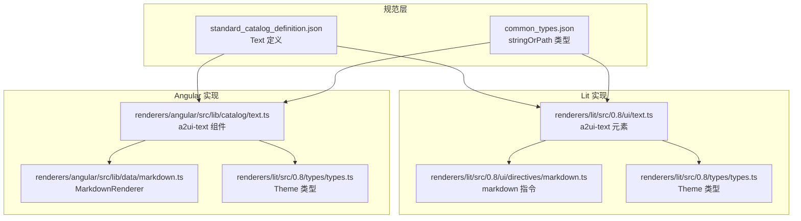
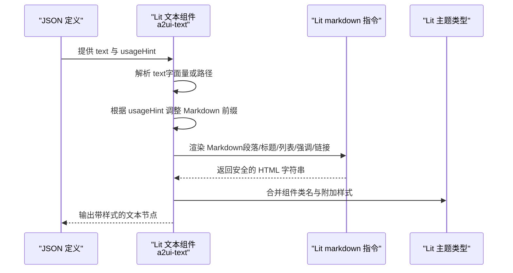
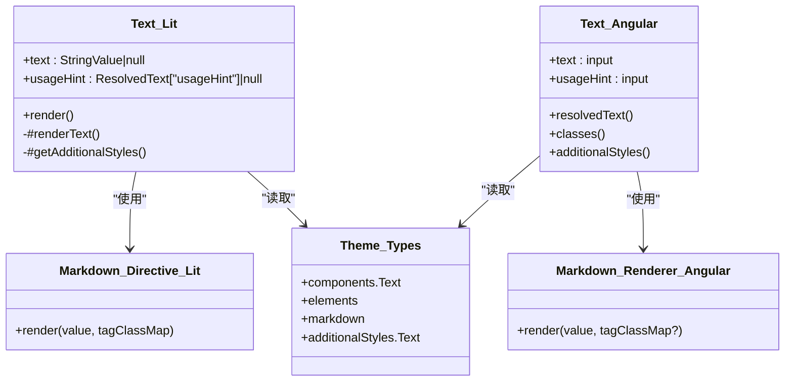
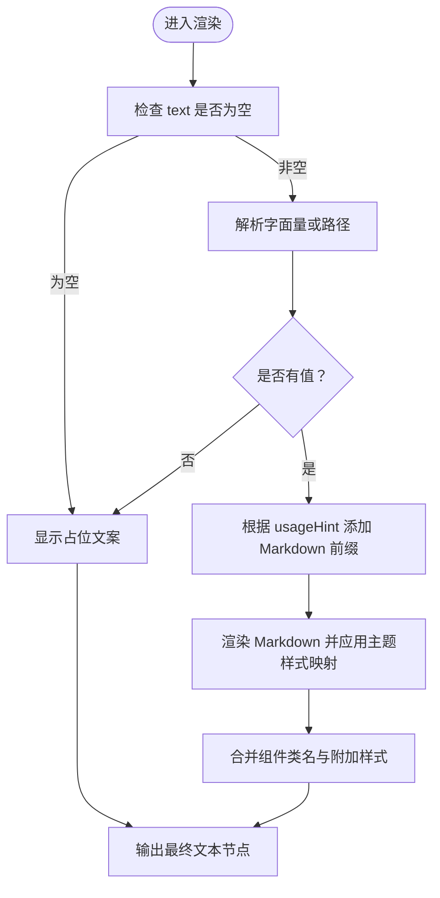

# 文本组件 (Text)

<cite>
**本文引用的文件**
- [renderers/lit/src/0.8/ui/text.ts](file://renderers/lit/src/0.8/ui/text.ts)
- [renderers/angular/src/lib/catalog/text.ts](file://renderers/angular/src/lib/catalog/text.ts)
- [renderers/lit/src/0.8/ui/directives/markdown.ts](file://renderers/lit/src/0.8/ui/directives/markdown.ts)
- [renderers/angular/src/lib/data/markdown.ts](file://renderers/angular/src/lib/data/markdown.ts)
- [renderers/lit/src/0.8/types/types.ts](file://renderers/lit/src/0.8/types/types.ts)
- [specification/0.9/json/standard_catalog_definition.json](file://specification/0.9/json/standard_catalog_definition.json)
- [specification/0.9/json/common_types.json](file://specification/0.9/json/common_types.json)
- [samples/client/angular/projects/gallery/src/app/features/library/library.component.ts](file://samples/client/angular/projects/gallery/src/app/features/library/library.component.ts)
</cite>

## 目录
1. [简介](#简介)
2. [项目结构](#项目结构)
3. [核心组件](#核心组件)
4. [架构总览](#架构总览)
5. [详细组件分析](#详细组件分析)
6. [依赖关系分析](#依赖关系分析)
7. [性能考量](#性能考量)
8. [故障排查指南](#故障排查指南)
9. [结论](#结论)
10. [附录：属性与用法参考](#附录属性与用法参考)

## 简介
文本组件用于在 A2UI 中显示静态或动态文本内容，支持基础 Markdown 渲染（不包含 HTML、图片、链接等富媒体），并通过“样式提示”（usageHint）控制标题层级、正文与说明性文本的视觉风格。该组件同时兼容 Lit 和 Angular 两种渲染器，并通过统一的组件规范进行数据绑定与主题化。

## 项目结构
- 文本组件在 Lit 渲染器中以自定义元素形式实现，在 Angular 渲染器中以组件形式实现。
- 文本组件的 JSON 规范由标准目录定义文件提供，支持字符串字面量或路径引用的数据模型值。
- Markdown 渲染在两个框架下分别通过各自的指令/服务完成，并结合主题样式映射。

**图表来源**
- [specification/0.9/json/standard_catalog_definition.json](file://specification/0.9/json/standard_catalog_definition.json#L48-L69)
- [specification/0.9/json/common_types.json](file://specification/0.9/json/common_types.json#L7-L20)
- [renderers/lit/src/0.8/ui/text.ts](file://renderers/lit/src/0.8/ui/text.ts#L39-L164)
- [renderers/lit/src/0.8/ui/directives/markdown.ts](file://renderers/lit/src/0.8/ui/directives/markdown.ts#L49-L100)
- [renderers/lit/src/0.8/types/types.ts](file://renderers/lit/src/0.8/types/types.ts#L116-L195)
- [renderers/angular/src/lib/catalog/text.ts](file://renderers/angular/src/lib/catalog/text.ts#L58-L137)
- [renderers/angular/src/lib/data/markdown.ts](file://renderers/angular/src/lib/data/markdown.ts#L36-L90)

**章节来源**
- [specification/0.9/json/standard_catalog_definition.json](file://specification/0.9/json/standard_catalog_definition.json#L48-L69)
- [specification/0.9/json/common_types.json](file://specification/0.9/json/common_types.json#L7-L20)
- [renderers/lit/src/0.8/ui/text.ts](file://renderers/lit/src/0.8/ui/text.ts#L39-L164)
- [renderers/angular/src/lib/catalog/text.ts](file://renderers/angular/src/lib/catalog/text.ts#L58-L137)

## 核心组件
- 组件名称：Text
- 组件类型：展示型组件
- 主要职责：
  - 接收文本内容（支持字面量或数据模型路径）
  - 根据 usageHint 应用标题层级或正文/说明样式
  - 渲染基础 Markdown（段落、标题、列表、强调、链接等，不含 HTML、图片、链接）
  - 结合主题系统应用类名与附加样式
- 关键输入（Lit/Angular 均支持）：
  - text：字符串字面量或数据模型路径
  - usageHint：样式提示，可选值为 h1、h2、h3、h4、h5、caption、body

**章节来源**
- [renderers/lit/src/0.8/ui/text.ts](file://renderers/lit/src/0.8/ui/text.ts#L39-L164)
- [renderers/angular/src/lib/catalog/text.ts](file://renderers/angular/src/lib/catalog/text.ts#L58-L137)
- [specification/0.9/json/standard_catalog_definition.json](file://specification/0.9/json/standard_catalog_definition.json#L48-L69)

## 架构总览
文本组件在两个渲染器中的工作流如下：

**图表来源**
- [renderers/lit/src/0.8/ui/text.ts](file://renderers/lit/src/0.8/ui/text.ts#L66-L123)
- [renderers/lit/src/0.8/ui/directives/markdown.ts](file://renderers/lit/src/0.8/ui/directives/markdown.ts#L49-L100)
- [renderers/lit/src/0.8/types/types.ts](file://renderers/lit/src/0.8/types/types.ts#L116-L195)

## 详细组件分析

### 属性与行为
- text
  - 类型：字符串字面量或数据模型路径
  - 支持：字面量字符串、路径引用
  - 默认值：null
  - 行为：当为路径时，从数据模型解析；为空则显示占位文案
- usageHint
  - 类型：枚举
  - 取值：h1、h2、h3、h4、h5、caption、body
  - 默认值：null（表示 body）
  - 行为：根据提示调整 Markdown 前缀，从而改变渲染后的标题层级或强调样式
- 渲染策略
  - 当 text 为 null/undefined 时，显示占位文案
  - 当 text 为路径时，从数据模型取值并转换为字符串
  - 根据 usageHint 添加对应 Markdown 前缀（标题或强调）
  - 使用 Markdown 渲染器输出 HTML，并应用主题样式映射

**章节来源**
- [renderers/lit/src/0.8/ui/text.ts](file://renderers/lit/src/0.8/ui/text.ts#L66-L123)
- [renderers/angular/src/lib/catalog/text.ts](file://renderers/angular/src/lib/catalog/text.ts#L63-L99)
- [specification/0.9/json/common_types.json](file://specification/0.9/json/common_types.json#L7-L20)

### Markdown 支持范围
- 支持：段落、标题（h1-h5）、无序/有序列表、列表项、强调、加粗、链接
- 不支持：HTML 片段、图片、复杂富媒体
- 安全性：渲染后通过安全处理，避免注入风险

**章节来源**
- [renderers/lit/src/0.8/ui/directives/markdown.ts](file://renderers/lit/src/0.8/ui/directives/markdown.ts#L49-L100)
- [renderers/angular/src/lib/data/markdown.ts](file://renderers/angular/src/lib/data/markdown.ts#L36-L90)
- [specification/0.9/json/standard_catalog_definition.json](file://specification/0.9/json/standard_catalog_definition.json#L56-L63)

### 主题与样式
- 组件类名合并：根据 usageHint 合并 Text 的通用样式与特定提示样式
- 附加样式：支持按提示（h1/h2/h3/h4/h5/caption/body）或整体 Text 的附加样式映射
- 标题样式：继承主题中对 h1-h5 的字体与行高设置，确保一致性

**章节来源**
- [renderers/lit/src/0.8/types/types.ts](file://renderers/lit/src/0.8/types/types.ts#L116-L195)
- [renderers/lit/src/0.8/ui/text.ts](file://renderers/lit/src/0.8/ui/text.ts#L149-L164)
- [renderers/angular/src/lib/catalog/text.ts](file://renderers/angular/src/lib/catalog/text.ts#L101-L137)

### 数据绑定与路径解析
- 字面量：直接使用
- 路径：从数据模型解析，返回字符串
- 空值处理：显示占位文案

**章节来源**
- [renderers/lit/src/0.8/ui/text.ts](file://renderers/lit/src/0.8/ui/text.ts#L66-L93)
- [specification/0.9/json/common_types.json](file://specification/0.9/json/common_types.json#L7-L20)

### 访问性与响应式设计
- 访问性：组件以语义化段落/标题呈现，配合主题样式与类名，便于屏幕阅读器识别结构
- 响应式：组件容器具备 flex 属性，可随布局权重变化；标题样式继承主题字体与行高，保证在不同尺寸下的可读性

**章节来源**
- [renderers/lit/src/0.8/ui/text.ts](file://renderers/lit/src/0.8/ui/text.ts#L47-L64)
- [renderers/angular/src/lib/catalog/text.ts](file://renderers/angular/src/lib/catalog/text.ts#L41-L56)

## 依赖关系分析

**图表来源**
- [renderers/lit/src/0.8/ui/text.ts](file://renderers/lit/src/0.8/ui/text.ts#L39-L164)
- [renderers/lit/src/0.8/ui/directives/markdown.ts](file://renderers/lit/src/0.8/ui/directives/markdown.ts#L49-L100)
- [renderers/lit/src/0.8/types/types.ts](file://renderers/lit/src/0.8/types/types.ts#L116-L195)
- [renderers/angular/src/lib/catalog/text.ts](file://renderers/angular/src/lib/catalog/text.ts#L58-L137)
- [renderers/angular/src/lib/data/markdown.ts](file://renderers/angular/src/lib/data/markdown.ts#L36-L90)

**章节来源**
- [renderers/lit/src/0.8/ui/text.ts](file://renderers/lit/src/0.8/ui/text.ts#L39-L164)
- [renderers/angular/src/lib/catalog/text.ts](file://renderers/angular/src/lib/catalog/text.ts#L58-L137)

## 性能考量
- 文本解析与 Markdown 渲染：仅在输入变更时触发，避免重复渲染
- 主题样式合并：按需合并，减少不必要的样式计算
- 路径解析：仅在 text 为路径时执行，空值快速返回

[本节为通用建议，无需具体文件来源]

## 故障排查指南
- 显示“(empty)”或“(no model)”
  - 可能原因：text 为空、路径解析失败或未提供数据处理器
  - 处理建议：检查 JSON 定义中 text 的值或路径是否正确
- Markdown 未生效
  - 可能原因：使用了不被支持的富媒体（HTML、图片、链接）
  - 处理建议：改用基础 Markdown 或使用专用组件
- 样式异常
  - 可能原因：主题中 Text 的类名映射缺失或附加样式未配置
  - 处理建议：确认 Theme 中 components.Text 与 additionalStyles.Text 的配置

**章节来源**
- [renderers/lit/src/0.8/ui/text.ts](file://renderers/lit/src/0.8/ui/text.ts#L66-L93)
- [renderers/lit/src/0.8/types/types.ts](file://renderers/lit/src/0.8/types/types.ts#L116-L195)

## 结论
文本组件提供了简洁而强大的文本展示能力，既支持静态字面量也支持动态数据绑定，并通过 usageHint 与主题系统实现一致的视觉风格。其 Markdown 渲染在保证安全的前提下满足常见排版需求，适用于标题、正文与说明性文本场景。

[本节为总结，无需具体文件来源]

## 附录：属性与用法参考

### JSON 定义属性
- component: 固定为 Text
- text: 字符串字面量或数据模型路径
  - 字面量：字符串
  - 路径：对象，包含 path 字段
- usageHint: 可选，枚举值为 h1、h2、h3、h4、h5、caption、body

**章节来源**
- [specification/0.9/json/standard_catalog_definition.json](file://specification/0.9/json/standard_catalog_definition.json#L48-L69)
- [specification/0.9/json/common_types.json](file://specification/0.9/json/common_types.json#L7-L20)

### Lit 示例（JSON 定义）
- 静态文本
  - 参考路径：[samples/client/angular/projects/gallery/src/app/features/library/library.component.ts](file://samples/client/angular/projects/gallery/src/app/features/library/library.component.ts#L183-L195)
- 动态文本（路径）
  - 参考路径：[specification/0.9/json/common_types.json](file://specification/0.9/json/common_types.json#L7-L20)

### Angular 示例（JSON 定义）
- 在示例应用中，Text 组件通过 createComponent 创建并传入 text 与 usageHint
  - 参考路径：[samples/client/angular/projects/gallery/src/app/features/library/library.component.ts](file://samples/client/angular/projects/gallery/src/app/features/library/library.component.ts#L183-L195)

### 渲染流程（算法）

**图表来源**
- [renderers/lit/src/0.8/ui/text.ts](file://renderers/lit/src/0.8/ui/text.ts#L66-L164)
- [renderers/lit/src/0.8/ui/directives/markdown.ts](file://renderers/lit/src/0.8/ui/directives/markdown.ts#L49-L100)
- [renderers/lit/src/0.8/types/types.ts](file://renderers/lit/src/0.8/types/types.ts#L116-L195)