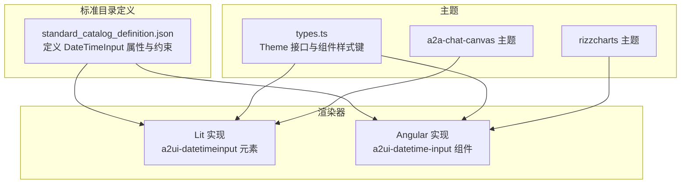
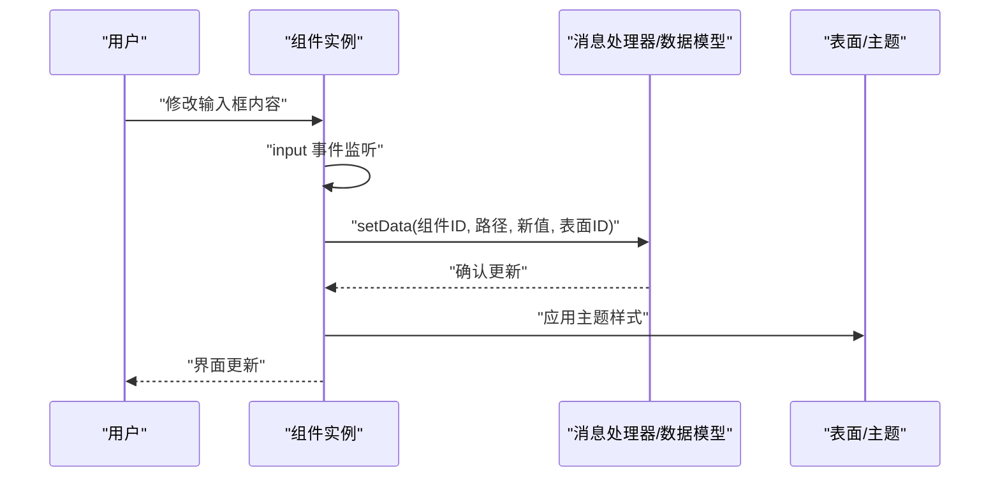
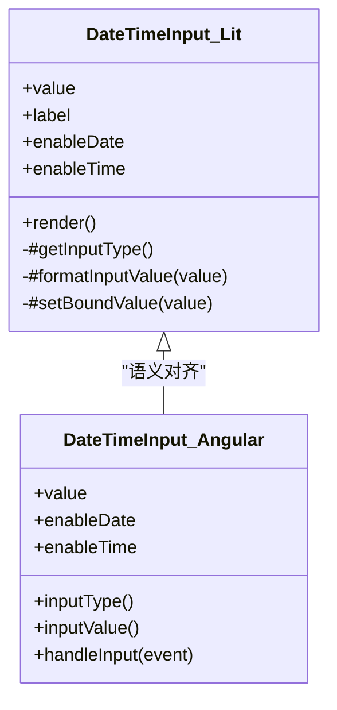
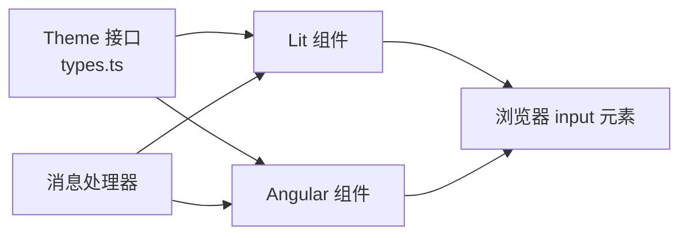
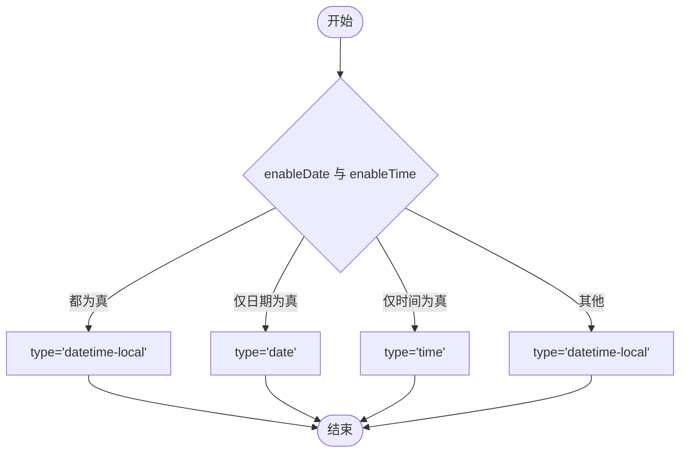
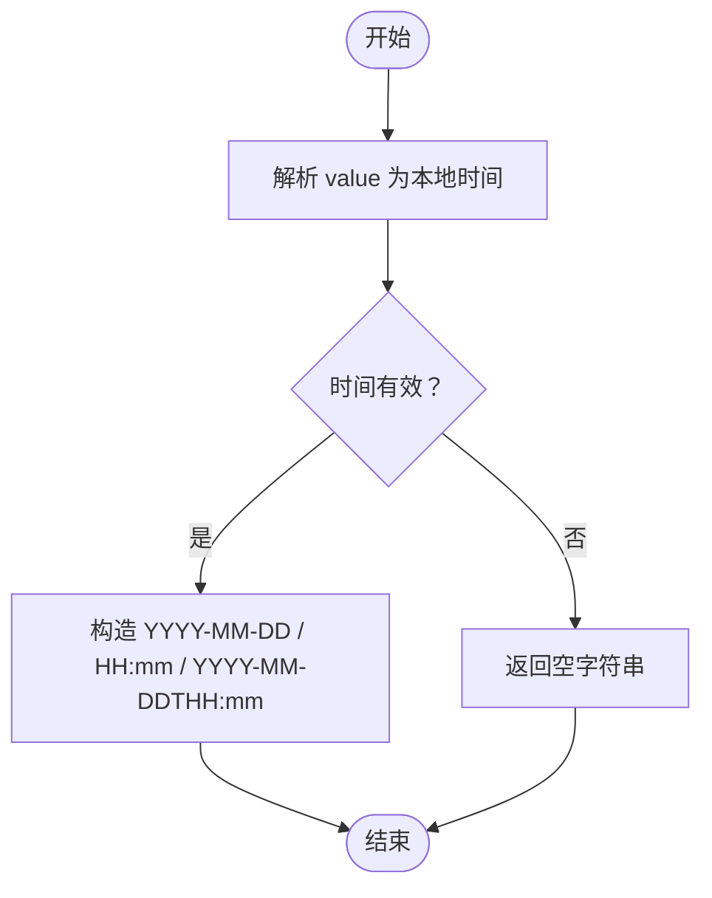

# 日期时间输入组件 (Datetime Input)

<cite>
**本文引用的文件**
- [renderers/lit/src/0.8/ui/datetime-input.ts](file://renderers/lit/src/0.8/ui/datetime-input.ts)
- [renderers/angular/src/lib/catalog/datetime-input.ts](file://renderers/angular/src/lib/catalog/datetime-input.ts)
- [specification/0.9/json/standard_catalog_definition.json](file://specification/0.9/json/standard_catalog_definition.json)
- [renderers/lit/src/0.8/types/types.ts](file://renderers/lit/src/0.8/types/types.ts)
- [samples/client/angular/projects/a2a-chat-canvas/src/lib/a2ui-catalog/theme.ts](file://samples/client/angular/projects/a2a-chat-canvas/src/lib/a2ui-catalog/theme.ts)
- [samples/client/angular/projects/rizzcharts/src/app/theme.ts](file://samples/client/angular/projects/rizzcharts/src/app/theme.ts)
- [renderers/lit/src/0.8/schemas/server_to_client_with_standard_catalog.json](file://renderers/lit/src/0.8/schemas/server_to_client_with_standard_catalog.json)
</cite>

## 目录
1. [简介](#简介)
2. [项目结构](#项目结构)
3. [核心组件](#核心组件)
4. [架构总览](#架构总览)
5. [详细组件分析](#详细组件分析)
6. [依赖关系分析](#依赖关系分析)
7. [性能考虑](#性能考虑)
8. [无障碍与响应式行为](#无障碍与响应式行为)
9. [故障排查指南](#故障排查指南)
10. [结论](#结论)
11. [附录：JSON 定义与示例](#附录json-定义与示例)

## 简介
本文件为 A2UI 日期时间输入组件（Datetime Input）的权威技术文档。该组件允许用户选择日期、时间或“日期+时间”的组合，并通过 JSON 标准目录进行声明式配置。文档覆盖：
- 组件在标准目录中的属性定义与默认值
- 在 Lit 与 Angular 渲染器中的实现差异与行为
- 输入格式与输出格式约定
- 数据绑定与变更事件传播机制
- 无障碍与响应式行为建议
- 实战示例（以路径引用代替代码片段）

## 项目结构
- 组件在标准目录中由统一的 JSON Schema 定义，渲染器（Lit/Angular）基于该定义生成 UI 并处理数据流。
- Lit 渲染器提供 Web Component 实现；Angular 渲染器提供 Angular 组件实现。
- 主题系统通过 Theme 接口为组件提供样式类名映射。

图表来源
- [specification/0.9/json/standard_catalog_definition.json](file://specification/0.9/json/standard_catalog_definition.json#L522-L555)
- [renderers/lit/src/0.8/ui/datetime-input.ts](file://renderers/lit/src/0.8/ui/datetime-input.ts#L1-L197)
- [renderers/angular/src/lib/catalog/datetime-input.ts](file://renderers/angular/src/lib/catalog/datetime-input.ts#L1-L128)
- [renderers/lit/src/0.8/types/types.ts](file://renderers/lit/src/0.8/types/types.ts#L65-L109)
- [samples/client/angular/projects/a2a-chat-canvas/src/lib/a2ui-catalog/theme.ts](file://samples/client/angular/projects/a2a-chat-canvas/src/lib/a2ui-catalog/theme.ts#L232-L237)
- [samples/client/angular/projects/rizzcharts/src/app/theme.ts](file://samples/client/angular/projects/rizzcharts/src/app/theme.ts#L232-L237)

章节来源
- [specification/0.9/json/standard_catalog_definition.json](file://specification/0.9/json/standard_catalog_definition.json#L522-L555)
- [renderers/lit/src/0.8/ui/datetime-input.ts](file://renderers/lit/src/0.8/ui/datetime-input.ts#L1-L197)
- [renderers/angular/src/lib/catalog/datetime-input.ts](file://renderers/angular/src/lib/catalog/datetime-input.ts#L1-L128)
- [renderers/lit/src/0.8/types/types.ts](file://renderers/lit/src/0.8/types/types.ts#L65-L109)

## 核心组件
- 组件名称：DateTimeInput
- 支持的输入类型：由 enableDate 与 enableTime 控制，最终映射到浏览器 input 的 type 值：
  - 同时启用：datetime-local
  - 仅启用日期：date
  - 仅启用时间：time
  - 默认：datetime-local
- 值绑定：value 可为字面量字符串或数据模型路径，渲染器会根据类型读取或写回数据模型。
- 输出格式：组件内部将值格式化为浏览器 input.value 所需的字符串格式，遵循本地化规则（非 UTC）。

章节来源
- [renderers/lit/src/0.8/ui/datetime-input.ts](file://renderers/lit/src/0.8/ui/datetime-input.ts#L116-L152)
- [renderers/angular/src/lib/catalog/datetime-input.ts](file://renderers/angular/src/lib/catalog/datetime-input.ts#L59-L112)
- [renderers/lit/src/0.8/schemas/server_to_client_with_standard_catalog.json](file://renderers/lit/src/0.8/schemas/server_to_client_with_standard_catalog.json#L625-L656)

## 架构总览
组件的数据流与事件传播如下：

图表来源
- [renderers/lit/src/0.8/ui/datetime-input.ts](file://renderers/lit/src/0.8/ui/datetime-input.ts#L100-L113)
- [renderers/lit/src/0.8/ui/datetime-input.ts](file://renderers/lit/src/0.8/ui/datetime-input.ts#L64-L83)
- [renderers/angular/src/lib/catalog/datetime-input.ts](file://renderers/angular/src/lib/catalog/datetime-input.ts#L114-L122)

## 详细组件分析

### 属性定义与默认值
以下属性来自标准目录定义与渲染器实现，用于控制组件行为与外观。

- component: 字符串常量，固定为 "DateTimeInput"
- value: 字符串或路径，表示当前选中的日期/时间值（ISO 8601 字符串）
  - 渲染器内部会解析为本地时间格式用于 input.value
- enableDate: 布尔值，默认 true
  - 控制是否允许选择日期部分
- enableTime: 布尔值，默认 true
  - 控制是否允许选择时间部分
- label: 字符串或路径，显示在标签上
  - 渲染器会根据当前输入类型动态设置占位文本（如 Date、Time、Date & Time）
- outputFormat: 字符串，输出格式提示（标准目录定义中存在该字段，但渲染器实现未直接使用）
- 其他通用属性：如 id、class、style 等由渲染器按主题映射注入

章节来源
- [specification/0.9/json/standard_catalog_definition.json](file://specification/0.9/json/standard_catalog_definition.json#L522-L555)
- [renderers/lit/src/0.8/ui/datetime-input.ts](file://renderers/lit/src/0.8/ui/datetime-input.ts#L28-L39)
- [renderers/angular/src/lib/catalog/datetime-input.ts](file://renderers/angular/src/lib/catalog/datetime-input.ts#L54-L57)

### 输入类型与格式
- 类型映射：
  - enableDate=true 且 enableTime=true → input.type="datetime-local"
  - enableDate=true 且 enableTime=false → input.type="date"
  - enableDate=false 且 enableTime=true → input.type="time"
  - 默认 fallback → input.type="datetime-local"
- 值格式：
  - 渲染器将 value 解析为本地时间，按以下格式写入 input.value：
    - date → "YYYY-MM-DD"
    - time → "HH:mm"
    - datetime-local → "YYYY-MM-DDTHH:mm"
  - 注意：不使用 UTC 格式，避免跨时区问题

章节来源
- [renderers/lit/src/0.8/ui/datetime-input.ts](file://renderers/lit/src/0.8/ui/datetime-input.ts#L116-L152)
- [renderers/angular/src/lib/catalog/datetime-input.ts](file://renderers/angular/src/lib/catalog/datetime-input.ts#L59-L112)

### 数据绑定与变更事件
- 数据绑定：
  - 渲染器通过消息处理器（或处理器封装）读取/写入数据模型，路径来源于 value.path
  - 当 value 为字面量字符串时，渲染器直接使用该值进行显示
- 变更事件：
  - 用户在 input 上触发 input 事件后，组件将新值写回到数据模型对应路径
  - 事件载荷：无额外自定义事件对象，仅包含新值字符串
- 表面与主题：
  - 渲染器在更新时应用主题样式键（container/element/label），确保一致的视觉表现

章节来源
- [renderers/lit/src/0.8/ui/datetime-input.ts](file://renderers/lit/src/0.8/ui/datetime-input.ts#L64-L83)
- [renderers/lit/src/0.8/ui/datetime-input.ts](file://renderers/lit/src/0.8/ui/datetime-input.ts#L100-L113)
- [renderers/angular/src/lib/catalog/datetime-input.ts](file://renderers/angular/src/lib/catalog/datetime-input.ts#L114-L122)
- [renderers/lit/src/0.8/types/types.ts](file://renderers/lit/src/0.8/types/types.ts#L65-L109)

### 类图（代码级）

图表来源
- [renderers/lit/src/0.8/ui/datetime-input.ts](file://renderers/lit/src/0.8/ui/datetime-input.ts#L26-L197)
- [renderers/angular/src/lib/catalog/datetime-input.ts](file://renderers/angular/src/lib/catalog/datetime-input.ts#L53-L128)

## 依赖关系分析
- 组件依赖于：
  - 主题系统：通过 Theme 接口中的 DateTimeInput 键注入样式类名
  - 消息处理器：负责读取/写入数据模型
  - 浏览器 input 元素：根据类型与格式设置 value
- 渲染器耦合点：
  - Lit：Web Component 自定义元素与属性绑定
  - Angular：输入属性与模板事件绑定

图表来源
- [renderers/lit/src/0.8/types/types.ts](file://renderers/lit/src/0.8/types/types.ts#L65-L109)
- [renderers/lit/src/0.8/ui/datetime-input.ts](file://renderers/lit/src/0.8/ui/datetime-input.ts#L1-L197)
- [renderers/angular/src/lib/catalog/datetime-input.ts](file://renderers/angular/src/lib/catalog/datetime-input.ts#L1-L128)

章节来源
- [renderers/lit/src/0.8/types/types.ts](file://renderers/lit/src/0.8/types/types.ts#L65-L109)
- [renderers/lit/src/0.8/ui/datetime-input.ts](file://renderers/lit/src/0.8/ui/datetime-input.ts#L1-L197)
- [renderers/angular/src/lib/catalog/datetime-input.ts](file://renderers/angular/src/lib/catalog/datetime-input.ts#L1-L128)

## 性能考虑
- 值格式化与解析：
  - 渲染器在每次 input 事件时都会解析并格式化值，建议在高频输入场景下避免不必要的重渲染
- 主题样式：
  - 使用主题键映射减少内联样式的开销
- 数据绑定：
  - 优先使用路径绑定，避免频繁字面量切换导致的重复渲染

[本节为通用建议，无需特定文件引用]

## 无障碍与响应式行为
- 无障碍建议：
  - 为 input 提供明确的 label 关联（已通过 for/id 实现）
  - 在 label 中使用可读性强的占位文本（如 Date/Time/Date & Time）
  - 对于必填场景，可在外部容器添加“必填”标识
- 响应式行为：
  - 组件容器采用弹性布局，宽度随父容器变化
  - input 宽度 100%，适配移动端与桌面端
- 主题一致性：
  - 通过 Theme 接口的 DateTimeInput 键统一容器、元素、标签的样式类名

章节来源
- [renderers/lit/src/0.8/ui/datetime-input.ts](file://renderers/lit/src/0.8/ui/datetime-input.ts#L85-L114)
- [renderers/angular/src/lib/catalog/datetime-input.ts](file://renderers/angular/src/lib/catalog/datetime-input.ts#L21-L37)
- [renderers/lit/src/0.8/types/types.ts](file://renderers/lit/src/0.8/types/types.ts#L65-L109)
- [samples/client/angular/projects/a2a-chat-canvas/src/lib/a2ui-catalog/theme.ts](file://samples/client/angular/projects/a2a-chat-canvas/src/lib/a2ui-catalog/theme.ts#L232-L237)
- [samples/client/angular/projects/rizzcharts/src/app/theme.ts](file://samples/client/angular/projects/rizzcharts/src/app/theme.ts#L232-L237)

## 故障排查指南
- 问题：输入框为空或显示异常
  - 检查 value 是否为合法的 ISO 8601 字符串或有效路径
  - 确认 enableDate/enableTime 组合与期望一致
- 问题：更改未生效
  - 确认 value.path 是否存在且可写
  - 检查消息处理器是否正确初始化
- 问题：样式不生效
  - 确认 Theme 中 DateTimeInput 键已配置
  - 检查主题类名映射是否正确

章节来源
- [renderers/lit/src/0.8/ui/datetime-input.ts](file://renderers/lit/src/0.8/ui/datetime-input.ts#L171-L196)
- [renderers/angular/src/lib/catalog/datetime-input.ts](file://renderers/angular/src/lib/catalog/datetime-input.ts#L87-L122)
- [renderers/lit/src/0.8/types/types.ts](file://renderers/lit/src/0.8/types/types.ts#L65-L109)

## 结论
- 日期时间输入组件通过标准目录定义与渲染器实现，提供了灵活的日期/时间选择能力
- 组件在 Lit 与 Angular 下行为一致，均遵循相同的输入类型映射与值格式化策略
- 通过主题系统与数据绑定，组件具备良好的可定制性与可维护性

[本节为总结，无需特定文件引用]

## 附录：JSON 定义与示例

### 标准目录属性清单（摘自标准定义）
- component: "DateTimeInput"
- value: 字符串或路径（当前值，ISO 8601 字符串）
- enableDate: 布尔值（默认 true）
- enableTime: 布尔值（默认 true）
- outputFormat: 字符串（输出格式提示）
- label: 字符串或路径（标签文本）

章节来源
- [specification/0.9/json/standard_catalog_definition.json](file://specification/0.9/json/standard_catalog_definition.json#L522-L555)

### 输入类型决策流程（算法）

图表来源
- [renderers/lit/src/0.8/ui/datetime-input.ts](file://renderers/lit/src/0.8/ui/datetime-input.ts#L116-L126)
- [renderers/angular/src/lib/catalog/datetime-input.ts](file://renderers/angular/src/lib/catalog/datetime-input.ts#L59-L72)

### 值格式化流程（算法）

图表来源
- [renderers/lit/src/0.8/ui/datetime-input.ts](file://renderers/lit/src/0.8/ui/datetime-input.ts#L128-L152)
- [renderers/angular/src/lib/catalog/datetime-input.ts](file://renderers/angular/src/lib/catalog/datetime-input.ts#L87-L112)

### Lit 与 Angular 示例（以路径引用代替代码）
- Lit 示例（JSON 定义）：参见 [renderers/lit/src/0.8/schemas/server_to_client_with_standard_catalog.json](file://renderers/lit/src/0.8/schemas/server_to_client_with_standard_catalog.json#L625-L656)
- Angular 示例（JSON 定义）：参见 [specification/0.9/json/standard_catalog_definition.json](file://specification/0.9/json/standard_catalog_definition.json#L522-L555)