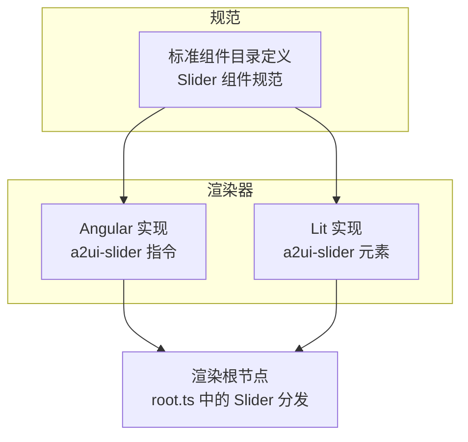
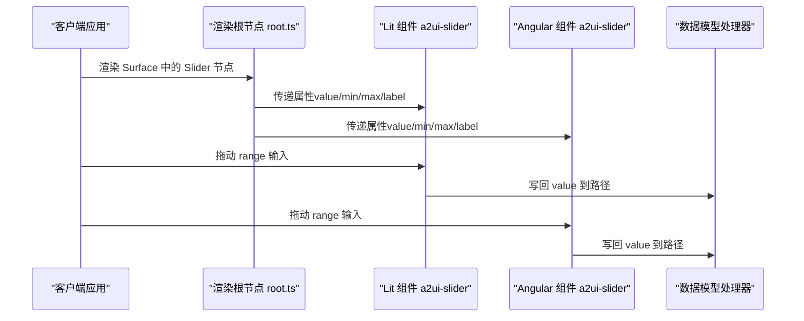
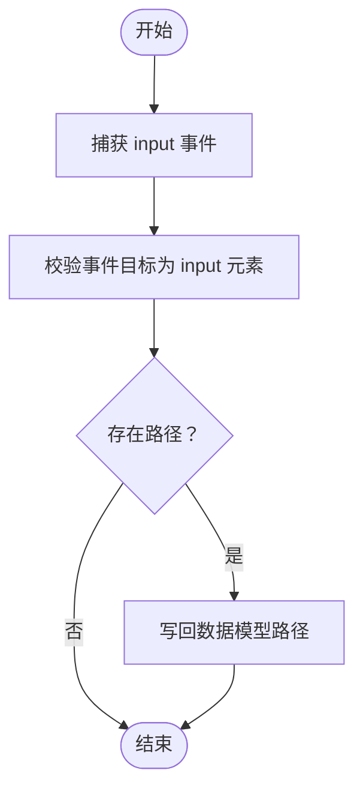
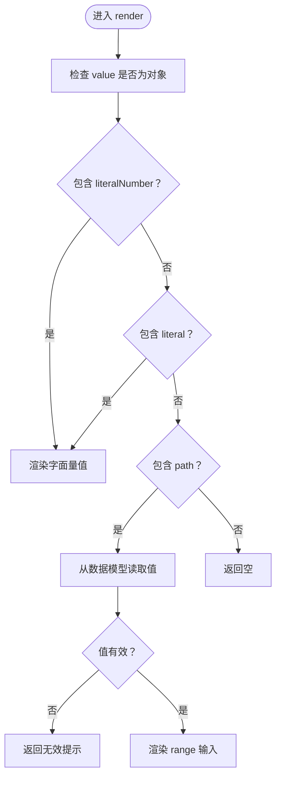
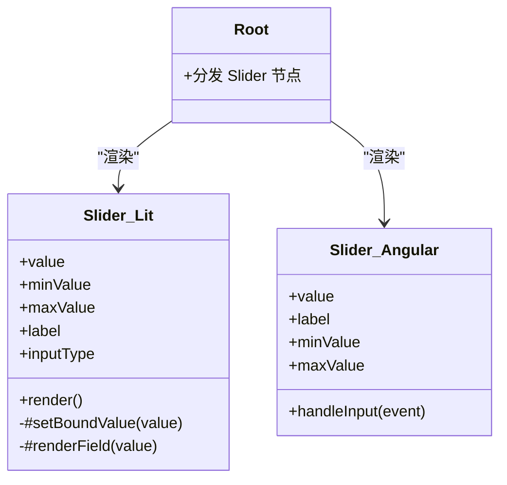

# 滑块组件（Slider）

<cite>
**本文引用的文件**
- [renderers/lit/src/0.8/ui/slider.ts](file://renderers/lit/src/0.8/ui/slider.ts)
- [renderers/angular/src/lib/catalog/slider.ts](file://renderers/angular/src/lib/catalog/slider.ts)
- [renderers/lit/src/0.8/ui/root.ts](file://renderers/lit/src/0.8/ui/root.ts)
- [specification/0.9/json/standard_catalog_definition.json](file://specification/0.9/json/standard_catalog_definition.json)
- [specification/0.8/json/standard_catalog_definition.json](file://specification/0.8/json/standard_catalog_definition.json)
- [samples/client/angular/projects/gallery/src/app/features/library/library.component.ts](file://samples/client/angular/projects/gallery/src/app/features/library/library.component.ts)
</cite>

## 目录
1. [简介](#简介)
2. [项目结构](#项目结构)
3. [核心组件](#核心组件)
4. [架构总览](#架构总览)
5. [详细组件分析](#详细组件分析)
6. [依赖关系分析](#依赖关系分析)
7. [性能考量](#性能考量)
8. [无障碍与键盘支持](#无障碍与键盘支持)
9. [响应式行为](#响应式行为)
10. [故障排查指南](#故障排查指南)
11. [结论](#结论)
12. [附录：JSON 定义与示例](#附录json-定义与示例)

## 简介
滑块组件用于通过拖动滑块在指定范围内选择数值。它支持数据绑定（直接绑定到数据模型路径）与字面量值，并在输入时将变更写回数据模型。本文件基于仓库中的实现与规范，系统性说明属性、事件、渲染流程、可访问性与响应式行为，并提供 Lit 与 Angular 的 JSON 定义示例。

## 项目结构
滑块组件在两个渲染器中均有实现：
- Lit 渲染器：自定义元素 a2ui-slider，负责渲染原生 range 输入并处理输入事件。
- Angular 渲染器：指令形式的 a2ui-slider，负责模板绑定与输入事件处理。

图表来源
- [renderers/lit/src/0.8/ui/slider.ts](file://renderers/lit/src/0.8/ui/slider.ts#L1-L160)
- [renderers/angular/src/lib/catalog/slider.ts](file://renderers/angular/src/lib/catalog/slider.ts#L1-L74)
- [renderers/lit/src/0.8/ui/root.ts](file://renderers/lit/src/0.8/ui/root.ts#L393-L408)
- [specification/0.9/json/standard_catalog_definition.json](file://specification/0.9/json/standard_catalog_definition.json#L605-L636)

章节来源
- [renderers/lit/src/0.8/ui/slider.ts](file://renderers/lit/src/0.8/ui/slider.ts#L1-L160)
- [renderers/angular/src/lib/catalog/slider.ts](file://renderers/angular/src/lib/catalog/slider.ts#L1-L74)
- [renderers/lit/src/0.8/ui/root.ts](file://renderers/lit/src/0.8/ui/root.ts#L393-L408)
- [specification/0.9/json/standard_catalog_definition.json](file://specification/0.9/json/standard_catalog_definition.json#L605-L636)

## 核心组件
- 组件名称：Slider
- 用途：在最小值与最大值之间拖动选择数值，支持字面量或数据模型路径绑定当前值。
- 关键点：
  - 支持数据绑定（path），也支持字面量（literalNumber）。
  - 输入事件会将新值写回数据模型对应路径。
  - 提供 label 属性用于展示标签文本。

章节来源
- [specification/0.9/json/standard_catalog_definition.json](file://specification/0.9/json/standard_catalog_definition.json#L605-L636)
- [renderers/lit/src/0.8/ui/slider.ts](file://renderers/lit/src/0.8/ui/slider.ts#L28-L44)
- [renderers/angular/src/lib/catalog/slider.ts](file://renderers/angular/src/lib/catalog/slider.ts#L55-L73)

## 架构总览
渲染器通过 root.ts 将标准目录中的 Slider 节点映射为具体组件实例，并传入 value、minValue、maxValue 等属性。Lit 与 Angular 实现分别处理各自的输入事件与数据写回逻辑。

图表来源
- [renderers/lit/src/0.8/ui/root.ts](file://renderers/lit/src/0.8/ui/root.ts#L393-L408)
- [renderers/lit/src/0.8/ui/slider.ts](file://renderers/lit/src/0.8/ui/slider.ts#L88-L126)
- [renderers/angular/src/lib/catalog/slider.ts](file://renderers/angular/src/lib/catalog/slider.ts#L64-L73)

## 详细组件分析

### 属性定义与默认值
以下属性来自标准目录定义与实现源码，类型、默认值与作用如下：

- component
  - 类型：字符串常量
  - 默认值：无（必填）
  - 作用：标识组件类型为 Slider

- label
  - 类型：字符串或路径（stringOrPath）
  - 默认值：空
  - 作用：显示在滑块上方的标签文本

- min / minValue
  - 类型：数字（number）
  - 默认值：0（实现中为 0；规范字段名在 0.9 中为 min，0.8 中为 minValue）
  - 作用：滑块的最小取值

- max / maxValue
  - 类型：数字（number）
  - 默认值：0（实现中为 0；规范字段名在 0.9 中为 max，0.8 中为 maxValue）
  - 作用：滑块的最大取值

- value
  - 类型：数字或路径（numberOrPath）
  - 默认值：无（必填）
  - 作用：当前值，支持字面量（literalNumber）或数据模型路径（path）

- showValue（未在实现中出现）
  - 说明：当前实现未提供单独的 showValue 属性；但 Lit 版本会在输入后显示当前数值（通过解析 value 并展示）。若需要显式控制显示，可在上层布局中自行添加文本展示。

章节来源
- [specification/0.9/json/standard_catalog_definition.json](file://specification/0.9/json/standard_catalog_definition.json#L605-L636)
- [specification/0.8/json/standard_catalog_definition.json](file://specification/0.8/json/standard_catalog_definition.json#L645-L671)
- [renderers/lit/src/0.8/ui/slider.ts](file://renderers/lit/src/0.8/ui/slider.ts#L30-L44)
- [renderers/angular/src/lib/catalog/slider.ts](file://renderers/angular/src/lib/catalog/slider.ts#L56-L63)

### 事件与载荷
- 输入事件：input
  - 触发时机：用户拖动滑块时持续触发
  - 事件目标：原生 input[type="range"] 元素
  - 事件处理：
    - Lit：监听 input 事件，调用内部方法将当前值写回数据模型路径
    - Angular：监听 (input)，调用处理器将当前值写回数据模型路径

- 变更事件：change
  - 当前实现未显式触发 change 事件
  - 若业务需要，可在上层封装中自行派发或监听 input 后的稳定状态变化

事件处理流程（Lit）：

图表来源
- [renderers/lit/src/0.8/ui/slider.ts](file://renderers/lit/src/0.8/ui/slider.ts#L101-L107)

章节来源
- [renderers/lit/src/0.8/ui/slider.ts](file://renderers/lit/src/0.8/ui/slider.ts#L101-L107)
- [renderers/angular/src/lib/catalog/slider.ts](file://renderers/angular/src/lib/catalog/slider.ts#L64-L73)

### 数据绑定与渲染
- 字面量值（literalNumber）
  - 直接渲染为当前值
- 数据模型路径（path）
  - 首次渲染时读取路径值作为初始值
  - 输入事件发生时写回路径值

Lit 渲染流程：

图表来源
- [renderers/lit/src/0.8/ui/slider.ts](file://renderers/lit/src/0.8/ui/slider.ts#L128-L158)

章节来源
- [renderers/lit/src/0.8/ui/slider.ts](file://renderers/lit/src/0.8/ui/slider.ts#L88-L126)
- [renderers/lit/src/0.8/ui/slider.ts](file://renderers/lit/src/0.8/ui/slider.ts#L128-L158)

### 类图（实现概览）

图表来源
- [renderers/lit/src/0.8/ui/slider.ts](file://renderers/lit/src/0.8/ui/slider.ts#L28-L158)
- [renderers/angular/src/lib/catalog/slider.ts](file://renderers/angular/src/lib/catalog/slider.ts#L55-L73)
- [renderers/lit/src/0.8/ui/root.ts](file://renderers/lit/src/0.8/ui/root.ts#L393-L408)

## 依赖关系分析
- 组件依赖
  - 根节点分发：root.ts 将标准目录中的 Slider 节点映射为具体组件实例，并传入 value、minValue、maxValue 等属性
  - 数据模型处理器：Lit 侧通过消息处理器写回数据；Angular 侧通过处理器写回数据
  - 主题样式：通过主题类名与附加样式注入

- 外部依赖
  - 原生 input[type="range"]：用于交互与值读取
  - 计算属性（Angular）：computed 用于解析字面量或路径值

章节来源
- [renderers/lit/src/0.8/ui/root.ts](file://renderers/lit/src/0.8/ui/root.ts#L393-L408)
- [renderers/lit/src/0.8/ui/slider.ts](file://renderers/lit/src/0.8/ui/slider.ts#L88-L126)
- [renderers/angular/src/lib/catalog/slider.ts](file://renderers/angular/src/lib/catalog/slider.ts#L61-L73)

## 性能考量
- 输入事件频率：input 事件在拖动过程中高频触发，建议在上层业务中按需节流或仅在释放时提交最终值
- 数据读写：路径读写应避免频繁触发不必要的重渲染
- 样式与布局：组件采用 block 显示与宽度 100%，在复杂布局中注意盒模型与 flex 权重

## 无障碍与键盘支持
- 键盘支持：原生 range 输入支持方向键微调与 Page Up/Down 快速跳转，具备基本无障碍能力
- 屏幕阅读器：建议为 label 提供明确文本，确保与 input 的 for/id 关联正确
- 可聚焦性：原生 input 默认可聚焦，无需额外 tabindex
- 值显示：当前实现未显式展示当前值，可在上层布局中添加数值展示以增强反馈

## 响应式行为
- 宽度：组件容器与 input 均设置为 100% 宽度，适配父容器尺寸变化
- 弹性：通过 host 的 flex 属性支持权重分配
- 主题：支持主题类名与附加样式注入，便于在不同主题下统一风格

章节来源
- [renderers/lit/src/0.8/ui/slider.ts](file://renderers/lit/src/0.8/ui/slider.ts#L45-L65)
- [renderers/angular/src/lib/catalog/slider.ts](file://renderers/angular/src/lib/catalog/slider.ts#L43-L53)

## 故障排查指南
- 问题：输入事件未写回数据模型
  - 排查：确认 value 为对象且包含 path；确认处理器已注入；确认事件目标为 input 元素
  - 参考：Lit 写回逻辑与 Angular 写回逻辑
- 问题：初始值为空或无效
  - 排查：确认 value 的 literal 或 path 是否有效；确认数据模型中路径值类型为字符串或数字
- 问题：最小值/最大值不生效
  - 排查：确认 min/minValue 与 max/maxValue 设置合理；确保实现中默认值不会覆盖传入值

章节来源
- [renderers/lit/src/0.8/ui/slider.ts](file://renderers/lit/src/0.8/ui/slider.ts#L139-L154)
- [renderers/lit/src/0.8/ui/slider.ts](file://renderers/lit/src/0.8/ui/slider.ts#L101-L107)
- [renderers/angular/src/lib/catalog/slider.ts](file://renderers/angular/src/lib/catalog/slider.ts#L64-L73)

## 结论
滑块组件提供了简洁而强大的数值选择能力，支持字面量与数据模型路径两种绑定方式，并在输入时将变更写回数据模型。Lit 与 Angular 两端实现保持一致的交互语义与数据流。建议在上层根据业务需求决定是否对 input 事件进行节流，以及是否显式展示当前值以提升用户体验。

## 附录：JSON 定义与示例
以下示例展示了如何在标准目录中定义一个滑块组件。字段与类型均来自标准目录定义与实现。

- 0.9 版本字段（min、max）
  - 示例片段路径：[标准目录定义（0.9）](file://specification/0.9/json/standard_catalog_definition.json#L605-L636)
  - 示例片段路径：[Angular 示例（Gallery）](file://samples/client/angular/projects/gallery/src/app/features/library/library.component.ts#L533-L539)

- 0.8 版本字段（minValue、maxValue）
  - 示例片段路径：[标准目录定义（0.8）](file://specification/0.8/json/standard_catalog_definition.json#L645-L671)

- Lit 渲染器属性映射
  - 示例片段路径：[root.ts 中的 Slider 分发](file://renderers/lit/src/0.8/ui/root.ts#L393-L408)

- Angular 渲染器属性映射
  - 示例片段路径：[Angular 组件定义](file://renderers/angular/src/lib/catalog/slider.ts#L55-L73)

- 示例 JSON（0.9 字段名）
  - 示例片段路径：[标准目录定义（0.9）](file://specification/0.9/json/standard_catalog_definition.json#L605-L636)
  - 示例片段路径：[Angular 示例（Gallery）](file://samples/client/angular/projects/gallery/src/app/features/library/library.component.ts#L533-L539)

- 示例 JSON（0.8 字段名）
  - 示例片段路径：[标准目录定义（0.8）](file://specification/0.8/json/standard_catalog_definition.json#L645-L671)