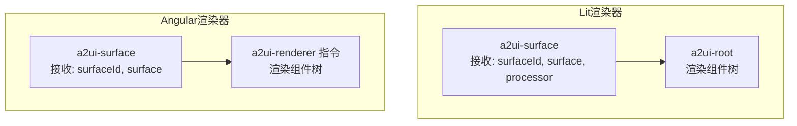
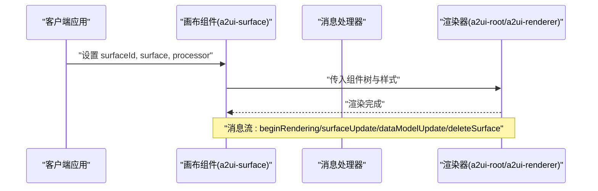
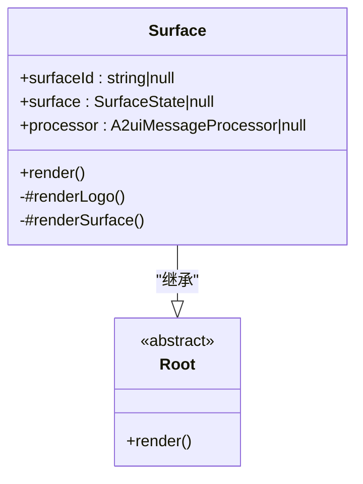
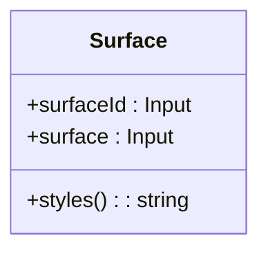
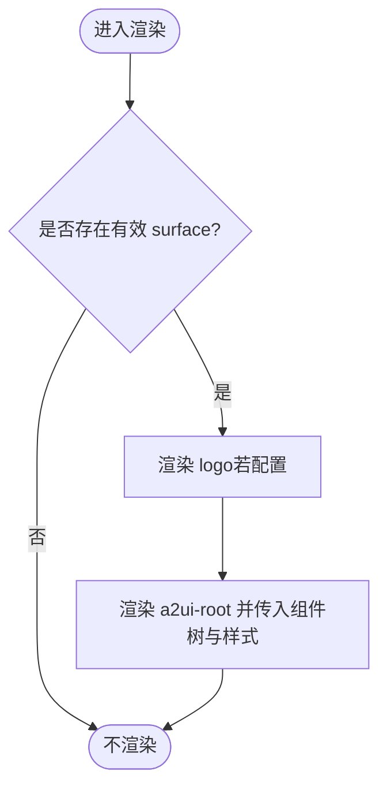
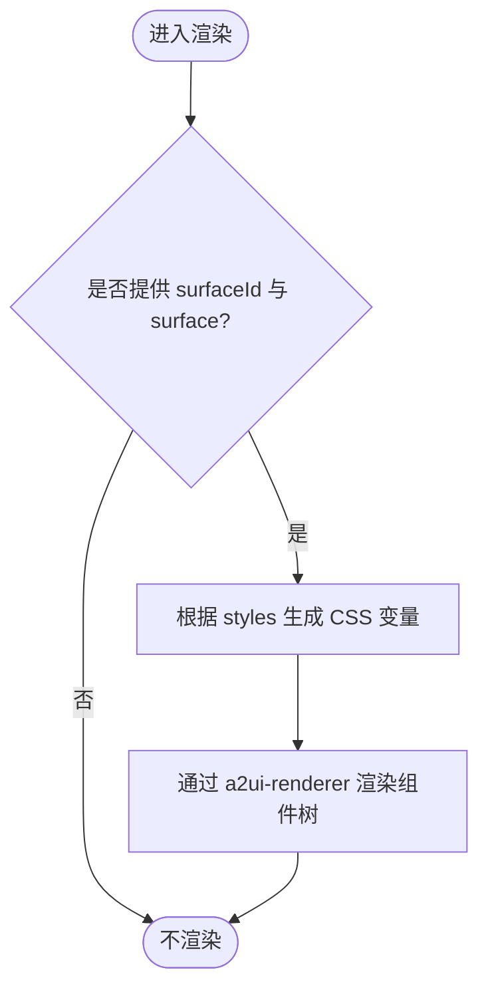
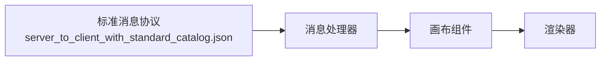

# 画布组件 (Surface)

<cite>
**本文引用的文件**
- [renderers/lit/src/0.8/ui/surface.ts](file://renderers/lit/src/0.8/ui/surface.ts)
- [renderers/angular/src/lib/catalog/surface.ts](file://renderers/angular/src/lib/catalog/surface.ts)
- [renderers/lit/src/0.8/types/types.ts](file://renderers/lit/src/0.8/types/types.ts)
- [specification/0.8/json/server_to_client_with_standard_catalog.json](file://specification/0.8/json/server_to_client_with_standard_catalog.json)
- [samples/client/lit/contact/contact.ts](file://samples/client/lit/contact/contact.ts)
- [samples/client/angular/projects/a2a-chat-canvas/src/lib/components/canvas/canvas.ts](file://samples/client/angular/projects/a2a-chat-canvas/src/lib/components/canvas/canvas.ts)
- [samples/client/angular/projects/a2a-chat-canvas/src/lib/components/canvas/canvas.html](file://samples/client/angular/projects/a2a-chat-canvas/src/lib/components/canvas/canvas.html)
</cite>

## 目录
1. [简介](#简介)
2. [项目结构](#项目结构)
3. [核心组件](#核心组件)
4. [架构总览](#架构总览)
5. [详细组件分析](#详细组件分析)
6. [依赖关系分析](#依赖关系分析)
7. [性能考量](#性能考量)
8. [故障排查指南](#故障排查指南)
9. [结论](#结论)
10. [附录](#附录)

## 简介
画布组件是A2UI系统中的顶级容器，代表一个独立的UI“画布”或“表面”。它承载并渲染整个组件树，是所有其他组件的根节点。画布不仅负责布局与样式注入，还通过消息流接收来自服务端的渲染指令，动态构建与更新UI状态。在Lit与Angular两种渲染器中，画布组件均以统一的接口形态出现：接收画布标识、画布状态以及消息处理器，并将组件树交由底层渲染器进行渲染。

本篇文档围绕以下目标展开：
- 解释画布作为顶级容器的核心职责与语义
- 从标准catalog定义中提取并解释surface组件的属性（id、rootComponentId、dataModel等）
- 说明画布在消息流（如beginRendering、surfaceUpdate、dataModelUpdate、deleteSurface）中的作用
- 提供Lit与Angular框架下通过JSON定义画布的参考路径与示例位置
- 阐述画布在管理UI状态与生命周期中的角色

## 项目结构
画布组件在不同渲染器中的实现与使用方式如下：
- Lit渲染器：a2ui-surface元素负责接收surfaceId、surface与processor，并将组件树传递给a2ui-root进行渲染；同时支持主题样式的注入与可选的logo渲染。
- Angular渲染器：a2ui-surface组件通过输入属性接收surfaceId与surface，并将组件树交给渲染器指令进行渲染；同时根据surface.styles生成CSS变量以支持主题化。

图表来源
- [renderers/lit/src/0.8/ui/surface.ts](file://renderers/lit/src/0.8/ui/surface.ts#L24-L135)
- [renderers/angular/src/lib/catalog/surface.ts](file://renderers/angular/src/lib/catalog/surface.ts#L17-L100)

章节来源
- [renderers/lit/src/0.8/ui/surface.ts](file://renderers/lit/src/0.8/ui/surface.ts#L24-L135)
- [renderers/angular/src/lib/catalog/surface.ts](file://renderers/angular/src/lib/catalog/surface.ts#L17-L100)

## 核心组件
本节聚焦画布组件的属性与行为，结合标准catalog定义与实现文件进行说明。

- 属性与类型
  - surfaceId: string | null
    - 类型：字符串或空
    - 作用：唯一标识当前画布实例，用于消息路由与状态管理
    - 默认值：null
  - surface: Surface | null
    - 类型：Surface接口对象
    - 作用：承载画布的完整状态，包括根组件ID、组件树、数据模型、组件映射与样式
    - 默认值：null
  - processor: A2uiMessageProcessor | null
    - 类型：消息处理器
    - 作用：处理来自服务端的消息，维护与更新画布状态
    - 默认值：null

- 关键字段（来自Surface接口）
  - rootComponentId: string | null
    - 作用：指向画布根组件的ID，决定组件树的起始点
  - componentTree: AnyComponentNode | null
    - 作用：解析后的组件树，作为渲染的直接输入
  - dataModel: DataMap
    - 作用：画布的数据上下文，驱动组件的绑定与交互
  - components: Map<string, ComponentInstance>
    - 作用：组件实例映射，便于按ID查找与更新
  - styles: Record<string, string>
    - 作用：样式配置，如字体、主色调等，注入到渲染层以支持主题化

- 行为与职责
  - 渲染入口：当存在有效的surface时，画布会渲染logo与组件树；否则不渲染
  - 主题注入：根据surface.styles生成CSS变量，支持颜色与字体主题
  - 事件桥接：Lit示例中通过事件监听收集用户动作，封装为客户端事件消息发送至服务端

章节来源
- [renderers/lit/src/0.8/types/types.ts](file://renderers/lit/src/0.8/types/types.ts#L523-L533)
- [renderers/lit/src/0.8/ui/surface.ts](file://renderers/lit/src/0.8/ui/surface.ts#L24-L135)
- [renderers/angular/src/lib/catalog/surface.ts](file://renderers/angular/src/lib/catalog/surface.ts#L45-L100)

## 架构总览
画布组件位于消息驱动的渲染架构顶端，负责：
- 接收beginRendering消息，建立画布的初始状态（rootComponentId、styles）
- 接收surfaceUpdate消息，更新组件集合与组件树
- 接收dataModelUpdate消息，增量或全量更新数据模型
- 接收deleteSurface消息，清理对应画布实例

图表来源
- [renderers/lit/src/0.8/ui/surface.ts](file://renderers/lit/src/0.8/ui/surface.ts#L117-L133)
- [renderers/angular/src/lib/catalog/surface.ts](file://renderers/angular/src/lib/catalog/surface.ts#L24-L31)
- [specification/0.8/json/server_to_client_with_standard_catalog.json](file://specification/0.8/json/server_to_client_with_standard_catalog.json#L1-L38)

## 详细组件分析

### 组件类图（Lit）

图表来源
- [renderers/lit/src/0.8/ui/surface.ts](file://renderers/lit/src/0.8/ui/surface.ts#L24-L135)

章节来源
- [renderers/lit/src/0.8/ui/surface.ts](file://renderers/lit/src/0.8/ui/surface.ts#L24-L135)

### 组件类图（Angular）

图表来源
- [renderers/angular/src/lib/catalog/surface.ts](file://renderers/angular/src/lib/catalog/surface.ts#L45-L100)

章节来源
- [renderers/angular/src/lib/catalog/surface.ts](file://renderers/angular/src/lib/catalog/surface.ts#L17-L100)

### 渲染流程（Lit）

图表来源
- [renderers/lit/src/0.8/ui/surface.ts](file://renderers/lit/src/0.8/ui/surface.ts#L61-L133)

章节来源
- [renderers/lit/src/0.8/ui/surface.ts](file://renderers/lit/src/0.8/ui/surface.ts#L61-L133)

### 渲染流程（Angular）

图表来源
- [renderers/angular/src/lib/catalog/surface.ts](file://renderers/angular/src/lib/catalog/surface.ts#L24-L31)
- [renderers/angular/src/lib/catalog/surface.ts](file://renderers/angular/src/lib/catalog/surface.ts#L45-L99)

章节来源
- [renderers/angular/src/lib/catalog/surface.ts](file://renderers/angular/src/lib/catalog/surface.ts#L24-L99)

### 消息流与画布生命周期
- beginRendering
  - 作用：通知客户端开始渲染指定surfaceId的画布，提供根组件ID与样式信息
  - 关键字段：surfaceId、root、styles
- surfaceUpdate
  - 作用：向指定surfaceId推送新的组件集合，重建组件树
  - 关键字段：surfaceId、components
- dataModelUpdate
  - 作用：对指定surfaceId的数据模型进行增量或全量更新
  - 关键字段：surfaceId、path、contents
- deleteSurface
  - 作用：删除指定surfaceId的画布实例
  - 关键字段：surfaceId

章节来源
- [specification/0.8/json/server_to_client_with_standard_catalog.json](file://specification/0.8/json/server_to_client_with_standard_catalog.json#L1-L38)
- [specification/0.8/json/server_to_client_with_standard_catalog.json](file://specification/0.8/json/server_to_client_with_standard_catalog.json#L39-L748)
- [specification/0.8/json/server_to_client_with_standard_catalog.json](file://specification/0.8/json/server_to_client_with_standard_catalog.json#L749-L827)

### 在Lit中通过JSON定义画布的参考路径
- beginRendering消息体（顶层结构）
  - 路径参考：[server_to_client_with_standard_catalog.json](file://specification/0.8/json/server_to_client_with_standard_catalog.json#L1-L38)
- surfaceUpdate消息体（顶层结构）
  - 路径参考：[server_to_client_with_standard_catalog.json](file://specification/0.8/json/server_to_client_with_standard_catalog.json#L39-L748)
- dataModelUpdate消息体（顶层结构）
  - 路径参考：[server_to_client_with_standard_catalog.json](file://specification/0.8/json/server_to_client_with_standard_catalog.json#L749-L827)

### 在Angular中通过JSON定义画布的参考路径
- beginRendering消息体（顶层结构）
  - 路径参考：[server_to_client_with_standard_catalog.json](file://specification/0.8/json/server_to_client_with_standard_catalog.json#L1-L38)
- surfaceUpdate消息体（顶层结构）
  - 路径参考：[server_to_client_with_standard_catalog.json](file://specification/0.8/json/server_to_client_with_standard_catalog.json#L39-L748)
- dataModelUpdate消息体（顶层结构）
  - 路径参考：[server_to_client_with_standard_catalog.json](file://specification/0.8/json/server_to_client_with_standard_catalog.json#L749-L827)

### 实际使用示例（参考路径）
- Lit示例：在应用中通过消息处理器获取画布并渲染
  - 路径参考：[samples/client/lit/contact/contact.ts](file://samples/client/lit/contact/contact.ts#L242-L306)
- Angular示例：在组件中计算画布内容并渲染
  - 路径参考：[samples/client/angular/projects/a2a-chat-canvas/src/lib/components/canvas/canvas.ts](file://samples/client/angular/projects/a2a-chat-canvas/src/lib/components/canvas/canvas.ts#L41-L66)
  - 模板参考：[samples/client/angular/projects/a2a-chat-canvas/src/lib/components/canvas/canvas.html](file://samples/client/angular/projects/a2a-chat-canvas/src/lib/components/canvas/canvas.html#L17-L21)

章节来源
- [samples/client/lit/contact/contact.ts](file://samples/client/lit/contact/contact.ts#L242-L306)
- [samples/client/angular/projects/a2a-chat-canvas/src/lib/components/canvas/canvas.ts](file://samples/client/angular/projects/a2a-chat-canvas/src/lib/components/canvas/canvas.ts#L41-L66)
- [samples/client/angular/projects/a2a-chat-canvas/src/lib/components/canvas/canvas.html](file://samples/client/angular/projects/a2a-chat-canvas/src/lib/components/canvas/canvas.html#L17-L21)

## 依赖关系分析
- 组件耦合
  - 画布组件依赖于消息处理器（processor）以解析与更新数据模型
  - 画布组件依赖于渲染器（a2ui-root 或 a2ui-renderer）以呈现组件树
- 外部依赖
  - 标准消息协议（server_to_client_with_standard_catalog.json）定义了beginRendering、surfaceUpdate、dataModelUpdate、deleteSurface等消息格式
- 生命周期
  - 初始化：beginRendering建立rootComponentId与styles
  - 更新：surfaceUpdate更新components与componentTree；dataModelUpdate更新dataModel
  - 销毁：deleteSurface清理实例

图表来源
- [specification/0.8/json/server_to_client_with_standard_catalog.json](file://specification/0.8/json/server_to_client_with_standard_catalog.json#L1-L38)
- [renderers/lit/src/0.8/types/types.ts](file://renderers/lit/src/0.8/types/types.ts#L39-L63)
- [renderers/lit/src/0.8/ui/surface.ts](file://renderers/lit/src/0.8/ui/surface.ts#L117-L133)

章节来源
- [renderers/lit/src/0.8/types/types.ts](file://renderers/lit/src/0.8/types/types.ts#L39-L63)
- [renderers/lit/src/0.8/ui/surface.ts](file://renderers/lit/src/0.8/ui/surface.ts#L117-L133)
- [specification/0.8/json/server_to_client_with_standard_catalog.json](file://specification/0.8/json/server_to_client_with_standard_catalog.json#L1-L38)

## 性能考量
- 组件树渲染
  - 将组件树作为单一入口传入渲染器，避免重复遍历与不必要的重排
- 数据模型更新
  - 使用增量更新（dataModelUpdate）减少不必要的重渲染
- 主题样式
  - 通过CSS变量注入主题，避免频繁DOM操作
- 事件处理
  - 在Lit示例中，将用户动作封装为客户端事件消息，减少直接DOM事件传播开销

## 故障排查指南
- 无画布渲染
  - 检查surface是否为空或未设置
  - 确认surfaceId与消息中的surfaceId一致
  - 参考：[renderers/lit/src/0.8/ui/surface.ts](file://renderers/lit/src/0.8/ui/surface.ts#L127-L133)
- 样式未生效
  - 检查surface.styles是否包含font与primaryColor
  - 确认渲染器已正确应用CSS变量
  - 参考：[renderers/lit/src/0.8/ui/surface.ts](file://renderers/lit/src/0.8/ui/surface.ts#L71-L116)、[renderers/angular/src/lib/catalog/surface.ts](file://renderers/angular/src/lib/catalog/surface.ts#L49-L98)
- 组件树不更新
  - 确认收到surfaceUpdate消息且components非空
  - 检查消息中的surfaceId与当前画布匹配
  - 参考：[specification/0.8/json/server_to_client_with_standard_catalog.json](file://specification/0.8/json/server_to_client_with_standard_catalog.json#L39-L748)
- 数据模型未更新
  - 确认收到dataModelUpdate消息且path与contents正确
  - 参考：[specification/0.8/json/server_to_client_with_standard_catalog.json](file://specification/0.8/json/server_to_client_with_standard_catalog.json#L749-L827)

章节来源
- [renderers/lit/src/0.8/ui/surface.ts](file://renderers/lit/src/0.8/ui/surface.ts#L71-L133)
- [renderers/angular/src/lib/catalog/surface.ts](file://renderers/angular/src/lib/catalog/surface.ts#L49-L98)
- [specification/0.8/json/server_to_client_with_standard_catalog.json](file://specification/0.8/json/server_to_client_with_standard_catalog.json#L39-L748)
- [specification/0.8/json/server_to_client_with_standard_catalog.json](file://specification/0.8/json/server_to_client_with_standard_catalog.json#L749-L827)

## 结论
画布组件是A2UI系统中承上启下的关键节点，既承载服务端消息驱动的UI状态，又向下委派给渲染器完成具体组件的绘制。通过统一的属性与消息协议，画布在Lit与Angular中实现了跨框架的一致体验。理解其属性、消息流与生命周期，有助于在实际开发中高效地构建与维护复杂的动态UI。

## 附录
- 标准消息协议参考
  - beginRendering：[server_to_client_with_standard_catalog.json](file://specification/0.8/json/server_to_client_with_standard_catalog.json#L1-L38)
  - surfaceUpdate：[server_to_client_with_standard_catalog.json](file://specification/0.8/json/server_to_client_with_standard_catalog.json#L39-L748)
  - dataModelUpdate：[server_to_client_with_standard_catalog.json](file://specification/0.8/json/server_to_client_with_standard_catalog.json#L749-L827)
  - deleteSurface：[server_to_client_with_standard_catalog.json](file://specification/0.8/json/server_to_client_with_standard_catalog.json#L749-L827)