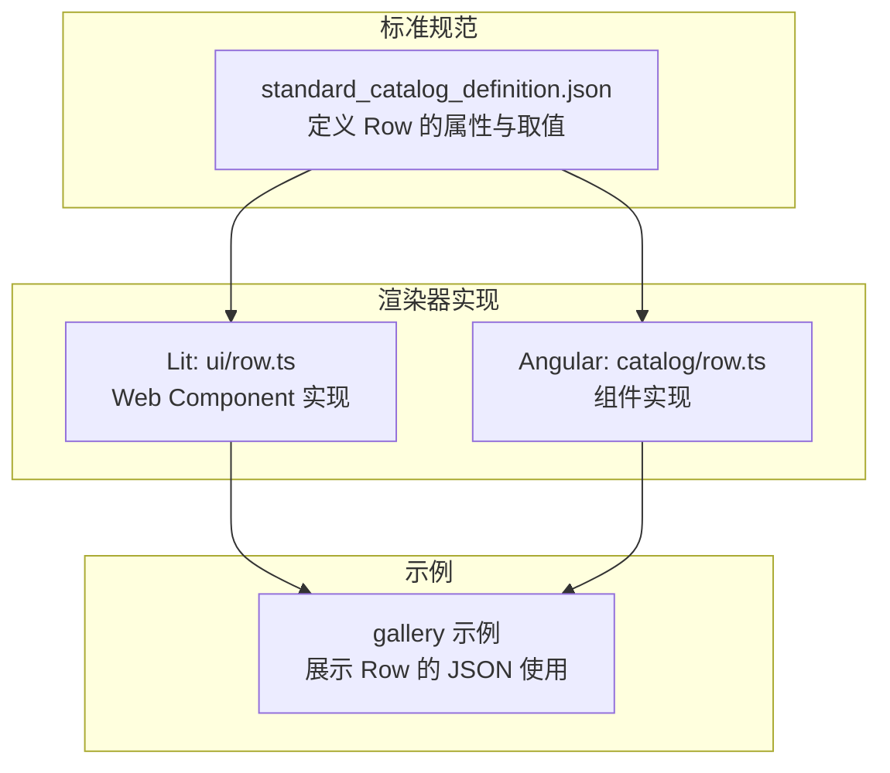
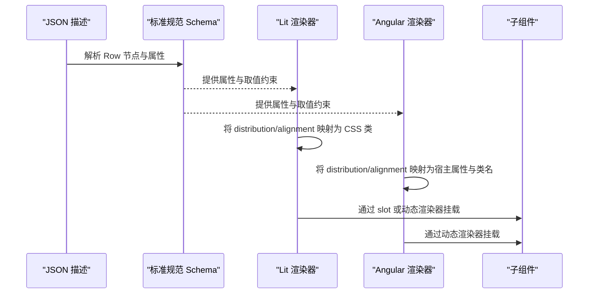
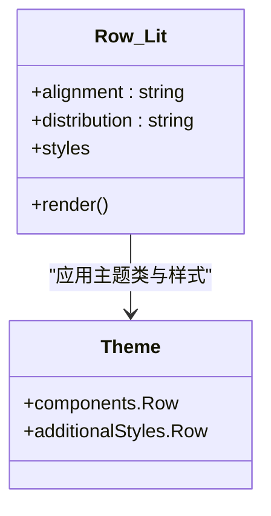
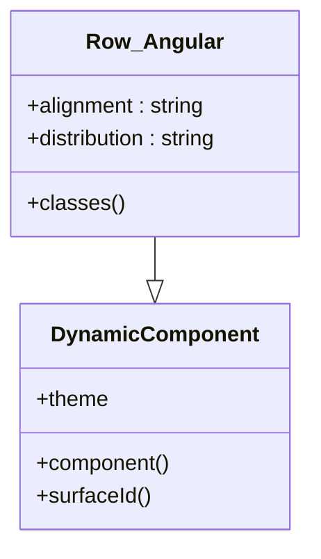
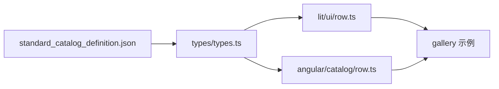

# 行组件 (Row)

<cite>
**本文引用的文件**
- [renderers/lit/src/0.8/ui/row.ts](file://renderers/lit/src/0.8/ui/row.ts)
- [renderers/angular/src/lib/catalog/row.ts](file://renderers/angular/src/lib/catalog/row.ts)
- [specification/0.9/json/standard_catalog_definition.json](file://specification/0.9/json/standard_catalog_definition.json)
- [renderers/lit/src/0.8/types/types.ts](file://renderers/lit/src/0.8/types/types.ts)
- [samples/client/angular/projects/gallery/src/app/features/library/library.component.ts](file://samples/client/angular/projects/gallery/src/app/features/library/library.component.ts)
</cite>

## 目录
1. [简介](#简介)
2. [项目结构](#项目结构)
3. [核心组件](#核心组件)
4. [架构总览](#架构总览)
5. [详细组件分析](#详细组件分析)
6. [依赖关系分析](#依赖关系分析)
7. [性能考量](#性能考量)
8. [故障排查指南](#故障排查指南)
9. [结论](#结论)
10. [附录](#附录)

## 简介
行组件（Row）是一个布局容器，用于在水平方向上排列其子组件。它不直接处理用户交互事件，而是专注于为子组件提供统一的布局行为，支持主轴（水平）分布与交叉轴（垂直）对齐控制。本文件基于标准规范与渲染器实现，系统性说明 Row 的属性、行为、样式映射以及在 Lit 与 Angular 框架下的 JSON 定义与使用方式，并给出与列组件（Column）在响应式场景中的协作建议。

## 项目结构
- 标准规范定义了 Row 的 JSON Schema 属性与取值范围，确保跨渲染器的一致性。
- Lit 渲染器实现了 Row 的 Web Component，负责将属性映射到 CSS 类或内联样式，并通过 slot 或动态渲染器挂载子组件。
- Angular 渲染器实现了 Row 组件，同样将属性映射到宿主属性与类名，并通过动态渲染器递归渲染子组件。
- 示例工程展示了如何在 JSON 中以 Row 包裹多个子组件，形成水平工具栏等常见布局。

图表来源
- [specification/0.9/json/standard_catalog_definition.json](file://specification/0.9/json/standard_catalog_definition.json#L237-L272)
- [renderers/lit/src/0.8/ui/row.ts](file://renderers/lit/src/0.8/ui/row.ts#L25-L105)
- [renderers/angular/src/lib/catalog/row.ts](file://renderers/angular/src/lib/catalog/row.ts#L22-L101)
- [samples/client/angular/projects/gallery/src/app/features/library/library.component.ts](file://samples/client/angular/projects/gallery/src/app/features/library/library.component.ts#L440-L488)

章节来源
- [specification/0.9/json/standard_catalog_definition.json](file://specification/0.9/json/standard_catalog_definition.json#L237-L272)
- [renderers/lit/src/0.8/ui/row.ts](file://renderers/lit/src/0.8/ui/row.ts#L25-L105)
- [renderers/angular/src/lib/catalog/row.ts](file://renderers/angular/src/lib/catalog/row.ts#L22-L101)
- [samples/client/angular/projects/gallery/src/app/features/library/library.component.ts](file://samples/client/angular/projects/gallery/src/app/features/library/library.component.ts#L440-L488)

## 核心组件
- 组件名称：Row
- 组件类型：布局容器
- 主要职责：
  - 在水平方向排列子组件（主轴为水平）
  - 控制主轴分布（distribution）与交叉轴对齐（alignment）
  - 不触发用户交互事件，仅承载与布局子组件
- 关键属性（来自标准规范与实现映射）：
  - children：子组件集合（显式列表或模板），必须提供
  - distribution：主轴分布策略，取值范围包括 start、center、end、spaceBetween、spaceAround、spaceEvenly、stretch
  - alignment：交叉轴对齐策略，取值范围包括 start、center、end、stretch
  - weight：当 Row 作为 Column 的直接子项时生效，用于分配剩余空间（由类型系统与主题系统支持）

章节来源
- [specification/0.9/json/standard_catalog_definition.json](file://specification/0.9/json/standard_catalog_definition.json#L237-L272)
- [renderers/lit/src/0.8/types/types.ts](file://renderers/lit/src/0.8/types/types.ts#L465-L475)
- [renderers/lit/src/0.8/ui/row.ts](file://renderers/lit/src/0.8/ui/row.ts#L27-L31)
- [renderers/angular/src/lib/catalog/row.ts](file://renderers/angular/src/lib/catalog/row.ts#L92-L93)

## 架构总览
Row 在不同渲染器中的职责与交互如下：
- 标准规范定义属性与取值约束
- Lit 渲染器将属性映射为宿主特性与 CSS 类，渲染 slot 中的子组件
- Angular 渲染器将属性映射为宿主属性与类名，通过动态渲染器递归渲染子组件
- 示例工程展示如何在 JSON 中组合 Row 与子组件（如 icon、text、button）

图表来源
- [specification/0.9/json/standard_catalog_definition.json](file://specification/0.9/json/standard_catalog_definition.json#L237-L272)
- [renderers/lit/src/0.8/ui/row.ts](file://renderers/lit/src/0.8/ui/row.ts#L94-L104)
- [renderers/angular/src/lib/catalog/row.ts](file://renderers/angular/src/lib/catalog/row.ts#L83-L90)

## 详细组件分析

### 属性定义与默认值
- children（必填）
  - 类型：数组引用（显式列表或模板）
  - 作用：声明 Row 的子组件集合；子组件必须通过 ID 引用，不可内联
- distribution（可选，默认值取决于渲染器）
  - 类型：字符串枚举
  - 取值：start、center、end、spaceBetween、spaceAround、spaceEvenly、stretch
  - 作用：控制主轴（水平）上的分布策略
- alignment（可选，默认值取决于渲染器）
  - 类型：字符串枚举
  - 取值：start、center、end、stretch
  - 作用：控制交叉轴（垂直）上的对齐策略
- weight（可选）
  - 类型：数字
  - 作用：当 Row 作为 Column 的直接子项时，参与剩余空间分配；由类型系统与主题系统支持

章节来源
- [specification/0.9/json/standard_catalog_definition.json](file://specification/0.9/json/standard_catalog_definition.json#L246-L269)
- [renderers/lit/src/0.8/types/types.ts](file://renderers/lit/src/0.8/types/types.ts#L465-L475)
- [renderers/lit/src/0.8/ui/row.ts](file://renderers/lit/src/0.8/ui/row.ts#L27-L31)
- [renderers/angular/src/lib/catalog/row.ts](file://renderers/angular/src/lib/catalog/row.ts#L92-L93)

### 渲染器实现要点

#### Lit 实现（Web Component）
- 属性映射
  - alignment：反射为宿主特性，影响 section 的 align-items
  - distribution：反射为宿主特性，影响 section 的 justify-content
- 样式映射
  - 通过 CSS 类选择器将属性映射为 align-items 与 justify-content
  - 支持主题附加样式 Row
- 子组件挂载
  - 使用 slot 或动态渲染器挂载 children

图表来源
- [renderers/lit/src/0.8/ui/row.ts](file://renderers/lit/src/0.8/ui/row.ts#L27-L31)
- [renderers/lit/src/0.8/ui/row.ts](file://renderers/lit/src/0.8/ui/row.ts#L33-L92)
- [renderers/lit/src/0.8/ui/row.ts](file://renderers/lit/src/0.8/ui/row.ts#L94-L104)
- [renderers/lit/src/0.8/types/types.ts](file://renderers/lit/src/0.8/types/types.ts#L164-L194)

章节来源
- [renderers/lit/src/0.8/ui/row.ts](file://renderers/lit/src/0.8/ui/row.ts#L27-L31)
- [renderers/lit/src/0.8/ui/row.ts](file://renderers/lit/src/0.8/ui/row.ts#L33-L92)
- [renderers/lit/src/0.8/ui/row.ts](file://renderers/lit/src/0.8/ui/row.ts#L94-L104)
- [renderers/lit/src/0.8/types/types.ts](file://renderers/lit/src/0.8/types/types.ts#L164-L194)

#### Angular 实现（组件）
- 输入属性
  - alignment：默认值为 'stretch'
  - distribution：默认值为 'start'
- 样式映射
  - 通过计算类名将 alignment 与 distribution 映射为 CSS 类
  - 支持主题附加样式 Row
- 子组件挂载
  - 使用动态渲染器递归渲染 children

图表来源
- [renderers/angular/src/lib/catalog/row.ts](file://renderers/angular/src/lib/catalog/row.ts#L91-L100)
- [renderers/angular/src/lib/catalog/row.ts](file://renderers/angular/src/lib/catalog/row.ts#L22-L89)

章节来源
- [renderers/angular/src/lib/catalog/row.ts](file://renderers/angular/src/lib/catalog/row.ts#L22-L100)

### 响应式设计与 Row/Column 协作
- Row 适合水平工具栏、按钮组、图标导航等场景
- Column 适合垂直布局（如侧边栏、列表、表单字段堆叠）
- 在复杂布局中，可在 Column 内嵌套 Row，或在 Row 内嵌套 Column，形成网格化布局
- 分布与对齐策略建议：
  - 工具栏：使用 spaceAround 或 spaceBetween 实现两端对齐或均匀分布
  - 列表项：使用 start/center/end 控制垂直对齐
  - 网格：Row 作为行容器，Column 作为列容器，结合 distribution/alignment 实现行列对齐

章节来源
- [specification/0.9/json/standard_catalog_definition.json](file://specification/0.9/json/standard_catalog_definition.json#L274-L309)
- [samples/client/angular/projects/gallery/src/app/features/library/library.component.ts](file://samples/client/angular/projects/gallery/src/app/features/library/library.component.ts#L440-L488)

### JSON 定义示例（Lit 与 Angular）
以下示例展示如何在 JSON 中定义一个包含 icon、text、button 的水平工具栏。请根据实际渲染器选择对应的 JSON 结构与属性。

- JSON 结构要点
  - component: "Row"
  - children: 子组件 ID 数组或模板对象
  - distribution: 如 "spaceAround"、"spaceBetween"
  - alignment: 如 "center"、"stretch"

- 示例参考路径
  - 在示例工程中，Row 与多个子组件组合的用法可参考：
    - [samples/client/angular/projects/gallery/src/app/features/library/library.component.ts](file://samples/client/angular/projects/gallery/src/app/features/library/library.component.ts#L440-L488)

章节来源
- [samples/client/angular/projects/gallery/src/app/features/library/library.component.ts](file://samples/client/angular/projects/gallery/src/app/features/library/library.component.ts#L440-L488)

## 依赖关系分析
- 标准规范对属性取值进行约束，保证跨渲染器一致性
- Lit 渲染器依赖类型系统中的 ResolvedRow 接口与主题系统
- Angular 渲染器依赖 DynamicComponent 基类与主题系统
- 示例工程通过 JSON 驱动渲染器，验证 Row 的布局效果

图表来源
- [specification/0.9/json/standard_catalog_definition.json](file://specification/0.9/json/standard_catalog_definition.json#L237-L272)
- [renderers/lit/src/0.8/types/types.ts](file://renderers/lit/src/0.8/types/types.ts#L465-L475)
- [renderers/lit/src/0.8/ui/row.ts](file://renderers/lit/src/0.8/ui/row.ts#L27-L31)
- [renderers/angular/src/lib/catalog/row.ts](file://renderers/angular/src/lib/catalog/row.ts#L92-L93)
- [samples/client/angular/projects/gallery/src/app/features/library/library.component.ts](file://samples/client/angular/projects/gallery/src/app/features/library/library.component.ts#L440-L488)

章节来源
- [renderers/lit/src/0.8/types/types.ts](file://renderers/lit/src/0.8/types/types.ts#L465-L475)
- [renderers/lit/src/0.8/ui/row.ts](file://renderers/lit/src/0.8/ui/row.ts#L27-L31)
- [renderers/angular/src/lib/catalog/row.ts](file://renderers/angular/src/lib/catalog/row.ts#L92-L93)
- [specification/0.9/json/standard_catalog_definition.json](file://specification/0.9/json/standard_catalog_definition.json#L237-L272)

## 性能考量
- 合理使用 distribution 与 alignment，避免过度嵌套导致的重排
- 在大量子组件场景下，优先使用模板化 children，减少重复渲染
- 利用主题系统统一管理样式，避免在 Row 上叠加过多内联样式
- 在 Angular 中，尽量复用 computed 计算类名，减少不必要的变更检测

## 故障排查指南
- 子组件未显示
  - 检查 children 是否正确引用子组件 ID，避免内联定义
  - 确认子组件是否已注册到组件树
- 分布与对齐无效
  - 确认 distribution/alignment 的取值是否在允许范围内
  - 检查主题样式是否覆盖了 Row 的样式
- 响应式异常
  - 在复杂嵌套中，确认 Row/Column 的主轴与交叉轴方向是否匹配
  - 调整 distribution/alignment 以适配不同屏幕尺寸

## 结论
Row 作为 A2UI 的基础布局容器，在标准规范与渲染器实现之间建立了清晰的契约：通过 children、distribution、alignment 等属性，为子组件提供一致的水平布局能力。Lit 与 Angular 渲染器分别以 Web Component 与组件的方式实现该契约，并通过主题系统与动态渲染机制完成子组件的挂载与更新。在响应式设计中，Row 与 Column 的组合可灵活构建网格与工具栏等常见布局。

## 附录

### 属性对照表（来自标准规范）
- component: "Row"
- children: 必填；数组引用（显式列表或模板）
- distribution: 可选；枚举值：start、center、end、spaceBetween、spaceAround、spaceEvenly、stretch
- alignment: 可选；枚举值：start、center、end、stretch
- weight: 可选；数字；用于 Column 直接子项的空间分配

章节来源
- [specification/0.9/json/standard_catalog_definition.json](file://specification/0.9/json/standard_catalog_definition.json#L246-L269)