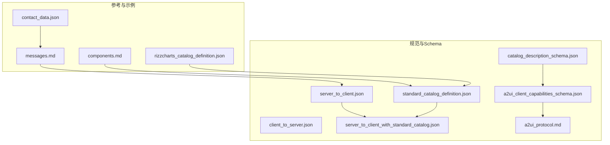
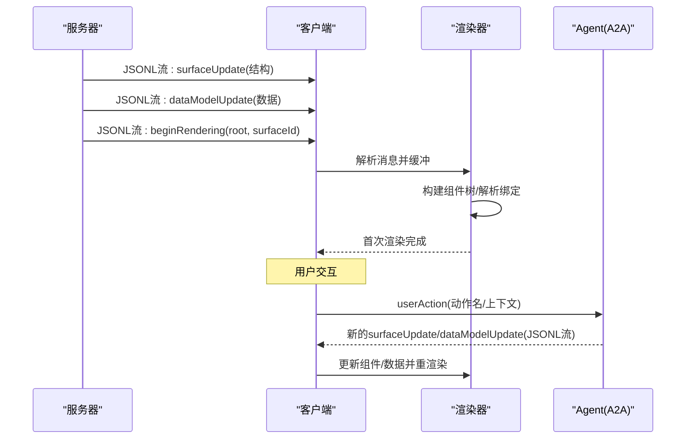
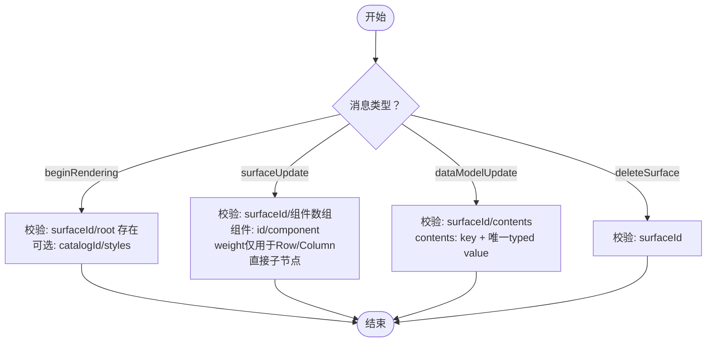
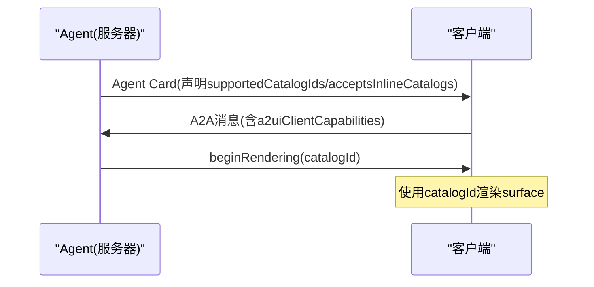
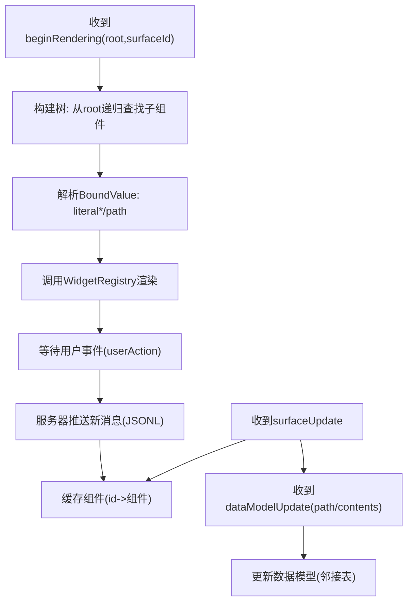
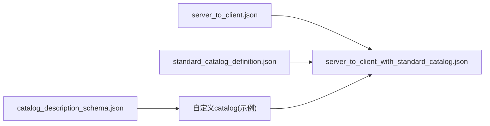

```mermaid
classDiagram
class Text {
+text : BoundValue
+usageHint : enum(h1..body)
}
class Image {
+url : BoundValue
+fit : enum(contain..scale-down)
+usageHint : enum(icon..header)
}
class Row {
+children : children
+distribution : enum(start..spaceEvenly)
+alignment : enum(start..stretch)
}
class Column {
+children : children
+distribution : enum(start..spaceEvenly)
+alignment : enum(center..stretch)
}
class Button {
+child : string
+primary : boolean
+action : Action
}
class CheckBox {
+label : BoundValue
+value : BoundValue
}
class TextField {
+label : BoundValue
+text : BoundValue
+textFieldType : enum(date..obscured)
+validationRegexp : string
}
class DateTimeInput {
+value : BoundValue
+enableDate : boolean
+enableTime : boolean
+outputFormat : string
}
class MultipleChoice {
+selections : BoundValue
+options : Option[]
+maxAllowedSelections : integer
}
class Slider {
+value : BoundValue
+minValue : number
+maxValue : number
}
class Card {
+child : string
}
class Tabs {
+tabItems : TabItem[]
}
class Divider {
+axis : enum(horizontal, vertical)
}
class Modal {
+entryPointChild : string
+contentChild : string
}
class List {
+children : children
+direction : enum(vertical, horizontal)
+alignment : enum(start..stretch)
}
class Icon {
+name : BoundValue
}
class Video {
+url : BoundValue
}
class AudioPlayer {
+url : BoundValue
+description : BoundValue
}
```

# v0.8协议规范

<cite>
**本文引用的文件**
- [standard_catalog_definition.json](file://specification/0.8/json/standard_catalog_definition.json)
- [server_to_client.json](file://specification/0.8/json/server_to_client.json)
- [client_to_server.json](file://specification/0.8/json/client_to_server.json)
- [a2ui_client_capabilities_schema.json](file://specification/0.8/json/a2ui_client_capabilities_schema.json)
- [catalog_description_schema.json](file://specification/0.8/json/catalog_description_schema.json)
- [server_to_client_with_standard_catalog.json](file://specification/0.8/json/server_to_client_with_standard_catalog.json)
- [a2ui_protocol.md](file://specification/0.8/docs/a2ui_protocol.md)
- [messages.md](file://docs/reference/messages.md)
- [components.md](file://docs/reference/components.md)
- [rizzcharts_catalog_definition.json](file://samples/agent/adk/rizzcharts/rizzcharts_catalog_definition.json)
- [contact_data.json](file://samples/agent/adk/contact_lookup/contact_data.json)
</cite>

## 目录
1. [引言](#引言)
2. [项目结构](#项目结构)
3. [核心组件](#核心组件)
4. [架构总览](#架构总览)
5. [详细组件分析](#详细组件分析)
6. [依赖关系分析](#依赖关系分析)
7. [性能考量](#性能考量)
8. [故障排查指南](#故障排查指南)
9. [结论](#结论)
10. [附录](#附录)

## 引言
本文件为A2UI v0.8协议的权威技术规范，面向Agent与渲染器开发者，提供消息类型、组件目录、能力协商、增量更新与渐进式渲染的完整说明。v0.8采用JSONL（JSON Lines）作为传输格式，通过beginRendering、surfaceUpdate、dataModelUpdate、deleteSurface四类消息实现“结构-数据”分离的动态UI生成与更新；客户端通过A2A事件向服务器回传用户动作与错误信息。本文以仓库中的JSON Schema与文档为基础，系统梳理协议设计原则、消息契约与组件模型，帮助构建兼容Agent与渲染器。

## 项目结构
- 规范与Schema
  - specification/0.8/json：包含v0.8协议的核心JSON Schema与标准组件目录
  - specification/0.8/docs：包含协议设计与使用说明文档
- 参考与示例
  - docs/reference：消息与组件参考文档
  - samples/agent/adk：自定义组件目录示例（如图表、地图）
  - samples/client：客户端渲染器示例（Angular/Lit）

**图示来源**
- [server_to_client.json](file://specification/0.8/json/server_to_client.json#L1-L148)
- [client_to_server.json](file://specification/0.8/json/client_to_server.json#L1-L54)
- [standard_catalog_definition.json](file://specification/0.8/json/standard_catalog_definition.json#L1-L685)
- [a2ui_client_capabilities_schema.json](file://specification/0.8/json/a2ui_client_capabilities_schema.json#L1-L24)
- [catalog_description_schema.json](file://specification/0.8/json/catalog_description_schema.json#L1-L35)
- [server_to_client_with_standard_catalog.json](file://specification/0.8/json/server_to_client_with_standard_catalog.json#L1-L827)
- [a2ui_protocol.md](file://specification/0.8/docs/a2ui_protocol.md#L1-L646)
- [messages.md](file://docs/reference/messages.md#L1-L397)
- [components.md](file://docs/reference/components.md#L1-L273)
- [rizzcharts_catalog_definition.json](file://samples/agent/adk/rizzcharts/rizzcharts_catalog_definition.json#L1-L125)
- [contact_data.json](file://samples/agent/adk/contact_lookup/contact_data.json#L1-L38)

**章节来源**
- [a2ui_protocol.md](file://specification/0.8/docs/a2ui_protocol.md#L1-L160)
- [messages.md](file://docs/reference/messages.md#L1-L120)

## 核心组件
- 消息类型（服务端到客户端）
  - beginRendering：触发初始渲染，指定surfaceId、root组件ID与可选catalogId/styles
  - surfaceUpdate：为surface添加/更新组件列表（扁平邻接表）
  - dataModelUpdate：为surface更新数据模型（按路径增量或整树替换）
  - deleteSurface：删除surface及其组件与数据
- 客户端到服务端事件
  - userAction：上报用户动作，包含name、surfaceId、sourceComponentId、timestamp、context
  - error：上报客户端侧错误
- 组件目录（Catalog）
  - 标准目录：包含Text、Image、Icon、Video、AudioPlayer、Row、Column、List、Card、Tabs、Divider、Modal、Button、CheckBox、TextField、DateTimeInput、MultipleChoice、Slider等22种标准组件
  - 自定义目录：通过catalog_description_schema定义catalogId、components、styles三要素

**章节来源**
- [server_to_client.json](file://specification/0.8/json/server_to_client.json#L1-L148)
- [client_to_server.json](file://specification/0.8/json/client_to_server.json#L1-L54)
- [standard_catalog_definition.json](file://specification/0.8/json/standard_catalog_definition.json#L1-L685)
- [catalog_description_schema.json](file://specification/0.8/json/catalog_description_schema.json#L1-L35)

## 架构总览
A2UI v0.8采用“结构-数据”分离与渐进式渲染：
- 结构（组件树）由surfaceUpdate提供，采用扁平邻接表模型，容器组件通过children.exlicitList或children.template声明子节点
- 数据（状态）由dataModelUpdate提供，支持按路径增量更新
- 初始渲染信号由beginRendering发出，确保客户端在收到完整结构后再构建UI
- 用户交互通过A2A userAction事件上报，服务器据此推送新的surfaceUpdate或dataModelUpdate

**图示来源**
- [a2ui_protocol.md](file://specification/0.8/docs/a2ui_protocol.md#L113-L142)
- [messages.md](file://docs/reference/messages.md#L1-L120)

## 详细组件分析

### 消息类型与JSON Schema
- beginRendering
  - 必填字段：surfaceId、root
  - 可选字段：catalogId（未提供时默认使用标准目录）、styles（由catalog定义）
  - 约束：必须在该surface的初始结构到达后才发送
- surfaceUpdate
  - 必填字段：surfaceId、components（至少1条）
  - 组件对象必填：id、component（且component对象仅包含一个组件类型键）
  - weight：仅当组件是Row/Column的直接子节点时可设置，对应CSS flex-grow
- dataModelUpdate
  - 必填字段：surfaceId、contents
  - 可选字段：path（未提供或为'/'时整树替换）
  - contents为邻接表，每项包含key与唯一typed value字段（valueString/valueNumber/valueBoolean/valueMap）
- deleteSurface
  - 必填字段：surfaceId

**图示来源**
- [server_to_client.json](file://specification/0.8/json/server_to_client.json#L1-L148)

**章节来源**
- [server_to_client.json](file://specification/0.8/json/server_to_client.json#L1-L148)
- [messages.md](file://docs/reference/messages.md#L1-L215)

### 组件目录（Catalog）与标准组件
- 标准组件（共22种）
  - 文本与媒体：Text、Image、Icon、Video、AudioPlayer
  - 布局容器：Row、Column、List、Card、Tabs、Divider、Modal
  - 表单控件：Button、CheckBox、TextField、DateTimeInput、MultipleChoice、Slider
- 组件通用规则
  - children.exlicitList vs children.template：容器组件只能二选一
  - BoundValue：文本/数值/布尔/数组/映射均可通过literal*或path绑定；若同时提供literal*，则隐式初始化数据模型
  - styles：beginRendering.styles由catalog定义（如font、primaryColor）

**图示来源**
- [standard_catalog_definition.json](file://specification/0.8/json/standard_catalog_definition.json#L1-L685)

**章节来源**
- [standard_catalog_definition.json](file://specification/0.8/json/standard_catalog_definition.json#L1-L685)
- [components.md](file://docs/reference/components.md#L1-L273)

### 客户端能力协商（a2uiClientCapabilities）
- supportedCatalogIds：客户端声明支持的catalog标识列表（必须包含标准目录）
- inlineCatalogs：仅当服务器声明acceptsInlineCatalogs=true时可携带内联catalog定义
- 协商流程
  - 服务器在Agent Card中声明supportedCatalogIds与acceptsInlineCatalogs
  - 客户端在每次请求的A2A消息元数据中携带a2uiClientCapabilities
  - 服务器在beginRendering中选择catalogId（可为标准目录或客户端提供的内联catalog）

**图示来源**
- [a2ui_protocol.md](file://specification/0.8/docs/a2ui_protocol.md#L166-L267)
- [a2ui_client_capabilities_schema.json](file://specification/0.8/json/a2ui_client_capabilities_schema.json#L1-L24)
- [catalog_description_schema.json](file://specification/0.8/json/catalog_description_schema.json#L1-L35)

**章节来源**
- [a2ui_protocol.md](file://specification/0.8/docs/a2ui_protocol.md#L166-L267)
- [a2ui_client_capabilities_schema.json](file://specification/0.8/json/a2ui_client_capabilities_schema.json#L1-L24)
- [catalog_description_schema.json](file://specification/0.8/json/catalog_description_schema.json#L1-L35)

### 增量更新与渐进式渲染
- 渐进式渲染：客户端在收到beginRendering前缓冲surfaceUpdate与dataModelUpdate，避免“半成品”闪屏
- 增量更新：dataModelUpdate支持按path局部更新；surfaceUpdate支持重复发送同id组件以更新属性
- 动态列表：容器组件children.template通过dataBinding与componentId实现从数据模型生成子项

**图示来源**
- [a2ui_protocol.md](file://specification/0.8/docs/a2ui_protocol.md#L98-L142)
- [messages.md](file://docs/reference/messages.md#L216-L397)

**章节来源**
- [a2ui_protocol.md](file://specification/0.8/docs/a2ui_protocol.md#L98-L142)
- [messages.md](file://docs/reference/messages.md#L216-L397)

### 实际消息交换示例
- 服务端到客户端（JSONL）
  - 典型顺序：先若干surfaceUpdate，再dataModelUpdate，最后beginRendering
  - 示例参考：contact_form_example.jsonl（v0.9示例，展示createSurface/updateComponents/updateDataModel的典型组合）
- 客户端到服务端（A2A）
  - userAction：包含动作名、时间戳、来源组件ID、上下文（已解析的BoundValue）
  - error：客户端侧错误信息（内容灵活）

**章节来源**
- [messages.md](file://docs/reference/messages.md#L1-L120)
- [client_to_server.json](file://specification/0.8/json/client_to_server.json#L1-L54)

## 依赖关系分析
- 协议耦合
  - server_to_client.json定义消息包络与字段约束
  - standard_catalog_definition.json定义组件属性与枚举
  - server_to_client_with_standard_catalog.json将标准组件Schema内嵌至消息Schema，便于LLM生成
- 外部依赖
  - catalog_description_schema.json用于自定义catalog描述
  - rizzcharts_catalog_definition.json展示了如何扩展标准组件集（如Canvas、Chart、GoogleMap）

**图示来源**
- [server_to_client.json](file://specification/0.8/json/server_to_client.json#L1-L148)
- [server_to_client_with_standard_catalog.json](file://specification/0.8/json/server_to_client_with_standard_catalog.json#L1-L827)
- [standard_catalog_definition.json](file://specification/0.8/json/standard_catalog_definition.json#L1-L685)
- [catalog_description_schema.json](file://specification/0.8/json/catalog_description_schema.json#L1-L35)
- [rizzcharts_catalog_definition.json](file://samples/agent/adk/rizzcharts/rizzcharts_catalog_definition.json#L1-L125)

**章节来源**
- [server_to_client_with_standard_catalog.json](file://specification/0.8/json/server_to_client_with_standard_catalog.json#L1-L827)
- [rizzcharts_catalog_definition.json](file://samples/agent/adk/rizzcharts/rizzcharts_catalog_definition.json#L1-L125)

## 性能考量
- 流式传输：JSONL逐行解析，降低首帧延迟
- 局部更新：优先使用dataModelUpdate的path增量更新，减少消息体积
- 组件扁平化：邻接表模型便于LLM分步生成，避免深层嵌套导致的生成失败
- 渲染控制：beginRendering作为渲染开关，避免不完整结构引发的重排与闪烁

[本节为通用指导，无需具体文件来源]

## 故障排查指南
- 常见错误与定位
  - 消息类型冲突：每条JSONL仅允许一种动作键（beginRendering/surfaceUpdate/dataModelUpdate/deleteSurface）
  - 组件类型未知：检查catalogId是否匹配，或是否遗漏自定义组件定义
  - 绑定路径无效：确认dataModelUpdate已在beginRendering前到达，且path正确
  - beginRendering过早：确保该surface的初始组件与数据均已到达
- 建议排查步骤
  - 校验server_to_client.json与标准/自定义catalog
  - 在客户端记录收到的消息顺序与surfaceId，核对beginRendering时机
  - 对userAction进行最小复现，逐步缩小问题范围

**章节来源**
- [messages.md](file://docs/reference/messages.md#L206-L397)
- [a2ui_protocol.md](file://specification/0.8/docs/a2ui_protocol.md#L98-L142)

## 结论
v0.8协议通过清晰的消息边界、可插拔的组件目录与严格的渐进式渲染机制，实现了LLM友好、平台无关、可扩展的UI生成与更新。开发者应优先遵循server_to_client.json与standard_catalog_definition.json的约束，结合catalog协商与增量更新策略，构建稳定高效的Agent与渲染器。

[本节为总结性内容，无需具体文件来源]

## 附录

### A. 消息类型字段清单与约束
- beginRendering
  - surfaceId：字符串，必填
  - root：字符串，必填
  - catalogId：字符串，可选（默认标准目录）
  - styles：对象，可选（由catalog定义）
- surfaceUpdate
  - surfaceId：字符串，必填
  - components：数组，必填（至少1项）
    - id：字符串，必填
    - component：对象，必填（仅包含一个组件类型键）
    - weight：数字，可选（仅Row/Column直接子节点）
- dataModelUpdate
  - surfaceId：字符串，必填
  - path：字符串，可选（未提供或'/'表示整树替换）
  - contents：数组，必填（邻接表，每项包含key与唯一typed value）
- deleteSurface
  - surfaceId：字符串，必填

**章节来源**
- [server_to_client.json](file://specification/0.8/json/server_to_client.json#L1-L148)

### B. 组件属性要点
- children.exlicitList vs children.template：容器组件二选一
- BoundValue：literal*与path可组合，用于初始化与运行时绑定
- styles：beginRendering.styles由catalog定义（如font、primaryColor）

**章节来源**
- [standard_catalog_definition.json](file://specification/0.8/json/standard_catalog_definition.json#L1-L685)
- [a2ui_protocol.md](file://specification/0.8/docs/a2ui_protocol.md#L434-L517)

### C. 能力协商与自定义目录
- supportedCatalogIds：客户端声明支持的catalog集合（必须包含标准目录）
- inlineCatalogs：仅在服务器声明acceptsInlineCatalogs=true时可用
- 自定义catalog示例：rizzcharts_catalog_definition.json展示了扩展Canvas、Chart、GoogleMap组件

**章节来源**
- [a2ui_client_capabilities_schema.json](file://specification/0.8/json/a2ui_client_capabilities_schema.json#L1-L24)
- [catalog_description_schema.json](file://specification/0.8/json/catalog_description_schema.json#L1-L35)
- [rizzcharts_catalog_definition.json](file://samples/agent/adk/rizzcharts/rizzcharts_catalog_definition.json#L1-L125)