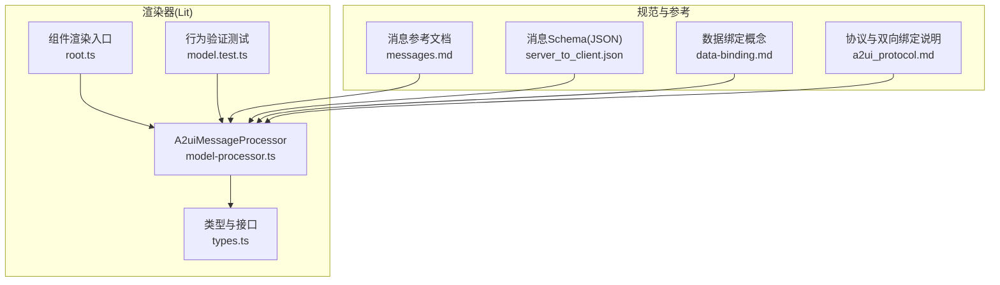
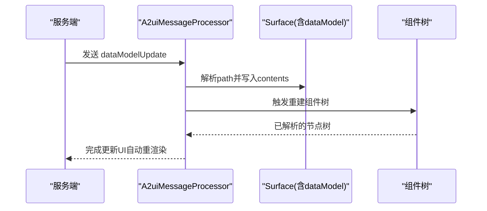
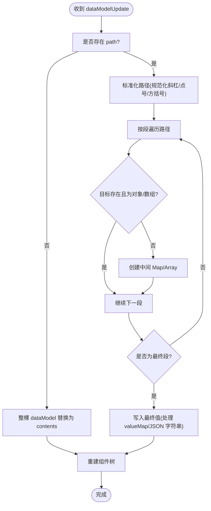
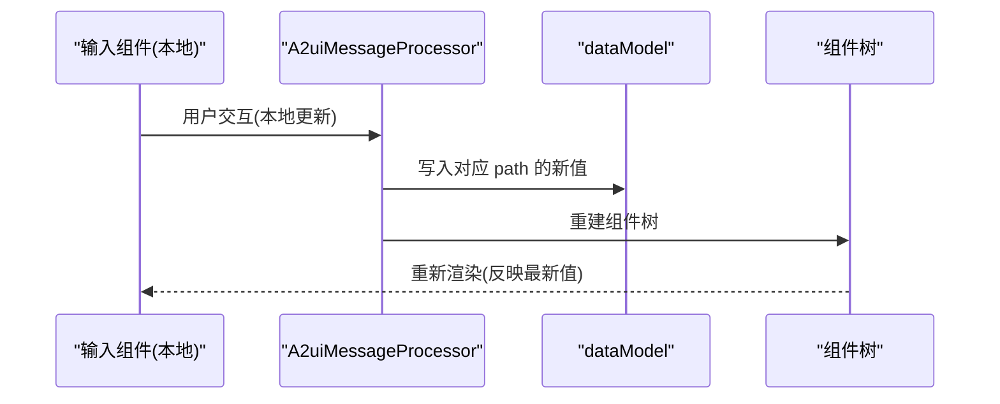
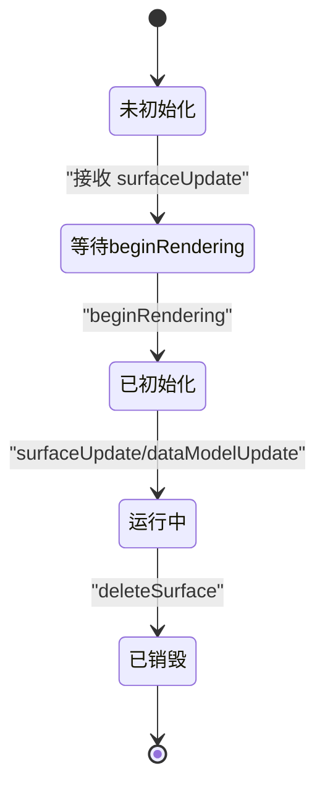
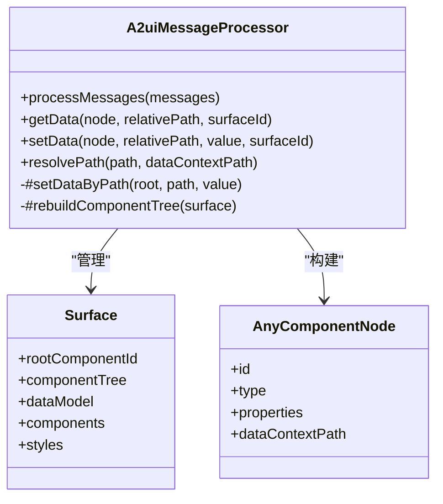

# v0.8数据模型

<cite>
**本文引用的文件**
- [model-processor.ts](file://renderers/lit/src/0.8/data/model-processor.ts)
- [types.ts](file://renderers/lit/src/0.8/types/types.ts)
- [messages.md](file://docs/reference/messages.md)
- [server_to_client.json](file://specification/0.8/json/server_to_client.json)
- [data-binding.md](file://docs/concepts/data-binding.md)
- [root.ts](file://renderers/lit/src/0.8/ui/root.ts)
- [model.test.ts](file://renderers/lit/src/0.8/model.test.ts)
- [a2ui_protocol.md](file://specification/0.9/docs/a2ui_protocol.md)
</cite>

## 目录
1. [引言](#引言)
2. [项目结构](#项目结构)
3. [核心组件](#核心组件)
4. [架构总览](#架构总览)
5. [详细组件分析](#详细组件分析)
6. [依赖关系分析](#依赖关系分析)
7. [性能考量](#性能考量)
8. [故障排查指南](#故障排查指南)
9. [结论](#结论)
10. [附录](#附录)

## 引言
本文件面向A2UI v0.8版本，系统化阐述“数据模型（dataModel）”的设计、职责与运行机制。重点覆盖：
- dataModel对象的结构与作用：作为UI组件属性的数据源中心，承载每个表面（surface）的状态。
- dataModelUpdate消息如何通过JSON Pointer路径进行部分更新，支持高效增量变更。
- 数据模型与UI组件树之间的绑定机制，以及数据变化如何驱动UI自动重渲染。
- 生命周期管理：在createSurface（此处对应beginRendering/surfaceUpdate）时初始化，在deleteSurface时清理。
- 最佳实践：如何组织数据以支撑复杂交互逻辑，并通过测试用例展示典型绑定场景。

## 项目结构
围绕v0.8数据模型的关键代码位于渲染器（Lit）实现中，类型定义与协议规范来自类型与规格目录。下图概览了与数据模型直接相关的模块关系。

图表来源
- [model-processor.ts](file://renderers/lit/src/0.8/data/model-processor.ts#L97-L124)
- [types.ts](file://renderers/lit/src/0.8/types/types.ts#L223-L235)
- [root.ts](file://renderers/lit/src/0.8/ui/root.ts#L290-L427)
- [model.test.ts](file://renderers/lit/src/0.8/model.test.ts#L131-L286)
- [messages.md](file://docs/reference/messages.md#L217-L301)
- [server_to_client.json](file://specification/0.8/json/server_to_client.json#L70-L134)
- [data-binding.md](file://docs/concepts/data-binding.md#L1-L133)
- [a2ui_protocol.md](file://specification/0.9/docs/a2ui_protocol.md#L298-L386)

章节来源
- [model-processor.ts](file://renderers/lit/src/0.8/data/model-processor.ts#L97-L124)
- [types.ts](file://renderers/lit/src/0.8/types/types.ts#L223-L235)
- [messages.md](file://docs/reference/messages.md#L217-L301)
- [server_to_client.json](file://specification/0.8/json/server_to_client.json#L70-L134)

## 核心组件
- 数据模型（dataModel）
  - 每个Surface拥有一个DataMap类型的dataModel，作为该表面的单一状态源。
  - 支持字符串、数字、布尔、null、Map、对象、数组等值类型，形成可递归的JSON-like结构。
- 消息处理器（A2uiMessageProcessor）
  - 接收并处理beginRendering、surfaceUpdate、dataModelUpdate、deleteSurface四类消息。
  - 负责解析与执行JSON Pointer路径，将contents转换为Map结构并写入dataModel。
  - 在dataModelUpdate后重建组件树，驱动UI自动重渲染。
- 组件树构建
  - 基于surfaceUpdate提供的组件邻接表，结合dataModel中的数据，递归构建已解析的组件节点树。
  - 支持显式列表与模板两种子节点生成方式；模板通过dataBinding将数组或映射项映射到子组件。

章节来源
- [types.ts](file://renderers/lit/src/0.8/types/types.ts#L223-L235)
- [model-processor.ts](file://renderers/lit/src/0.8/data/model-processor.ts#L97-L124)
- [model-processor.ts](file://renderers/lit/src/0.8/data/model-processor.ts#L426-L435)
- [model-processor.ts](file://renderers/lit/src/0.8/data/model-processor.ts#L449-L464)

## 架构总览
下图展示了从消息到数据模型再到组件树的端到端流程。

图表来源
- [model-processor.ts](file://renderers/lit/src/0.8/data/model-processor.ts#L113-L118)
- [model-processor.ts](file://renderers/lit/src/0.8/data/model-processor.ts#L426-L435)
- [model-processor.ts](file://renderers/lit/src/0.8/data/model-processor.ts#L449-L464)

## 详细组件分析

### 数据模型结构与职责
- 结构
  - dataModel是Map<string, DataValue>，其中DataValue支持字符串、数字、布尔、null、DataMap、DataObject、DataArray。
  - 通过#setDataByPath实现对任意JSON Pointer路径的设置，支持“根替换”和“局部更新”。
- 职责
  - 作为UI组件属性的数据源中心，承载每个Surface的状态。
  - 与组件树解耦：组件只读取dataModel，不直接持有状态。
  - 支持增量更新：仅发送变更路径，避免全量替换带来的开销。

章节来源
- [types.ts](file://renderers/lit/src/0.8/types/types.ts#L223-L235)
- [model-processor.ts](file://renderers/lit/src/0.8/data/model-processor.ts#L257-L346)

### dataModelUpdate消息与JSON Pointer路径
- 消息格式
  - 必填：surfaceId、contents（键值对数组，每项包含key与唯一value*属性）。
  - 可选：path（JSON Pointer路径）。若省略或为“/”，则整棵dataModel被contents替换。
- 路径解析与写入
  - 支持绝对路径（以“/”开头）与相对路径（相对于节点dataContextPath）。
  - 特殊路径“.”表示节点自身的数据上下文路径。
  - 支持数组索引与对象键访问，自动创建缺失的中间层级。
- 类型安全
  - contents中的value*属性用于明确类型，避免泛型value导致的类型推断问题。
  - 字符串形式的valueMap会递归转换为Map；字符串值若为JSON格式会被尝试解析。

图表来源
- [model-processor.ts](file://renderers/lit/src/0.8/data/model-processor.ts#L181-L196)
- [model-processor.ts](file://renderers/lit/src/0.8/data/model-processor.ts#L257-L346)
- [model-processor.ts](file://renderers/lit/src/0.8/data/model-processor.ts#L348-L363)
- [messages.md](file://docs/reference/messages.md#L217-L301)
- [server_to_client.json](file://specification/0.8/json/server_to_client.json#L70-L134)

章节来源
- [messages.md](file://docs/reference/messages.md#L217-L301)
- [server_to_client.json](file://specification/0.8/json/server_to_client.json#L70-L134)
- [model-processor.ts](file://renderers/lit/src/0.8/data/model-processor.ts#L181-L196)
- [model-processor.ts](file://renderers/lit/src/0.8/data/model-processor.ts#L257-L346)
- [model-processor.ts](file://renderers/lit/src/0.8/data/model-processor.ts#L348-L363)

### 数据模型与UI组件树的绑定机制
- 绑定原理
  - 组件属性中可通过“path”或“literal*”指定值来源；当使用path时，渲染器通过getData(node.relativePath)从dataModel读取对应值。
  - 相对路径会在getData内部与节点的dataContextPath合并，实现模板内路径的正确解析。
- 自动重渲染
  - dataModelUpdate后，处理器调用#rebuildComponentTree重建组件树，所有绑定到受影响路径的组件都会重新解析属性并更新视图。
- 输入组件的双向绑定
  - 文本框、复选框、滑条、多选、日期时间输入等交互组件在本地即时更新dataModel，随后触发重渲染；用户动作通过UserAction携带上下文发送给服务器。

图表来源
- [model-processor.ts](file://renderers/lit/src/0.8/data/model-processor.ts#L131-L151)
- [model-processor.ts](file://renderers/lit/src/0.8/data/model-processor.ts#L426-L435)
- [root.ts](file://renderers/lit/src/0.8/ui/root.ts#L323-L355)
- [a2ui_protocol.md](file://specification/0.9/docs/a2ui_protocol.md#L342-L386)

章节来源
- [model-processor.ts](file://renderers/lit/src/0.8/data/model-processor.ts#L131-L151)
- [model-processor.ts](file://renderers/lit/src/0.8/data/model-processor.ts#L426-L435)
- [root.ts](file://renderers/lit/src/0.8/ui/root.ts#L290-L427)
- [a2ui_protocol.md](file://specification/0.9/docs/a2ui_protocol.md#L342-L386)

### 生命周期：初始化与清理
- 初始化
  - beginRendering：设置rootComponentId与样式，触发首次组件树重建。
  - surfaceUpdate：注册组件邻接表，后续可基于这些组件定义构建树。
  - dataModelUpdate：填充初始数据，随后重建树，使组件得以绑定初始值。
- 清理
  - deleteSurface：删除该surface的所有组件与数据，释放内存占用。

图表来源
- [model-processor.ts](file://renderers/lit/src/0.8/data/model-processor.ts#L405-L413)
- [model-processor.ts](file://renderers/lit/src/0.8/data/model-processor.ts#L415-L424)
- [model-processor.ts](file://renderers/lit/src/0.8/data/model-processor.ts#L437-L439)

章节来源
- [model-processor.ts](file://renderers/lit/src/0.8/data/model-processor.ts#L405-L413)
- [model-processor.ts](file://renderers/lit/src/0.8/data/model-processor.ts#L415-L424)
- [model-processor.ts](file://renderers/lit/src/0.8/data/model-processor.ts#L437-L439)

### 典型应用场景与最佳实践
- 组织数据以支持复杂交互
  - 将表单输入集中在一个命名空间（如/form），便于双向绑定与提交时收集上下文。
  - 使用数组或映射存储列表数据，配合模板渲染动态列表。
- 避免全量替换
  - 优先发送针对具体路径的dataModelUpdate，减少不必要的重建成本。
- 预计算显示值
  - 在服务端格式化货币、日期等显示值，降低客户端负担。
- 测试验证
  - 单元测试覆盖了路径解析、根替换、嵌套Map、数组模板、多表面隔离等关键场景。

章节来源
- [data-binding.md](file://docs/concepts/data-binding.md#L117-L133)
- [model.test.ts](file://renderers/lit/src/0.8/model.test.ts#L131-L286)
- [model.test.ts](file://renderers/lit/src/0.8/model.test.ts#L412-L541)
- [model.test.ts](file://renderers/lit/src/0.8/model.test.ts#L1203-L1253)
- [model.test.ts](file://renderers/lit/src/0.8/model.test.ts#L1255-L1331)

## 依赖关系分析
- 组件耦合
  - A2uiMessageProcessor与Surface紧密耦合：负责Surface的创建、更新与销毁。
  - 组件树构建依赖于组件邻接表与dataModel，二者通过dataBinding连接。
- 外部依赖
  - JSON Pointer路径解析与规范化由处理器内部实现，不依赖外部库。
  - 类型系统统一约束DataValue与组件属性形状，保证运行时一致性。

图表来源
- [model-processor.ts](file://renderers/lit/src/0.8/data/model-processor.ts#L97-L124)
- [model-processor.ts](file://renderers/lit/src/0.8/data/model-processor.ts#L449-L464)
- [types.ts](file://renderers/lit/src/0.8/types/types.ts#L526-L533)
- [types.ts](file://renderers/lit/src/0.8/types/types.ts#L420-L450)

章节来源
- [model-processor.ts](file://renderers/lit/src/0.8/data/model-processor.ts#L97-L124)
- [model-processor.ts](file://renderers/lit/src/0.8/data/model-processor.ts#L449-L464)
- [types.ts](file://renderers/lit/src/0.8/types/types.ts#L526-L533)
- [types.ts](file://renderers/lit/src/0.8/types/types.ts#L420-L450)

## 性能考量
- 局部更新优于全量替换
  - 通过JSON Pointer定位变更点，避免重建整棵树。
- 路径规范化与缓存
  - 对路径进行两步规范化（方括号→点号→斜杠），减少歧义与重复解析。
- 懒创建中间层
  - 在写入过程中按需创建Map/Array，避免无谓的深层结构初始化。
- 模板渲染优化
  - 列表模板按需展开，仅在数据到达后重建子树，减少空渲染。

[本节为通用指导，无需特定文件引用]

## 故障排查指南
- 常见错误
  - dataModelUpdate缺少必需字段：确保包含surfaceId与contents；可选path必须为合法JSON Pointer。
  - contents中每项必须有且仅有一个value*属性，否则校验失败。
  - deleteSurface不会抛错，但会清空该surface的组件与数据；若删除不存在的surface为幂等操作。
- 定位方法
  - 使用单元测试覆盖的场景（如根替换、相对路径、数组模板、数值键Map）逐项比对行为。
  - 检查组件树重建是否成功，确认dataContextPath与模板dataBinding是否正确。

章节来源
- [messages.md](file://docs/reference/messages.md#L217-L301)
- [messages.md](file://docs/reference/messages.md#L303-L354)
- [model.test.ts](file://renderers/lit/src/0.8/model.test.ts#L131-L286)
- [model.test.ts](file://renderers/lit/src/0.8/model.test.ts#L412-L541)

## 结论
v0.8数据模型以Map为中心，结合JSON Pointer路径与邻接表组件定义，实现了高内聚、低耦合的UI状态管理。通过增量更新与自动重渲染，既满足复杂交互需求，又保持良好的性能与可维护性。遵循本文最佳实践与测试用例中的模式，可在实际项目中稳定地组织数据与绑定逻辑。

[本节为总结性内容，无需特定文件引用]

## 附录
- 关键API与路径参考
  - dataModelUpdate消息Schema与示例：[messages.md](file://docs/reference/messages.md#L217-L301)
  - JSON Schema定义：[server_to_client.json](file://specification/0.8/json/server_to_client.json#L70-L134)
  - 数据绑定概念与示例：[data-binding.md](file://docs/concepts/data-binding.md#L1-L133)
  - 双向绑定与用户动作：[a2ui_protocol.md](file://specification/0.9/docs/a2ui_protocol.md#L342-L386)
- 行为验证测试
  - 路径解析与根替换：[model.test.ts](file://renderers/lit/src/0.8/model.test.ts#L131-L286)
  - 动态列表与模板：[model.test.ts](file://renderers/lit/src/0.8/model.test.ts#L412-L541)
  - 数组模板与“.”路径：[model.test.ts](file://renderers/lit/src/0.8/model.test.ts#L1203-L1253)
  - 多表面隔离：[model.test.ts](file://renderers/lit/src/0.8/model.test.ts#L1255-L1331)