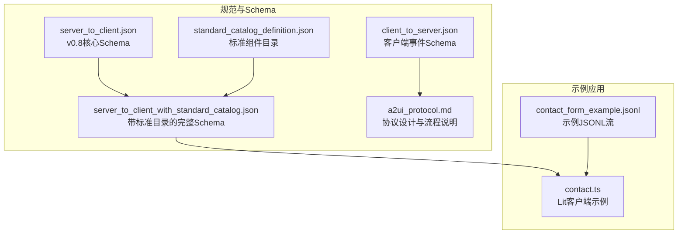
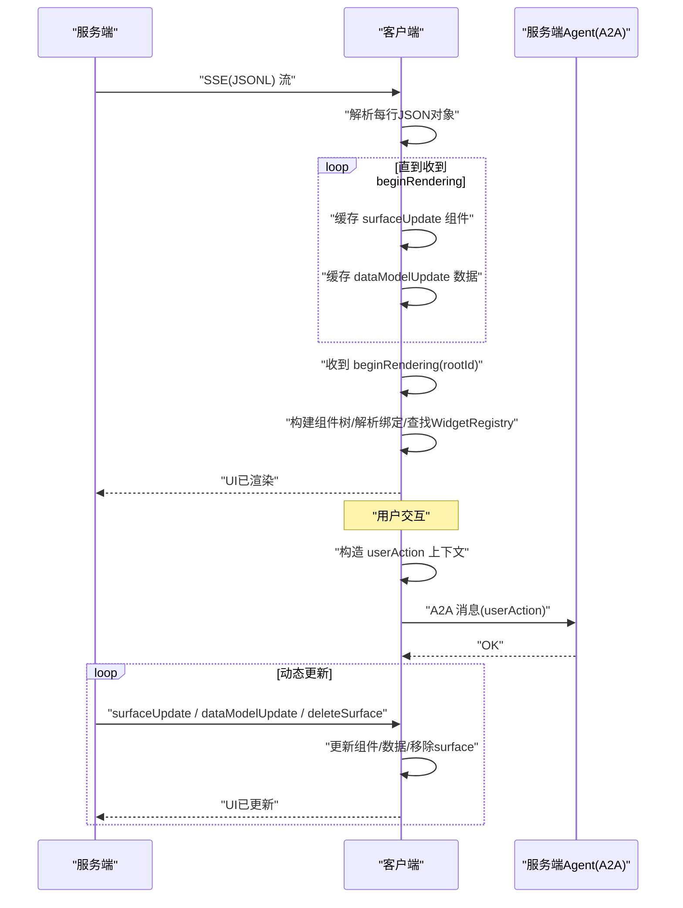
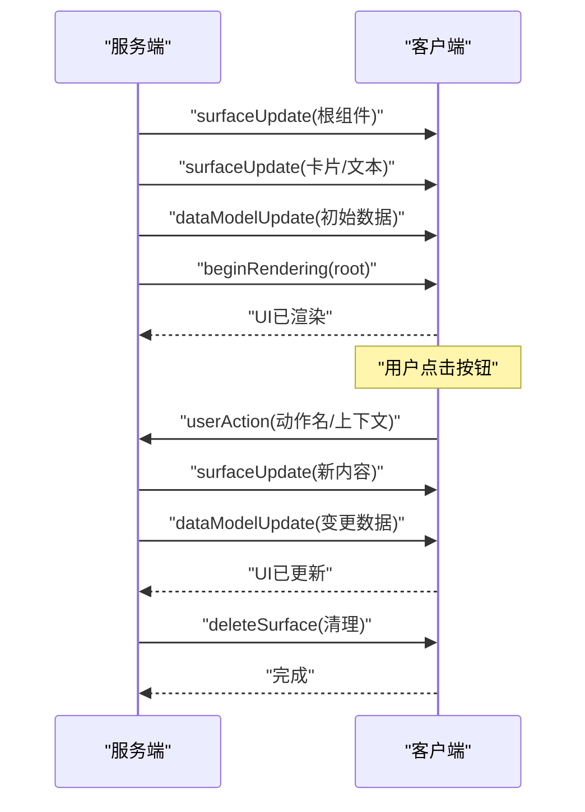
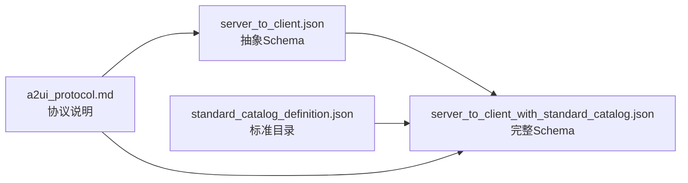

# v0.8消息协议

<cite>
**本文引用的文件**
- [client_to_server.json](file://specification/0.8/json/client_to_server.json)
- [server_to_client.json](file://specification/0.8/json/server_to_client.json)
- [server_to_client_with_standard_catalog.json](file://specification/0.8/json/server_to_client_with_standard_catalog.json)
- [standard_catalog_definition.json](file://specification/0.8/json/standard_catalog_definition.json)
- [a2ui_protocol.md](file://specification/0.8/docs/a2ui_protocol.md)
- [contact_form_example.jsonl](file://specification/0.9/json/contact_form_example.jsonl)
- [contact.ts](file://samples/client/lit/contact/contact.ts)
</cite>

## 目录
1. [简介](#简介)
2. [项目结构](#项目结构)
3. [核心组件](#核心组件)
4. [架构总览](#架构总览)
5. [详细组件分析](#详细组件分析)
6. [依赖关系分析](#依赖关系分析)
7. [性能考量](#性能考量)
8. [故障排查指南](#故障排查指南)
9. [结论](#结论)
10. [附录](#附录)

## 简介
本文件面向Agent开发者与渲染器开发者，系统性阐述A2UI v0.8消息协议：如何通过JSONL（JSON Lines）流式传输，实现从服务端到客户端的UI定义与状态更新，以及从客户端到服务端的用户事件上报。文档聚焦以下四类核心消息：
- beginRendering：开始渲染指定surface的根组件
- surfaceUpdate：为surface补充或更新组件树
- dataModelUpdate：为surface更新数据模型
- deleteSurface：删除指定surface

同时，明确createSurface、beginRendering、surfaceUpdate、dataModelUpdate、deleteSurface等关键消息的结构、字段语义、数据类型与使用场景；解释JSONL序列化与增量更新策略；给出一次完整UI生成、更新与销毁的典型消息交换序列；说明时序要求、错误处理机制及在高延迟网络下的稳健行为。

## 项目结构
A2UI v0.8协议由“服务端到客户端”与“客户端到服务端”两类消息Schema构成，配合标准组件目录（Catalog）与协议文档共同形成完整规范。示例应用展示了客户端如何消费JSONL流并响应用户事件。

图表来源
- [server_to_client.json](file://specification/0.8/json/server_to_client.json#L1-L148)
- [server_to_client_with_standard_catalog.json](file://specification/0.8/json/server_to_client_with_standard_catalog.json#L1-L120)
- [standard_catalog_definition.json](file://specification/0.8/json/standard_catalog_definition.json#L1-L120)
- [client_to_server.json](file://specification/0.8/json/client_to_server.json#L1-L54)
- [a2ui_protocol.md](file://specification/0.8/docs/a2ui_protocol.md#L1-L120)
- [contact.ts](file://samples/client/lit/contact/contact.ts#L1-L120)
- [contact_form_example.jsonl](file://specification/0.9/json/contact_form_example.jsonl#L1-L4)

章节来源
- [server_to_client.json](file://specification/0.8/json/server_to_client.json#L1-L148)
- [client_to_server.json](file://specification/0.8/json/client_to_server.json#L1-L54)
- [a2ui_protocol.md](file://specification/0.8/docs/a2ui_protocol.md#L1-L120)

## 核心组件
- 服务端到客户端消息类型
  - beginRendering：指示客户端以某个surfaceId与root组件开始渲染；可选catalogId用于选择组件目录
  - surfaceUpdate：向指定surface补充或更新组件列表；组件以扁平列表存储，通过id建立父子关系
  - dataModelUpdate：向指定surface更新数据模型；支持路径定位与局部替换
  - deleteSurface：删除指定surface
- 客户端到服务端消息类型
  - userAction：上报用户触发的动作，包含动作名、来源组件、时间戳与上下文
  - error：上报客户端侧错误信息

章节来源
- [server_to_client.json](file://specification/0.8/json/server_to_client.json#L1-L148)
- [client_to_server.json](file://specification/0.8/json/client_to_server.json#L1-L54)
- [a2ui_protocol.md](file://specification/0.8/docs/a2ui_protocol.md#L56-L112)

## 架构总览
A2UI采用单向UI推送（SSE/JSONL）+ 客户端事件上报（A2A）的双通道架构。服务端按顺序发送JSONL消息，客户端边接收边缓冲组件与数据，直到收到beginRendering后才进行首次渲染；用户交互通过userAction上报至服务端，服务端再通过同一流推送新的surfaceUpdate或dataModelUpdate以驱动UI动态更新。

图表来源
- [a2ui_protocol.md](file://specification/0.8/docs/a2ui_protocol.md#L113-L142)
- [server_to_client.json](file://specification/0.8/json/server_to_client.json#L1-L148)
- [client_to_server.json](file://specification/0.8/json/client_to_server.json#L1-L54)

## 详细组件分析

### 服务端到客户端：beginRendering
- 作用：通知客户端开始渲染某surface的根组件，可选catalogId指定组件目录
- 关键字段
  - surfaceId：目标surface标识
  - catalogId：组件目录标识；省略时默认使用标准目录
  - root：根组件id
  - styles：样式信息（如字体、主色）
- 时序要点
  - 客户端在收到beginRendering前不应进行首次渲染，避免“半成品”闪现
  - beginRendering是渲染的触发信号，客户端在此之后才开始构建与绑定组件树

章节来源
- [server_to_client.json](file://specification/0.8/json/server_to_client.json#L7-L31)
- [a2ui_protocol.md](file://specification/0.8/docs/a2ui_protocol.md#L98-L112)

### 服务端到客户端：surfaceUpdate
- 作用：为某surface补充或更新组件集合；组件以扁平列表形式出现，通过id建立父子关系
- 关键字段
  - surfaceId：目标surface标识
  - components：组件数组，每个元素包含
    - id：组件唯一标识
    - component：组件类型包装对象，包含且仅包含一个组件类型键（如"Text"/"Row"），其值为该组件的属性对象
    - weight：仅当组件直接位于Row/Column下时可用，对应CSS flex-grow
- 组件树模型
  - 使用邻接表模型：容器组件（Row/Column/List/Card/Tabs等）通过children属性引用子组件id
  - children支持两种模式：explicitList（显式列表）或template（模板绑定数据列表）

章节来源
- [server_to_client.json](file://specification/0.8/json/server_to_client.json#L32-L69)
- [server_to_client_with_standard_catalog.json](file://specification/0.8/json/server_to_client_with_standard_catalog.json#L39-L748)
- [standard_catalog_definition.json](file://specification/0.8/json/standard_catalog_definition.json#L1-L685)
- [a2ui_protocol.md](file://specification/0.8/docs/a2ui_protocol.md#L347-L423)

### 服务端到客户端：dataModelUpdate
- 作用：为某surface更新数据模型；支持路径定位与局部替换
- 关键字段
  - surfaceId：目标surface标识
  - path：可选路径（如"/user/name"），省略或"/"表示整树替换
  - contents：数据条目数组，每项包含key与一个typed value（valueString/valueNumber/valueBoolean/valueMap）
- 数据绑定
  - 组件属性可通过BoundValue对象绑定到数据模型；支持literal与path组合作为初始化简写
  - 客户端在渲染前解析绑定，确保显示与交互基于最新数据

章节来源
- [server_to_client.json](file://specification/0.8/json/server_to_client.json#L70-L134)
- [a2ui_protocol.md](file://specification/0.8/docs/a2ui_protocol.md#L433-L517)

### 服务端到客户端：deleteSurface
- 作用：删除指定surface及其内容
- 关键字段
  - surfaceId：要删除的surface标识

章节来源
- [server_to_client.json](file://specification/0.8/json/server_to_client.json#L135-L147)

### 客户端到服务端：userAction
- 作用：上报用户触发的动作
- 关键字段
  - name：动作名称（来自组件action.name）
  - surfaceId：事件来源surface
  - sourceComponentId：触发事件的组件id
  - timestamp：ISO 8601时间戳
  - context：解析后的上下文对象（由组件action.context中各键值对解析而来）
- 错误上报
  - error：客户端侧错误上报，内容灵活

章节来源
- [client_to_server.json](file://specification/0.8/json/client_to_server.json#L1-L54)
- [a2ui_protocol.md](file://specification/0.8/docs/a2ui_protocol.md#L518-L543)

### JSONL序列化与增量更新
- 序列化方式
  - 每行一条独立JSON对象，严格遵循对应Schema
  - 客户端逐行解析，边接收边缓冲组件与数据
- 增量更新策略
  - 组件更新：通过surfaceUpdate增量追加或覆盖组件定义
  - 数据更新：通过dataModelUpdate局部替换，避免重发整个UI结构
  - 渲染时机：仅在beginRendering后执行首次渲染，保证初始视图一致性

章节来源
- [a2ui_protocol.md](file://specification/0.8/docs/a2ui_protocol.md#L86-L112)

### 实际消息交换序列示例
以下为一次典型的UI生成、更新与销毁过程的JSONL序列（基于协议规范与示例）：
- 步骤1：surfaceUpdate（定义根组件与子组件）
- 步骤2：surfaceUpdate（定义卡片与文本等子组件）
- 步骤3：dataModelUpdate（填充初始数据）
- 步骤4：beginRendering（触发首次渲染）
- 步骤5：用户点击按钮（客户端构造userAction并上报）
- 步骤6：服务端返回surfaceUpdate/dataModelUpdate（动态更新UI）
- 步骤7：deleteSurface（清理指定surface）

图表来源
- [a2ui_protocol.md](file://specification/0.8/docs/a2ui_protocol.md#L144-L161)
- [server_to_client.json](file://specification/0.8/json/server_to_client.json#L1-L148)
- [client_to_server.json](file://specification/0.8/json/client_to_server.json#L1-L54)

## 依赖关系分析
- 组件目录（Catalog）与消息Schema的关系
  - server_to_client.json为抽象Schema，不包含具体组件属性
  - server_to_client_with_standard_catalog.json为“已解析”的完整Schema，将标准目录中的组件属性注入其中
  - standard_catalog_definition.json定义了标准组件集与样式属性
- 协议文档与Schema的映射
  - a2ui_protocol.md对消息语义、时序与交互流程进行说明，与Schema保持一一对应

图表来源
- [server_to_client.json](file://specification/0.8/json/server_to_client.json#L1-L148)
- [server_to_client_with_standard_catalog.json](file://specification/0.8/json/server_to_client_with_standard_catalog.json#L1-L120)
- [standard_catalog_definition.json](file://specification/0.8/json/standard_catalog_definition.json#L1-L120)
- [a2ui_protocol.md](file://specification/0.8/docs/a2ui_protocol.md#L267-L284)

章节来源
- [server_to_client.json](file://specification/0.8/json/server_to_client.json#L1-L148)
- [server_to_client_with_standard_catalog.json](file://specification/0.8/json/server_to_client_with_standard_catalog.json#L1-L120)
- [standard_catalog_definition.json](file://specification/0.8/json/standard_catalog_definition.json#L1-L120)
- [a2ui_protocol.md](file://specification/0.8/docs/a2ui_protocol.md#L267-L284)

## 性能考量
- 流式渲染与渐进体验
  - JSONL允许客户端边接收边渲染，降低首屏等待时间
  - beginRendering作为渲染触发点，避免过早渲染导致的闪烁
- 组件与数据分离
  - 组件结构一次性下发，后续通过dataModelUpdate进行轻量级更新，显著减少传输体积
- 邻接表模型的优势
  - 扁平组件列表便于LLM逐步生成，且客户端只需维护组件映射即可重建树
- 高延迟网络下的稳健性
  - 客户端在收到beginRendering前不渲染，确保在网络抖动或延迟情况下仍能获得一致的初始视图
  - 局部数据更新优先于全量重绘，提升弱网环境下的交互流畅度

[本节为通用指导，无需列出具体文件来源]

## 故障排查指南
- 常见问题与定位
  - 组件缺失：检查surfaceUpdate是否包含所有被引用的子组件id
  - 绑定路径错误：确认dataModelUpdate中提供的路径与组件绑定的path一致
  - catalogId不匹配：若未指定catalogId，默认使用标准目录；若自定义目录，请确保服务端与客户端均支持
  - 事件上下文为空：检查组件action.context的value是否包含literal或path，必要时先通过dataModelUpdate初始化
- 错误上报
  - 客户端遇到渲染或绑定异常时，可通过error消息上报，便于服务端诊断
- 示例参考
  - 参考contact.ts中对userAction的构造与发送逻辑，确保timestamp、surfaceId、sourceComponentId与context正确

章节来源
- [client_to_server.json](file://specification/0.8/json/client_to_server.json#L1-L54)
- [contact.ts](file://samples/client/lit/contact/contact.ts#L250-L306)

## 结论
A2UI v0.8通过清晰的消息边界、组件与数据分离的设计、以及JSONL流式传输，实现了LLM友好、平台无关、可增量更新的UI协议。开发者应重点关注：
- 用surfaceUpdate定义组件邻接表，用dataModelUpdate管理状态
- 以beginRendering为渲染触发点，确保初始视图稳定
- 通过userAction与服务端协作，驱动UI动态演进
- 在catalogId与标准目录之间保持一致，避免渲染失败

[本节为总结，无需列出具体文件来源]

## 附录

### A. JSONL消息交换序列（示例）
- 服务端发送若干surfaceUpdate与dataModelUpdate
- 服务端发送beginRendering
- 客户端渲染完成后，用户交互触发userAction
- 服务端返回surfaceUpdate/dataModelUpdate，客户端更新UI
- 服务端发送deleteSurface，客户端清理

章节来源
- [a2ui_protocol.md](file://specification/0.8/docs/a2ui_protocol.md#L144-L161)
- [contact_form_example.jsonl](file://specification/0.9/json/contact_form_example.jsonl#L1-L4)

### B. 组件目录与Schema对照
- 标准组件目录（Text/Image/Icon/Row/Column/List/Card/Tabs/Divider/Modal/Button/CheckBox/TextField/DateTimeInput/MultipleChoice/Slider等）在standard_catalog_definition.json中定义
- 已解析Schema（server_to_client_with_standard_catalog.json）将这些组件属性注入到消息Schema中，便于LLM生成与验证

章节来源
- [standard_catalog_definition.json](file://specification/0.8/json/standard_catalog_definition.json#L1-L685)
- [server_to_client_with_standard_catalog.json](file://specification/0.8/json/server_to_client_with_standard_catalog.json#L1-L120)