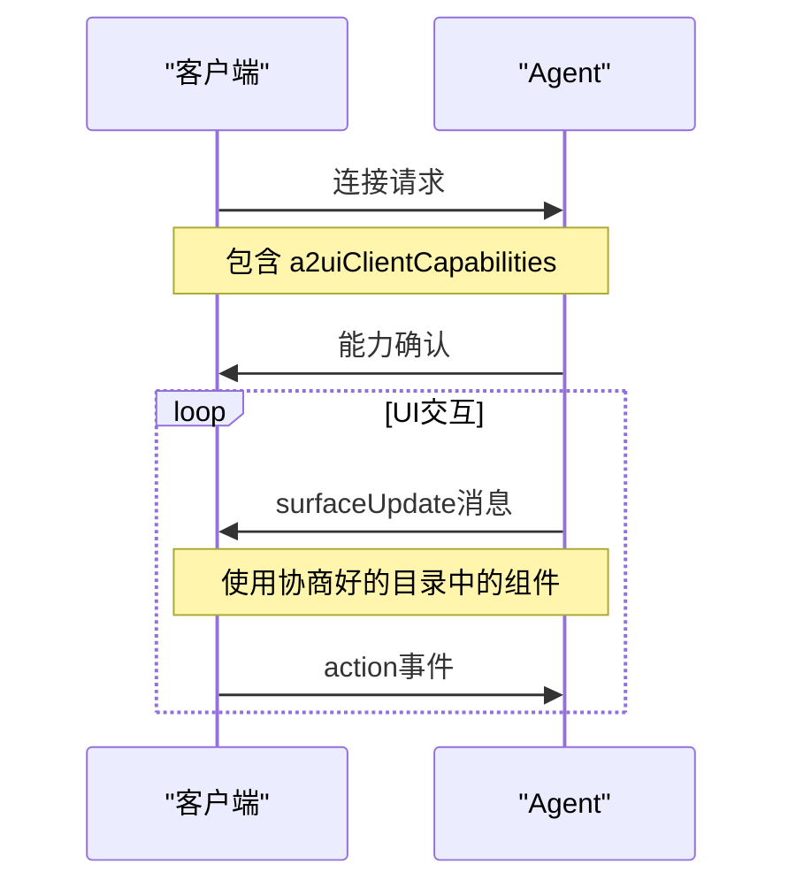

# v0.8组件目录

<cite>
**本文档中引用的文件**  
- [standard_catalog_definition.json](file://specification/0.8/json/standard_catalog_definition.json)
- [catalog_description_schema.json](file://specification/0.8/json/catalog_description_schema.json)
- [a2ui_client_capabilities_schema.json](file://specification/0.8/json/a2ui_client_capabilities_schema.json)
- [components.ts](file://renderers/lit/src/0.8/types/components.ts)
- [component-registry.ts](file://renderers/lit/src/0.8/ui/component-registry.ts)
- [rizzcharts_catalog_definition.json](file://samples/agent/adk/rizzcharts/rizzcharts_catalog_definition.json)
- [chart.json](file://samples/agent/adk/rizzcharts/examples/rizzcharts_catalog/chart.json)
</cite>

## 目录
1. [简介](#简介)
2. [标准组件目录详解](#标准组件目录详解)
3. [组件目录作为客户端与Agent之间的契约](#组件目录作为客户端与agent之间的契约)
4. [客户端能力协商机制](#客户端能力协商机制)
5. [自定义组件扩展机制](#自定义组件扩展机制)
6. [组件目录的JSON Schema定义](#组件目录的json-schema定义)
7. [完整组件目录示例](#完整组件目录示例)

## 简介

A2UI v0.8组件目录定义了一套标准化的用户界面组件，用于在Agent与客户端之间构建动态、可交互的UI。该目录作为客户端与Agent之间的契约，确保双方对可用组件及其属性有共同的理解。本参考文档深入解析`standard_catalog_definition.json`文件中定义的22个标准组件，并阐述组件目录的扩展机制和能力协商流程。

**Section sources**
- [standard_catalog_definition.json](file://specification/0.8/json/standard_catalog_definition.json)

## 标准组件目录详解

v0.8版本的A2UI标准组件目录包含22个核心组件，分为布局、显示、交互和容器四大类。每个组件都通过JSON Schema明确定义其属性、类型、约束和语义。

### 布局组件

布局组件用于组织和排列其他UI元素。

#### Row（行）
水平布局容器，子组件从左到右排列。
- **children**: 定义子组件，支持`explicitList`（固定列表）或`template`（动态模板）。
- **distribution**: 主轴（水平）分布方式，枚举值：`start`, `center`, `end`, `spaceBetween`, `spaceAround`, `spaceEvenly`。
- **alignment**: 交叉轴（垂直）对齐方式，枚举值：`start`, `center`, `end`, `stretch`。

#### Column（列）
垂直布局容器，子组件从上到下排列。
- **children**: 定义子组件，支持`explicitList`（固定列表）或`template`（动态模板）。
- **distribution**: 主轴（垂直）分布方式，枚举值：`start`, `center`, `end`, `spaceBetween`, `spaceAround`, `spaceEvenly`。
- **alignment**: 交叉轴（水平）对齐方式，枚举值：`start`, `center`, `end`, `stretch`。

#### List（列表）
可滚动的项目列表，支持垂直或水平布局。
- **children**: 定义列表项，支持`explicitList`或`template`。
- **direction**: 布局方向，`vertical`或`horizontal`。
- **alignment**: 交叉轴对齐方式，枚举值：`start`, `center`, `end`, `stretch`。

### 显示组件

显示组件用于呈现静态内容。

#### Text（文本）
显示文本内容，支持基础Markdown格式。
- **text**: 文本内容，可通过`literalString`（字面量）或`path`（数据模型路径）指定。
- **usageHint**: 文本样式提示，枚举值：`h1`, `h2`, `h3`, `h4`, `h5`, `caption`, `body`。

#### Image（图像）
显示来自URL的图像。
- **url**: 图像URL，可通过`literalString`或`path`指定。
- **fit**: 图像填充模式，对应CSS `object-fit`属性，枚举值：`contain`, `cover`, `fill`, `none`, `scale-down`。
- **usageHint**: 图像样式提示，枚举值：`icon`, `avatar`, `smallFeature`, `mediumFeature`, `largeFeature`, `header`。

#### Icon（图标）
显示图标。
- **name**: 图标名称，支持预定义的Material Icons（如`check`, `home`等）。

#### Video（视频）
播放视频。
- **url**: 视频URL，可通过`literalString`或`path`指定。

#### AudioPlayer（音频播放器）
播放音频。
- **url**: 音频URL，可通过`literalString`或`path`指定。
- **description**: 音频描述，可通过`literalString`或`path`指定。

### 交互组件

交互组件允许用户与UI进行交互。

#### Button（按钮）
可点击的按钮，触发客户端动作。
- **child**: 按钮内显示的组件ID（通常是Text或Icon）。
- **primary**: 布尔值，指示是否为首要操作。
- **action**: 点击时触发的动作，包含`name`（动作名）和可选的`context`（上下文数据）。

#### TextField（文本字段）
文本输入框。
- **label**: 字段标签，可通过`literalString`或`path`指定。
- **text**: 字段值，可通过`literalString`或`path`指定。
- **textFieldType**: 输入类型，枚举值：`date`, `longText`, `number`, `shortText`, `obscured`（密码）。
- **validationRegexp**: 用于客户端验证的正则表达式。

#### CheckBox（复选框）
布尔值切换控件。
- **label**: 复选框旁的文本标签。
- **value**: 当前状态（true为选中，false为未选中），可通过`literalBoolean`或`path`指定。

#### DateTimeInput（日期时间输入）
日期和/或时间选择器。
- **value**: 选中的日期/时间值。
- **enableDate**: 是否允许选择日期。
- **enableTime**: 是否允许选择时间。
- **outputFormat**: 输出字符串的格式。

#### MultipleChoice（多选）
允许用户从多个选项中选择。
- **selections**: 当前选中的值，可通过`literalArray`或`path`指定。
- **options**: 可用选项数组，每个选项包含`label`和`value`。
- **maxAllowedSelections**: 允许选择的最大选项数。

#### Slider（滑块）
数值选择控件。
- **value**: 当前滑块值。
- **minValue**: 最小值。
- **maxValue**: 最大值。

### 容器组件

容器组件用于包裹和组织其他组件。

#### Card（卡片）
带有边框、阴影和内边距的容器。
- **child**: 要在卡片内渲染的组件ID。

#### Tabs（标签页）
标签式界面。
- **tabItems**: 标签项数组，每个项包含`title`（标签标题）和`child`（内容组件ID）。

#### Modal（模态框）
覆盖在内容之上的对话框。
- **entryPointChild**: 触发模态框的组件ID（如按钮）。
- **contentChild**: 模态框内显示的内容组件ID。

#### Divider（分隔线）
视觉分隔线。
- **axis**: 分隔线方向，`horizontal`或`vertical`。

**Section sources**
- [standard_catalog_definition.json](file://specification/0.8/json/standard_catalog_definition.json)
- [components.ts](file://renderers/lit/src/0.8/types/components.ts)

## 组件目录作为客户端与Agent之间的契约

组件目录（Catalog）是A2UI架构中的核心概念，它充当了客户端与Agent之间的正式契约。这个契约明确了以下几点：

1.  **可用组件集**：目录精确地列出了客户端能够渲染的所有组件类型（如`Button`, `TextField`等）。
2.  **组件接口**：通过JSON Schema，目录定义了每个组件的属性、数据类型、约束条件和语义。这确保了Agent生成的UI消息和客户端的渲染逻辑对组件的使用方式有一致的理解。
3.  **数据绑定协议**：目录规定了如何通过`path`属性将组件属性绑定到共享的数据模型上，实现了UI状态与数据模型的同步。
4.  **动作通信**：目录定义了`action`对象的结构，使得Agent可以声明用户交互时应触发的动作，而客户端则负责执行这些动作。

通过遵守这个契约，Agent可以安全地生成复杂的UI，而无需关心底层渲染细节；客户端则可以自信地渲染Agent发送的任何符合目录规范的UI消息。

**Section sources**
- [standard_catalog_definition.json](file://specification/0.8/json/standard_catalog_definition.json)

## 客户端能力协商机制

为了实现灵活的兼容性，A2UI引入了`client_capabilities`协商机制。该机制允许客户端主动声明其支持的组件子集，从而与Agent建立一个双方都支持的“共同语言”。

协商过程如下：

1.  **客户端声明能力**：客户端在与Agent建立连接时，会发送一个包含`a2uiClientCapabilities`对象的消息。
2.  **`supportedCatalogIds`**：此字段是客户端支持的目录ID列表。对于v0.8标准目录，其ID为`a2ui.org:standard_catalog_0_8_0`。客户端可以声明支持一个或多个目录。
3.  **`inlineCatalogs`**：如果Agent在其能力中声明了`acceptsInlineCatalogs: true`，客户端还可以在此字段中内联发送自定义目录的完整定义。
4.  **Agent选择目录**：Agent收到客户端的能力声明后，会选择一个双方都支持的目录（或使用内联目录）来生成后续的UI消息。

这种机制使得系统能够优雅地处理版本差异和功能扩展，确保只有双方都理解的组件才会被使用。



**Diagram sources**
- [a2ui_client_capabilities_schema.json](file://specification/0.8/json/a2ui_client_capabilities_schema.json)

## 自定义组件扩展机制

A2UI允许通过自定义组件来扩展标准目录，以满足特定应用的需求。

### 在客户端注册自定义组件

1.  **实现组件**：开发者需要在客户端代码中实现一个新的Web Component（如Lit Element或Angular Component）。
2.  **注册组件**：使用`componentRegistry.register()`方法将新组件注册到A2UI客户端。
    - **typeName**: 组件的逻辑名称（如`GoogleMap`），必须是字母数字组合。
    - **constructor**: 组件类的构造函数。
    - **tagName** (可选): 自定义元素的标签名，如果不提供，则默认为`a2ui-custom-{typeName}`。

```typescript
// 示例：注册自定义组件
componentRegistry.register('GoogleMap', GoogleMapElement);
```

### Agent引用自定义组件

一旦客户端注册了自定义组件，Agent就可以在`surfaceUpdate`消息中引用它，就像使用标准组件一样。Agent通过组件的`typeName`来引用它，并遵循该组件在目录中定义的Schema。

例如，一个名为`Chart`的自定义组件可以在消息中这样使用：
```json
{
  "id": "sales-chart",
  "component": {
    "Chart": {
      "type": "doughnut",
      "chartData": { "path": "/sales/data" }
    }
  }
}
```

**Section sources**
- [component-registry.ts](file://renderers/lit/src/0.8/ui/component-registry.ts)
- [rizzcharts_catalog_definition.json](file://samples/agent/adk/rizzcharts/rizzcharts_catalog_definition.json)

## 组件目录的JSON Schema定义

组件目录本身也由一个JSON Schema进行定义，确保其结构的正确性。

```json
{
  "title": "A2UI Catalog Description Schema",
  "type": "object",
  "properties": {
    "catalogId": {
      "type": "string",
      "description": "唯一标识此目录的字符串。建议使用拥有的域名作为前缀。"
    },
    "components": {
      "type": "object",
      "additionalProperties": {
        "$ref": "https://json-schema.org/draft/2020-12/schema"
      },
      "description": "组件目录，键为组件名，值为该组件的JSON Schema。"
    },
    "styles": {
      "type": "object",
      "additionalProperties": {
        "$ref": "https://json-schema.org/draft/2020-12/schema"
      },
      "description": "样式目录。"
    }
  },
  "required": ["catalogId", "components", "styles"]
}
```

**Diagram sources**
- [catalog_description_schema.json](file://specification/0.8/json/catalog_description_schema.json)

## 完整组件目录示例

以下是一个包含标准组件和自定义组件的完整目录示例。

```json
{
  "catalogId": "mycompany.com:extended_catalog_v1",
  "components": {
    "$ref": "standard_catalog_definition.json#/components",
    "GoogleMap": {
      "type": "object",
      "properties": {
        "center": { "type": "object" },
        "zoom": { "type": "number" },
        "pins": { "type": "array" }
      },
      "required": ["center", "zoom"]
    },
    "Chart": {
      "type": "object",
      "properties": {
        "type": { "enum": ["doughnut", "pie"] },
        "chartData": { "type": "object" }
      },
      "required": ["type", "chartData"]
    }
  },
  "styles": {
    "font": "Roboto",
    "primaryColor": "#00BFFF"
  }
}
```

此目录通过`$ref`继承了v0.8标准目录的所有组件，并添加了`GoogleMap`和`Chart`两个自定义组件。

**Section sources**
- [rizzcharts_catalog_definition.json](file://samples/agent/adk/rizzcharts/rizzcharts_catalog_definition.json)
- [chart.json](file://samples/agent/adk/rizzcharts/examples/rizzcharts_catalog/chart.json)