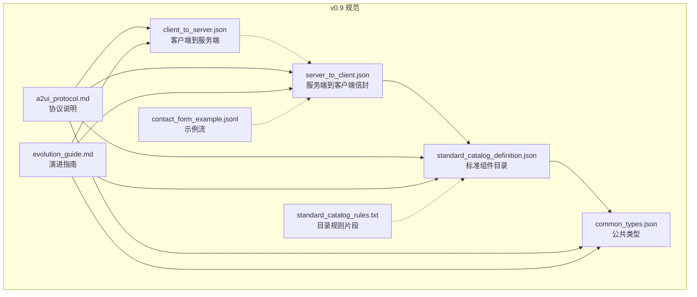
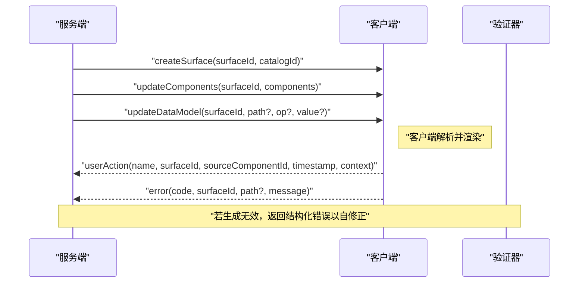
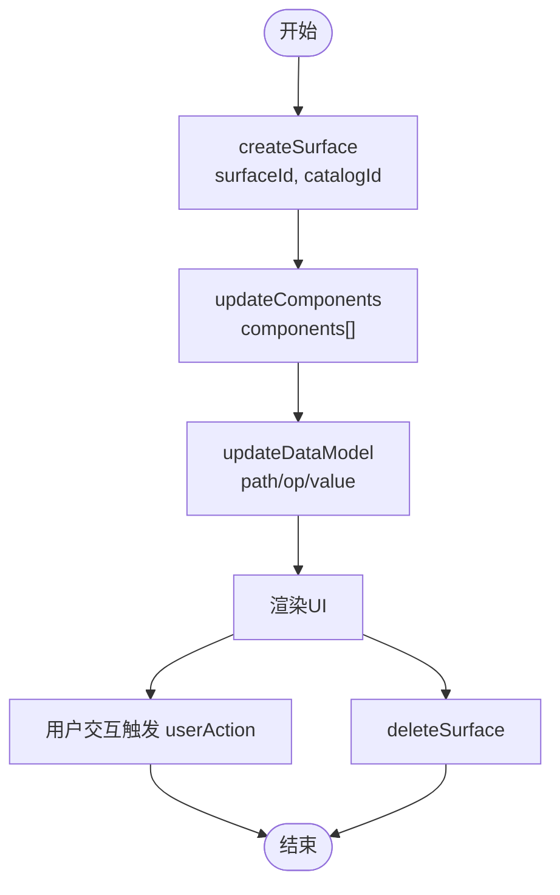
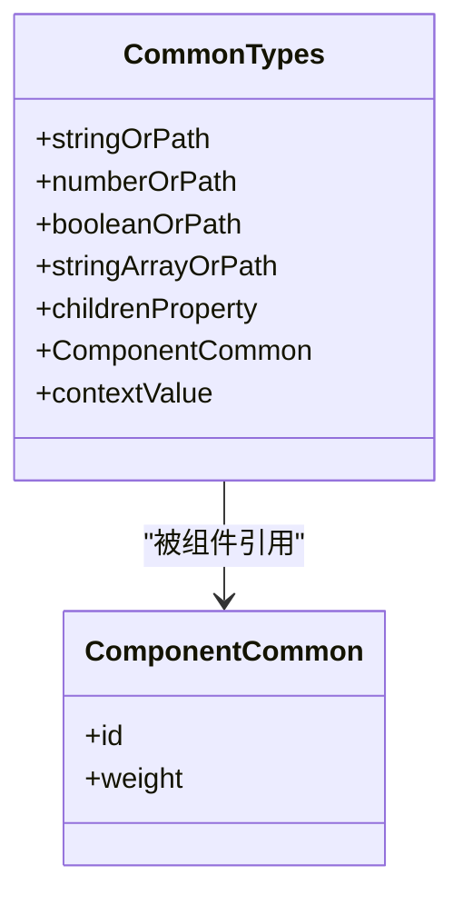
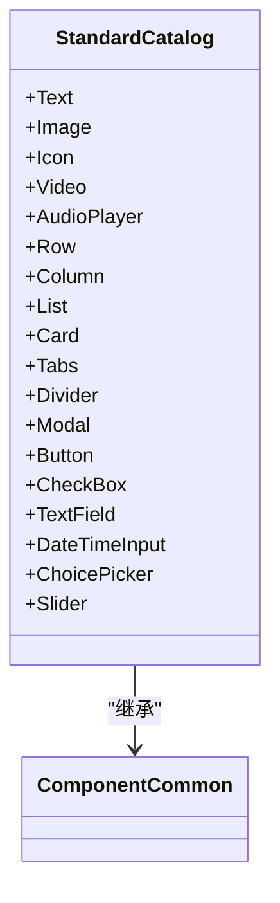
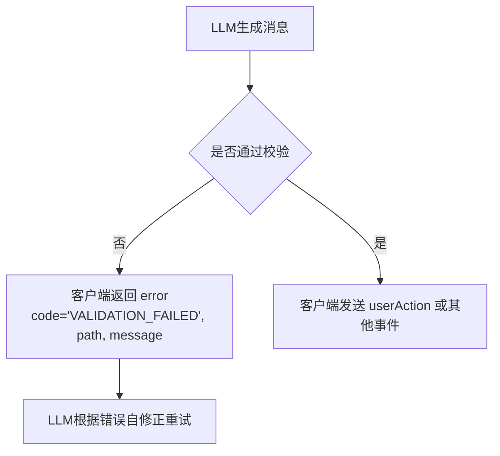
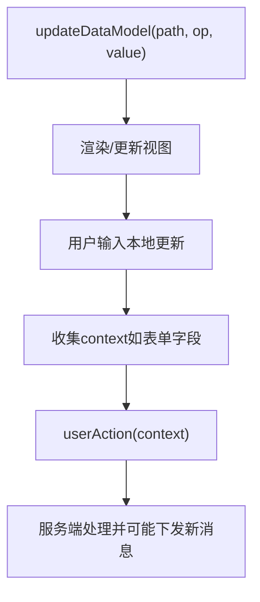
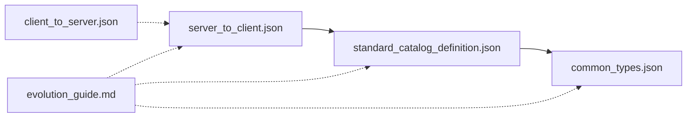

# v0.9协议规范

<cite>
**本文引用的文件**
- [a2ui_protocol.md](file://specification/0.9/docs/a2ui_protocol.md)
- [evolution_guide.md](file://specification/0.9/docs/evolution_guide.md)
- [server_to_client.json](file://specification/0.9/json/server_to_client.json)
- [client_to_server.json](file://specification/0.9/json/client_to_server.json)
- [common_types.json](file://specification/0.9/json/common_types.json)
- [standard_catalog_definition.json](file://specification/0.9/json/standard_catalog_definition.json)
- [standard_catalog_rules.txt](file://specification/0.9/json/standard_catalog_rules.txt)
- [contact_form_example.jsonl](file://specification/0.9/json/contact_form_example.jsonl)
- [server_to_client_with_standard_catalog.json](file://renderers/lit/src/0.8/schemas/server_to_client_with_standard_catalog.json)
</cite>

## 目录
1. [简介](#简介)
2. [项目结构](#项目结构)
3. [核心组件](#核心组件)
4. [架构总览](#架构总览)
5. [详细组件分析](#详细组件分析)
6. [依赖关系分析](#依赖关系分析)
7. [性能考量](#性能考量)
8. [故障排查指南](#故障排查指南)
9. [结论](#结论)
10. [附录](#附录)

## 简介
本文件是A2UI协议v0.9版本的权威技术规范，面向需要开发v0.9兼容系统的工程师与架构师。v0.9在哲学上从“结构化输出优先”转向“提示词优先”，通过模块化Schema（公共类型、消息信封、标准组件目录）提升可读性与可维护性，并以严格的验证反馈循环强化LLM生成的稳健性。本文将系统阐述四类消息类型、数据绑定与状态管理、组件目录、错误处理流程，并给出从v0.8到v0.9的迁移路线与兼容性策略。

## 项目结构
v0.9规范由三类Schema与配套文档构成：
- 公共类型：统一的可绑定值、权重、子节点等基础类型定义
- 服务端到客户端信封：定义四类消息的顶层结构与校验
- 标准组件目录：定义具体UI组件及其属性
- 客户端到服务端：定义客户端上报动作与错误的结构
- 迁移与演进指南：对比v0.8与v0.9的关键差异与迁移建议
- 示例流：展示典型交互序列

图表来源
- [server_to_client.json](file://specification/0.9/json/server_to_client.json#L1-L115)
- [common_types.json](file://specification/0.9/json/common_types.json#L1-L121)
- [standard_catalog_definition.json](file://specification/0.9/json/standard_catalog_definition.json#L1-L639)
- [client_to_server.json](file://specification/0.9/json/client_to_server.json#L1-L98)
- [standard_catalog_rules.txt](file://specification/0.9/json/standard_catalog_rules.txt#L1-L6)
- [a2ui_protocol.md](file://specification/0.9/docs/a2ui_protocol.md#L1-L473)
- [evolution_guide.md](file://specification/0.9/docs/evolution_guide.md#L1-L277)
- [contact_form_example.jsonl](file://specification/0.9/json/contact_form_example.jsonl#L1-L4)

章节来源
- [a2ui_protocol.md](file://specification/0.9/docs/a2ui_protocol.md#L1-L120)
- [server_to_client.json](file://specification/0.9/json/server_to_client.json#L1-L115)
- [common_types.json](file://specification/0.9/json/common_types.json#L1-L121)
- [standard_catalog_definition.json](file://specification/0.9/json/standard_catalog_definition.json#L1-L639)
- [client_to_server.json](file://specification/0.9/json/client_to_server.json#L1-L98)
- [standard_catalog_rules.txt](file://specification/0.9/json/standard_catalog_rules.txt#L1-L6)
- [evolution_guide.md](file://specification/0.9/docs/evolution_guide.md#L1-L120)

## 核心组件
- 四类服务端到客户端消息
  - createSurface：创建并准备渲染表面，声明catalogId
  - updateComponents：批量添加或更新组件定义
  - updateDataModel：对数据模型进行增删改操作
  - deleteSurface：删除表面及关联资源
- 公共类型
  - stringOrPath/numberOrPath/booleanOrPath/stringArrayOrPath：统一的可绑定值
  - childrenProperty：静态数组或模板（基于路径的动态列表）
  - id/ComponentCommon/weight：组件标识与布局权重
  - contextValue：动作上下文的多态值
- 标准组件目录
  - Text/Image/Icon/Video/AudioPlayer/Row/Column/List/Card/Tabs/Divider/Modal/Button/CheckBox/TextField/DateTimeInput/ChoicePicker/Slider
- 客户端到服务端
  - userAction：用户触发的动作
  - error：客户端错误上报（含严格格式）

章节来源
- [a2ui_protocol.md](file://specification/0.9/docs/a2ui_protocol.md#L100-L210)
- [server_to_client.json](file://specification/0.9/json/server_to_client.json#L1-L115)
- [common_types.json](file://specification/0.9/json/common_types.json#L1-L121)
- [standard_catalog_definition.json](file://specification/0.9/json/standard_catalog_definition.json#L1-L639)
- [client_to_server.json](file://specification/0.9/json/client_to_server.json#L1-L98)

## 架构总览
v0.9采用“提示词优先”的设计：将Schema与示例直接嵌入LLM提示，借助更自然的JSON对象结构与oneOf顶层约束，使LLM更容易生成符合协议的消息流。客户端按顺序消费消息，构建组件树与数据模型，渲染UI；用户交互通过客户端到服务端消息回传。

图表来源
- [a2ui_protocol.md](file://specification/0.9/docs/a2ui_protocol.md#L41-L76)
- [server_to_client.json](file://specification/0.9/json/server_to_client.json#L1-L115)
- [client_to_server.json](file://specification/0.9/json/client_to_server.json#L1-L98)

## 详细组件分析

### 服务端到客户端信封（server_to_client.json）
- 顶层使用oneOf确保每条消息仅包含一个键：createSurface/updateComponents/updateDataModel/deleteSurface
- createSurface
  - 必填：surfaceId、catalogId
  - 语义：创建表面并准备渲染，后续需配合updateComponents与updateDataModel
- updateComponents
  - 必填：surfaceId、components（至少一项）
  - 组件列表扁平化，通过childrenProperty或id引用建立树关系
  - 必须存在唯一root组件
- updateDataModel
  - 必填：surfaceId
  - 可选：path（默认根），op（add/replace/remove，默认replace），value（当op为add/replace时必填）
- deleteSurface
  - 必填：surfaceId

图表来源
- [server_to_client.json](file://specification/0.9/json/server_to_client.json#L1-L115)

章节来源
- [server_to_client.json](file://specification/0.9/json/server_to_client.json#L1-L115)
- [a2ui_protocol.md](file://specification/0.9/docs/a2ui_protocol.md#L105-L208)

### 公共类型（common_types.json）
- 可绑定值
  - stringOrPath/numberOrPath/booleanOrPath/stringArrayOrPath：允许字面量或{ "path": "..." }
- 子节点
  - childrenProperty：数组（静态）或对象（模板，含componentId与path）
- 组件通用
  - id：组件唯一标识
  - weight：Row/Column内相对权重（flex-grow）
- 上下文值
  - contextValue：字符串/数字/布尔或{ "path": "..." }

图表来源
- [common_types.json](file://specification/0.9/json/common_types.json#L1-L121)

章节来源
- [common_types.json](file://specification/0.9/json/common_types.json#L1-L121)

### 标准组件目录（standard_catalog_definition.json）
- 组件分类
  - 文本与媒体：Text、Image、Icon、Video、AudioPlayer
  - 布局容器：Row、Column、List、Card、Tabs、Divider、Modal
  - 交互控件：Button、CheckBox、TextField、DateTimeInput、ChoicePicker、Slider
- 关键点
  - 统一使用"component"常量字段作为多态判别
  - 大多数属性支持stringOrPath等可绑定值
  - Button的action.context为标准JSON对象（v0.9相较v0.8的改进）
  - ChoicePicker替代v0.8的MultipleChoice，简化属性集合并统一usageHint
  - Slider属性名从minValue/maxValue改为min/max

图表来源
- [standard_catalog_definition.json](file://specification/0.9/json/standard_catalog_definition.json#L1-L639)
- [common_types.json](file://specification/0.9/json/common_types.json#L1-L121)

章节来源
- [standard_catalog_definition.json](file://specification/0.9/json/standard_catalog_definition.json#L1-L639)
- [evolution_guide.md](file://specification/0.9/docs/evolution_guide.md#L107-L182)

### 客户端到服务端（client_to_server.json）
- userAction
  - name/surfaceId/sourceComponentId/timestamp/context
  - context为已解析后的键值对象
- error
  - 严格格式：code必须为"VALIDATION_FAILED"时，需包含surfaceId、path、message
  - 其他错误可包含任意字段，但至少包含code/surfaceId/message

图表来源
- [client_to_server.json](file://specification/0.9/json/client_to_server.json#L1-L98)
- [a2ui_protocol.md](file://specification/0.9/docs/a2ui_protocol.md#L425-L446)

章节来源
- [client_to_server.json](file://specification/0.9/json/client_to_server.json#L1-L98)
- [a2ui_protocol.md](file://specification/0.9/docs/a2ui_protocol.md#L425-L446)

### 数据绑定与状态管理
- 路径解析
  - 默认根作用域：绝对路径以"/"开头，始终从数据模型根解析
  - 列表作用域：容器模板迭代数组时，相对路径在子项内解析
- 双向绑定
  - 输入组件本地更新数据模型，再通过userAction携带context回传服务端
  - 保证标签与输入框共享同一路径时的实时联动

图表来源
- [a2ui_protocol.md](file://specification/0.9/docs/a2ui_protocol.md#L271-L384)

章节来源
- [a2ui_protocol.md](file://specification/0.9/docs/a2ui_protocol.md#L271-L384)

### 示例流（contact_form_example.jsonl）
- 展示从createSurface到updateComponents再到updateDataModel的完整序列
- 适合用于验证生成器与客户端的正确性

章节来源
- [contact_form_example.jsonl](file://specification/0.9/json/contact_form_example.jsonl#L1-L4)

## 依赖关系分析
- server_to_client.json依赖standard_catalog_definition.json中的anyComponent定义
- standard_catalog_definition.json依赖common_types.json中的可绑定值与通用属性
- client_to_server.json独立于服务端信封，仅用于客户端上报
- evolution_guide.md对比v0.8与v0.9的差异，指导迁移

图表来源
- [server_to_client.json](file://specification/0.9/json/server_to_client.json#L1-L115)
- [standard_catalog_definition.json](file://specification/0.9/json/standard_catalog_definition.json#L1-L639)
- [common_types.json](file://specification/0.9/json/common_types.json#L1-L121)
- [client_to_server.json](file://specification/0.9/json/client_to_server.json#L1-L98)
- [evolution_guide.md](file://specification/0.9/docs/evolution_guide.md#L1-L277)

章节来源
- [server_to_client.json](file://specification/0.9/json/server_to_client.json#L1-L115)
- [standard_catalog_definition.json](file://specification/0.9/json/standard_catalog_definition.json#L1-L639)
- [common_types.json](file://specification/0.9/json/common_types.json#L1-L121)
- [client_to_server.json](file://specification/0.9/json/client_to_server.json#L1-L98)
- [evolution_guide.md](file://specification/0.9/docs/evolution_guide.md#L1-L277)

## 性能考量
- 模块化Schema降低复杂度，便于缓存与增量校验
- 扁平组件列表与childrenProperty减少深层嵌套，利于快速构建树
- 严格错误反馈循环避免无效渲染，减少客户端重排成本
- 建议客户端实现消息缓冲与去重，避免重复组件定义带来的解析开销

## 故障排查指南
- 常见错误类型
  - 结构不符：缺少必填字段或多余字段
  - 路径错误：JSON Pointer不合法或作用域不匹配
  - 组件缺失：未先createSurface或未提供唯一root
  - 数据模型操作：op与value不匹配
- 排查步骤
  - 使用client_to_server.json的error格式回传给LLM，明确path与message
  - 在提示中加入standard_catalog_rules.txt，强调必需属性
  - 对比0.8旧Schema（server_to_client_with_standard_catalog.json）定位差异
- 自修正建议
  - 将错误信息转为自然语言提示，引导LLM按规则补齐

章节来源
- [client_to_server.json](file://specification/0.9/json/client_to_server.json#L1-L98)
- [standard_catalog_rules.txt](file://specification/0.9/json/standard_catalog_rules.txt#L1-L6)
- [server_to_client_with_standard_catalog.json](file://renderers/lit/src/0.8/schemas/server_to_client_with_standard_catalog.json#L1-L827)

## 结论
v0.9以“提示词优先”为核心理念，通过模块化Schema与oneOf顶层约束显著提升了LLM生成的稳定性与可读性。公共类型与标准组件目录的解耦，使得客户端可灵活替换组件集而不影响协议核心。迁移至v0.9的关键在于：消息类型与生命周期的调整、组件属性的标准化、数据模型更新方式的简化，以及严格的验证反馈闭环。遵循本文档与演进指南，可高效完成从v0.8到v0.9的升级。

## 附录

### 从v0.8到v0.9的迁移要点
- 消息生命周期
  - v0.8：beginRendering显式创建表面并携带样式
  - v0.9：createSurface仅创建表面，不再携带样式；样式交由客户端主题层处理
- 组件更新
  - v0.8：surfaceUpdate使用键值包装（如{"Text": {...}}）
  - v0.9：updateComponents使用扁平结构，以"component": "X"作为判别
- 数据模型更新
  - v0.8：dataModelUpdate使用键值对数组与typed value字段
  - v0.9：updateDataModel使用标准JSON对象，op支持add/replace/remove
- 数据绑定
  - v0.8：dataBinding/literalString等命名不一致
  - v0.9：统一使用path与stringOrPath/numberOrPath等类型
- 组件差异
  - Button上下文：v0.8使用键值对数组，v0.9使用标准JSON对象
  - ChoicePicker：v0.9统一名称与usageHint，简化属性
  - Slider：v0.8的minValue/maxValue改为min/max
- 新增规则
  - v0.9引入standard_catalog_rules.txt，以自然语言规则补充Schema难以表达的约束

章节来源
- [evolution_guide.md](file://specification/0.9/docs/evolution_guide.md#L1-L277)
- [a2ui_protocol.md](file://specification/0.9/docs/a2ui_protocol.md#L30-L76)