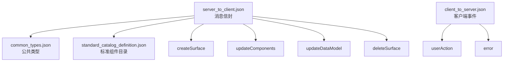
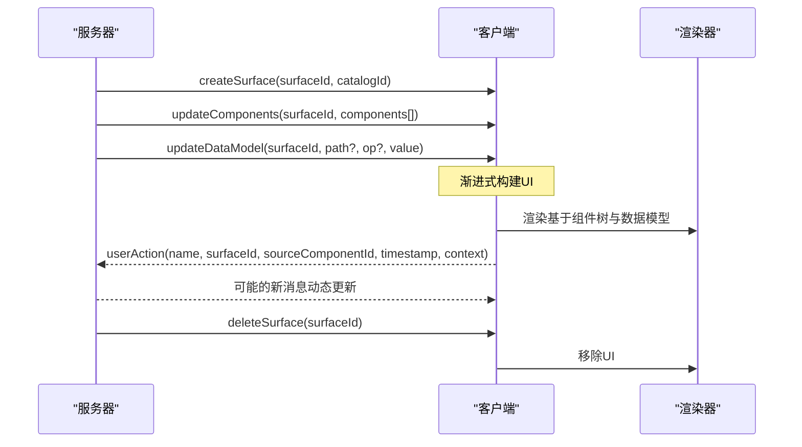
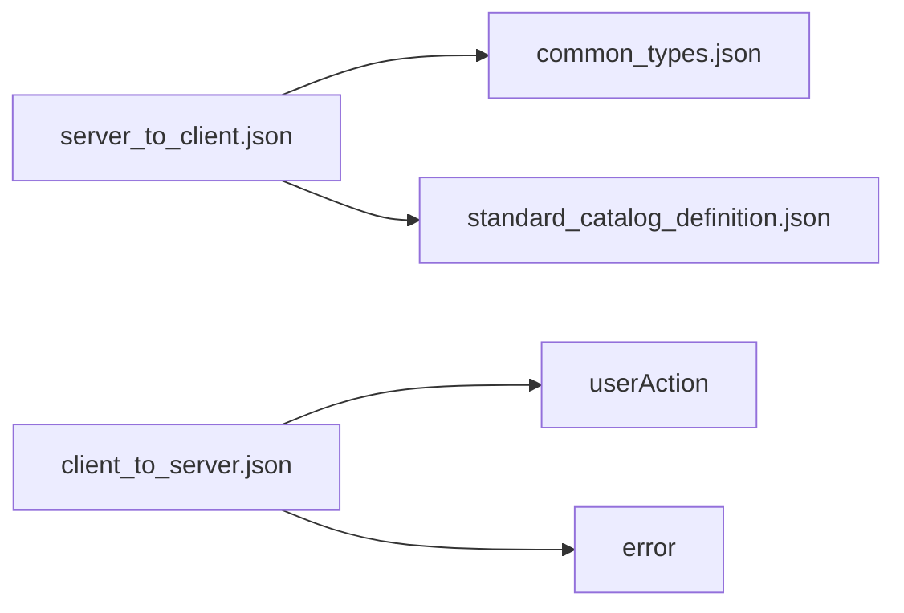
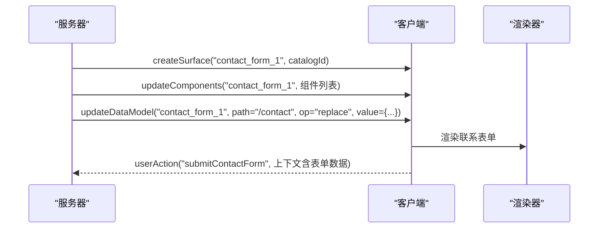

# v0.9消息协议

<cite>
**本文引用的文件**
- [server_to_client.json](file://specification/0.9/json/server_to_client.json)
- [client_to_server.json](file://specification/0.9/json/client_to_server.json)
- [common_types.json](file://specification/0.9/json/common_types.json)
- [standard_catalog_definition.json](file://specification/0.9/json/standard_catalog_definition.json)
- [standard_catalog_rules.txt](file://specification/0.9/json/standard_catalog_rules.txt)
- [a2ui_protocol.md](file://specification/0.9/docs/a2ui_protocol.md)
- [evolution_guide.md](file://specification/0.9/docs/evolution_guide.md)
- [contact_form_example.jsonl](file://specification/0.9/json/contact_form_example.jsonl)
- [messages.md](file://docs/reference/messages.md)
- [renderer-development.md](file://docs/guides/renderer-development.md)
- [server_to_client_v0.8.json](file://specification/0.8/json/server_to_client.json)
- [client_to_server_v0.8.json](file://specification/0.8/json/client_to_server.json)
</cite>

## 目录
1. [简介](#简介)
2. [项目结构](#项目结构)
3. [核心组件](#核心组件)
4. [架构总览](#架构总览)
5. [详细组件分析](#详细组件分析)
6. [依赖关系分析](#依赖关系分析)
7. [性能考量](#性能考量)
8. [故障排查指南](#故障排查指南)
9. [结论](#结论)
10. [附录](#附录)

## 简介
本文件为A2UI v0.9消息协议的权威技术参考，基于server_to_client.json与client_to_server.json的JSON Schema，系统性定义四类消息类型（createSurface、updateComponents、updateDataModel、deleteSurface）的结构、字段含义、数据类型与约束；解释消息流的处理机制（增量更新、渐进式渲染、错误处理）；对比v0.8协议，明确新增、修改与废弃字段；提供完整的消息序列示例，展示从表面创建到UI生成与交互的端到端流程。本文同时给出面向Agent与客户端渲染器的实现建议与最佳实践。

## 项目结构
A2UI v0.9将协议拆分为三个相互协作的JSON Schema：
- 公共类型：common_types.json 定义可复用的绑定类型、权重、子节点模型等基础能力
- 标准组件目录：standard_catalog_definition.json 定义标准组件集合及其属性
- 消息信封：server_to_client.json 定义四类消息的顶层结构与校验规则
- 客户端到服务端事件：client_to_server.json 定义用户动作与错误上报格式

图表来源
- [server_to_client.json](file://specification/0.9/json/server_to_client.json#L1-L115)
- [common_types.json](file://specification/0.9/json/common_types.json#L1-L121)
- [standard_catalog_definition.json](file://specification/0.9/json/standard_catalog_definition.json#L1-L200)
- [client_to_server.json](file://specification/0.9/json/client_to_server.json#L1-L98)

章节来源
- [server_to_client.json](file://specification/0.9/json/server_to_client.json#L1-L115)
- [common_types.json](file://specification/0.9/json/common_types.json#L1-L121)
- [standard_catalog_definition.json](file://specification/0.9/json/standard_catalog_definition.json#L1-L200)
- [client_to_server.json](file://specification/0.9/json/client_to_server.json#L1-L98)

## 核心组件
- createSurface：创建并准备渲染一个UI表面，要求提供surfaceId与catalogId
- updateComponents：向指定surfaceId推送组件列表（扁平化结构+discriminator），建立树形关系
- updateDataModel：对指定surfaceId的数据模型进行增量更新（支持路径定位与操作类型）
- deleteSurface：删除指定surfaceId的表面及其组件与数据
- userAction：客户端上报用户触发的动作，包含名称、来源组件、时间戳与上下文
- error：客户端上报错误，支持标准的“验证失败”反馈格式

章节来源
- [server_to_client.json](file://specification/0.9/json/server_to_client.json#L1-L115)
- [client_to_server.json](file://specification/0.9/json/client_to_server.json#L1-L98)

## 架构总览
v0.9采用“提示优先”的设计哲学，将协议嵌入LLM系统提示中，通过更自然的JSON对象表达与模块化Schema提升可读性与生成效率。消息信封以oneOf严格限定每条消息的类型，配合标准组件目录与公共类型，形成清晰的协议边界。

图表来源
- [a2ui_protocol.md](file://specification/0.9/docs/a2ui_protocol.md#L41-L75)
- [server_to_client.json](file://specification/0.9/json/server_to_client.json#L1-L115)
- [client_to_server.json](file://specification/0.9/json/client_to_server.json#L1-L98)

## 详细组件分析

### createSurface
- 作用：通知客户端创建新表面并开始渲染
- 必填字段：surfaceId、catalogId
- 约束：必须先于updateComponents发送；catalogId用于声明使用的组件目录
- 语义：客户端在收到该消息后，等待后续updateComponents与/或updateDataModel

章节来源
- [server_to_client.json](file://specification/0.9/json/server_to_client.json#L14-L36)
- [a2ui_protocol.md](file://specification/0.9/docs/a2ui_protocol.md#L108-L127)

### updateComponents
- 作用：为指定surfaceId提供组件列表，建立树形关系
- 结构要点：
  - 组件扁平化，使用discriminator字段component标识类型
  - 子节点通过childrenProperty定义（静态数组或模板）
  - 每个组件有唯一id，容器组件通过id引用子组件
- 约束：必须先有createSurface；至少包含一个id为root的根组件
- 增量更新：可多次发送，逐步补充组件树

章节来源
- [server_to_client.json](file://specification/0.9/json/server_to_client.json#L37-L63)
- [standard_catalog_definition.json](file://specification/0.9/json/standard_catalog_definition.json#L23-L47)
- [a2ui_protocol.md](file://specification/0.9/docs/a2ui_protocol.md#L128-L199)

### updateDataModel
- 作用：更新指定surfaceId的数据模型
- 关键字段：
  - surfaceId：目标表面
  - path：JSON Pointer定位到数据模型中的位置，默认“/”表示整体会替换
  - op：操作类型，枚举值add/replace/remove，默认replace
  - value：要更新的数据（任意JSON对象），在add/replace时必填，在remove时不允许出现
- 语义：支持局部增量更新，避免全量替换

章节来源
- [server_to_client.json](file://specification/0.9/json/server_to_client.json#L64-L112)
- [a2ui_protocol.md](file://specification/0.9/docs/a2ui_protocol.md#L164-L189)

### deleteSurface
- 作用：删除指定surfaceId的表面及关联组件与数据
- 约束：必须先有createSurface

章节来源
- [server_to_client.json](file://specification/0.9/json/server_to_client.json#L95-L112)
- [a2ui_protocol.md](file://specification/0.9/docs/a2ui_protocol.md#L191-L207)

### userAction
- 作用：上报用户触发的动作
- 字段：name、surfaceId、sourceComponentId、timestamp（ISO 8601）、context（对象）
- 用途：当输入组件发生双向绑定变化后，由用户显式触发动作，将当前数据回传给服务器

章节来源
- [client_to_server.json](file://specification/0.9/json/client_to_server.json#L8-L42)
- [a2ui_protocol.md](file://specification/0.9/docs/a2ui_protocol.md#L448-L469)

### error
- 作用：上报客户端侧错误
- 标准格式（验证失败）：code必须为“VALIDATION_FAILED”，包含surfaceId、path、message
- 其他错误：code非“VALIDATION_FAILED”，需包含message与surfaceId

章节来源
- [client_to_server.json](file://specification/0.9/json/client_to_server.json#L43-L90)
- [a2ui_protocol.md](file://specification/0.9/docs/a2ui_protocol.md#L425-L446)

### 数据绑定与公共类型
- stringOrPath/numberOrPath/booleanOrPath/stringArrayOrPath：属性可为字面量或指向数据模型的path
- childrenProperty：静态数组或模板（template）两种形式
- id：组件唯一标识
- weight：仅允许在Row/Column的直接子项上设置，对应CSS flex-grow语义

章节来源
- [common_types.json](file://specification/0.9/json/common_types.json#L1-L121)
- [a2ui_protocol.md](file://specification/0.9/docs/a2ui_protocol.md#L271-L341)

### 标准组件目录（节选）
- Text/Image/Icon/Video/AudioPlayer/Row/Column/List/Card/Tabs/Divider/Modal/Button/CheckBox/TextField/DateTimeInput/ChoicePicker/Slider
- 每个组件均以component字段作为discriminator，结合公共类型完成数据绑定与布局控制

章节来源
- [standard_catalog_definition.json](file://specification/0.9/json/standard_catalog_definition.json#L1-L200)

## 依赖关系分析
- server_to_client.json依赖common_types.json中的通用类型与standard_catalog_definition.json中的组件定义
- 客户端渲染器需要解析消息信封、解析组件目录、维护组件映射与数据模型，并在收到userAction时回传上下文

图表来源
- [server_to_client.json](file://specification/0.9/json/server_to_client.json#L1-L115)
- [common_types.json](file://specification/0.9/json/common_types.json#L1-L121)
- [standard_catalog_definition.json](file://specification/0.9/json/standard_catalog_definition.json#L1-L200)
- [client_to_server.json](file://specification/0.9/json/client_to_server.json#L1-L98)

章节来源
- [server_to_client.json](file://specification/0.9/json/server_to_client.json#L1-L115)
- [client_to_server.json](file://specification/0.9/json/client_to_server.json#L1-L98)

## 性能考量
- 增量更新：通过多次updateComponents与updateDataModel实现渐进式渲染，减少一次性传输开销
- 局部数据更新：使用path与op进行细粒度更新，避免全量替换
- 组件扁平化：以ID映射与childrenProperty建立树，便于快速查找与更新
- 验证反馈循环：通过标准error格式快速定位问题，降低重试成本

[本节为通用指导，不直接分析具体文件]

## 故障排查指南
- 验证失败：当LLM生成的JSON不符合Schema时，客户端应返回code为“VALIDATION_FAILED”的error消息，包含surfaceId、path与message，以便模型自修正
- 常见错误场景：
  - 缺少必需字段（如createSurface缺少catalogId）
  - 组件未按标准目录定义（unknown component type）
  - 数据模型路径无效或类型不匹配
- 建议流程：生成→验证→上报错误→提示修正→再次生成

章节来源
- [client_to_server.json](file://specification/0.9/json/client_to_server.json#L43-L90)
- [a2ui_protocol.md](file://specification/0.9/docs/a2ui_protocol.md#L425-L446)

## 结论
v0.9协议以模块化Schema与“提示优先”理念，显著提升了可读性与生成效率；通过严格的oneOf消息信封、扁平化组件结构与路径驱动的数据绑定，实现了灵活而稳健的UI动态生成与交互。迁移至v0.9的关键在于：使用createSurface替代beginRendering、采用updateComponents的discriminator结构、以updateDataModel的op/path实现增量更新，并遵循标准error反馈机制。

[本节为总结性内容，不直接分析具体文件]

## 附录

### v0.8到v0.9变更概览
- 消息类型：beginRendering → createSurface；surfaceUpdate → updateComponents；dataModelUpdate → updateDataModel
- 表面创建：createSurface引入catalogId，移除样式信息
- 组件结构：从key包装改为component字段discriminator
- 数据模型：从邻接表数组改为标准JSON对象，新增op字段
- 数据绑定：统一使用path，简化bound value结构
- 错误处理：引入标准“验证失败”反馈格式

章节来源
- [evolution_guide.md](file://specification/0.9/docs/evolution_guide.md#L1-L277)
- [server_to_client_v0.8.json](file://specification/0.8/json/server_to_client.json#L1-L148)
- [client_to_server_v0.8.json](file://specification/0.8/json/client_to_server.json#L1-L54)

### 消息序列示例（联系表单）
以下示例展示了从创建表面到组件与数据模型更新的完整流程，可用于Agent生成与客户端渲染器实现参考。

图表来源
- [contact_form_example.jsonl](file://specification/0.9/json/contact_form_example.jsonl#L1-L4)
- [a2ui_protocol.md](file://specification/0.9/docs/a2ui_protocol.md#L209-L218)

章节来源
- [contact_form_example.jsonl](file://specification/0.9/json/contact_form_example.jsonl#L1-L4)
- [a2ui_protocol.md](file://specification/0.9/docs/a2ui_protocol.md#L209-L218)

### 实现要点与最佳实践
- 渲染器实现清单（摘自v0.8指南，适用于v0.9）：
  - JSONL流解析与消息分发
  - 多表面管理与组件缓冲（邻接表）
  - 数据模型存储与增量更新
  - 渐进式渲染控制与数据绑定解析
  - 动态列表渲染（模板）
  - 用户动作上报与错误报告
- 组件目录检查清单：确保覆盖标准组件集，映射到原生UI控件

章节来源
- [renderer-development.md](file://docs/guides/renderer-development.md#L1-L83)
- [standard_catalog_rules.txt](file://specification/0.9/json/standard_catalog_rules.txt#L1-L6)