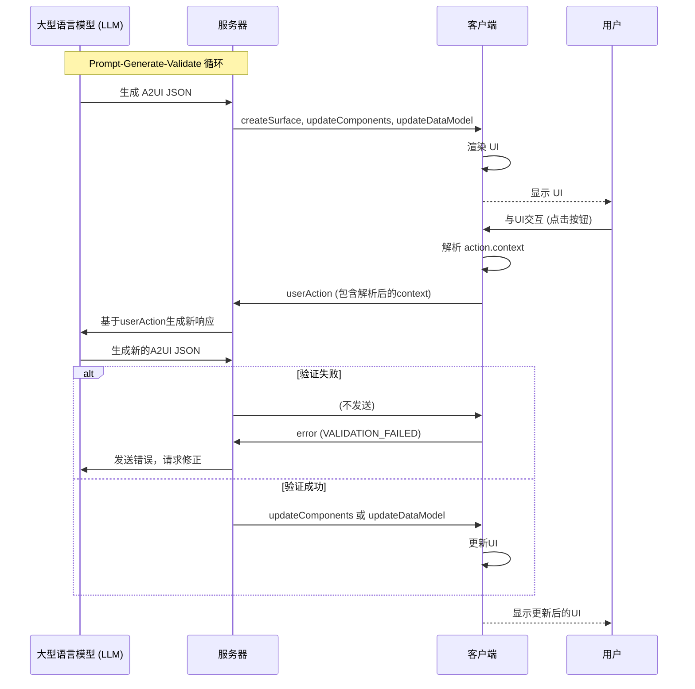

# 客户端到服务器消息

<cite>
**本文档引用的文件**
- [client_to_server.json](file://specification/0.9/json/client_to_server.json)
- [a2ui_protocol.md](file://specification/0.9/docs/a2ui_protocol.md)
- [evolution_guide.md](file://specification/0.9/docs/evolution_guide.md)
- [contact_form_example.jsonl](file://specification/0.9/json/contact_form_example.jsonl)
- [button.ts](file://renderers/lit/src/0.8/ui/button.ts)
- [events.ts](file://renderers/lit/src/0.8/events/events.ts)
</cite>

## 目录
1. [简介](#简介)
2. [v0.9客户端到服务器消息概览](#v09客户端到服务器消息概览)
3. [核心消息类型详解](#核心消息类型详解)
4. [用户交互事件（userAction）](#用户交互事件useraction)
5. [错误报告（error）](#错误报告error)
6. [v0.8到v0.9的变更对比](#v08到v09的变更对比)
7. [消息在交互流程中的位置](#消息在交互流程中的位置)

## 简介
本技术文档旨在全面定义A2UI协议v0.9版本中客户端到服务器消息的结构与语义。基于`client_to_server.json`的JSON Schema，本文档详细阐述了所有消息类型（如`userAction`、`error`等）的字段含义、数据类型和约束条件。重点解释了用户交互事件的封装格式，以及错误报告机制。通过实际JSON示例和与v0.8版本的对比，确保Agent开发者能够正确处理来自v0.9客户端的消息。

## v0.9客户端到服务器消息概览
在A2UI v0.9协议中，客户端到服务器的消息流是单向的，主要用于报告用户交互和客户端状态。与v0.8版本相比，v0.9的客户端消息结构更加简洁和标准化。消息通过一个JSON对象传输，该对象必须且只能包含一个顶级属性，该属性定义了消息的类型。

根据`client_to_server.json` Schema，v0.9定义了两种核心消息类型：
- **`userAction`**: 当用户与UI组件（如按钮）交互时触发，用于向服务器报告用户意图。
- **`error`**: 用于向服务器报告客户端发生的错误，特别是验证失败。

这种设计遵循了协议的“提示优先”哲学，使得消息结构更易于理解和生成。

**Section sources**
- [client_to_server.json](file://specification/0.9/json/client_to_server.json#L1-L98)
- [a2ui_protocol.md](file://specification/0.9/docs/a2ui_protocol.md#L447-L467)

## 核心消息类型详解
本节将深入分析v0.9协议中定义的每种客户端到服务器消息类型的结构、字段和约束。

### userAction消息
`userAction`消息是客户端与服务器通信的核心，它封装了用户在UI上的任何操作。

**结构与字段：**
- `name` (**字符串**, 必需): 动作的名称，直接取自触发该事件的组件的`action.name`属性。例如，一个提交按钮的`action.name`可能为`"submit_form"`。
- `surfaceId` (**字符串**, 必需): 事件发生的UI表面的唯一标识符。这帮助服务器定位到具体的UI上下文。
- `sourceComponentId` (**字符串**, 必需): 触发事件的组件的ID。服务器可以利用此ID来精确识别是哪个组件被交互。
- `timestamp` (**字符串**, 格式为`date-time`, 必需): 事件发生时的ISO 8601时间戳，用于记录和审计。
- `context` (**对象**, 必需): 一个JSON对象，包含了组件`action.context`中定义的键值对。这些值在发送前会解析所有数据绑定，确保服务器收到的是最终的、具体的值。

**约束条件：**
- `userAction`消息对象必须包含上述所有五个字段。
- `context`对象可以包含任意数量的额外属性（`additionalProperties: true`），为开发者提供了极大的灵活性。

**Section sources**
- [client_to_server.json](file://specification/0.9/json/client_to_server.json#L8-L41)
- [a2ui_protocol.md](file://specification/0.9/docs/a2ui_protocol.md#L451-L462)

### error消息
`error`消息用于向服务器报告客户端在处理UI或验证数据时遇到的问题。v0.9版本对此进行了重大改进，引入了标准化的验证错误格式。

**结构与字段：**
`error`消息使用`oneOf`关键字定义了两种子类型：

1.  **验证失败错误 (Validation Failed Error)**:
    - `code` (**常量**, 必需): 必须为`"VALIDATION_FAILED"`。这是区分一般错误和验证错误的关键。
    - `surfaceId` (**字符串**, 必需): 发生错误的UI表面ID。
    - `path` (**字符串**, 必需): 指向验证失败字段的JSON指针（例如`'/components/0/text'`）。
    - `message` (**字符串**, 必需): 一个简短的、单句的描述，说明验证失败的原因。

2.  **通用错误 (Generic Error)**:
    - `code` (**字符串**, 必需): 一个描述错误类型的代码，但不能是`"VALIDATION_FAILED"`。
    - `message` (**字符串**, 必需): 错误的描述信息。
    - `surfaceId` (**字符串**, 必需): 发生错误的UI表面ID。
    - `additionalProperties: true`: 允许包含其他自定义的错误信息。

**约束条件：**
- 消息必须是`Validation Failed Error`或`Generic Error`中的一种，不能同时满足两者。
- `Validation Failed Error`的`code`字段是固定的，确保了错误类型的明确性。

**Section sources**
- [client_to_server.json](file://specification/0.9/json/client_to_server.json#L43-L88)
- [a2ui_protocol.md](file://specification/0.9/docs/a2ui_protocol.md#L463-L467)
- [evolution_guide.md](file://specification/0.9/docs/evolution_guide.md#L260-L277)

## 用户交互事件（userAction）
`userAction`消息是用户与Agent驱动的UI进行交互的桥梁。其封装格式设计精巧，能够准确地传达用户的意图。

**封装流程：**
1.  **事件触发**: 当用户点击一个带有`action`定义的组件（如`Button`）时，客户端的渲染器会捕获此事件。
2.  **上下文解析**: 客户端会立即解析`action.context`中所有数据绑定（`path`）。例如，如果`context`包含`{"email": {"path": "/formData/email"}}`，客户端会查询其本地数据模型，并将`/formData/email`的当前值（如`"user@example.com"`）填入。
3.  **消息构建**: 客户端使用解析后的`context`、组件的`action.name`、`surfaceId`、`sourceComponentId`和当前时间戳，构建一个`userAction`消息对象。
4.  **消息发送**: 构建好的消息通过HTTP POST请求发送到服务器的指定端点（如`/a2a`）。

**在渐进式渲染中的作用：**
`userAction`消息本身不直接参与渐进式渲染的“创建-更新-删除”循环。它的作用是在渲染后的UI上，将用户的动态输入反馈给服务器。服务器收到`userAction`后，可以根据`context`中的数据和`name`中的意图，生成新的`updateComponents`或`updateDataModel`消息，从而实现UI的动态响应，形成一个完整的交互闭环。

**Section sources**
- [a2ui_protocol.md](file://specification/0.9/docs/a2ui_protocol.md#L451-L462)
- [button.ts](file://renderers/lit/src/0.8/ui/button.ts#L48-L60)
- [events.ts](file://renderers/lit/src/0.8/events/events.ts#L35-L37)

## 错误报告（error）
`error`消息，特别是`VALIDATION_FAILED`类型，是v0.9协议“提示-生成-验证”循环的关键组成部分。

**资源清理语义：**
`error`消息本身不包含资源清理指令。它的主要语义是**反馈和修正**。当客户端验证服务器生成的JSON失败时，它会发送一个`VALIDATION_FAILED`错误。这个错误包含了精确的`path`和`message`，可以被送回给LLM，让LLM“自我修正”其输出。这避免了因无效消息导致的UI崩溃，实现了更健壮的容错机制。

**与`surfaceDeleted`的区别：**
文档目标中提到的`surfaceDeleted`消息是**服务器到客户端**的消息，用于指示客户端删除一个UI表面并释放其资源。而`error`是**客户端到服务器**的消息，用于报告问题。两者方向相反，目的也不同。`surfaceDeleted`负责UI资源的清理，而`error`负责通信和数据的修正。

**Section sources**
- [a2ui_protocol.md](file://specification/0.9/docs/a2ui_protocol.md#L425-L445)
- [evolution_guide.md](file://specification/0.9/docs/evolution_guide.md#L260-L277)

## v0.8到v0.9的变更对比
本节对比了v0.8和v0.9版本在客户端到服务器消息方面的关键变更点。

| 特性 | v0.8 | v0.9 |
| :--- | :--- | :--- |
| **消息类型** | `userAction`, `error` | `userAction`, `error` |
| **`userAction`结构** | 与v0.9基本相同 | 与v0.8基本相同，保持了向后兼容性 |
| **`error`结构** | 灵活的对象，`additionalProperties: true`，无标准化格式 | 引入了`oneOf`，区分`VALIDATION_FAILED`和通用错误，`VALIDATION_FAILED`有严格的标准化格式 |
| **验证错误反馈** | 无明确标准，格式不统一 | 采用标准化的`VALIDATION_FAILED`格式，支持LLM自我修正 |
| **`componentReady`消息** | 存在 | **已移除**。v0.9的渲染逻辑基于`root`组件的存在，不再需要此消息 |
| **`surfaceDeleted`消息** | 作为客户端消息存在 | **已移除**。`deleteSurface`是服务器到客户端的消息，客户端不再发送此消息 |

**关键变更点总结：**
1.  **`error`消息标准化**: 这是最重大的变更。v0.9引入了`VALIDATION_FAILED`错误码和精确的`path`字段，使得错误可以被程序化地处理。
2.  **`componentReady`和`surfaceDeleted`的移除**: 这两个消息在v0.9中被移除，因为它们的语义要么被其他机制替代（`componentReady`），要么方向错误（`surfaceDeleted`应为服务器指令）。

**Section sources**
- [client_to_server.json](file://specification/0.8/json/client_to_server.json#L1-L54)
- [client_to_server.json](file://specification/0.9/json/client_to_server.json#L1-L98)
- [evolution_guide.md](file://specification/0.9/docs/evolution_guide.md#L260-L277)

## 消息在交互流程中的位置
`userAction`和`error`消息在完整的A2UI交互流程中扮演着至关重要的角色。

**Diagram sources**
- [a2ui_protocol.md](file://specification/0.9/docs/a2ui_protocol.md#L54-L75)
- [evolution_guide.md](file://specification/0.9/docs/evolution_guide.md#L409-L423)

**Section sources**
- [a2ui_protocol.md](file://specification/0.9/docs/a2ui_protocol.md#L42-L75)
- [contact_form_example.jsonl](file://specification/0.9/json/contact_form_example.jsonl#L1-L4)