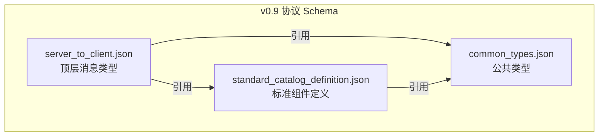
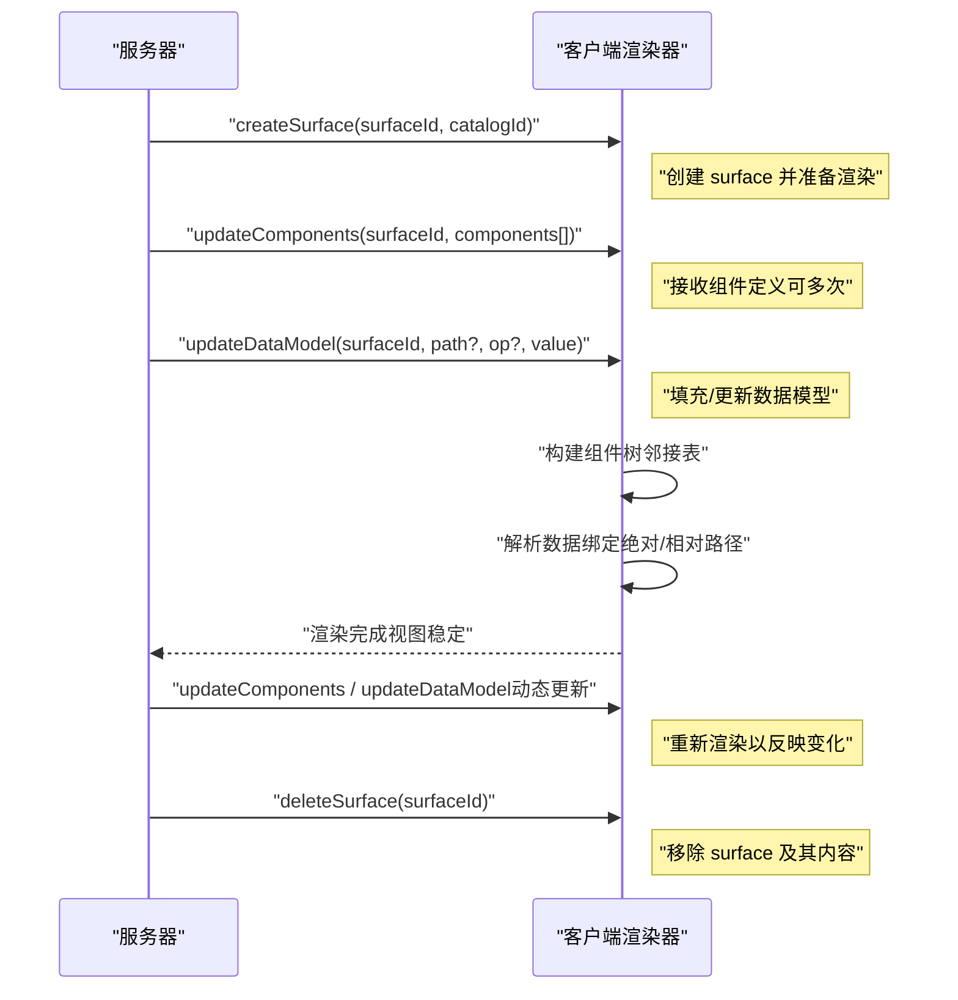
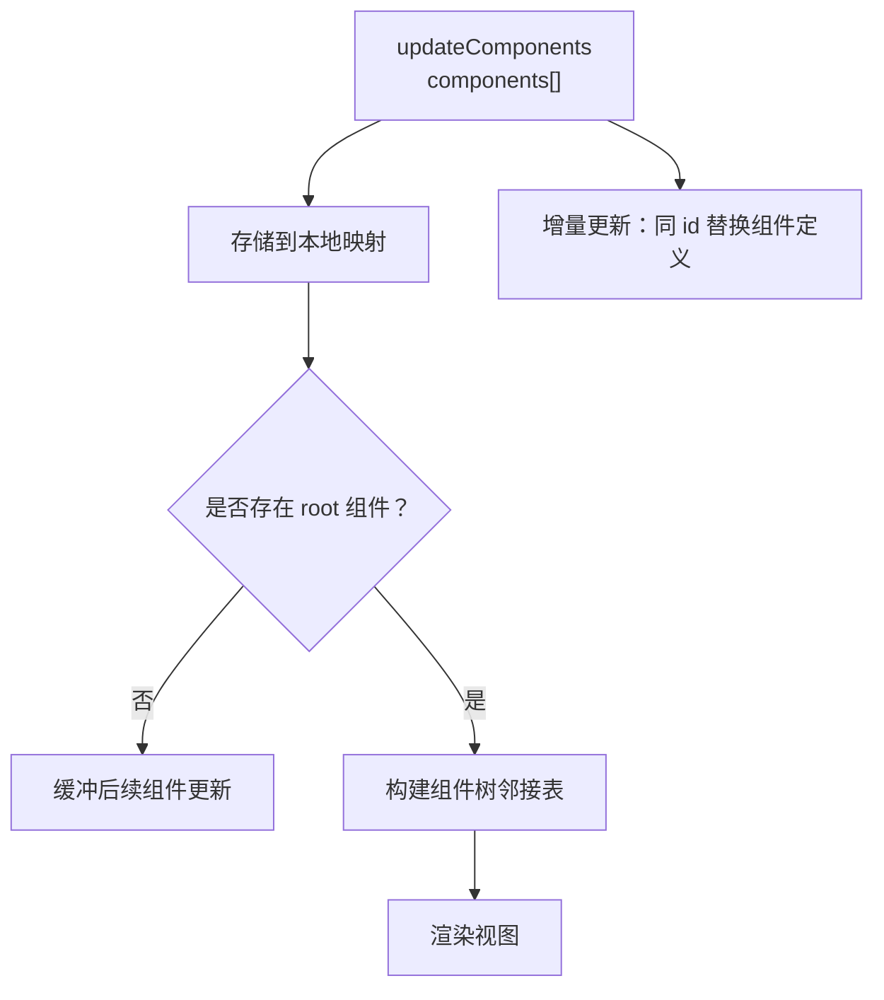
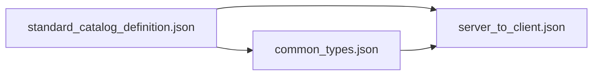

# 服务器到客户端消息

<cite>
**本文引用的文件**
- [server_to_client.json](file://specification/0.9/json/server_to_client.json)
- [a2ui_protocol.md](file://specification/0.9/docs/a2ui_protocol.md)
- [messages.md](file://docs/reference/messages.md)
- [standard_catalog_definition.json](file://specification/0.9/json/standard_catalog_definition.json)
- [common_types.json](file://specification/0.9/json/common_types.json)
- [evolution_guide.md](file://specification/0.9/docs/evolution_guide.md)
- [contact_form_example.jsonl](file://specification/0.9/json/contact_form_example.jsonl)
- [server_to_client_with_standard_catalog.json](file://renderers/lit/src/0.8/schemas/server_to_client_with_standard_catalog.json)
</cite>

## 目录
1. [简介](#简介)
2. [项目结构](#项目结构)
3. [核心组件](#核心组件)
4. [架构总览](#架构总览)
5. [详细组件分析](#详细组件分析)
6. [依赖关系分析](#依赖关系分析)
7. [性能考量](#性能考量)
8. [故障排查指南](#故障排查指南)
9. [结论](#结论)
10. [附录](#附录)

## 简介
本文件是 A2UI 协议 v0.9 中“服务器到客户端消息”的权威技术文档。它基于 v0.9 的 JSON Schema 定义，系统性地描述四类消息：createSurface、updateComponents、updateDataModel、deleteSurface。文档重点解释：
- 每条消息的结构、字段含义、数据类型与约束
- 触发场景与处理逻辑（特别是增量更新与渐进式渲染）
- 与 v0.8 的差异与迁移要点
- 结合协议文档与示例，给出消息流时序与状态管理建议
- 为客户端渲染器开发者提供可操作的实现指南

## 项目结构
v0.9 的消息协议由三个核心 JSON Schema 组成：
- envelope 层：server_to_client.json，定义顶层消息类型与校验规则
- 公共类型层：common_types.json，提供路径绑定、权重、children 等通用类型
- 标准组件层：standard_catalog_definition.json，定义具体组件及其属性

图表来源
- [server_to_client.json](file://specification/0.9/json/server_to_client.json#L1-L115)
- [common_types.json](file://specification/0.9/json/common_types.json#L1-L121)
- [standard_catalog_definition.json](file://specification/0.9/json/standard_catalog_definition.json#L1-L639)

章节来源
- [server_to_client.json](file://specification/0.9/json/server_to_client.json#L1-L115)
- [common_types.json](file://specification/0.9/json/common_types.json#L1-L121)
- [standard_catalog_definition.json](file://specification/0.9/json/standard_catalog_definition.json#L1-L639)

## 核心组件
v0.9 的服务器到客户端消息由以下四类组成，每条消息在 JSONL 流中独立出现且仅包含一个键：
- createSurface：创建并准备渲染某个 surface
- updateComponents：向指定 surface 增量添加或更新组件树
- updateDataModel：更新 surface 的数据模型（支持路径与操作）
- deleteSurface：删除指定 surface 及其内容

这些消息共同构成“增量构建 + 渐进式渲染”的核心流程：先创建 surface，再逐步发送组件定义，随后填充数据模型，最后渲染；后续可继续增量更新组件或数据，或在不再需要时删除 surface。

章节来源
- [a2ui_protocol.md](file://specification/0.9/docs/a2ui_protocol.md#L19-L53)
- [server_to_client.json](file://specification/0.9/json/server_to_client.json#L1-L115)

## 架构总览
下图展示了 v0.9 协议的消息流与渲染时序，以及与组件目录的关系：

图表来源
- [a2ui_protocol.md](file://specification/0.9/docs/a2ui_protocol.md#L47-L75)
- [server_to_client.json](file://specification/0.9/json/server_to_client.json#L1-L115)
- [standard_catalog_definition.json](file://specification/0.9/json/standard_catalog_definition.json#L1-L639)

章节来源
- [a2ui_protocol.md](file://specification/0.9/docs/a2ui_protocol.md#L47-L75)

## 详细组件分析

### createSurface
- 作用：通知客户端创建一个新的 surface，并为其准备渲染。必须在首次 updateComponents 之前发送。
- 关键字段
  - surfaceId：字符串，唯一标识该 surface
  - catalogId：字符串，组件目录标识（推荐使用 URI）
- 约束
  - 必须包含 surfaceId 与 catalogId
  - 与 updateComponents 的 catalogId 需一致
- 处理逻辑
  - 客户端创建 surface 容器
  - 缓存后续 updateComponents 与 updateDataModel
  - 等待根组件定义（见 updateComponents）

章节来源
- [server_to_client.json](file://specification/0.9/json/server_to_client.json#L14-L36)
- [a2ui_protocol.md](file://specification/0.9/docs/a2ui_protocol.md#L108-L127)

### updateComponents
- 作用：向指定 surface 增量添加或更新组件集合。组件以扁平数组形式提供，通过 ID 引用建立父子关系（邻接表）。
- 关键字段
  - surfaceId：目标 surface
  - components：组件对象数组，每个对象包含：
    - id：组件唯一标识
    - component：组件类型（如 Text、Button 等）
    - 其他属性：由标准组件目录定义
- 约束
  - 至少包含一个组件
  - 必须存在一个 id 为 "root" 的组件作为根节点
  - children 使用 childrenProperty（静态数组或模板），不支持内联子组件
- 处理逻辑
  - 客户端将组件存入映射表
  - 当存在 root 组件时，开始构建树并渲染
  - 后续增量更新会替换同 id 的组件定义

章节来源
- [server_to_client.json](file://specification/0.9/json/server_to_client.json#L37-L112)
- [standard_catalog_definition.json](file://specification/0.9/json/standard_catalog_definition.json#L1-L639)
- [a2ui_protocol.md](file://specification/0.9/docs/a2ui_protocol.md#L128-L190)

### updateDataModel
- 作用：更新 surface 的数据模型。支持对整个模型或特定路径进行增删改。
- 关键字段
  - surfaceId：目标 surface
  - path：可选，JSON Pointer（如 "/user/name"）。省略或 "/" 表示整模型替换
  - op：可选，操作类型，默认 replace；取值 add、replace、remove
  - value：可选，要写入的数据（JSON 对象）。add/replace 必须提供，remove 不允许提供
- 处理逻辑
  - 客户端按 path 解析写入策略
  - 支持绝对路径与相对路径（模板迭代时）
  - 数据变更后触发响应式重渲染

章节来源
- [server_to_client.json](file://specification/0.9/json/server_to_client.json#L64-L112)
- [a2ui_protocol.md](file://specification/0.9/docs/a2ui_protocol.md#L164-L189)

### deleteSurface
- 作用：删除指定 surface 及其所有组件与数据。
- 关键字段
  - surfaceId：要删除的 surface
- 处理逻辑
  - 客户端清理组件树与数据模型
  - 删除操作幂等（不存在也无副作用）

章节来源
- [server_to_client.json](file://specification/0.9/json/server_to_client.json#L95-L112)
- [a2ui_protocol.md](file://specification/0.9/docs/a2ui_protocol.md#L191-L207)

### 组件模型与邻接表
- 组件以扁平数组形式传输，通过 childrenProperty 建立父子关系
- 容器组件（Row/Column/List/Card/Tabs/Modal 等）的 children 支持两种模式：
  - 静态数组：直接列出子组件 ID
  - 模板：从数据模型列表生成子项，需提供模板组件 ID 与数据路径
- 必须存在且仅存在一个 id 为 "root" 的组件作为树根

图表来源
- [a2ui_protocol.md](file://specification/0.9/docs/a2ui_protocol.md#L234-L270)
- [standard_catalog_definition.json](file://specification/0.9/json/standard_catalog_definition.json#L237-L336)

章节来源
- [a2ui_protocol.md](file://specification/0.9/docs/a2ui_protocol.md#L234-L270)

### 数据绑定、作用域与状态管理
- 路径解析
  - 绝对路径：始终从数据模型根解析
  - 相对路径：在容器模板迭代时，从当前数组项开始解析
- 两路绑定
  - 输入型组件（TextField、CheckBox、Slider、ChoicePicker、DateTimeInput）支持本地双向绑定
  - 用户输入即时更新本地数据模型，提交动作时通过 userAction 将上下文传回服务器

章节来源
- [a2ui_protocol.md](file://specification/0.9/docs/a2ui_protocol.md#L271-L384)

## 依赖关系分析
- server_to_client.json 依赖 common_types.json 与 standard_catalog_definition.json
- standard_catalog_definition.json 依赖 common_types.json（如 childrenProperty、stringOrPath 等）
- 协议文档 a2ui_protocol.md 对上述 Schema 进行了语义化说明与示例

图表来源
- [server_to_client.json](file://specification/0.9/json/server_to_client.json#L1-L115)
- [common_types.json](file://specification/0.9/json/common_types.json#L1-L121)
- [standard_catalog_definition.json](file://specification/0.9/json/standard_catalog_definition.json#L1-L639)

章节来源
- [server_to_client.json](file://specification/0.9/json/server_to_client.json#L1-L115)
- [common_types.json](file://specification/0.9/json/common_types.json#L1-L121)
- [standard_catalog_definition.json](file://specification/0.9/json/standard_catalog_definition.json#L1-L639)

## 性能考量
- 增量更新优先：尽量使用 updateComponents 与 updateDataModel 的增量能力，避免重复发送完整组件树
- 路径写入优化：使用更精确的 path 与 op，减少不必要的整模型替换
- 组件扁平化：邻接表模型便于客户端缓存与增量重建
- 模板渲染：容器组件模板化可减少重复组件定义，降低消息体积

## 故障排查指南
- 常见问题与定位
  - 缺少 root 组件：导致渲染阻塞。确保至少有一个 id 为 "root" 的组件
  - 组件未按顺序到达：客户端会缓冲，但最终需补齐 root 才能渲染
  - catalogId 不一致：createSurface 与 updateComponents 的 catalogId 必须匹配
  - 路径错误：检查绝对/相对路径与数据模型结构
  - 两路绑定未同步：确认用户动作通过 userAction 上报服务器
- 错误格式参考
  - v0.9 引入了严格的 ValidationFailed 错误反馈格式，便于 LLM 自修正

章节来源
- [evolution_guide.md](file://specification/0.9/docs/evolution_guide.md#L260-L277)
- [a2ui_protocol.md](file://specification/0.9/docs/a2ui_protocol.md#L425-L446)

## 结论
v0.9 在 v0.8 的基础上进行了哲学与架构层面的重构：采用“提示优先”的设计，将消息类型从 beginRendering、surfaceUpdate、dataModelUpdate、deleteSurface 调整为 createSurface、updateComponents、updateDataModel、deleteSurface，并引入更自然的扁平组件定义与统一的路径绑定体系。这使得协议更易被 LLM 生成，同时保持对客户端渲染器的清晰契约。迁移时应重点关注消息类型替换、组件定义扁平化、catalogId 的显式声明与数据模型更新的路径与操作语义。

## 附录

### v0.8 与 v0.9 的关键差异对照
- 消息类型
  - v0.8：beginRendering、surfaceUpdate、dataModelUpdate、deleteSurface
  - v0.9：createSurface、updateComponents、updateDataModel、deleteSurface
- 表面创建
  - v0.8：beginRendering 显式信号，携带样式信息
  - v0.9：createSurface 显式信号，不再携带样式信息，要求 catalogId
- 组件定义
  - v0.8：组件包裹在键名为组件类型的对象中
  - v0.9：组件使用 discriminator 字段 component
- 数据模型更新
  - v0.8：邻接表+typed value 字段
  - v0.9：标准 JSON 对象，新增 op 与 value
- 辅助规则
  - v0.9：新增 standard_catalog_rules.txt，用于补充难以用 JSON Schema 表达的规则

章节来源
- [evolution_guide.md](file://specification/0.9/docs/evolution_guide.md#L1-L277)
- [server_to_client_with_standard_catalog.json](file://renderers/lit/src/0.8/schemas/server_to_client_with_standard_catalog.json#L1-L827)

### 示例流与最佳实践
- 完整示例（联系人表单）
  - createSurface -> updateComponents（多批增量）-> updateDataModel -> deleteSurface
- 渐进式渲染建议
  - 先发送基础布局组件，再逐步补充细节与数据
  - 使用模板化容器批量生成子项，减少消息数量
- 最佳实践清单
  - 严格维护 catalogId 一致性
  - 保证存在且仅存在一个 root 组件
  - 使用精确的 path 与合适的 op
  - 对输入型组件采用两路绑定并在动作触发时上报上下文

章节来源
- [contact_form_example.jsonl](file://specification/0.9/json/contact_form_example.jsonl#L1-L4)
- [a2ui_protocol.md](file://specification/0.9/docs/a2ui_protocol.md#L209-L218)