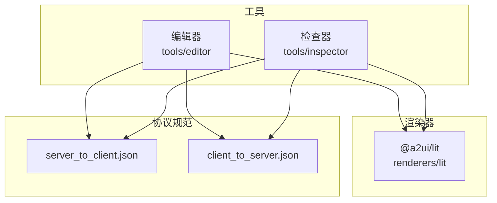
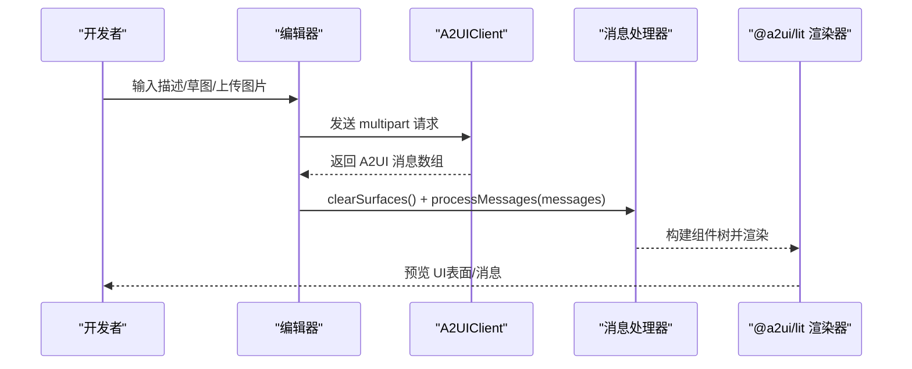
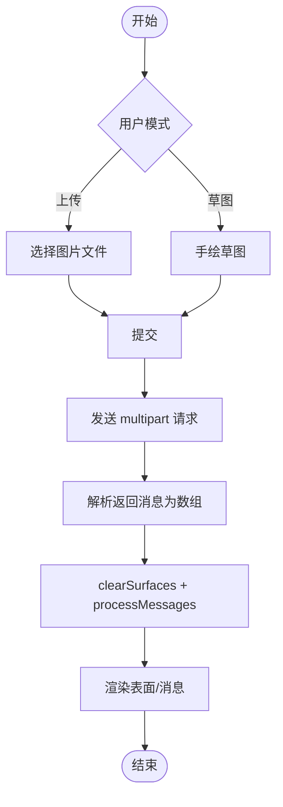
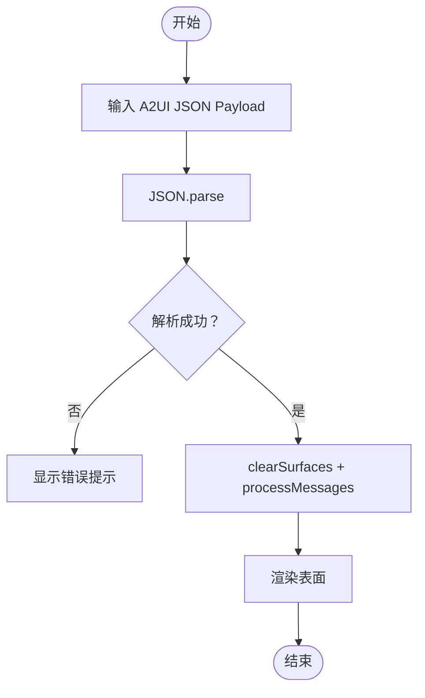
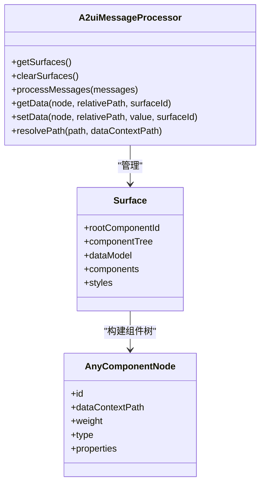
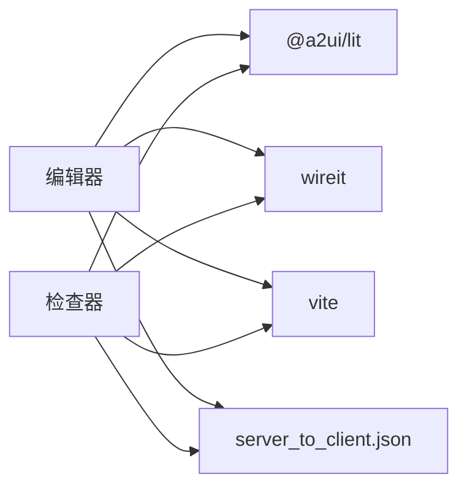

# 开发工具

<cite>
**本文引用的文件**
- [README.md](file://README.md)
- [tools/editor/package.json](file://tools/editor/package.json)
- [tools/editor/README.md](file://tools/editor/README.md)
- [tools/editor/editor.ts](file://tools/editor/editor.ts)
- [tools/editor/index.html](file://tools/editor/index.html)
- [tools/inspector/package.json](file://tools/inspector/package.json)
- [tools/inspector/README.md](file://tools/inspector/README.md)
- [tools/inspector/inspector.ts](file://tools/inspector/inspector.ts)
- [tools/inspector/index.html](file://tools/inspector/index.html)
- [specification/0.9/json/server_to_client.json](file://specification/0.9/json/server_to_client.json)
- [specification/0.9/json/client_to_server.json](file://specification/0.9/json/client_to_server.json)
- [renderers/lit/src/0.8/data/model-processor.ts](file://renderers/lit/src/0.8/data/model-processor.ts)
- [renderers/lit/src/0.8/types/components.ts](file://renderers/lit/src/0.8/types/components.ts)
</cite>

## 目录
1. [简介](#简介)
2. [项目结构](#项目结构)
3. [核心组件](#核心组件)
4. [架构总览](#架构总览)
5. [详细组件分析](#详细组件分析)
6. [依赖关系分析](#依赖关系分析)
7. [性能考量](#性能考量)
8. [故障排查指南](#故障排查指南)
9. [结论](#结论)
10. [附录](#附录)

## 简介
本文件系统性介绍 A2UI 的两大核心开发工具：A2UI 编辑器与 A2UI 检查器。前者是一个基于 Web 的可视化工具，允许开发者通过拖拽标准组件（如按钮、表单、图表等）构建 UI 布局，并实时生成符合 A2UI 协议的消息结构，支持导出与预览，显著提升 Agent 开发效率；后者用于拦截并解析客户端与 Agent 之间的 A2UI 消息流（JSONL 格式），提供消息类型过滤、结构化查看、错误高亮与时间线追踪，是调试渲染问题与协议兼容性的关键工具。本文将结合仓库中的脚本配置与源码，给出启动方式、界面功能分区说明与典型使用场景（如验证 surfaceUpdate 消息结构）。

## 项目结构
- 工具目录
  - tools/editor：A2UI 编辑器，基于 Vite + TypeScript + Lit 构建，提供拖拽与草图输入、消息生成与预览能力。
  - tools/inspector：A2UI 检查器，同样基于 Vite + TypeScript + Lit，提供 A2UI 消息输入、解析与可视化展示。
- 渲染器与协议
  - renderers/lit：A2UI 的 Web 渲染器，提供组件类型定义与消息处理器，支撑编辑器/检查器的可视化渲染。
  - specification/0.9/json：A2UI v0.9 规范的 JSON Schema，定义了服务端到客户端与客户端到服务端的消息结构。
- 顶层说明
  - README.md 提供项目总体介绍、用例与运行示例，便于快速理解 A2UI 生态。

**图表来源**
- [tools/editor/package.json](file://tools/editor/package.json#L1-L78)
- [tools/inspector/package.json](file://tools/inspector/package.json#L1-L84)
- [renderers/lit/src/0.8/data/model-processor.ts](file://renderers/lit/src/0.8/data/model-processor.ts#L1-L120)
- [specification/0.9/json/server_to_client.json](file://specification/0.9/json/server_to_client.json#L1-L115)
- [specification/0.9/json/client_to_server.json](file://specification/0.9/json/client_to_server.json#L1-L98)

**章节来源**
- [README.md](file://README.md#L1-L169)
- [tools/editor/package.json](file://tools/editor/package.json#L1-L78)
- [tools/inspector/package.json](file://tools/inspector/package.json#L1-L84)

## 核心组件
- A2UI 编辑器（tools/editor）
  - 功能：提供上传图片或手绘草图、输入文本描述、触发生成 UI、在右侧以“表面”或“消息”两种模式预览的能力；支持复制消息到剪贴板。
  - 技术栈：Vite + TypeScript + Lit；依赖 @a2ui/lit 渲染器与信号上下文；通过 A2UIClient 发送 multipart 请求并解析返回的 A2UI 消息。
- A2UI 检查器（tools/inspector）
  - 功能：直接输入 A2UI JSON Payload，解析为表面并可视化渲染；支持错误提示与本地持久化最近输入项。
  - 技术栈：Vite + TypeScript + Lit；依赖 @a2ui/lit 渲染器与信号上下文；通过消息处理器 processMessages 渲染。

**章节来源**
- [tools/editor/README.md](file://tools/editor/README.md#L1-L21)
- [tools/inspector/README.md](file://tools/inspector/README.md#L1-L16)
- [tools/editor/editor.ts](file://tools/editor/editor.ts#L1-L120)
- [tools/inspector/inspector.ts](file://tools/inspector/inspector.ts#L1-L120)

## 架构总览
编辑器与检查器均基于相同的渲染器与消息处理器，二者通过不同的输入路径（multipart 或 JSON 字符串）进入消息处理流程，最终统一由 @a2ui/lit 的组件树渲染层进行可视化输出。

**图表来源**
- [tools/editor/editor.ts](file://tools/editor/editor.ts#L760-L860)
- [renderers/lit/src/0.8/data/model-processor.ts](file://renderers/lit/src/0.8/data/model-processor.ts#L93-L124)

## 详细组件分析

### A2UI 编辑器（tools/editor）
- 启动方式与脚本
  - 使用 npm 脚本启动开发服务器，依赖 Vite 与 wireit 任务编排，自动构建 @a2ui/lit 渲染器。
  - 需要环境变量 GEMINI_API_KEY（见编辑器 README）。
- 界面功能分区
  - 左侧控制区：用户模式切换（上传/草图）、文本输入框、提交按钮。
  - 中部分割器：左侧为控制区，右侧为“表面容器”，用于渲染生成的 UI。
  - 右侧表面容器：顶部为“渲染模式”切换（表面/消息），底部为渲染区域。
- 处理流程
  - 表单提交后，根据用户模式选择图片（上传或手绘画布），调用 A2UIClient 发送请求，解析返回的 A2UI 消息数组，交由消息处理器处理并渲染。
  - 支持将最后一条消息复制到剪贴板。
- 典型使用场景
  - 验证 surfaceUpdate 消息结构：在“消息”模式下，粘贴包含 updateComponents 的 A2UI 消息，观察右侧渲染结果是否正确构建组件树。

**图表来源**
- [tools/editor/editor.ts](file://tools/editor/editor.ts#L760-L860)
- [tools/editor/index.html](file://tools/editor/index.html#L180-L196)

**章节来源**
- [tools/editor/package.json](file://tools/editor/package.json#L1-L78)
- [tools/editor/README.md](file://tools/editor/README.md#L1-L21)
- [tools/editor/editor.ts](file://tools/editor/editor.ts#L433-L562)
- [tools/editor/editor.ts](file://tools/editor/editor.ts#L564-L759)
- [tools/editor/editor.ts](file://tools/editor/editor.ts#L760-L860)
- [tools/editor/editor.ts](file://tools/editor/editor.ts#L861-L911)

### A2UI 检查器（tools/inspector）
- 启动方式与脚本
  - 使用 npm 脚本启动开发服务器，依赖 Vite 与 wireit 任务编排，自动构建 @a2ui/lit 渲染器。
- 界面功能分区
  - 左侧控制区：文本域输入 A2UI JSON Payload，提交按钮。
  - 右侧表面容器：顶部为标题，底部为渲染区域。
- 处理流程
  - 提交后解析 JSON，调用消息处理器 clearSurfaces 与 processMessages，渲染表面；若解析失败，显示错误提示。
  - 最近一次输入会保存在本地存储中，便于复用。
- 典型使用场景
  - 验证 surfaceUpdate 消息结构：在输入框粘贴包含 updateComponents 的 A2UI 消息，点击“生成 UI”，观察右侧是否正确渲染组件树。

**图表来源**
- [tools/inspector/inspector.ts](file://tools/inspector/inspector.ts#L508-L560)
- [tools/inspector/inspector.ts](file://tools/inspector/inspector.ts#L520-L543)

**章节来源**
- [tools/inspector/package.json](file://tools/inspector/package.json#L1-L84)
- [tools/inspector/README.md](file://tools/inspector/README.md#L1-L16)
- [tools/inspector/inspector.ts](file://tools/inspector/inspector.ts#L418-L461)
- [tools/inspector/inspector.ts](file://tools/inspector/inspector.ts#L463-L498)
- [tools/inspector/inspector.ts](file://tools/inspector/inspector.ts#L508-L560)

### 协议与数据模型
- 服务端到客户端消息（server_to_client.json）
  - 定义了 createSurface、updateComponents、updateDataModel、deleteSurface 等消息类型，以及各字段的约束与必填项。
- 客户端到服务端事件（client_to_server.json）
  - 定义了 userAction、error 等事件类型，用于上报用户动作与客户端错误。
- 渲染器消息处理器（model-processor.ts）
  - 统一处理 beginRendering、surfaceUpdate、dataModelUpdate、deleteSurface 等消息，维护表面集合与组件树，支持路径解析与数据模型更新。
- 组件类型（components.ts）
  - 定义了文本、图像、图标、视频、音频播放器、行/列布局、列表、卡片、标签页、分隔线、模态框、按钮、复选框、文本输入、日期时间输入、多选、滑块等组件的属性与行为。

**图表来源**
- [renderers/lit/src/0.8/data/model-processor.ts](file://renderers/lit/src/0.8/data/model-processor.ts#L60-L124)
- [renderers/lit/src/0.8/data/model-processor.ts](file://renderers/lit/src/0.8/data/model-processor.ts#L388-L440)
- [renderers/lit/src/0.8/data/model-processor.ts](file://renderers/lit/src/0.8/data/model-processor.ts#L449-L520)
- [renderers/lit/src/0.8/types/components.ts](file://renderers/lit/src/0.8/types/components.ts#L1-L212)

**章节来源**
- [specification/0.9/json/server_to_client.json](file://specification/0.9/json/server_to_client.json#L1-L115)
- [specification/0.9/json/client_to_server.json](file://specification/0.9/json/client_to_server.json#L1-L98)
- [renderers/lit/src/0.8/data/model-processor.ts](file://renderers/lit/src/0.8/data/model-processor.ts#L1-L120)
- [renderers/lit/src/0.8/types/components.ts](file://renderers/lit/src/0.8/types/components.ts#L1-L212)

## 依赖关系分析
- 编辑器与检查器共同依赖：
  - @a2ui/lit 渲染器（组件类型与渲染逻辑）
  - @lit-labs/signals（响应式信号）
  - @lit/context（主题上下文）
  - Vite（开发服务器与打包）
  - wireit（任务编排）
- 协议依赖：
  - server_to_client.json 与 client_to_server.json 作为消息结构的权威来源，指导编辑器/检查器的输入与渲染。

**图表来源**
- [tools/editor/package.json](file://tools/editor/package.json#L1-L78)
- [tools/inspector/package.json](file://tools/inspector/package.json#L1-L84)
- [specification/0.9/json/server_to_client.json](file://specification/0.9/json/server_to_client.json#L1-L115)

**章节来源**
- [tools/editor/package.json](file://tools/editor/package.json#L1-L78)
- [tools/inspector/package.json](file://tools/inspector/package.json#L1-L84)

## 性能考量
- 编辑器与检查器均采用响应式渲染与信号上下文，避免不必要的重渲染。
- 消息处理器对组件树的重建采用递归构建与访问标记，防止循环引用导致的无限递归。
- 数据模型更新支持路径解析与键值数组转换，减少字符串解析开销。
- 建议在大规模组件树场景下，优先使用 updateComponents 与 updateDataModel 的增量更新，降低重建成本。

[本节为通用建议，不直接分析具体文件]

## 故障排查指南
- 编辑器无法启动
  - 确认已设置 GEMINI_API_KEY（编辑器 README 明确要求）。
  - 确认安装依赖并执行 npm run dev。
- 检查器无法渲染
  - 确认输入的 JSON 符合 server_to_client.json 的结构；若解析失败，检查是否有 createSurface 与 updateComponents 的配对。
- 错误提示
  - 检查器会在解析失败时弹出错误提示；编辑器在请求异常时也会通过 Snackbar 展示错误信息。
- 本地持久化
  - 检查器会将最近一次输入保存在本地存储中，便于复用。

**章节来源**
- [tools/editor/README.md](file://tools/editor/README.md#L1-L21)
- [tools/inspector/README.md](file://tools/inspector/README.md#L1-L16)
- [tools/inspector/inspector.ts](file://tools/inspector/inspector.ts#L520-L543)
- [tools/editor/editor.ts](file://tools/editor/editor.ts#L468-L495)

## 结论
A2UI 编辑器与检查器分别覆盖“生成与预览”和“解析与调试”的核心开发需求。二者共享同一套渲染器与消息处理器，确保在编辑器中生成的 A2UI 消息能够在检查器中得到一致的可视化呈现。借助规范化的 JSON Schema 与响应式渲染机制，开发者可以高效地验证 surfaceUpdate 等关键消息结构，加速 Agent UI 的迭代与调试。

[本节为总结性内容，不直接分析具体文件]

## 附录
- 启动命令参考
  - 编辑器：npm run dev（需设置 GEMINI_API_KEY）
  - 检查器：npm run dev
- 典型使用场景
  - 在检查器中粘贴包含 updateComponents 的 A2UI 消息，验证组件树渲染是否正确。
  - 在编辑器中上传图片或绘制草图，输入描述，点击“生成 UI”，在右侧“表面”模式查看渲染效果。

**章节来源**
- [tools/editor/README.md](file://tools/editor/README.md#L1-L21)
- [tools/inspector/README.md](file://tools/inspector/README.md#L1-L16)
- [tools/editor/package.json](file://tools/editor/package.json#L1-L78)
- [tools/inspector/package.json](file://tools/inspector/package.json#L1-L84)