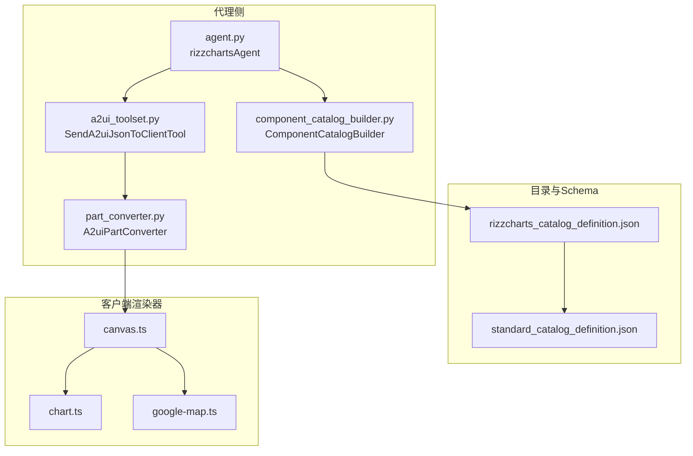
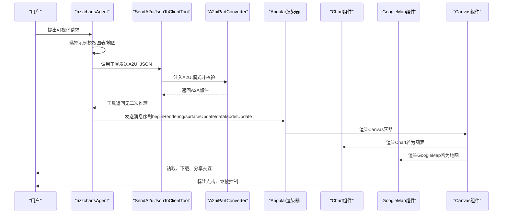
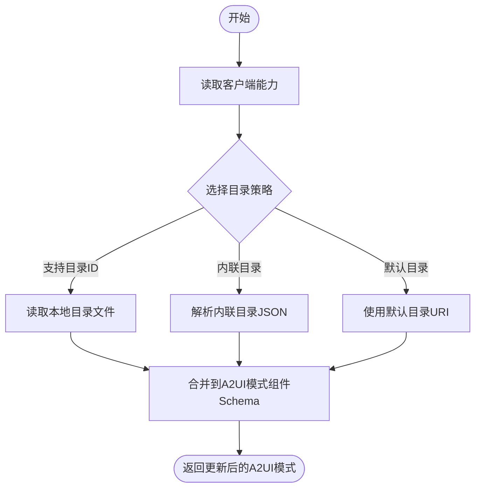
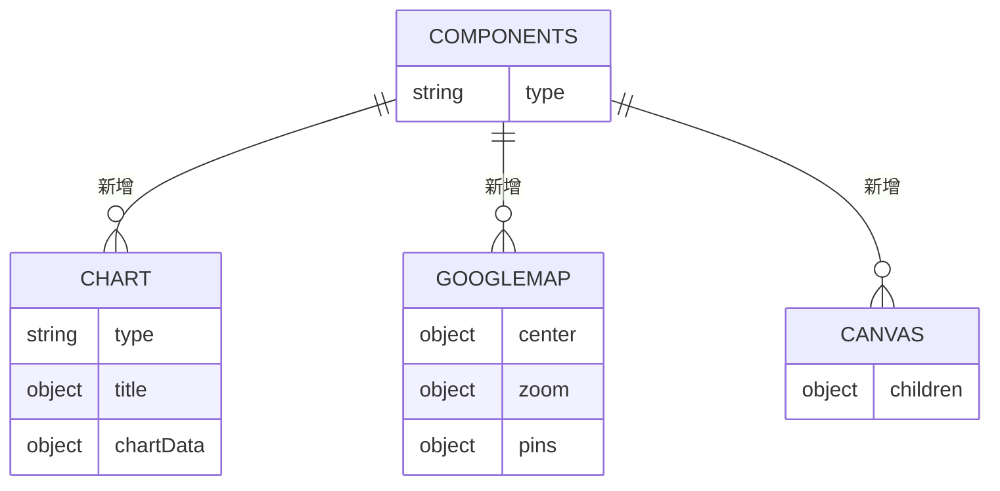
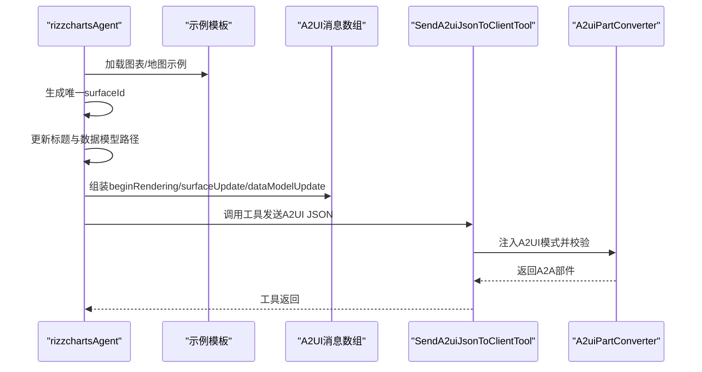
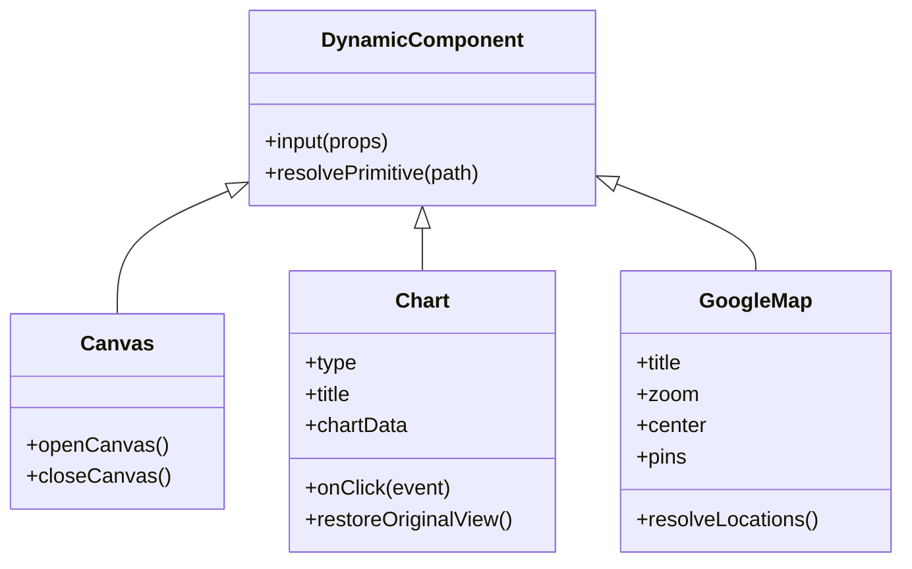
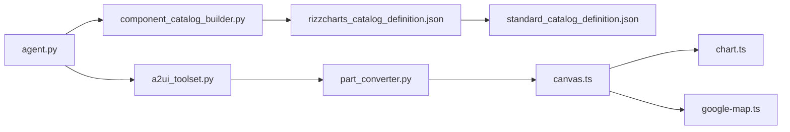

# RizzCharts可视化示例

<cite>
**本文引用的文件列表**
- [component_catalog_builder.py](file://samples/agent/adk/rizzcharts/component_catalog_builder.py)
- [rizzcharts_catalog_definition.json](file://samples/agent/adk/rizzcharts/rizzcharts_catalog_definition.json)
- [agent.py](file://samples/agent/adk/rizzcharts/agent.py)
- [chart.json（示例）](file://samples/agent/adk/rizzcharts/examples/rizzcharts_catalog/chart.json)
- [map.json（示例）](file://samples/agent/adk/rizzcharts/examples/rizzcharts_catalog/map.json)
- [a2ui_toolset.py](file://samples/agent/adk/rizzcharts/a2ui_toolset.py)
- [part_converter.py](file://samples/agent/adk/rizzcharts/part_converter.py)
- [chart.ts（Angular渲染器）](file://samples/client/angular/projects/rizzcharts/src/a2ui-catalog/chart.ts)
- [google-map.ts（Angular渲染器）](file://samples/client/angular/projects/rizzcharts/src/a2ui-catalog/google-map.ts)
- [canvas.ts（Angular渲染器）](file://samples/client/angular/projects/rizzcharts/src/a2ui-catalog/canvas.ts)
- [standard_catalog_definition.json](file://specification/0.8/json/standard_catalog_definition.json)
</cite>

## 目录
1. [简介](#简介)
2. [项目结构](#项目结构)
3. [核心组件](#核心组件)
4. [架构总览](#架构总览)
5. [详细组件分析](#详细组件分析)
6. [依赖关系分析](#依赖关系分析)
7. [性能考量](#性能考量)
8. [故障排查指南](#故障排查指南)
9. [结论](#结论)
10. [附录：最佳实践清单](#附录最佳实践清单)

## 简介
本文件聚焦于“rizzcharts”示例中的复杂数据可视化实现，系统性讲解以下关键点：
- 如何通过组件目录构建器定义包含自定义图表与地图组件的扩展目录，并与标准目录进行合并；
- 自定义目录描述文件的结构与语义，以及与标准目录的继承与覆盖机制；
- 代理如何生成包含动态图表的“surfaceUpdate”消息，涵盖数据映射、样式配置与交互事件绑定；
- 基于Angular渲染器的自定义组件开发、目录版本管理与高性能可视化渲染的最佳实践。

## 项目结构
该示例位于 samples/agent/adk/rizzcharts 目录下，围绕“可视化代理 + 标准/自定义组件目录 + 客户端渲染器”的闭环展开。核心文件与职责如下：
- 组件目录构建器：负责加载客户端能力、解析本地或内联目录、合并到A2UI模式；
- 自定义目录定义：声明Chart、GoogleMap等自定义组件的Schema；
- 代理：根据用户意图选择模板，构造A2UI JSON序列（含beginRendering、surfaceUpdate、dataModelUpdate），并通过工具发送给客户端；
- 示例模板：提供图表与地图的完整消息序列，演示数据模型路径绑定与布局组织；
- 工具集与转换器：在工具调用时注入A2UI模式、校验JSON并转为A2A协议部件；
- Angular渲染器：实现Chart、GoogleMap、Canvas等组件，完成数据绑定、样式与交互。

**图示来源**
- [agent.py](file://samples/agent/adk/rizzcharts/agent.py#L1-L153)
- [a2ui_toolset.py](file://samples/agent/adk/rizzcharts/a2ui_toolset.py#L1-L137)
- [part_converter.py](file://samples/agent/adk/rizzcharts/part_converter.py#L1-L82)
- [component_catalog_builder.py](file://samples/agent/adk/rizzcharts/component_catalog_builder.py#L1-L88)
- [rizzcharts_catalog_definition.json](file://samples/agent/adk/rizzcharts/rizzcharts_catalog_definition.json#L1-L125)
- [standard_catalog_definition.json](file://specification/0.8/json/standard_catalog_definition.json#L1-L200)
- [canvas.ts](file://samples/client/angular/projects/rizzcharts/src/a2ui-catalog/canvas.ts#L1-L61)
- [chart.ts](file://samples/client/angular/projects/rizzcharts/src/a2ui-catalog/chart.ts#L1-L273)
- [google-map.ts](file://samples/client/angular/projects/rizzcharts/src/a2ui-catalog/google-map.ts#L1-L231)

**章节来源**
- [agent.py](file://samples/agent/adk/rizzcharts/agent.py#L1-L153)
- [component_catalog_builder.py](file://samples/agent/adk/rizzcharts/component_catalog_builder.py#L1-L88)
- [rizzcharts_catalog_definition.json](file://samples/agent/adk/rizzcharts/rizzcharts_catalog_definition.json#L1-L125)
- [standard_catalog_definition.json](file://specification/0.8/json/standard_catalog_definition.json#L1-L200)

## 核心组件
- 组件目录构建器（ComponentCatalogBuilder）
  - 负责从客户端能力中选择目录URI或内联目录，读取本地JSON并将其合并入A2UI模式的组件Schema；
  - 支持缓存文件内容以提升性能；
  - 在加载过程中对输入参数进行严格校验，避免同时设置支持目录与内联目录。
- 自定义目录定义（rizzcharts_catalog_definition.json）
  - 通过$ref继承标准目录的组件集合；
  - 新增Canvas、Chart、GoogleMap三类自定义组件，定义其属性、必填项与数据模型路径绑定方式；
  - Chart支持饼图/甜甜圈图类型与钻取层级；GoogleMap支持中心点、缩放级别与多点标注。
- 代理（rizzchartsAgent）
  - 根据catalog_uri选择对应示例模板（图表/地图）；
  - 构造包含beginRendering、surfaceUpdate、dataModelUpdate的消息数组；
  - 使用工具集将A2UI JSON发送至客户端，确保消息符合A2UI模式。
- Angular渲染器组件
  - Canvas：打开并渲染指定surface的子组件树；
  - Chart：基于Chart.js实现饼图/甜甜圈图，支持点击钻取、百分比标签、下载/分享按钮；
  - GoogleMap：基于Angular Google Maps实现，支持动态标注、颜色配置与默认中心点。

**章节来源**
- [component_catalog_builder.py](file://samples/agent/adk/rizzcharts/component_catalog_builder.py#L1-L88)
- [rizzcharts_catalog_definition.json](file://samples/agent/adk/rizzcharts/rizzcharts_catalog_definition.json#L1-L125)
- [agent.py](file://samples/agent/adk/rizzcharts/agent.py#L1-L153)
- [chart.ts](file://samples/client/angular/projects/rizzcharts/src/a2ui-catalog/chart.ts#L1-L273)
- [google-map.ts](file://samples/client/angular/projects/rizzcharts/src/a2ui-catalog/google-map.ts#L1-L231)
- [canvas.ts](file://samples/client/angular/projects/rizzcharts/src/a2ui-catalog/canvas.ts#L1-L61)

## 架构总览
下面的序列图展示了从代理到客户端渲染器的完整流程，包括目录加载、消息构造与渲染执行。

**图示来源**
- [agent.py](file://samples/agent/adk/rizzcharts/agent.py#L1-L153)
- [a2ui_toolset.py](file://samples/agent/adk/rizzcharts/a2ui_toolset.py#L1-L137)
- [part_converter.py](file://samples/agent/adk/rizzcharts/part_converter.py#L1-L82)
- [chart.ts](file://samples/client/angular/projects/rizzcharts/src/a2ui-catalog/chart.ts#L1-L273)
- [google-map.ts](file://samples/client/angular/projects/rizzcharts/src/a2ui-catalog/google-map.ts#L1-L231)
- [canvas.ts](file://samples/client/angular/projects/rizzcharts/src/a2ui-catalog/canvas.ts#L1-L61)

## 详细组件分析

### 组件目录构建器（ComponentCatalogBuilder）
- 功能要点
  - 从客户端能力中解析支持的目录ID与内联目录；
  - 若存在匹配的本地目录URI，则读取并解析为JSON；
  - 将自定义目录合并到A2UI模式的组件Schema中，使渲染器可识别新增组件；
  - 对异常情况进行日志记录与错误抛出，便于定位问题。
- 关键流程
  - 选择目录：优先使用支持目录ID，其次尝试内联目录，否则回退默认目录；
  - 合并Schema：将目录JSON直接注入到A2UI模式的组件定义位置；
  - 缓存优化：对文件读取结果进行缓存，减少重复I/O。

**图示来源**
- [component_catalog_builder.py](file://samples/agent/adk/rizzcharts/component_catalog_builder.py#L1-L88)

**章节来源**
- [component_catalog_builder.py](file://samples/agent/adk/rizzcharts/component_catalog_builder.py#L1-L88)

### 自定义目录定义（rizzcharts_catalog_definition.json）
- 结构与继承
  - 通过$ref继承标准目录组件集合，保证兼容性；
  - 新增Canvas、Chart、GoogleMap三类组件，分别用于布局容器、数据可视化与地理信息展示。
- 数据模型绑定
  - 所有需要动态数据的字段均支持“literal/ path”两种形式，便于静态示例与动态数据切换；
  - Chart的chartData支持多层级钻取，GoogleMap的pins支持批量标注。
- 必填字段与约束
  - Chart要求type与chartData；GoogleMap要求center与zoom；
  - 每个组件的属性均明确必填项，降低运行期错误概率。

**图示来源**
- [rizzcharts_catalog_definition.json](file://samples/agent/adk/rizzcharts/rizzcharts_catalog_definition.json#L1-L125)
- [standard_catalog_definition.json](file://specification/0.8/json/standard_catalog_definition.json#L1-L200)

**章节来源**
- [rizzcharts_catalog_definition.json](file://samples/agent/adk/rizzcharts/rizzcharts_catalog_definition.json#L1-L125)
- [standard_catalog_definition.json](file://specification/0.8/json/standard_catalog_definition.json#L1-L200)

### 代理生成“surfaceUpdate”消息（rizzchartsAgent）
- 消息序列
  - beginRendering：声明surfaceId与根组件；
  - surfaceUpdate：创建Canvas容器与布局组件（如Column），并挂载Chart或GoogleMap；
  - dataModelUpdate：通过路径写入数据模型，驱动组件渲染与交互。
- 数据映射
  - Chart：title与chartData通过path绑定到数据模型；
  - GoogleMap：center、zoom、pins通过path绑定到数据模型；
  - 文本标题可通过修改Text组件的literalString实现动态化。
- 样式与交互
  - 渲染器侧通过组件模板与样式变量实现统一主题；
  - Chart支持点击钻取、百分比标签、下载/分享按钮；GoogleMap支持标注点击与缩放控制。
- 生成规则
  - 根据用户意图选择图表或地图模板；
  - 为每个surface生成唯一surfaceId；
  - 确保消息数组严格遵循A2UI规范并通过工具校验。

**图示来源**
- [agent.py](file://samples/agent/adk/rizzcharts/agent.py#L1-L153)
- [chart.json（示例）](file://samples/agent/adk/rizzcharts/examples/rizzcharts_catalog/chart.json#L1-L95)
- [map.json（示例）](file://samples/agent/adk/rizzcharts/examples/rizzcharts_catalog/map.json#L1-L106)
- [a2ui_toolset.py](file://samples/agent/adk/rizzcharts/a2ui_toolset.py#L1-L137)
- [part_converter.py](file://samples/agent/adk/rizzcharts/part_converter.py#L1-L82)

**章节来源**
- [agent.py](file://samples/agent/adk/rizzcharts/agent.py#L1-L153)
- [chart.json（示例）](file://samples/agent/adk/rizzcharts/examples/rizzcharts_catalog/chart.json#L1-L95)
- [map.json（示例）](file://samples/agent/adk/rizzcharts/examples/rizzcharts_catalog/map.json#L1-L106)
- [a2ui_toolset.py](file://samples/agent/adk/rizzcharts/a2ui_toolset.py#L1-L137)
- [part_converter.py](file://samples/agent/adk/rizzcharts/part_converter.py#L1-L82)

### Angular渲染器组件实现
- Canvas
  - 作为容器打开指定surface，渲染children中声明的组件树；
  - 通过服务与路由联动，确保渲染上下文正确。
- Chart
  - 解析数据模型路径，构建饼图/甜甜圈图数据集；
  - 支持点击图例与扇区钻取，显示百分比标签；
  - 提供下载与分享按钮，增强交互体验。
- GoogleMap
  - 解析中心点与缩放级别，支持默认中心；
  - 通过AdvancedMarker渲染带背景色、边框色、图标色的标注；
  - 限制最大标注数量，避免性能问题。

**图示来源**
- [canvas.ts](file://samples/client/angular/projects/rizzcharts/src/a2ui-catalog/canvas.ts#L1-L61)
- [chart.ts](file://samples/client/angular/projects/rizzcharts/src/a2ui-catalog/chart.ts#L1-L273)
- [google-map.ts](file://samples/client/angular/projects/rizzcharts/src/a2ui-catalog/google-map.ts#L1-L231)

**章节来源**
- [canvas.ts](file://samples/client/angular/projects/rizzcharts/src/a2ui-catalog/canvas.ts#L1-L61)
- [chart.ts](file://samples/client/angular/projects/rizzcharts/src/a2ui-catalog/chart.ts#L1-L273)
- [google-map.ts](file://samples/client/angular/projects/rizzcharts/src/a2ui-catalog/google-map.ts#L1-L231)

## 依赖关系分析
- 代理依赖工具集与转换器，确保A2UI JSON在进入客户端前被注入模式并校验；
- 目录构建器依赖标准目录定义，通过$ref实现继承与扩展；
- 渲染器组件依赖DynamicComponent基类与第三方图表/地图库，实现数据绑定与交互。

**图示来源**
- [agent.py](file://samples/agent/adk/rizzcharts/agent.py#L1-L153)
- [a2ui_toolset.py](file://samples/agent/adk/rizzcharts/a2ui_toolset.py#L1-L137)
- [part_converter.py](file://samples/agent/adk/rizzcharts/part_converter.py#L1-L82)
- [component_catalog_builder.py](file://samples/agent/adk/rizzcharts/component_catalog_builder.py#L1-L88)
- [rizzcharts_catalog_definition.json](file://samples/agent/adk/rizzcharts/rizzcharts_catalog_definition.json#L1-L125)
- [standard_catalog_definition.json](file://specification/0.8/json/standard_catalog_definition.json#L1-L200)
- [canvas.ts](file://samples/client/angular/projects/rizzcharts/src/a2ui-catalog/canvas.ts#L1-L61)
- [chart.ts](file://samples/client/angular/projects/rizzcharts/src/a2ui-catalog/chart.ts#L1-L273)
- [google-map.ts](file://samples/client/angular/projects/rizzcharts/src/a2ui-catalog/google-map.ts#L1-L231)

**章节来源**
- [agent.py](file://samples/agent/adk/rizzcharts/agent.py#L1-L153)
- [a2ui_toolset.py](file://samples/agent/adk/rizzcharts/a2ui_toolset.py#L1-L137)
- [part_converter.py](file://samples/agent/adk/rizzcharts/part_converter.py#L1-L82)
- [component_catalog_builder.py](file://samples/agent/adk/rizzcharts/component_catalog_builder.py#L1-L88)
- [rizzcharts_catalog_definition.json](file://samples/agent/adk/rizzcharts/rizzcharts_catalog_definition.json#L1-L125)
- [standard_catalog_definition.json](file://specification/0.8/json/standard_catalog_definition.json#L1-L200)
- [canvas.ts](file://samples/client/angular/projects/rizzcharts/src/a2ui-catalog/canvas.ts#L1-L61)
- [chart.ts](file://samples/client/angular/projects/rizzcharts/src/a2ui-catalog/chart.ts#L1-L273)
- [google-map.ts](file://samples/client/angular/projects/rizzcharts/src/a2ui-catalog/google-map.ts#L1-L231)

## 性能考量
- 文件I/O与缓存
  - 目录构建器对文件读取结果进行缓存，减少重复I/O开销；
  - 建议在生产环境保持目录文件稳定，避免频繁重载。
- 数据绑定与渲染
  - Chart组件对数据模型路径采用按需解析，避免一次性加载全部数据；
  - GoogleMap组件限制最大标注数量，防止大规模数据导致渲染卡顿。
- 模式注入与校验
  - 工具集在工具调用时注入A2UI模式并进行Schema校验，避免无效消息进入客户端；
  - 建议在代理侧提前对示例模板进行校验，减少运行期失败概率。

[本节为通用性能建议，不直接分析具体文件]

## 故障排查指南
- 目录加载失败
  - 检查客户端能力是否包含支持的目录ID或内联目录；
  - 确认本地目录URI映射正确且文件可读。
- A2UI模式不匹配
  - 确认自定义目录已成功合并到A2UI模式；
  - 校验组件Schema字段是否符合要求（如Chart的type与chartData）。
- 工具调用失败
  - 检查工具参数是否包含a2ui_json；
  - 查看工具返回的错误信息，定位Schema校验失败的具体字段。
- 渲染异常
  - 检查数据模型路径是否存在；
  - 确认Chart/Map组件的必填字段已正确赋值。

**章节来源**
- [component_catalog_builder.py](file://samples/agent/adk/rizzcharts/component_catalog_builder.py#L1-L88)
- [a2ui_toolset.py](file://samples/agent/adk/rizzcharts/a2ui_toolset.py#L1-L137)
- [part_converter.py](file://samples/agent/adk/rizzcharts/part_converter.py#L1-L82)
- [chart.ts](file://samples/client/angular/projects/rizzcharts/src/a2ui-catalog/chart.ts#L1-L273)
- [google-map.ts](file://samples/client/angular/projects/rizzcharts/src/a2ui-catalog/google-map.ts#L1-L231)

## 结论
本示例通过“自定义组件目录 + 代理消息构造 + 渲染器组件实现”的闭环，完整展示了复杂数据可视化的端到端流程。组件目录构建器与自定义目录定义确保了扩展性与兼容性；代理通过模板化与数据模型绑定实现了高复用与动态化；渲染器则提供了高性能、可交互的可视化体验。结合本文的最佳实践，可在实际项目中快速落地高质量的可视化方案。

[本节为总结性内容，不直接分析具体文件]

## 附录：最佳实践清单
- 自定义组件开发
  - 明确组件Schema与必填字段，优先支持“literal/path”双形态；
  - 在渲染器中实现数据边界检查与默认值处理，避免空数据导致崩溃；
  - 为交互事件提供清晰回调接口，保持与数据模型解耦。
- 目录版本管理
  - 使用$ref继承标准目录，仅新增必要字段，减少差异；
  - 通过本地URI映射与默认目录回退，兼顾灵活性与稳定性；
  - 对目录文件进行版本化管理，变更前先做向后兼容评估。
- 高性能可视化渲染
  - 控制数据规模与渲染粒度，如限制标注数量、分页加载；
  - 利用缓存与懒加载策略，减少重复计算与DOM操作；
  - 在代理侧预校验消息结构，降低客户端渲染失败率。

[本节为通用最佳实践，不直接分析具体文件]