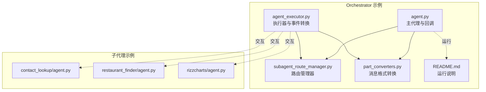
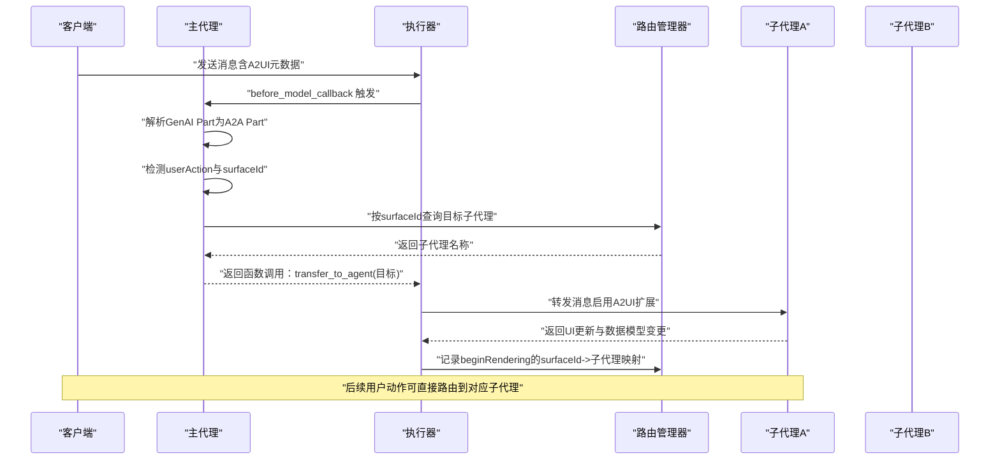
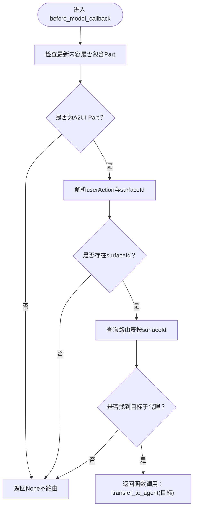
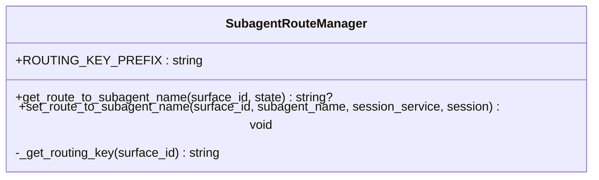
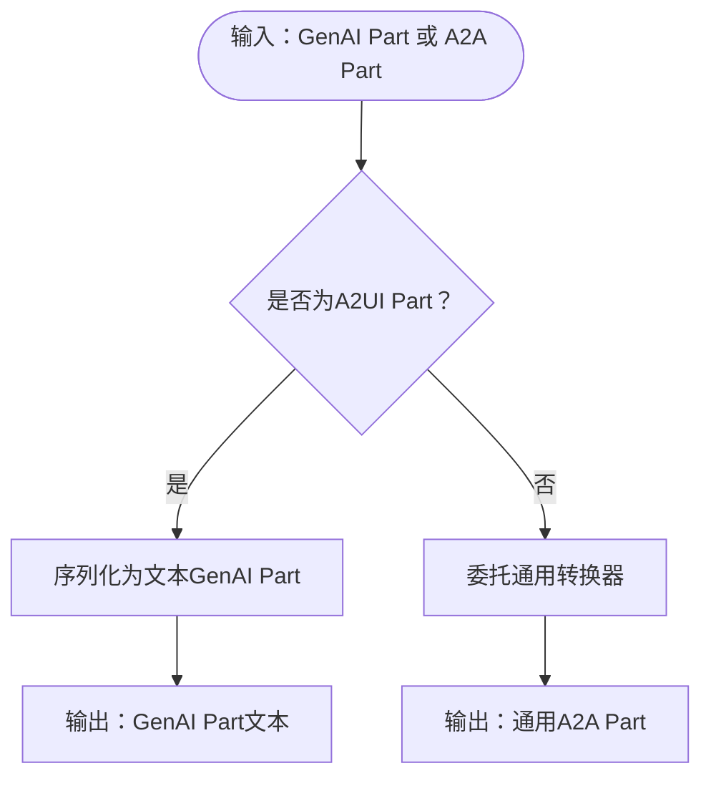
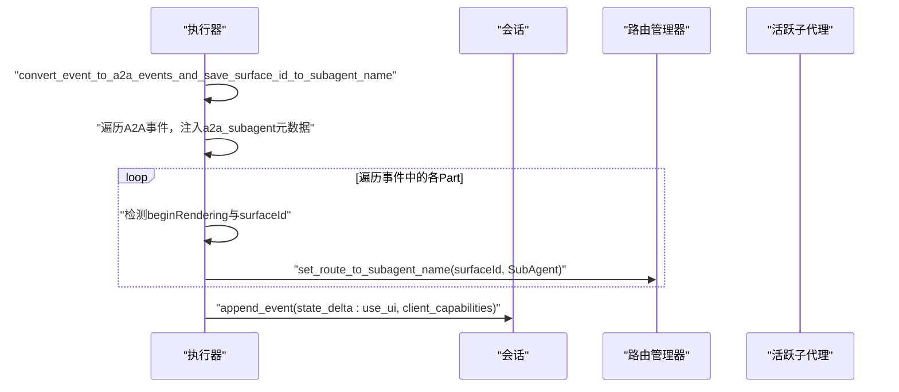
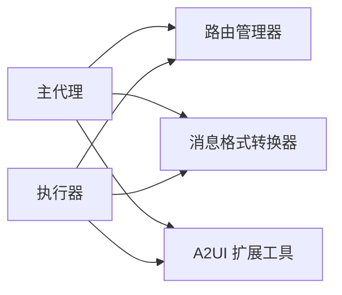

# 多代理协调示例

<cite>
**本文引用的文件**
- [agent.py](file://samples/agent/adk/orchestrator/agent.py)
- [subagent_route_manager.py](file://samples/agent/adk/orchestrator/subagent_route_manager.py)
- [part_converters.py](file://samples/agent/adk/orchestrator/part_converters.py)
- [agent_executor.py](file://samples/agent/adk/orchestrator/agent_executor.py)
- [README.md](file://samples/agent/adk/orchestrator/README.md)
- [contact_lookup/agent.py](file://samples/agent/adk/contact_lookup/agent.py)
- [restaurant_finder/agent.py](file://samples/agent/adk/restaurant_finder/agent.py)
- [rizzcharts/agent.py](file://samples/agent/adk/rizzcharts/agent.py)
- [a2ui_extension.py](file://a2a_agents/python/a2ui_extension/src/a2ui/a2ui_extension.py)
- [a2ui_protocol.md](file://specification/0.8/docs/a2ui_protocol.md)
- [renderer-development.md](file://docs/guides/renderer-development.md)
</cite>

## 目录
1. [简介](#简介)
2. [项目结构](#项目结构)
3. [核心组件](#核心组件)
4. [架构总览](#架构总览)
5. [组件详解](#组件详解)
6. [依赖关系分析](#依赖关系分析)
7. [性能与可扩展性](#性能与可扩展性)
8. [故障排查指南](#故障排查指南)
9. [结论](#结论)
10. [附录](#附录)

## 简介
本文件围绕 A2UI 的“多代理协调示例”进行深入剖析，重点说明主代理如何借助 A2UI 生成任务路由界面，并通过回调与事件机制协调多个子代理完成复杂任务。文档将详细解释以下要点：
- 主代理如何在请求前回调中识别 A2UI 用户动作并动态路由至目标子代理；
- 子代理路由管理器如何基于会话状态记录并查询 surfaceId 到子代理名称的映射；
- 消息格式转换器如何在 GenAI Part 与 A2A Part 之间进行双向转换，尤其是对 A2UI Part 的特殊处理；
- 主代理如何将子代理响应整合并更新到共享数据模型（通过事件与会话状态）；
- 代理间通信设计、状态同步机制与异常处理的最佳实践。

## 项目结构
该示例位于 samples/agent/adk/orchestrator 目录，包含主代理构建、子代理路由管理、消息格式转换与执行器等关键文件；同时配合多个子代理示例（联系人查找、餐厅搜索、可视化仪表盘）共同演示端到端流程。

图表来源
- [agent.py](file://samples/agent/adk/orchestrator/agent.py#L81-L189)
- [subagent_route_manager.py](file://samples/agent/adk/orchestrator/subagent_route_manager.py#L1-L64)
- [part_converters.py](file://samples/agent/adk/orchestrator/part_converters.py#L1-L51)
- [agent_executor.py](file://samples/agent/adk/orchestrator/agent_executor.py#L1-L162)
- [README.md](file://samples/agent/adk/orchestrator/README.md#L1-L65)
- [contact_lookup/agent.py](file://samples/agent/adk/contact_lookup/agent.py#L1-L293)
- [restaurant_finder/agent.py](file://samples/agent/adk/restaurant_finder/agent.py#L1-L304)
- [rizzcharts/agent.py](file://samples/agent/adk/rizzcharts/agent.py#L1-L153)

章节来源
- [agent.py](file://samples/agent/adk/orchestrator/agent.py#L81-L189)
- [agent_executor.py](file://samples/agent/adk/orchestrator/agent_executor.py#L1-L162)
- [README.md](file://samples/agent/adk/orchestrator/README.md#L1-L65)

## 核心组件
- 主代理与回调：负责在推理前识别用户动作并触发函数式转移，将请求定向给指定子代理。
- 子代理路由管理器：维护 surfaceId 到子代理名称的映射，写入会话事件以实现状态同步。
- 消息格式转换器：在 GenAI Part 与 A2A Part 之间进行双向转换，特别处理 A2UI Part。
- 执行器与事件转换：将底层事件转换为 A2A 事件，提取子代理卡片元数据，并在 UI 开始渲染时记录路由信息。

章节来源
- [agent.py](file://samples/agent/adk/orchestrator/agent.py#L81-L189)
- [subagent_route_manager.py](file://samples/agent/adk/orchestrator/subagent_route_manager.py#L1-L64)
- [part_converters.py](file://samples/agent/adk/orchestrator/part_converters.py#L1-L51)
- [agent_executor.py](file://samples/agent/adk/orchestrator/agent_executor.py#L1-L162)

## 架构总览
下图展示了从客户端发起请求到主代理识别用户动作、路由到子代理、再由子代理返回 UI 更新与数据模型变更的整体流程。

图表来源
- [agent.py](file://samples/agent/adk/orchestrator/agent.py#L81-L189)
- [agent_executor.py](file://samples/agent/adk/orchestrator/agent_executor.py#L1-L162)
- [subagent_route_manager.py](file://samples/agent/adk/orchestrator/subagent_route_manager.py#L1-L64)

## 组件详解

### 主代理与回调：动态路由用户动作
- 请求前回调：主代理在推理前回调中检查最新内容的最后一部分是否为 A2UI Part，并从中提取 userAction 与 surfaceId。
- 路由决策：通过路由管理器查询当前会话状态中该 surfaceId 对应的子代理名称，若存在则返回函数调用“transfer_to_agent”，将原始消息转交给目标子代理。
- 作用：避免每次请求都进行一次昂贵的 LLM 推理，而是优先通过已记录的映射进行快速路由。

图表来源
- [agent.py](file://samples/agent/adk/orchestrator/agent.py#L81-L116)

章节来源
- [agent.py](file://samples/agent/adk/orchestrator/agent.py#L81-L116)

### 子代理路由管理器：状态同步与映射维护
- 键空间约定：以固定前缀拼接 surfaceId 作为键，存储子代理名称。
- 查询：从会话 State 中读取对应键值，返回目标子代理名称。
- 设置：当 UI 开始渲染（beginRendering）时，将 surfaceId 与当前作者（即活跃子代理名）写入会话事件的 state_delta，从而实现跨轮次的状态同步。

图表来源
- [subagent_route_manager.py](file://samples/agent/adk/orchestrator/subagent_route_manager.py#L1-L64)

章节来源
- [subagent_route_manager.py](file://samples/agent/adk/orchestrator/subagent_route_manager.py#L1-L64)

### 消息格式转换器：A2UI Part 的双向转换
- GenAI Part -> A2A Part：当 A2A Part 本身已是 A2UI Part 时，将其序列化为文本形式的 GenAI Part；否则委托通用转换器。
- GenAI Part -> A2A Part：尝试从 GenAI Part 的文本解析出 A2A Part；若解析失败或非 A2UI，则回退到通用转换器。
- 作用：确保主代理与子代理之间的消息在 A2UI 语义上保持一致，同时兼容普通文本输入。

图表来源
- [part_converters.py](file://samples/agent/adk/orchestrator/part_converters.py#L1-L51)

章节来源
- [part_converters.py](file://samples/agent/adk/orchestrator/part_converters.py#L1-L51)

### 执行器与事件转换：UI 生命周期与元数据注入
- 事件转换：将底层事件转换为 A2A 事件，并在事件元数据中注入活跃子代理的 AgentCard（用于客户端渲染与能力声明）。
- UI 生命周期：当 A2A Part 含 beginRendering 且包含 surfaceId 时，异步设置该 surfaceId 对应的子代理名称，以便后续用户动作可直接路由。
- 会话初始化：在会话准备阶段激活 A2UI 扩展，向会话状态写入 use_ui 与 client_capabilities，确保远程子代理调用启用 A2UI 扩展并携带客户端能力信息。

图表来源
- [agent_executor.py](file://samples/agent/adk/orchestrator/agent_executor.py#L1-L162)
- [subagent_route_manager.py](file://samples/agent/adk/orchestrator/subagent_route_manager.py#L1-L64)

章节来源
- [agent_executor.py](file://samples/agent/adk/orchestrator/agent_executor.py#L1-L162)

### 子代理示例：UI 生成与数据模型更新
- 联系人查找：支持 UI 与文本两种模式，通过 A2UI Schema 校验 UI 输出，保证生成的 UI JSON 符合规范。
- 餐厅搜索：根据用户意图生成 UI，填充 dataModelUpdate.contents，支持预订与确认流程。
- 可视化仪表盘：根据 catalog_uri 选择模板，构造图表或地图 UI，并要求为每个请求生成新的 surfaceId。

章节来源
- [contact_lookup/agent.py](file://samples/agent/adk/contact_lookup/agent.py#L1-L293)
- [restaurant_finder/agent.py](file://samples/agent/adk/restaurant_finder/agent.py#L1-L304)
- [rizzcharts/agent.py](file://samples/agent/adk/rizzcharts/agent.py#L1-L153)

## 依赖关系分析
- 主代理依赖：
  - 路由管理器：用于查询/设置 surfaceId -> 子代理名称映射。
  - 消息格式转换器：用于在 A2UI Part 与通用 Part 之间转换。
  - A2UI 扩展工具：用于激活扩展与创建扩展元数据。
- 执行器依赖：
  - 事件转换器：将底层事件转换为 A2A 事件。
  - 路由管理器：在 UI 开始渲染时写入路由映射。
  - A2UI 扩展工具：在会话初始化时写入 use_ui 与 client_capabilities。

图表来源
- [agent.py](file://samples/agent/adk/orchestrator/agent.py#L81-L189)
- [agent_executor.py](file://samples/agent/adk/orchestrator/agent_executor.py#L1-L162)
- [subagent_route_manager.py](file://samples/agent/adk/orchestrator/subagent_route_manager.py#L1-L64)
- [part_converters.py](file://samples/agent/adk/orchestrator/part_converters.py#L1-L51)
- [a2ui_extension.py](file://a2a_agents/python/a2ui_extension/src/a2ui/a2ui_extension.py#L88-L117)

章节来源
- [agent.py](file://samples/agent/adk/orchestrator/agent.py#L81-L189)
- [agent_executor.py](file://samples/agent/adk/orchestrator/agent_executor.py#L1-L162)
- [subagent_route_manager.py](file://samples/agent/adk/orchestrator/subagent_route_manager.py#L1-L64)
- [part_converters.py](file://samples/agent/adk/orchestrator/part_converters.py#L1-L51)
- [a2ui_extension.py](file://a2a_agents/python/a2ui_extension/src/a2ui/a2ui_extension.py#L88-L117)

## 性能与可扩展性
- 减少 LLM 推理开销：通过 before_model_callback 仅在必要时进行推理，其余时间直接根据会话状态路由，提升吞吐量。
- 异步事件写入：在 UI 开始渲染时异步设置路由映射，避免阻塞主流程。
- 会话状态复用：通过 state_delta 写入 use_ui 与 client_capabilities，减少重复计算与网络往返。
- 可扩展子代理：主代理在构建时动态加载多个子代理卡片与描述，便于横向扩展更多专业子代理。

[本节为一般性建议，无需列出具体文件来源]

## 故障排查指南
- A2UI 扩展未激活
  - 现象：客户端无法接收 A2UI UI 更新或元数据缺失。
  - 排查：确认执行器在会话准备阶段已写入 use_ui 与 client_capabilities；检查请求头是否包含扩展 URI。
  - 参考路径
    - [agent_executor.py](file://samples/agent/adk/orchestrator/agent_executor.py#L135-L162)
    - [a2ui_extension.py](file://a2a_agents/python/a2ui_extension/src/a2ui/a2ui_extension.py#L88-L117)
- 路由映射为空
  - 现象：用户动作无法路由到子代理。
  - 排查：确认 UI 已发出 beginRendering 并触发 set_route_to_subagent_name；检查 surfaceId 是否一致。
  - 参考路径
    - [agent_executor.py](file://samples/agent/adk/orchestrator/agent_executor.py#L87-L118)
    - [subagent_route_manager.py](file://samples/agent/adk/orchestrator/subagent_route_manager.py#L34-L64)
- 消息格式转换异常
  - 现象：A2UI Part 解析失败或类型不匹配。
  - 排查：检查 GenAI Part 文本是否为合法 JSON；确认 is_a2ui_part 判断逻辑；必要时回退到通用转换器。
  - 参考路径
    - [part_converters.py](file://samples/agent/adk/orchestrator/part_converters.py#L1-L51)
- 子代理 UI 校验失败
  - 现象：子代理返回的 UI JSON 不符合 Schema。
  - 排查：检查 A2UI Schema 加载与校验逻辑；确保生成的 UI JSON 包含 beginRendering、surfaceUpdate、dataModelUpdate 三段消息且 surfaceId 一致。
  - 参考路径
    - [contact_lookup/agent.py](file://samples/agent/adk/contact_lookup/agent.py#L1-L293)
    - [restaurant_finder/agent.py](file://samples/agent/adk/restaurant_finder/agent.py#L1-L304)
    - [rizzcharts/agent.py](file://samples/agent/adk/rizzcharts/agent.py#L1-L153)

章节来源
- [agent_executor.py](file://samples/agent/adk/orchestrator/agent_executor.py#L87-L162)
- [subagent_route_manager.py](file://samples/agent/adk/orchestrator/subagent_route_manager.py#L1-L64)
- [part_converters.py](file://samples/agent/adk/orchestrator/part_converters.py#L1-L51)
- [contact_lookup/agent.py](file://samples/agent/adk/contact_lookup/agent.py#L1-L293)
- [restaurant_finder/agent.py](file://samples/agent/adk/restaurant_finder/agent.py#L1-L304)
- [rizzcharts/agent.py](file://samples/agent/adk/rizzcharts/agent.py#L1-L153)

## 结论
该示例通过“请求前回调 + 会话状态 + 事件转换”的组合，实现了主代理对多子代理的高效协调。A2UI 扩展贯穿于消息格式转换、UI 生命周期与元数据传递，确保 UI 生成与状态同步的一致性。通过路由管理器与事件转换器，系统在保证安全性的同时，提供了良好的可扩展性与可维护性。

[本节为总结性内容，无需列出具体文件来源]

## 附录

### A2UI 协议要点与客户端职责
- 客户端职责：上报 a2uiClientCapabilities；在 userAction 中携带 surfaceId 与上下文；在 UI 需要变更时通过 separate SSE 流接收 surfaceUpdate 与 dataModelUpdate。
- 参考路径
  - [a2ui_protocol.md](file://specification/0.8/docs/a2ui_protocol.md#L546-L615)
  - [renderer-development.md](file://docs/guides/renderer-development.md#L43-L58)

章节来源
- [a2ui_protocol.md](file://specification/0.8/docs/a2ui_protocol.md#L546-L615)
- [renderer-development.md](file://docs/guides/renderer-development.md#L43-L58)