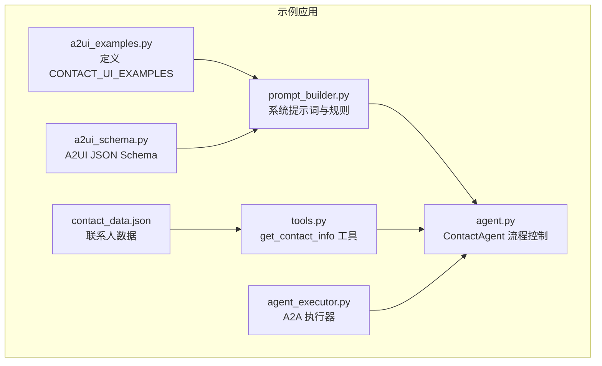
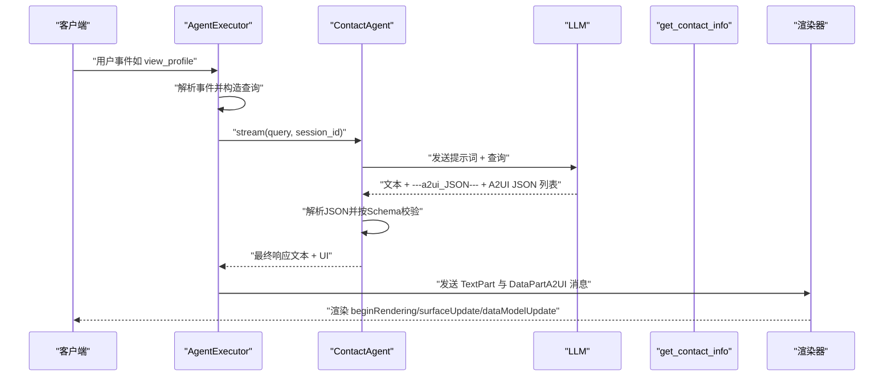
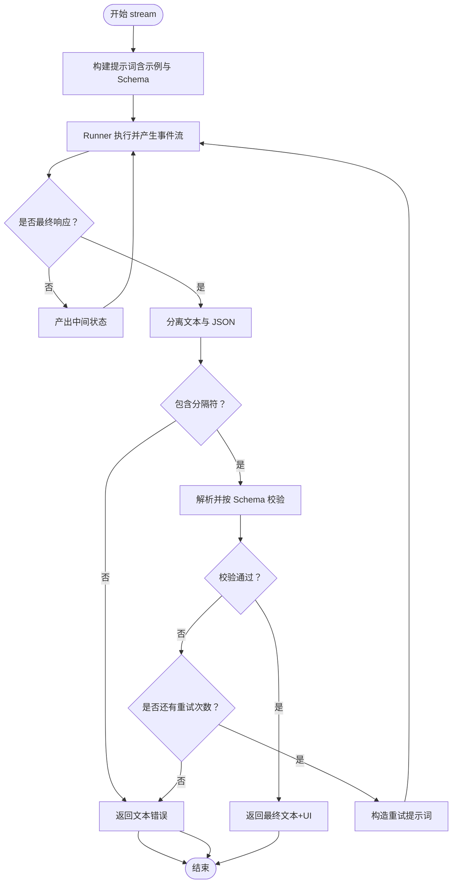
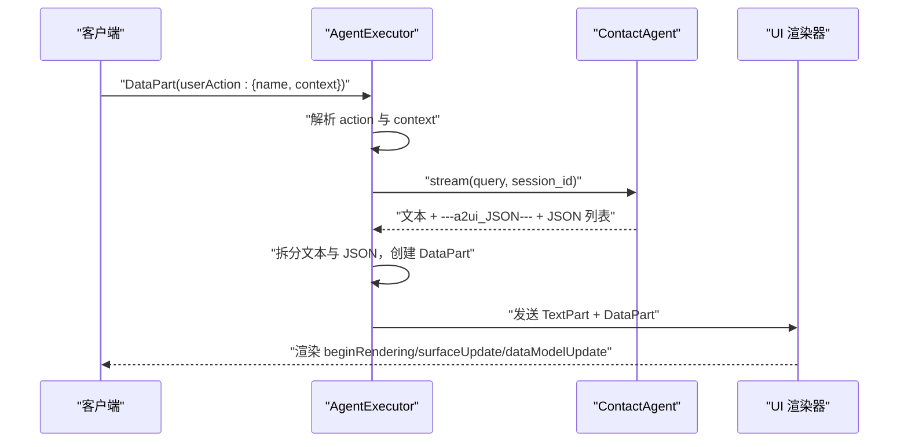
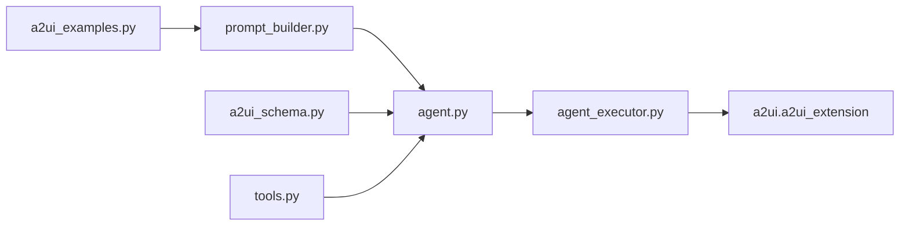

# 联系人查找示例

<cite>
**本文引用的文件列表**
- [a2ui_examples.py](file://samples/agent/adk/contact_lookup/a2ui_examples.py)
- [a2ui_schema.py](file://samples/agent/adk/contact_lookup/a2ui_schema.py)
- [prompt_builder.py](file://samples/agent/adk/contact_lookup/prompt_builder.py)
- [agent.py](file://samples/agent/adk/contact_lookup/agent.py)
- [agent_executor.py](file://samples/agent/adk/contact_lookup/agent_executor.py)
- [tools.py](file://samples/agent/adk/contact_lookup/tools.py)
- [contact_data.json](file://samples/agent/adk/contact_lookup/contact_data.json)
- [pyproject.toml](file://samples/agent/adk/contact_lookup/pyproject.toml)
- [README.md](file://samples/agent/adk/contact_lookup/README.md)
</cite>

## 目录
1. [简介](#简介)
2. [项目结构](#项目结构)
3. [核心组件](#核心组件)
4. [架构总览](#架构总览)
5. [详细组件分析](#详细组件分析)
6. [依赖关系分析](#依赖关系分析)
7. [性能考量](#性能考量)
8. [故障排查指南](#故障排查指南)
9. [结论](#结论)
10. [附录：运行步骤与最佳实践](#附录运行步骤与最佳实践)

## 简介
本文件深入解析 A2UI 协议在 contact_lookup 示例中的应用，重点说明如何通过 A2UI 动态生成“联系人搜索”表单与结果展示界面，并围绕以下关键点展开：
- 在 a2ui_examples.py 中，如何以 A2UI 消息序列定义组件树、数据绑定路径与样式；
- 如何在 agent.py 中响应用户输入，调用工具函数进行搜索，并通过 surfaceUpdate/dataModelUpdate 更新 UI；
- 如何在 agent_executor.py 中接收客户端事件，构造查询并分发最终的文本与 A2UI 数据部分；
- 在 tools.py 中实现基于本地数据的联系人检索逻辑；
- 提供完整运行步骤、核心代码片段路径、事件处理流程图与可复用的最佳实践。

## 项目结构
该示例位于 samples/agent/adk/contact_lookup，采用“按功能模块组织”的结构：
- a2ui_examples.py：包含 CONTACT_UI_EXAMPLES 常量，内含多套 A2UI 消息序列（联系人列表、联系人卡片、模态确认等），用于演示组件树与数据模型的构建。
- a2ui_schema.py：定义 A2UI 消息的 JSON Schema，确保 LLM 输出的 UI 定义符合协议规范。
- prompt_builder.py：封装系统提示词，指导 LLM 生成合法的 A2UI JSON 列表，并注入示例与 Schema。
- agent.py：ContactAgent 类负责构建 LLM Agent、执行流式推理、对 UI 输出进行二次校验与重试。
- agent_executor.py：A2A 服务器侧执行器，解析客户端事件、构造查询、拆分文本与 UI 部分并回传给客户端。
- tools.py：工具函数 get_contact_info，从本地 contact_data.json 过滤匹配联系人，支持名称与部门过滤。
- contact_data.json：示例联系人数据源。
- pyproject.toml/README.md：项目依赖与运行说明。

图表来源
- [a2ui_examples.py](file://samples/agent/adk/contact_lookup/a2ui_examples.py#L1-L163)
- [a2ui_schema.py](file://samples/agent/adk/contact_lookup/a2ui_schema.py#L1-L793)
- [prompt_builder.py](file://samples/agent/adk/contact_lookup/prompt_builder.py#L1-L119)
- [agent.py](file://samples/agent/adk/contact_lookup/agent.py#L1-L293)
- [agent_executor.py](file://samples/agent/adk/contact_lookup/agent_executor.py#L1-L212)
- [tools.py](file://samples/agent/adk/contact_lookup/tools.py#L1-L69)
- [contact_data.json](file://samples/agent/adk/contact_lookup/contact_data.json#L1-L38)

章节来源
- [a2ui_examples.py](file://samples/agent/adk/contact_lookup/a2ui_examples.py#L1-L163)
- [a2ui_schema.py](file://samples/agent/adk/contact_lookup/a2ui_schema.py#L1-L793)
- [prompt_builder.py](file://samples/agent/adk/contact_lookup/prompt_builder.py#L1-L119)
- [agent.py](file://samples/agent/adk/contact_lookup/agent.py#L1-L293)
- [agent_executor.py](file://samples/agent/adk/contact_lookup/agent_executor.py#L1-L212)
- [tools.py](file://samples/agent/adk/contact_lookup/tools.py#L1-L69)
- [contact_data.json](file://samples/agent/adk/contact_lookup/contact_data.json#L1-L38)
- [pyproject.toml](file://samples/agent/adk/contact_lookup/pyproject.toml#L1-L27)
- [README.md](file://samples/agent/adk/contact_lookup/README.md#L1-L40)

## 核心组件
- A2UI 消息序列与组件树
  - a2ui_examples.py 中的 CONTACT_UI_EXAMPLES 定义了三类典型 UI 场景：联系人列表、联系人卡片、动作确认模态。每条消息包含 beginRendering/surfaceUpdate/dataModelUpdate/deleteSurface 等阶段，通过组件树描述布局、样式与交互。
  - 关键点：组件树以“根组件 + 子组件”形式组织；Row/Column/List 支持 explicitList 或 template 两种子节点定义；Button 的 action 字段携带上下文键值，用于后续事件处理。
- A2UI JSON Schema
  - a2ui_schema.py 提供严格的 JSON Schema，约束每个 A2UI 消息必须包含且仅包含一个动作字段（beginRendering/surfaceUpdate/dataModelUpdate/deleteSurface），并对各组件属性进行类型与枚举校验。
- 系统提示词与模板
  - prompt_builder.py 将示例与 Schema 注入到提示词中，要求 LLM 输出“文本 + 分隔符 + A2UI JSON 列表”，并遵循模板规则（单个联系人用卡片模板，多个联系人用列表模板，空结果返回空列表）。
- Agent 推理与校验
  - agent.py 构建 LlmAgent 并注册 get_contact_info 工具；在流式输出中，若启用 UI，则对 LLM 返回的 JSON 进行解析与 Schema 校验，失败则重试；成功后将文本与 UI 分离并回传。
- A2A 执行器与事件处理
  - agent_executor.py 解析客户端事件（如 view_profile/send_email 等），根据事件名构造查询语句，驱动 ContactAgent 执行；最终将文本与 A2UI 数据部分合并为消息回传。
- 工具函数与数据源
  - tools.py 读取 contact_data.json，按名称与部门进行过滤，支持从 ToolContext 获取 base_url 并替换静态资源地址，保证跨环境一致性。

章节来源
- [a2ui_examples.py](file://samples/agent/adk/contact_lookup/a2ui_examples.py#L1-L163)
- [a2ui_schema.py](file://samples/agent/adk/contact_lookup/a2ui_schema.py#L1-L793)
- [prompt_builder.py](file://samples/agent/adk/contact_lookup/prompt_builder.py#L1-L119)
- [agent.py](file://samples/agent/adk/contact_lookup/agent.py#L1-L293)
- [agent_executor.py](file://samples/agent/adk/contact_lookup/agent_executor.py#L1-L212)
- [tools.py](file://samples/agent/adk/contact_lookup/tools.py#L1-L69)
- [contact_data.json](file://samples/agent/adk/contact_lookup/contact_data.json#L1-L38)

## 架构总览
下图展示了从客户端事件到 UI 渲染的整体流程，涵盖提示词构造、工具调用、消息校验与回传。

图表来源
- [agent_executor.py](file://samples/agent/adk/contact_lookup/agent_executor.py#L1-L212)
- [agent.py](file://samples/agent/adk/contact_lookup/agent.py#L1-L293)
- [prompt_builder.py](file://samples/agent/adk/contact_lookup/prompt_builder.py#L1-L119)
- [tools.py](file://samples/agent/adk/contact_lookup/tools.py#L1-L69)

## 详细组件分析

### 组件树与数据绑定路径设计（a2ui_examples.py）
- 组件树构建
  - 联系人列表场景通过 Column/Row/List/Card 等容器与文本、图片、按钮组合，形成“头像 + 名称/标题 + 操作按钮”的卡片布局；List 的 children 使用 template 指向数据模型中的 contacts 列表，实现动态渲染。
  - 联系人卡片场景通过 Image/Text/Icon/Row/Column/Divider/Button 等组件，构建“头像 + 描述 + 信息行 + 操作按钮 + 链接”的完整视图。
  - 动作确认场景通过 Modal 包裹 Column，内部包含标题、消息与确认按钮，使用 dataModelUpdate 动态填充标题与消息内容。
- 数据绑定路径
  - 文本与图片等组件的 text/url 属性可通过 path 引用数据模型中的字段（例如 "/contacts/0/name"）。dataModelUpdate 的 contents 以键值对形式写入数据模型，供组件树按路径读取。
  - Button 的 action.context 可携带上下文键值（如 contactName、department），在客户端事件中被提取并拼装为查询语句。
- 样式与主题
  - beginRendering 支持 styles.primaryColor 与 styles.font，便于统一主题风格。

章节来源
- [a2ui_examples.py](file://samples/agent/adk/contact_lookup/a2ui_examples.py#L1-L163)

### A2UI JSON Schema（a2ui_schema.py）
- 核心约束
  - 每条消息必须包含且仅包含一个动作字段：beginRendering/surfaceUpdate/dataModelUpdate/deleteSurface。
  - surfaceUpdate 必须包含 surfaceId 与 components 数组；components 中每个组件需包含 id 与 component（且 component 仅包含一种组件类型）。
  - 各组件属性（如 Button.action、Text.text、Image.url 等）均有限定的类型与枚举值，确保渲染端可安全消费。
- 验证策略
  - agent.py 在收到 LLM 输出后，先尝试解析 JSON，再使用 jsonschema.validate 对整个数组进行校验，失败即触发重试或降级为文本响应。

章节来源
- [a2ui_schema.py](file://samples/agent/adk/contact_lookup/a2ui_schema.py#L1-L793)
- [agent.py](file://samples/agent/adk/contact_lookup/agent.py#L1-L293)

### 系统提示词与模板（prompt_builder.py）
- 规则要点
  - 输出格式：文本 + 分隔符 + A2UI JSON 列表；JSON 必须通过 Schema 校验。
  - 模板选择：单个联系人用 CONTACT_CARD_EXAMPLE；多个联系人用 CONTACT_LIST_EXAMPLE；无结果返回空列表。
  - 行为约定：主操作按钮应设置 primary=true；动作场景使用 ACTION_CONFIRMATION/FOLLOW_SUCCESS 等模板。
- 与示例与 Schema 的集成
  - get_ui_prompt 直接注入 CONTACT_UI_EXAMPLES 与 A2UI_SCHEMA，避免格式化破坏 JSON 结构。

章节来源
- [prompt_builder.py](file://samples/agent/adk/contact_lookup/prompt_builder.py#L1-L119)
- [a2ui_examples.py](file://samples/agent/adk/contact_lookup/a2ui_examples.py#L1-L163)
- [a2ui_schema.py](file://samples/agent/adk/contact_lookup/a2ui_schema.py#L1-L793)

### Agent 推理与 UI 校验（agent.py）
- 组件树
  - ContactAgent 负责构建 LlmAgent，注册 get_contact_info 工具，管理 Runner 会话与内存服务。
  - 初始化时加载 A2UI_SCHEMA 并包装为数组模式，以便校验 LLM 返回的 JSON 列表。
- 流式处理与重试
  - stream 中对 Runner 事件进行迭代，非最终响应时持续产出中间状态；最终响应后进行 UI 校验：
    - 若未启用 UI 或 Schema 加载失败，直接返回文本错误；
    - 若未找到分隔符或 JSON 为空，按“无结果”处理；
    - 否则解析 JSON 并使用 jsonschema.validate 校验；失败则重试，最多两次；
    - 成功则返回最终文本+UI 的组合。
- 错误处理
  - 对 JSON 解析异常、Schema 校验异常与空响应进行日志记录与降级处理。

图表来源
- [agent.py](file://samples/agent/adk/contact_lookup/agent.py#L1-L293)

章节来源
- [agent.py](file://samples/agent/adk/contact_lookup/agent.py#L1-L293)

### A2A 执行器与事件处理（agent_executor.py）
- 事件解析
  - 从请求上下文中识别 A2UI 扩展是否激活；若激活则使用 UI Agent，否则使用文本 Agent。
  - 解析 DataPart 中的 userAction 字段，提取 action 名称与 context 上下文。
- 查询构造
  - 根据 action 名称映射为特定查询前缀（如 WHO_IS、USER_WANTS_TO_EMAIL 等），并将 contactName、department、email 等上下文注入。
- 响应组装
  - 将文本与 A2UI JSON 分离，分别封装为 TextPart 与 DataPart（通过 create_a2ui_part），并设置任务状态（如 input_required/completed）。

图表来源
- [agent_executor.py](file://samples/agent/adk/contact_lookup/agent_executor.py#L1-L212)
- [agent.py](file://samples/agent/adk/contact_lookup/agent.py#L1-L293)

章节来源
- [agent_executor.py](file://samples/agent/adk/contact_lookup/agent_executor.py#L1-L212)

### 工具函数与数据源（tools.py、contact_data.json）
- 工具函数
  - get_contact_info 从 contact_data.json 读取全部联系人，按 name 与 department（可选）过滤，返回 JSON 字符串；支持从 ToolContext 读取 base_url 并替换静态资源地址，保证跨环境可用。
- 数据源
  - contact_data.json 包含若干联系人对象，字段覆盖姓名、职位、部门、邮箱、电话、日历状态与头像 URL。

章节来源
- [tools.py](file://samples/agent/adk/contact_lookup/tools.py#L1-L69)
- [contact_data.json](file://samples/agent/adk/contact_lookup/contact_data.json#L1-L38)

## 依赖关系分析
- 内部依赖
  - agent.py 依赖 prompt_builder.py（系统提示词）、a2ui_schema.py（Schema 校验）、tools.py（工具函数）。
  - agent_executor.py 依赖 agent.py（ContactAgent）、a2ui.a2ui_extension（A2UI 扩展激活与 DataPart 创建）。
  - prompt_builder.py 依赖 a2ui_examples.py（示例模板）与 a2ui_schema.py（Schema）。
- 外部依赖
  - pyproject.toml 明确列出 a2a-sdk、google-adk、google-genai、jsonschema、litellm 等依赖，确保运行环境具备必要的 SDK 与 LLM 能力。

图表来源
- [agent.py](file://samples/agent/adk/contact_lookup/agent.py#L1-L293)
- [agent_executor.py](file://samples/agent/adk/contact_lookup/agent_executor.py#L1-L212)
- [prompt_builder.py](file://samples/agent/adk/contact_lookup/prompt_builder.py#L1-L119)
- [a2ui_schema.py](file://samples/agent/adk/contact_lookup/a2ui_schema.py#L1-L793)
- [a2ui_examples.py](file://samples/agent/adk/contact_lookup/a2ui_examples.py#L1-L163)
- [tools.py](file://samples/agent/adk/contact_lookup/tools.py#L1-L69)

章节来源
- [pyproject.toml](file://samples/agent/adk/contact_lookup/pyproject.toml#L1-L27)

## 性能考量
- LLM 输出校验与重试
  - 对于 UI 场景，每次最终响应都会进行 JSON 解析与 Schema 校验，失败将触发重试，可能增加往返时间。建议在生产中合理设置超时与最大重试次数。
- 数据模型更新
  - dataModelUpdate 的 contents 以键值对形式写入，建议尽量减少不必要的大对象更新，优先增量更新。
- 组件树复杂度
  - List/Row/Column 的嵌套深度与 children 数量直接影响渲染成本。建议在模板中控制组件数量与层级，避免过度复杂化。

## 故障排查指南
- UI 校验失败
  - 现象：Agent 返回文本错误或触发重试。
  - 排查：检查 LLM 输出是否包含分隔符、JSON 是否可解析、是否满足 A2UI Schema；查看 agent.py 中的日志与异常分支。
- 空结果
  - 现象：返回空列表或“未找到”文本。
  - 排查：确认 tools.py 的过滤条件（名称/部门）是否与 contact_data.json 中的数据一致。
- 事件未生效
  - 现象：客户端点击按钮无响应。
  - 排查：确认 agent_executor.py 是否正确解析 userAction 的 name 与 context；检查 Button.action.name 与 action 名称是否一致。

章节来源
- [agent.py](file://samples/agent/adk/contact_lookup/agent.py#L1-L293)
- [agent_executor.py](file://samples/agent/adk/contact_lookup/agent_executor.py#L1-L212)
- [tools.py](file://samples/agent/adk/contact_lookup/tools.py#L1-L69)

## 结论
本示例完整展示了如何利用 A2UI 协议在 LLM 驱动的 Agent 中动态生成与更新 UI：通过示例模板与 Schema 约束确保输出合法性，借助工具函数实现数据检索，结合 A2A 执行器解析客户端事件并回传文本与 UI 数据。该模式可广泛复用于需要“富界面 + 智能对话”的应用场景。

## 附录：运行步骤与最佳实践

### 运行步骤
- 准备环境
  - 安装依赖：参考 pyproject.toml 中的依赖声明。
  - 设置环境变量：在 .env 中配置 LLM API Key（如 GEMINI_API_KEY）。
- 启动服务
  - 在 samples/agent/adk/contact_lookup 目录下运行入口脚本（README.md 提供 uv run . 的启动方式）。
- 交互流程
  - 客户端发送用户事件（如 view_profile/send_email 等），AgentExecutor 解析后构造查询，ContactAgent 调用工具函数检索联系人，最终返回文本与 A2UI JSON 列表，由渲染器按 beginRendering/surfaceUpdate/dataModelUpdate 顺序渲染。

章节来源
- [README.md](file://samples/agent/adk/contact_lookup/README.md#L1-L40)
- [pyproject.toml](file://samples/agent/adk/contact_lookup/pyproject.toml#L1-L27)

### 最佳实践
- 输出格式与校验
  - 固定使用“文本 + 分隔符 + A2UI JSON 列表”的格式；在 Agent 层对 JSON 进行严格 Schema 校验，失败自动重试。
- 组件树设计
  - 使用 explicitList 与 template 组合表达固定布局与动态列表；Button 的 action.context 仅传递必要上下文，避免冗余。
- 数据模型更新
  - dataModelUpdate 的 contents 采用键值对结构，按需增量更新；避免一次性替换整棵数据树。
- 事件命名与路由
  - 统一 action.name 命名规范，确保 AgentExecutor 能准确映射到对应查询前缀；在模板中明确动作后的 UI 切换（如模态确认、成功提示卡）。
- 安全与健壮性
  - 对外部输入（包括联系人数据与客户端事件）进行最小信任原则处理；对 JSON 解析与 Schema 校验失败进行降级与日志记录。