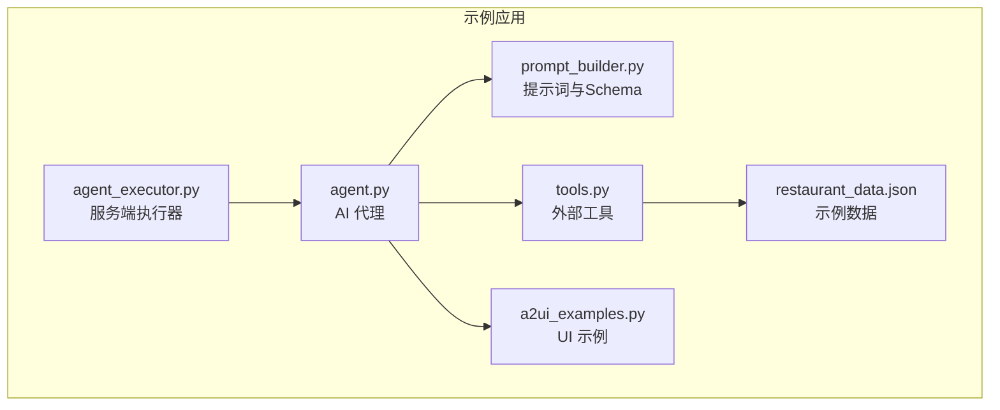
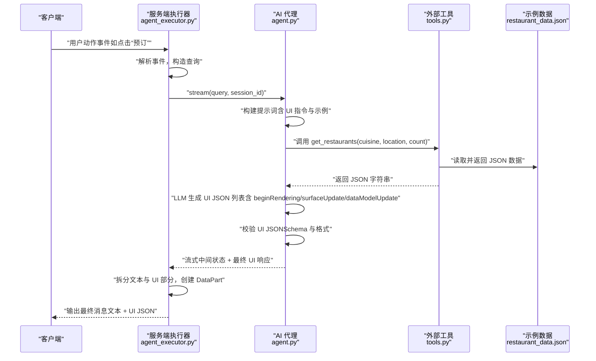
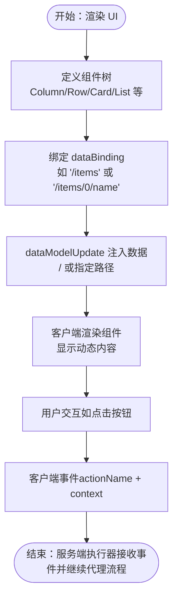
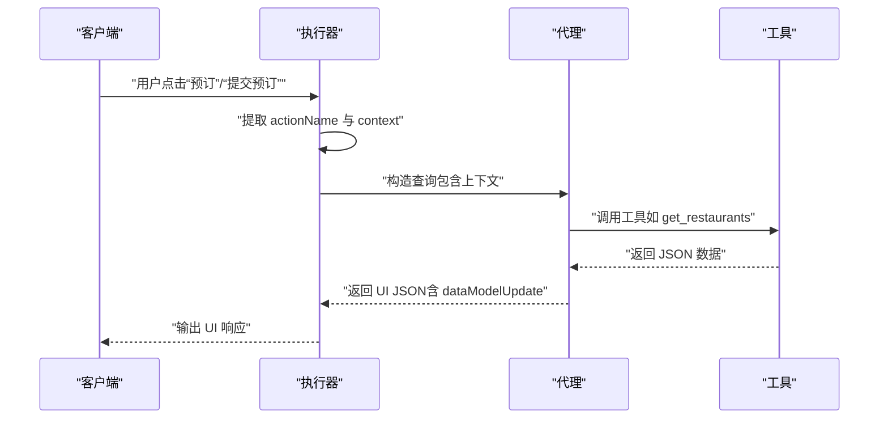
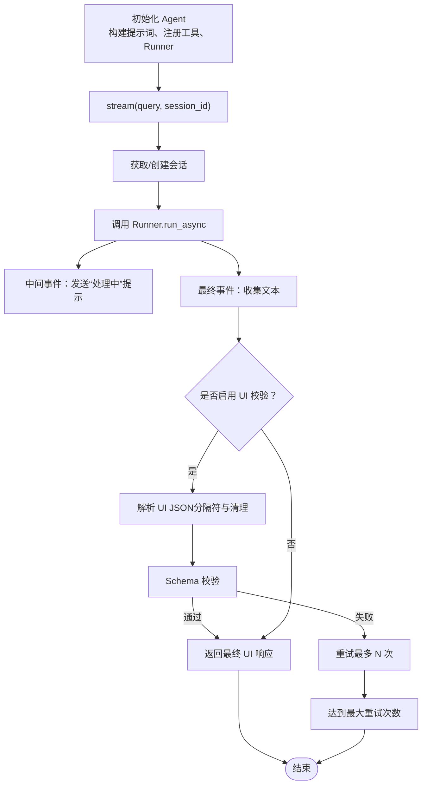
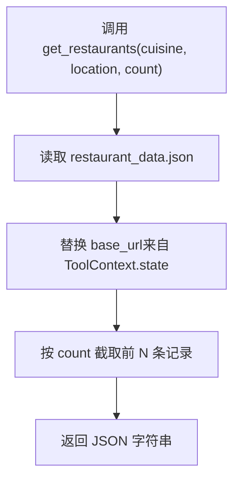
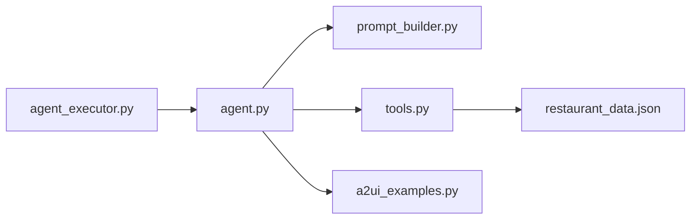

# 餐厅查找示例

<cite>
**本文引用的文件**
- [a2ui_examples.py](file://samples/agent/adk/restaurant_finder/a2ui_examples.py)
- [agent.py](file://samples/agent/adk/restaurant_finder/agent.py)
- [agent_executor.py](file://samples/agent/adk/restaurant_finder/agent_executor.py)
- [tools.py](file://samples/agent/adk/restaurant_finder/tools.py)
- [prompt_builder.py](file://samples/agent/adk/restaurant_finder/prompt_builder.py)
- [restaurant_data.json](file://samples/agent/adk/restaurant_finder/restaurant_data.json)
</cite>

## 目录
1. [简介](#简介)
2. [项目结构](#项目结构)
3. [核心组件](#核心组件)
4. [架构总览](#架构总览)
5. [详细组件分析](#详细组件分析)
6. [依赖关系分析](#依赖关系分析)
7. [性能考虑](#性能考虑)
8. [故障排查指南](#故障排查指南)
9. [结论](#结论)
10. [附录](#附录)

## 简介
本示例展示了如何使用 AI 代理结合外部工具调用与 A2UI 动态生成 UI，实现“餐厅搜索与预订”全流程。用户在客户端发起查询后，代理根据意图选择合适的 UI 模板（单列列表、两列列表、预订表单、确认页），并通过 dataModelUpdate 将数据模型注入到 UI 中；当用户在 UI 上填写或点击时，客户端事件被转换为文本查询，再次进入代理流程，最终完成预订确认。

## 项目结构
该示例位于 samples/agent/adk/restaurant_finder 目录下，包含以下关键文件：
- a2ui_examples.py：定义了 A2UI 的 UI 示例（列表卡片、预订表单、确认页等）
- agent.py：AI 代理实现，负责构建提示词、调用工具、校验 UI 输出、流式返回
- agent_executor.py：服务端执行器，解析客户端事件、组装查询、分发任务、输出最终响应
- tools.py：外部工具实现，按条件读取本地数据并返回 JSON
- prompt_builder.py：A2UI Schema 定义与 UI 提示词构建
- restaurant_data.json：示例餐厅数据

图表来源
- [agent_executor.py](file://samples/agent/adk/restaurant_finder/agent_executor.py#L41-L193)
- [agent.py](file://samples/agent/adk/restaurant_finder/agent.py#L94-L112)
- [prompt_builder.py](file://samples/agent/adk/restaurant_finder/prompt_builder.py#L1-L120)
- [tools.py](file://samples/agent/adk/restaurant_finder/tools.py#L24-L56)
- [a2ui_examples.py](file://samples/agent/adk/restaurant_finder/a2ui_examples.py#L1-L187)
- [restaurant_data.json](file://samples/agent/adk/restaurant_finder/restaurant_data.json#L1-L66)

章节来源
- [agent_executor.py](file://samples/agent/adk/restaurant_finder/agent_executor.py#L41-L193)
- [agent.py](file://samples/agent/adk/restaurant_finder/agent.py#L94-L112)
- [prompt_builder.py](file://samples/agent/adk/restaurant_finder/prompt_builder.py#L1-L120)
- [tools.py](file://samples/agent/adk/restaurant_finder/tools.py#L24-L56)
- [a2ui_examples.py](file://samples/agent/adk/restaurant_finder/a2ui_examples.py#L1-L187)
- [restaurant_data.json](file://samples/agent/adk/restaurant_finder/restaurant_data.json#L1-L66)

## 核心组件
- AI 代理（RestaurantAgent）：负责构建提示词、调用工具、校验 UI 输出、流式返回内容
- 服务端执行器（RestaurantAgentExecutor）：解析客户端事件、组装查询、驱动代理流、输出最终响应
- 外部工具（get_restaurants）：按条件读取本地 JSON 数据并返回
- UI 示例（a2ui_examples）：定义列表卡片、预订表单、确认页等 UI 结构与 dataModel 绑定
- 提示词与 Schema（prompt_builder）：定义 A2UI Schema、UI 规则与示例

章节来源
- [agent.py](file://samples/agent/adk/restaurant_finder/agent.py#L56-L113)
- [agent_executor.py](file://samples/agent/adk/restaurant_finder/agent_executor.py#L41-L193)
- [tools.py](file://samples/agent/adk/restaurant_finder/tools.py#L24-L56)
- [a2ui_examples.py](file://samples/agent/adk/restaurant_finder/a2ui_examples.py#L1-L187)
- [prompt_builder.py](file://samples/agent/adk/restaurant_finder/prompt_builder.py#L1-L120)

## 架构总览
下面的序列图展示了从客户端事件到代理响应的完整流程，以及 UI 渲染与数据模型更新的关键步骤。

图表来源
- [agent_executor.py](file://samples/agent/adk/restaurant_finder/agent_executor.py#L92-L171)
- [agent.py](file://samples/agent/adk/restaurant_finder/agent.py#L114-L304)
- [tools.py](file://samples/agent/adk/restaurant_finder/tools.py#L24-L56)
- [restaurant_data.json](file://samples/agent/adk/restaurant_finder/restaurant_data.json#L1-L66)

## 详细组件分析

### 表单组件与 dataModel 绑定机制
- UI 示例定义了多种组件树，如 Column、Row、Card、List、Text、Image、TextField、DateTimeInput、Button 等，并通过 dataBinding 将组件与 dataModel 路径关联
- Button 的 action.context 可携带上下文键值对，这些键值对在客户端事件中被传递给服务端执行器
- dataModelUpdate 用于一次性填充整个数据模型或指定路径下的内容，支持字符串、数字、布尔、映射等多种类型

图表来源
- [a2ui_examples.py](file://samples/agent/adk/restaurant_finder/a2ui_examples.py#L123-L154)
- [a2ui_examples.py](file://samples/agent/adk/restaurant_finder/a2ui_examples.py#L156-L186)
- [a2ui_examples.py](file://samples/agent/adk/restaurant_finder/a2ui_examples.py#L1-L122)

章节来源
- [a2ui_examples.py](file://samples/agent/adk/restaurant_finder/a2ui_examples.py#L1-L187)

### 用户提交表单后的数据回传与工具查询触发
- 当用户点击“预订”或“提交预订”按钮时，客户端会发送包含 actionName 与 context 的用户动作事件
- 服务端执行器解析事件，提取上下文信息（如餐厅名、地址、图片、人数、时间、饮食要求等），并将其拼接为新的查询文本
- 代理收到该查询后，根据指令选择合适的 UI 示例模板，生成 UI JSON；若为“提交预订”，代理会生成确认页 UI 并填充最终数据

图表来源
- [agent_executor.py](file://samples/agent/adk/restaurant_finder/agent_executor.py#L92-L171)
- [agent.py](file://samples/agent/adk/restaurant_finder/agent.py#L39-L53)

章节来源
- [agent_executor.py](file://samples/agent/adk/restaurant_finder/agent_executor.py#L92-L171)
- [agent.py](file://samples/agent/adk/restaurant_finder/agent.py#L39-L53)

### agent.py 的状态管理流程
- 初始化：构建 LLM Agent，注册工具，准备 Runner 与内存服务
- 流式处理：每次会话维护 session 状态，异步消费 runner 事件
- 中间状态：在每次尝试前向客户端发送“处理中”的提示
- 最终响应：将文本与 UI JSON 分离，分别封装为 TextPart 与 DataPart
- 校验与重试：对 UI JSON 进行格式与 Schema 校验，失败时进行有限次重试

图表来源
- [agent.py](file://samples/agent/adk/restaurant_finder/agent.py#L114-L304)
- [prompt_builder.py](file://samples/agent/adk/restaurant_finder/prompt_builder.py#L1-L120)

章节来源
- [agent.py](file://samples/agent/adk/restaurant_finder/agent.py#L94-L113)
- [agent.py](file://samples/agent/adk/restaurant_finder/agent.py#L114-L304)

### 工具调用与数据源
- 工具函数根据用户查询中的“菜系、地点、数量”参数，从本地 JSON 文件读取数据
- 在工具内部，会检查 ToolContext.state 中的 base_url，并替换数据中的静态资源地址，确保客户端能正确访问
- 返回的数据为 JSON 字符串，供代理后续生成 UI

图表来源
- [tools.py](file://samples/agent/adk/restaurant_finder/tools.py#L24-L56)
- [restaurant_data.json](file://samples/agent/adk/restaurant_finder/restaurant_data.json#L1-L66)

章节来源
- [tools.py](file://samples/agent/adk/restaurant_finder/tools.py#L24-L56)
- [restaurant_data.json](file://samples/agent/adk/restaurant_finder/restaurant_data.json#L1-L66)

### A2UI Schema 与 UI 示例
- A2UI Schema 定义了 beginRendering、surfaceUpdate、dataModelUpdate、deleteSurface 等消息结构，约束组件类型、属性与必填项
- UI 示例提供了列表卡片、预订表单、确认页等常见布局，展示 dataBinding 与 action.context 的使用方式
- 提示词构建器将 Schema、规则与示例组合，指导 LLM 生成符合协议的消息列表

章节来源
- [prompt_builder.py](file://samples/agent/adk/restaurant_finder/prompt_builder.py#L1-L120)
- [a2ui_examples.py](file://samples/agent/adk/restaurant_finder/a2ui_examples.py#L1-L187)

## 依赖关系分析
- agent_executor.py 依赖 agent.py 的流式接口，负责事件解析与任务状态更新
- agent.py 依赖 prompt_builder.py 的提示词与 Schema，依赖 tools.py 的工具函数
- tools.py 依赖 restaurant_data.json 作为数据源
- a2ui_examples.py 为 UI 示例集合，供提示词构建器引用

图表来源
- [agent_executor.py](file://samples/agent/adk/restaurant_finder/agent_executor.py#L41-L193)
- [agent.py](file://samples/agent/adk/restaurant_finder/agent.py#L94-L112)
- [prompt_builder.py](file://samples/agent/adk/restaurant_finder/prompt_builder.py#L1-L120)
- [tools.py](file://samples/agent/adk/restaurant_finder/tools.py#L24-L56)
- [a2ui_examples.py](file://samples/agent/adk/restaurant_finder/a2ui_examples.py#L1-L187)
- [restaurant_data.json](file://samples/agent/adk/restaurant_finder/restaurant_data.json#L1-L66)

章节来源
- [agent_executor.py](file://samples/agent/adk/restaurant_finder/agent_executor.py#L41-L193)
- [agent.py](file://samples/agent/adk/restaurant_finder/agent.py#L94-L112)
- [prompt_builder.py](file://samples/agent/adk/restaurant_finder/prompt_builder.py#L1-L120)
- [tools.py](file://samples/agent/adk/restaurant_finder/tools.py#L24-L56)
- [a2ui_examples.py](file://samples/agent/adk/restaurant_finder/a2ui_examples.py#L1-L187)
- [restaurant_data.json](file://samples/agent/adk/restaurant_finder/restaurant_data.json#L1-L66)

## 性能考虑
- UI 校验与重试：代理对 UI JSON 进行 Schema 校验与格式清理，失败时进行有限次重试，避免无效渲染与客户端等待
- 流式中间状态：在每次尝试前向客户端发送“处理中”提示，提升用户体验
- 数据裁剪：工具按 count 参数仅返回所需数量的记录，减少不必要的数据传输
- 资源地址替换：在工具内根据 base_url 替换静态资源地址，避免跨域与资源不可达问题

章节来源
- [agent.py](file://samples/agent/adk/restaurant_finder/agent.py#L132-L304)
- [tools.py](file://samples/agent/adk/restaurant_finder/tools.py#L24-L56)

## 故障排查指南
- UI 校验失败：检查 UI JSON 是否包含分隔符、是否为合法 JSON、是否满足 A2UI Schema；代理会在日志中记录错误原因
- 无最终响应：若多次尝试均未得到有效响应，代理会返回文本错误提示；可在客户端重试或检查网络与模型配置
- 工具读取失败：检查 restaurant_data.json 是否存在、JSON 是否合法；工具会记录文件未找到或解析失败的日志
- 事件解析异常：确认客户端事件是否包含 actionName 与 context；执行器会根据 actionName 选择不同的查询构造策略

章节来源
- [agent.py](file://samples/agent/adk/restaurant_finder/agent.py#L132-L304)
- [agent_executor.py](file://samples/agent/adk/restaurant_finder/agent_executor.py#L92-L171)
- [tools.py](file://samples/agent/adk/restaurant_finder/tools.py#L24-L56)

## 结论
该示例清晰地展示了如何将 AI 代理、外部工具与 A2UI 协作，实现从“餐厅搜索”到“预订确认”的闭环体验。通过 dataModel 绑定与事件驱动，UI 可以动态反映数据变化；通过严格的 UI 校验与重试机制，保证了界面的一致性与稳定性。该模式可作为构建复杂交互式 UI 的参考范式。

## 附录
- 可复用的表单验证模式
  - 使用 TextField 的 validationRegexp 字段进行客户端侧正则校验
  - 在 dataModelUpdate 中为字段提供默认值与占位文案，降低空值风险
  - 对关键字段（如日期时间）使用 DateTimeInput 并设置 enableDate/enableTime，确保输入规范
- 错误处理策略
  - 代理层：UI 校验失败时重试，超过阈值后降级为文本错误提示
  - 执行器层：解析事件失败时回退到文本输入，保证可用性
  - 工具层：捕获文件不存在与 JSON 解析异常，记录日志并返回空数据
- 性能优化建议
  - 控制 UI JSON 的大小，避免一次性注入过多数据
  - 合理设置 count，限制工具返回的数据量
  - 使用 base_url 动态替换静态资源地址，减少资源加载失败