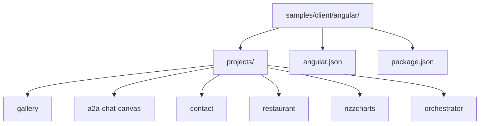
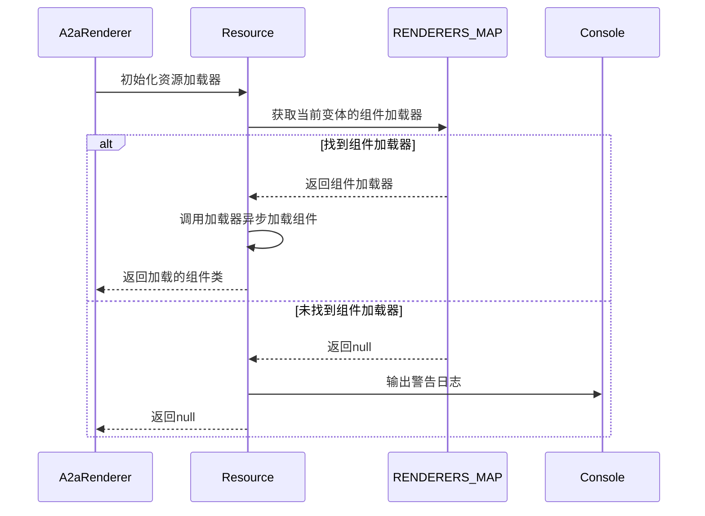
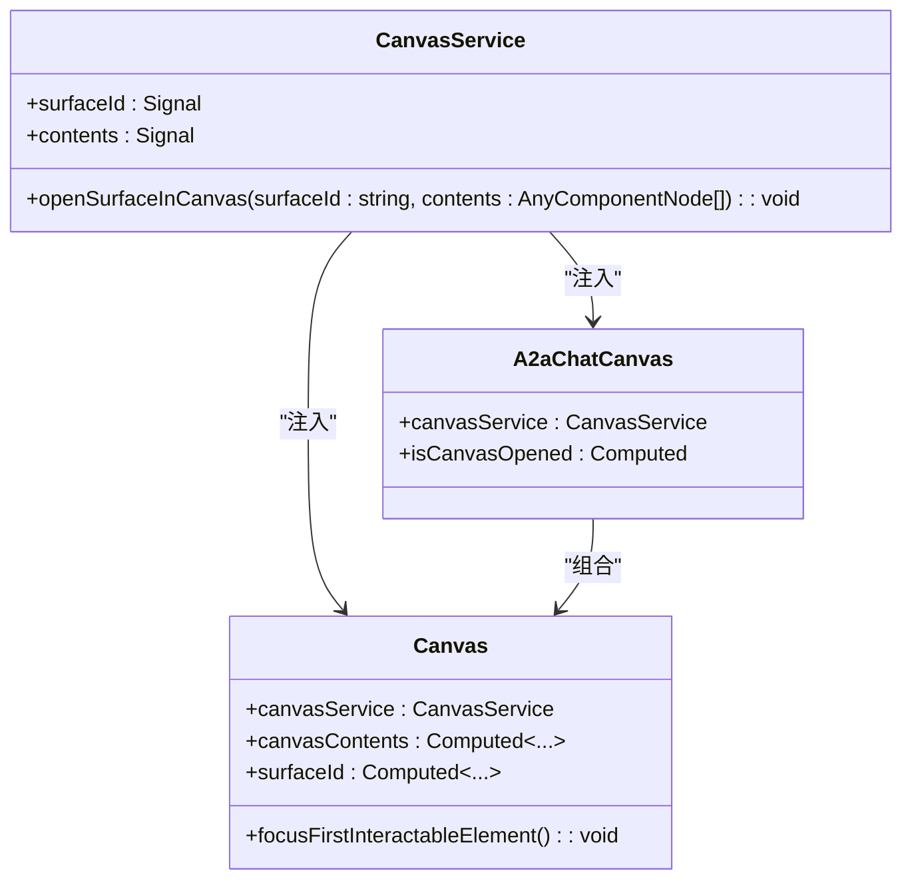
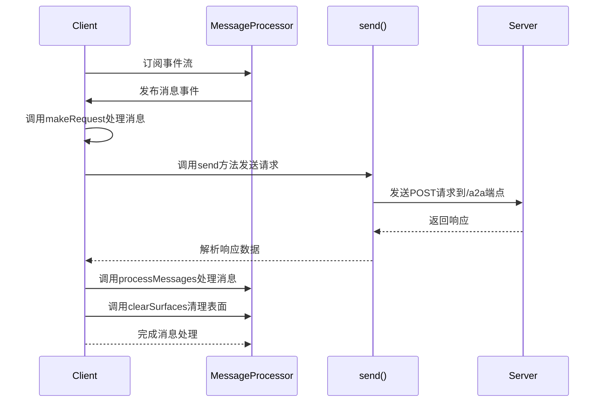
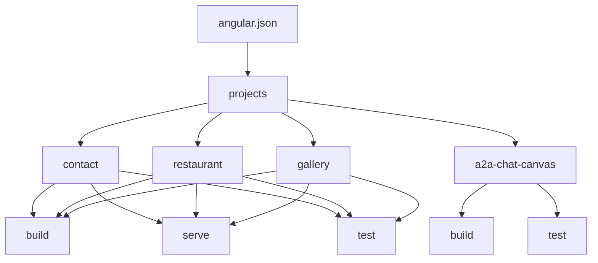

# Angular客户端示例

<cite>
**本文档中引用的文件**  
- [gallery.component.ts](file://samples/client/angular/projects/gallery/src/app/features/gallery/gallery.component.ts)
- [app.ts](file://samples/client/angular/projects/gallery/src/app/app.ts)
- [a2a-chat-canvas.ts](file://samples/client/angular/projects/a2a-chat-canvas/src/lib/a2a-chat-canvas.ts)
- [a2a-renderer.ts](file://samples/client/angular/projects/a2a-chat-canvas/src/lib/a2a-renderer/a2a-renderer.ts)
- [canvas-service.ts](file://samples/client/angular/projects/a2a-chat-canvas/src/lib/services/canvas-service.ts)
- [canvas.ts](file://samples/client/angular/projects/a2a-chat-canvas/src/lib/components/canvas/canvas.ts)
- [client.ts](file://samples/client/angular/projects/contact/src/app/client.ts)
- [client.ts](file://samples/client/angular/projects/restaurant/src/app/client.ts)
- [angular.json](file://samples/client/angular/angular.json)
- [package.json](file://samples/client/angular/package.json)
</cite>

## 目录
1. [项目结构](#项目结构)
2. [UI组件展示库分析](#ui组件展示库分析)
3. [A2A聊天画布组件库](#a2a聊天画布组件库)
4. [具体应用实现](#具体应用实现)
5. [构建配置](#构建配置)
6. [代码复用模式](#代码复用模式)

## 项目结构

`samples/client/angular/`目录包含多个Angular项目，主要分为三类：UI组件展示库、A2A聊天画布组件库和具体应用。项目结构遵循Angular工作区模式，通过`angular.json`文件统一管理多个项目。



**Diagram sources**
- [angular.json](file://samples/client/angular/angular.json#L1-L504)

## UI组件展示库分析

`projects/gallery/`项目作为UI组件展示库，通过路由组织不同组件的演示。该库的核心是`gallery.component.ts`文件，它实现了组件演示的展示逻辑。

`App`组件通过`currentView`信号管理当前视图状态，允许在'library'和'gallery'之间切换。这种基于信号的状态管理方式是Angular现代响应式编程的核心。

```mermaid
classDiagram
class App {
+currentView : Signal<'library' | 'gallery'>
+setView(view : 'library' | 'gallery') : void
}
class GalleryComponent {
+samples : GallerySample[]
+selectedSample : GallerySample | null
+activeSection : string
+showJsonId : string | null
+openDialog(sample : GallerySample) : void
+closeDialog() : void
+scrollTo(id : string) : void
+onScroll(event : Event) : void
+toggleJson(id : string) : void
+getJson(surface : Surface) : string
}
class LibraryComponent {
+blocks : Block[]
+categories : Category[]
+selectedBlock : {name : string, surface : Surface} | null
+activeSection : string
+showJsonId : string | null
+openDialog(block : {name : string, surface : Surface}) : void
+closeDialog() : void
+scrollTo(name : string) : void
+onScroll(event : Event) : void
+toggleJson(name : string) : void
+getJson(surface : Surface) : string
}
App --> GalleryComponent : "使用"
App --> LibraryComponent : "使用"
```

**Diagram sources**
- [app.ts](file://samples/client/angular/projects/gallery/src/app/app.ts#L17-L34)
- [gallery.component.ts](file://samples/client/angular/projects/gallery/src/app/features/gallery/gallery.component.ts#L1-L247)
- [library.component.ts](file://samples/client/angular/projects/gallery/src/app/features/library/library.component.ts#L1-L584)

**Section sources**
- [app.ts](file://samples/client/angular/projects/gallery/src/app/app.ts#L17-L34)
- [gallery.component.ts](file://samples/client/angular/projects/gallery/src/app/features/gallery/gallery.component.ts#L1-L247)

## A2A聊天画布组件库

`projects/a2a-chat-canvas/`组件库采用模块化封装结构，核心组件包括`a2a-renderer`和`canvas-service`。

### A2A渲染器集成

`a2a-renderer`组件通过Angular的资源加载机制动态加载渲染器组件。它利用`RENDERERS_MAP`注入令牌获取渲染器映射，根据`uiMessageContent`的变体类型异步加载相应的组件类。



**Diagram sources**
- [a2a-renderer.ts](file://samples/client/angular/projects/a2a-chat-canvas/src/lib/a2a-renderer/a2a-renderer.ts#L1-L51)

### 画布服务状态管理

`canvas-service`是管理UI状态的核心服务，使用Angular的信号（Signal）实现响应式状态管理。该服务通过`surfaceId`和`contents`两个信号分别存储当前画布表面ID和组件节点。



**Diagram sources**
- [canvas-service.ts](file://samples/client/angular/projects/a2a-chat-canvas/src/lib/services/canvas-service.ts#L1-L42)
- [canvas.ts](file://samples/client/angular/projects/a2a-chat-canvas/src/lib/components/canvas/canvas.ts#L1-L66)
- [a2a-chat-canvas.ts](file://samples/client/angular/projects/a2a-chat-canvas/src/lib/a2a-chat-canvas.ts#L1-L44)

**Section sources**
- [canvas-service.ts](file://samples/client/angular/projects/a2a-chat-canvas/src/lib/services/canvas-service.ts#L1-L42)
- [a2a-renderer.ts](file://samples/client/angular/projects/a2a-chat-canvas/src/lib/a2a-renderer/a2a-renderer.ts#L1-L51)

## 具体应用实现

`contact`、`restaurant`等具体应用通过`client.ts`初始化A2UI环境，并通过`a2a-service`与Agent通信。

### A2UI环境初始化

`client.ts`文件中的`Client`服务是A2UI环境的核心，它通过注入`MessageProcessor`来处理消息事件流。服务的构造函数订阅消息处理器的事件流，当收到消息时调用`makeRequest`方法处理请求。



**Diagram sources**
- [client.ts](file://samples/client/angular/projects/contact/src/app/client.ts#L1-L83)
- [client.ts](file://samples/client/angular/projects/restaurant/src/app/client.ts#L1-L85)

### Agent通信机制

`Client`服务的`send`方法负责与后端Agent进行通信。它通过`fetch` API向`/a2a`端点发送POST请求，将消息序列化为JSON格式。响应处理逻辑包括错误处理和消息解析，确保从服务器响应中提取出有效的`ServerToClientMessage`数组。

**Section sources**
- [client.ts](file://samples/client/angular/projects/contact/src/app/client.ts#L1-L83)
- [client.ts](file://samples/client/angular/projects/restaurant/src/app/client.ts#L1-L85)

## 构建配置

`angular.json`和`package.json`文件定义了项目的构建配置和依赖关系。

### Angular构建配置

`angular.json`文件配置了多个项目的构建选项，包括`contact`、`restaurant`、`gallery`等应用项目和`a2a-chat-canvas`库项目。每个项目都有独立的构建、开发服务器、测试等配置。



**Diagram sources**
- [angular.json](file://samples/client/angular/angular.json#L1-L504)

### 包管理配置

`package.json`文件定义了项目依赖和脚本命令。项目依赖包括Angular框架、A2UI渲染器、CDK、Material等UI库，以及用于图表、地图等特定功能的库。

```json
{
  "scripts": {
    "ng": "ng",
    "start": "ng serve",
    "build": "ng build",
    "watch": "ng build --watch --configuration development",
    "test": "ng test",
    "serve:ssr:angular": "node dist/angular/server/server.mjs",
    "serve:ssr:restaurant": "node dist/restaurant/server/server.mjs",
    "serve:ssr:rizzcharts": "node dist/rizzcharts/server/server.mjs",
    "serve:ssr:contact": "node dist/contact/server/server.mjs",
    "build:lit": "cd ../../../renderers/lit && npm i && npm run build",
    "serve:agent:restaurant": "cd ../../agent/adk/restaurant_finder && uv run .",
    "demo:restaurant": "npm run build:lit && concurrently -k -n \"AGENT,WEB\" -c \"magenta,blue\" \"npm run serve:agent:restaurant\" \"npm start -- restaurant\""
  }
}
```

**Diagram sources**
- [package.json](file://samples/client/angular/package.json#L1-L88)

**Section sources**
- [angular.json](file://samples/client/angular/angular.json#L1-L504)
- [package.json](file://samples/client/angular/package.json#L1-L88)

## 代码复用模式

各项目间存在多种代码复用模式，体现了模块化设计思想。

### 组件库复用

`a2a-chat-canvas`作为一个独立的库项目，被其他应用项目复用。通过Angular的库构建机制，该组件库可以被打包并作为依赖引入到其他项目中。

### 服务复用

`Client`服务在`contact`和`restaurant`项目中具有几乎相同的实现，体现了服务层的复用模式。这种模式确保了与Agent通信的一致性。

### 配置复用

多个应用项目共享相似的构建配置，包括SSR（服务端渲染）配置、样式配置、资源文件配置等，通过Angular工作区的配置继承机制实现。

**Section sources**
- [a2a-chat-canvas.ts](file://samples/client/angular/projects/a2a-chat-canvas/src/lib/a2a-chat-canvas.ts#L1-L44)
- [client.ts](file://samples/client/angular/projects/contact/src/app/client.ts#L1-L83)
- [client.ts](file://samples/client/angular/projects/restaurant/src/app/client.ts#L1-L85)
- [angular.json](file://samples/client/angular/angular.json#L1-L504)