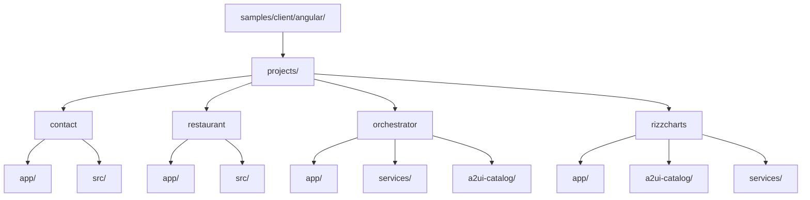
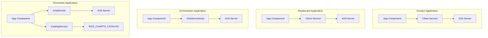
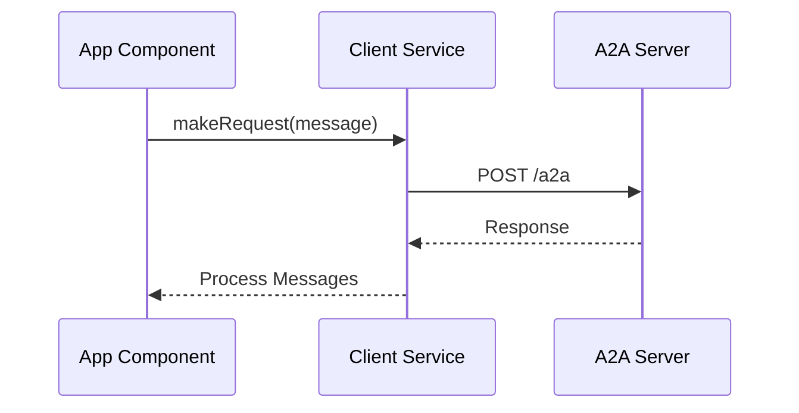
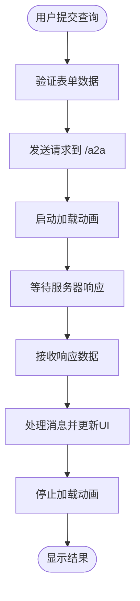
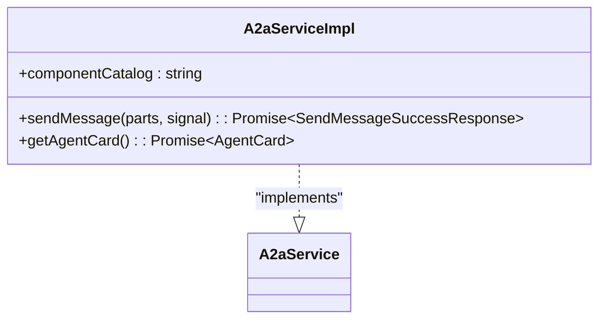
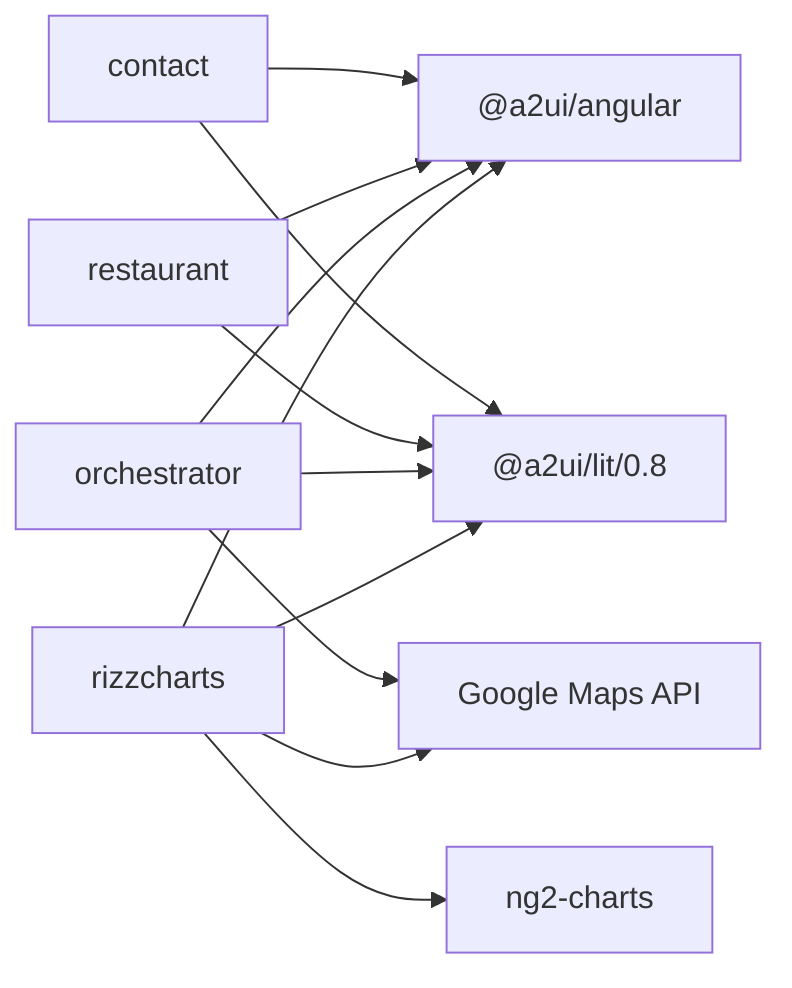

# 具体应用示例

<cite>
**本文档中引用的文件**  
- [client.ts](file://samples/client/angular/projects/contact/src/app/client.ts)
- [app.ts](file://samples/client/angular/projects/contact/src/app/app.ts)
- [app.config.ts](file://samples/client/angular/projects/contact/src/app/app.config.ts)
- [restaurant/client.ts](file://samples/client/angular/projects/restaurant/src/app/client.ts)
- [restaurant/app.ts](file://samples/client/angular/projects/restaurant/src/app/app.ts)
- [orchestrator/app.ts](file://samples/client/angular/projects/orchestrator/src/app/app.ts)
- [orchestrator/app.routes.ts](file://samples/client/angular/projects/orchestrator/src/app/app.routes.ts)
- [orchestrator/a2a-service-impl.ts](file://samples/client/angular/projects/orchestrator/src/services/a2a-service-impl.ts)
- [rizzcharts/app.ts](file://samples/client/angular/projects/rizzcharts/src/app/app.ts)
- [rizzcharts/app.routes.ts](file://samples/client/angular/projects/rizzcharts/src/app/app.routes.ts)
- [rizzcharts/catalog.ts](file://samples/client/angular/projects/rizzcharts/src/a2ui-catalog/catalog.ts)
- [rizzcharts/chart.ts](file://samples/client/angular/projects/rizzcharts/src/a2ui-catalog/chart.ts)
- [rizzcharts/google-map.ts](file://samples/client/angular/projects/rizzcharts/src/a2ui-catalog/google-map.ts)
- [rizzcharts/a2a_service.ts](file://samples/client/angular/projects/rizzcharts/src/services/a2a_service.ts)
</cite>

## 目录
1. [简介](#简介)
2. [项目结构](#项目结构)
3. [核心组件](#核心组件)
4. [架构概述](#架构概述)
5. [详细组件分析](#详细组件分析)
6. [依赖分析](#依赖分析)
7. [性能考虑](#性能考虑)
8. [故障排除指南](#故障排除指南)
9. [结论](#结论)

## 简介
本文档全面介绍 `samples/client/angular/` 目录下的四个具体应用示例：`contact`、`restaurant`、`orchestrator` 和 `rizzcharts`。这些示例展示了 A2UI 框架在不同场景下的应用，包括基础通信、复杂 UI 交互、路由配置以及自定义组件扩展能力。文档将详细解析每个应用的核心实现，并提供运行命令和特性对比。

## 项目结构
`samples/client/angular/` 目录包含四个独立的 Angular 应用项目，每个项目都位于 `projects/` 子目录下。这些项目共享相同的构建配置和依赖管理，但各自实现了不同的功能和 UI 特性。



**图示来源**
- [project_structure](file://project_structure)

**本节来源**
- [project_structure](file://project_structure)

## 核心组件
四个应用共享一些核心组件，如 `client.ts` 中的通信逻辑和 `app.ts` 中的主组件。它们都基于 A2UI 框架，使用 `@a2ui/angular` 和 `@a2ui/lit/0.8` 包来处理与 Agent 的通信和 UI 渲染。每个应用通过 `app.config.ts` 配置 A2UI 环境，并通过 `client.ts` 实现与后端的 A2A 通信。

**本节来源**
- [contact/client.ts](file://samples/client/angular/projects/contact/src/app/client.ts#L1-L83)
- [contact/app.config.ts](file://samples/client/angular/projects/contact/src/app/app.config.ts#L1-L45)
- [restaurant/client.ts](file://samples/client/angular/projects/restaurant/src/app/client.ts#L1-L85)

## 架构概述
这四个应用遵循相似的架构模式：主组件 (`app.ts`) 负责 UI 交互和状态管理，服务类 (`client.ts` 或特定服务) 负责与 Agent 进行通信。`contact` 和 `restaurant` 是基础应用，`orchestrator` 和 `rizzcharts` 则展示了更高级的功能，如自定义服务实现和组件目录扩展。



**图示来源**
- [contact/app.ts](file://samples/client/angular/projects/contact/src/app/app.ts#L1-L51)
- [contact/client.ts](file://samples/client/angular/projects/contact/src/app/client.ts#L1-L83)
- [orchestrator/app.ts](file://samples/client/angular/projects/orchestrator/src/app/app.ts#L1-L46)
- [orchestrator/a2a-service-impl.ts](file://samples/client/angular/projects/orchestrator/src/services/a2a-service-impl.ts#L1-L52)
- [rizzcharts/app.ts](file://samples/client/angular/projects/rizzcharts/src/app/app.ts#L1-L59)
- [rizzcharts/a2a_service.ts](file://samples/client/angular/projects/rizzcharts/src/services/a2a_service.ts#L1-L68)

## 详细组件分析

### contact 应用分析
`contact` 应用是四个示例中最基础的一个，用于演示 A2UI 环境的初始化和与 Agent 的基本通信流程。

#### A2UI 环境初始化
`contact` 应用通过 `app.config.ts` 文件初始化 A2UI 环境。该文件使用 `provideA2UI` 函数配置 A2UI，传入 `DEFAULT_CATALOG` 作为组件目录，并应用自定义主题。这为应用提供了标准的 UI 组件集和视觉样式。



**图示来源**
- [contact/app.config.ts](file://samples/client/angular/projects/contact/src/app/app.config.ts#L27-L45)
- [contact/client.ts](file://samples/client/angular/projects/contact/src/app/client.ts#L39-L56)
- [contact/app.ts](file://samples/client/angular/projects/contact/src/app/app.ts#L44-L47)

#### 与 Agent 的通信
`app.ts` 中的 `handleSubmit` 方法处理用户提交的表单数据，并调用 `client.makeRequest` 方法。`client.ts` 中的 `Client` 服务负责实际的 HTTP 通信，它通过 `fetch` 请求将消息发送到 `/a2a` 端点，并处理响应。响应数据经过 `MessageProcessor` 处理后，更新 UI 状态。

**本节来源**
- [contact/client.ts](file://samples/client/angular/projects/contact/src/app/client.ts#L1-L83)
- [contact/app.ts](file://samples/client/angular/projects/contact/src/app/app.ts#L34-L49)
- [contact/app.config.ts](file://samples/client/angular/projects/contact/src/app/app.config.ts#L1-L45)

### restaurant 应用分析
`restaurant` 应用在 `contact` 的基础上增加了更复杂的 UI 交互和用户体验功能。

#### 复杂 UI 交互
`restaurant` 应用的 `app.ts` 文件中包含了更丰富的 UI 逻辑。除了基本的表单提交，它还实现了加载动画，通过 `startLoadingAnimation` 和 `stopLoadingAnimation` 方法管理一个循环显示的文本序列，为用户提供更好的等待反馈。

#### 地图集成
虽然 `restaurant` 应用本身没有直接集成地图组件，但其设计为处理包含地图数据的响应做好了准备。其 UI 结构和数据处理逻辑可以轻松地与地图组件集成，展示餐厅位置等信息。



**图示来源**
- [restaurant/app.ts](file://samples/client/angular/projects/restaurant/src/app/app.ts#L75-L87)
- [restaurant/client.ts](file://samples/client/angular/projects/restaurant/src/app/client.ts#L43-L51)

**本节来源**
- [restaurant/app.ts](file://samples/client/angular/projects/restaurant/src/app/app.ts#L1-L90)
- [restaurant/client.ts](file://samples/client/angular/projects/restaurant/src/app/client.ts#L1-L85)

### orchestrator 应用分析
`orchestrator` 应用展示了更高级的配置和自定义服务实现。

#### 路由配置
`orchestrator` 应用的 `app.routes.ts` 文件定义了应用的路由配置。目前该文件为空，`routes` 常量被初始化为一个空数组，表明该应用可能是一个单页应用或路由配置在其他地方管理。

#### a2a-service-impl.ts 实现
`a2a-service-impl.ts` 文件实现了一个自定义的 `A2aService` 接口。该服务不仅处理消息发送，还通过 `componentCatalog` 属性支持在请求中附加组件目录信息。`getAgentCard` 方法用于从 `/a2a/agent-card` 端点获取 Agent 的元数据卡片。



**图示来源**
- [orchestrator/app.routes.ts](file://samples/client/angular/projects/orchestrator/src/app/app.routes.ts#L1-L20)
- [orchestrator/a2a-service-impl.ts](file://samples/client/angular/projects/orchestrator/src/services/a2a-service-impl.ts#L1-L52)

**本节来源**
- [orchestrator/app.routes.ts](file://samples/client/angular/projects/orchestrator/src/app/app.routes.ts#L1-L20)
- [orchestrator/a2a-service-impl.ts](file://samples/client/angular/projects/orchestrator/src/services/a2a-service-impl.ts#L1-L52)
- [orchestrator/app.ts](file://samples/client/angular/projects/orchestrator/src/app/app.ts#L1-L46)

### rizzcharts 应用分析
`rizzcharts` 应用是四个示例中最复杂的，重点展示了 A2UI 的扩展能力。

#### a2ui-catalog 目录结构
`rizzcharts` 应用的 `a2ui-catalog/` 目录定义了一个包含 `Chart` 和 `GoogleMap` 等自定义组件的扩展目录。`catalog.ts` 文件是核心，它通过 `RIZZ_CHARTS_CATALOG` 常量定义了这些组件的注册信息，包括组件类型和属性绑定。

#### catalog.ts 实现
`catalog.ts` 文件中的 `RIZZ_CHARTS_CATALOG` 对象扩展了 `DEFAULT_CATALOG`，并添加了 `Chart` 和 `GoogleMap` 组件。每个组件都指定了一个动态导入的类型和一个 `bindings` 函数，用于将 A2UI 消息中的属性映射到 Angular 组件的输入属性。

```mermaid
classDiagram
class RIZZ_CHARTS_CATALOG {
+Canvas : () => Promise
+Chart : { type : () => Promise, bindings : Function }
+GoogleMap : { type : () => Promise, bindings : Function }
}
RIZZ_CHARTS_CATALOG --> DEFAULT_CATALOG : "extends"
```

**图示来源**
- [rizzcharts/catalog.ts](file://samples/client/angular/projects/rizzcharts/src/a2ui-catalog/catalog.ts#L1-L44)
- [rizzcharts/chart.ts](file://samples/client/angular/projects/rizzcharts/src/a2ui-catalog/chart.ts#L1-L273)
- [rizzcharts/google-map.ts](file://samples/client/angular/projects/rizzcharts/src/a2ui-catalog/google-map.ts#L1-L231)

**本节来源**
- [rizzcharts/catalog.ts](file://samples/client/angular/projects/rizzcharts/src/a2ui-catalog/catalog.ts#L1-L44)
- [rizzcharts/chart.ts](file://samples/client/angular/projects/rizzcharts/src/a2ui-catalog/chart.ts#L1-L273)
- [rizzcharts/google-map.ts](file://samples/client/angular/projects/rizzcharts/src/a2ui-catalog/google-map.ts#L1-L231)

## 依赖分析
四个应用都依赖于核心的 A2UI 包 (`@a2ui/angular`, `@a2ui/lit/0.8`) 和 Angular 框架。`orchestrator` 和 `rizzcharts` 应用额外依赖于 Google Maps API，通过在 `app.ts` 的 `ngOnInit` 方法中动态加载脚本来实现。`rizzcharts` 应用还依赖于 `ng2-charts` 库来渲染图表。



**图示来源**
- [contact/client.ts](file://samples/client/angular/projects/contact/src/app/client.ts#L17-L18)
- [orchestrator/app.ts](file://samples/client/angular/projects/orchestrator/src/app/app.ts#L40-L43)
- [rizzcharts/app.ts](file://samples/client/angular/projects/rizzcharts/src/app/app.ts#L46-L49)

**本节来源**
- [contact/client.ts](file://samples/client/angular/projects/contact/src/app/client.ts#L17-L18)
- [orchestrator/app.ts](file://samples/client/angular/projects/orchestrator/src/app/app.ts#L40-L43)
- [rizzcharts/app.ts](file://samples/client/angular/projects/rizzcharts/src/app/app.ts#L46-L49)

## 性能考虑
所有应用都采用了信号（`signal`）进行状态管理，这是 Angular 的 Zoneless 变更检测机制，有助于提升性能。`client.ts` 中的 `isLoading` 信号用于控制加载状态，避免不必要的 UI 重绘。`rizzcharts` 应用中的 `Chart` 组件使用了计算信号（`computed`）来优化数据解析和视图更新。

## 故障排除指南
如果应用无法正常运行，请检查以下几点：
1.  确保后端 A2A 服务正在运行，并且 `/a2a` 端点可访问。
2.  检查 `environment.ts` 文件中的 `googleMapsApiKey` 是否正确配置。
3.  确认 `package.json` 中的依赖已正确安装。
4.  查看浏览器开发者工具中的网络请求和控制台日志，以获取错误详情。

**本节来源**
- [contact/client.ts](file://samples/client/angular/projects/contact/src/app/client.ts#L47-L48)
- [orchestrator/app.ts](file://samples/client/angular/projects/orchestrator/src/app/app.ts#L40)
- [rizzcharts/app.ts](file://samples/client/angular/projects/rizzcharts/src/app/app.ts#L46)

## 结论
通过对 `contact`、`restaurant`、`orchestrator` 和 `rizzcharts` 四个应用的分析，我们可以看到 A2UI 框架从基础通信到高级扩展的完整能力。`contact` 提供了最简实现，`restaurant` 增强了用户体验，`orchestrator` 展示了自定义服务，而 `rizzcharts` 则充分体现了框架的可扩展性。这些示例为开发者构建自己的 A2UI 应用提供了宝贵的参考。

要运行这些示例，可以使用如 `npm run demo:restaurant` 这样的命令（具体命令需参考项目根目录的 `package.json`）。各应用的共性在于都基于 A2UI 进行通信，而特性则体现在各自的 UI 复杂度和功能扩展上。