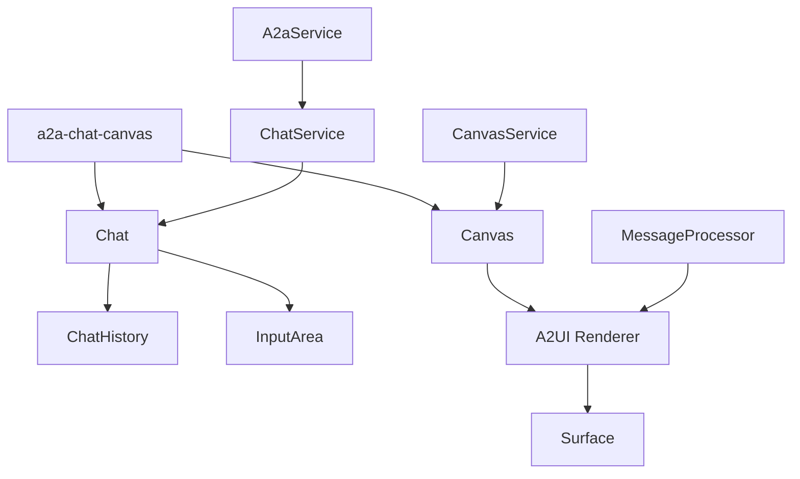
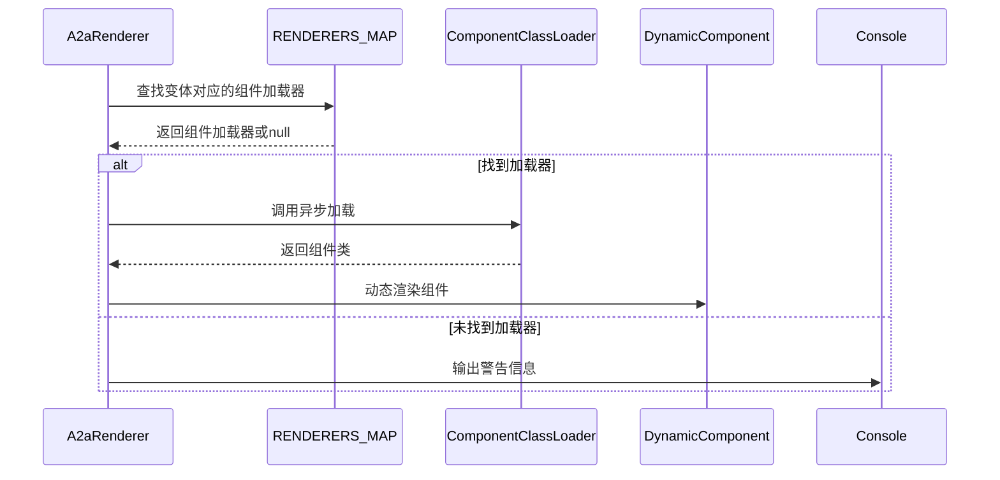
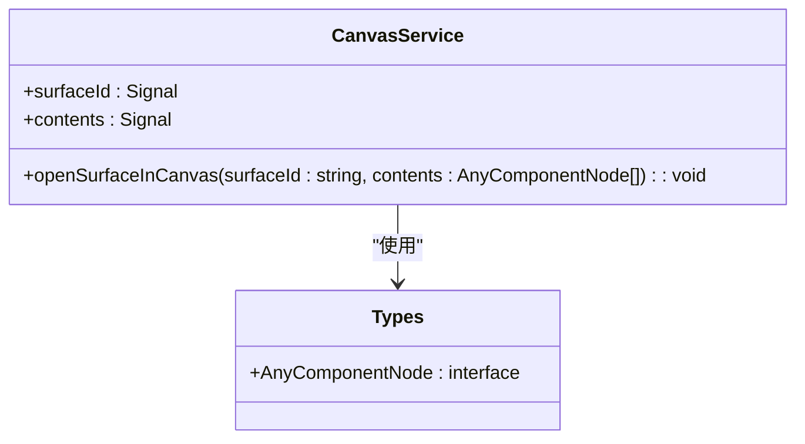
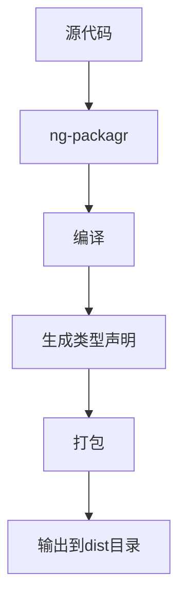
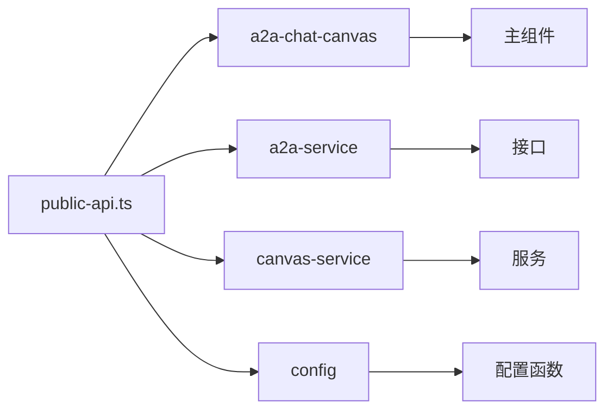

# 核心组件库

<cite>
**本文档中引用的文件**  
- [a2a-chat-canvas.ts](file://samples/client/angular/projects/a2a-chat-canvas/src/lib/a2a-chat-canvas.ts)
- [a2a-renderer.ts](file://samples/client/angular/projects/a2a-chat-canvas/src/lib/a2a-renderer/a2a-renderer.ts)
- [canvas-service.ts](file://samples/client/angular/projects/a2a-chat-canvas/src/lib/services/canvas-service.ts)
- [chat-service.ts](file://samples/client/angular/projects/a2a-chat-canvas/src/lib/services/chat-service.ts)
- [ui-message.ts](file://samples/client/angular/projects/a2a-chat-canvas/src/lib/types/ui-message.ts)
- [tokens.ts](file://samples/client/angular/projects/a2a-chat-canvas/src/lib/a2a-renderer/tokens.ts)
- [types.ts](file://samples/client/angular/projects/a2a-chat-canvas/src/lib/a2a-renderer/types.ts)
- [config.ts](file://samples/client/angular/projects/a2a-chat-canvas/src/lib/config.ts)
- [public-api.ts](file://samples/client/angular/projects/a2a-chat-canvas/src/public-api.ts)
- [ng-package.json](file://samples/client/angular/projects/a2a-chat-canvas/ng-package.json)
- [package.json](file://samples/client/angular/projects/a2a-chat-canvas/package.json)
- [tsconfig.lib.json](file://samples/client/angular/projects/a2a-chat-canvas/tsconfig.lib.json)
</cite>

## 目录
1. [简介](#简介)
2. [项目结构](#项目结构)
3. [核心组件分析](#核心组件分析)
4. [a2a-renderer 组件详解](#a2a-renderer-组件详解)
5. [canvas-service 服务分析](#canvas-service-服务分析)
6. [a2a-chat-canvas 主组件分析](#a2a-chat-canvas-主组件分析)
7. [共享库构建配置](#共享库构建配置)
8. [构建流程与导出模式](#构建流程与导出模式)
9. [结论](#结论)

## 简介
`a2a-chat-canvas` 是一个可复用的 Angular UI 组件库，旨在封装与 A2UI 协议交互的核心功能。该库提供了一套完整的聊天界面解决方案，包括消息历史、输入区域和渲染器组件。通过集成 Lit 渲染器，该库能够解析和渲染 A2UI JSON 数据，并通过 `canvas-service` 管理 `Surface` 的生命周期和状态。本文档将深入剖析该组件库的架构和实现细节，为开发者提供创建自定义 UI 库的范本。

## 项目结构
`a2a-chat-canvas` 组件库的项目结构遵循 Angular 库的标准组织方式，主要包含以下几个核心目录：
- `lib/`: 包含所有可复用的组件、服务和类型定义
- `a2a-renderer/`: 负责解析和渲染 A2UI JSON 数据的核心渲染器组件
- `components/`: 包含聊天界面的各个 UI 组件
- `services/`: 提供核心业务逻辑的服务
- `interfaces/`: 定义依赖注入接口
- `types/`: 定义共享类型
- `utils/`: 提供辅助工具函数

**Section sources**
- [a2a-chat-canvas.ts](file://samples/client/angular/projects/a2a-chat-canvas/src/lib/a2a-chat-canvas.ts)
- [a2a-renderer.ts](file://samples/client/angular/projects/a2a-chat-canvas/src/lib/a2a-renderer/a2a-renderer.ts)
- [canvas-service.ts](file://samples/client/angular/projects/a2a-chat-canvas/src/lib/services/canvas-service.ts)

## 核心组件分析
`a2a-chat-canvas` 库的核心由三个主要部分组成：`a2a-renderer` 组件、`canvas-service` 服务和 `a2a-chat-canvas` 主组件。这些组件协同工作，形成了一个完整的聊天界面解决方案。

**Diagram sources**
- [a2a-chat-canvas.ts](file://samples/client/angular/projects/a2a-chat-canvas/src/lib/a2a-chat-canvas.ts)
- [chat-service.ts](file://samples/client/angular/projects/a2a-chat-canvas/src/lib/services/chat-service.ts)
- [canvas-service.ts](file://samples/client/angular/projects/a2a-chat-canvas/src/lib/services/canvas-service.ts)

## a2a-renderer 组件详解
`a2a-renderer` 组件是该库的核心渲染引擎，负责动态解析和渲染 A2UI JSON 数据。它通过依赖注入机制获取渲染器映射，并根据 `UiMessageContent` 的变体类型动态加载相应的组件。

该组件使用 Angular 的 `resource` API 实现异步组件加载，确保了渲染的灵活性和可扩展性。当接收到 `UiMessageContent` 时，它会查找 `RENDERERS_MAP` 注入令牌中对应的组件加载器，如果找不到匹配的渲染器，则会输出警告信息。

**Diagram sources**
- [a2a-renderer.ts](file://samples/client/angular/projects/a2a-chat-canvas/src/lib/a2a-renderer/a2a-renderer.ts)
- [tokens.ts](file://samples/client/angular/projects/a2a-chat-canvas/src/lib/a2a-renderer/tokens.ts)
- [types.ts](file://samples/client/angular/projects/a2a-chat-canvas/src/lib/a2a-renderer/types.ts)

**Section sources**
- [a2a-renderer.ts](file://samples/client/angular/projects/a2a-chat-canvas/src/lib/a2a-renderer/a2a-renderer.ts)
- [tokens.ts](file://samples/client/angular/projects/a2a-chat-canvas/src/lib/a2a-renderer/tokens.ts)
- [types.ts](file://samples/client/angular/projects/a2a-chat-canvas/src/lib/a2a-renderer/types.ts)

## canvas-service 服务分析
`canvas-service` 是一个根级注入的服务，负责管理画布（canvas）的状态和生命周期。该服务使用 Angular 的 `signal` API 来管理状态，确保了响应式编程的一致性。

服务的核心功能包括：
- 管理当前显示的 A2UI surface ID
- 存储 surface 的根组件节点
- 提供打开 surface 的方法

当调用 `openSurfaceInCanvas` 方法时，服务会更新 `surfaceId` 和 `contents` 信号，触发依赖这些状态的组件重新渲染。这种设计模式实现了组件间的松耦合，使得状态管理更加清晰和可维护。

**Diagram sources**
- [canvas-service.ts](file://samples/client/angular/projects/a2a-chat-canvas/src/lib/services/canvas-service.ts)
- [types.ts](file://samples/client/angular/projects/a2a-chat-canvas/src/lib/a2a-renderer/types.ts)

**Section sources**
- [canvas-service.ts](file://samples/client/angular/projects/a2a-chat-canvas/src/lib/services/canvas-service.ts)

## a2a-chat-canvas 主组件分析
`a2a-chat-canvas` 是库的主组件，负责整合聊天界面的所有部分。它通过计算信号（computed signal）来确定画布是否打开，并根据 `canvasService` 的状态动态显示相应的界面。

该组件的主要特性包括：
- 通过 `emptyHistoryTemplate` 输入属性支持自定义空历史模板
- 通过 `messageDecorator` 输入属性支持自定义消息装饰器
- 使用 `computed` 函数监听 `canvasService.surfaceId()` 的变化
- 通过 `imports` 元数据导入 `Canvas` 和 `Chat` 组件

主组件的设计体现了 Angular 的组合式 API 风格，通过信号和计算信号实现了高效的响应式更新，避免了不必要的重渲染。

**Section sources**
- [a2a-chat-canvas.ts](file://samples/client/angular/projects/a2a-chat-canvas/src/lib/a2a-chat-canvas.ts)
- [chat-service.ts](file://samples/client/angular/projects/a2a-chat-canvas/src/lib/services/chat-service.ts)

## 共享库构建配置
`projects/lib/` 目录下的构建配置遵循 Angular 库的最佳实践。`ng-package.json` 文件定义了库的构建目标和入口文件，而 `tsconfig.lib.json` 则配置了 TypeScript 编译选项。

构建配置的关键特性包括：
- 使用 `ng-packagr` 进行库打包
- 指定 `src/public-api.ts` 作为入口文件
- 配置适当的编译选项以生成类型声明文件
- 设置正确的输出目录

**Diagram sources**
- [ng-package.json](file://samples/client/angular/projects/a2a-chat-canvas/ng-package.json)
- [tsconfig.lib.json](file://samples/client/angular/projects/a2a-chat-canvas/tsconfig.lib.json)

## 构建流程与导出模式
`a2a-chat-canvas` 库的构建流程基于 `ng-packagr`，这是一个专门为 Angular 库设计的打包工具。`ng-package.json` 文件中的配置指定了构建的目标目录和入口文件，确保了库的正确打包。

`public-api.ts` 文件采用了聚合导出模式，将库的所有公共 API 集中在一个入口文件中。这种模式有以下几个优点：
- 简化了库的导入路径
- 明确了公共 API 的边界
- 便于版本控制和向后兼容

**Diagram sources**
- [public-api.ts](file://samples/client/angular/projects/a2a-chat-canvas/src/public-api.ts)
- [ng-package.json](file://samples/client/angular/projects/a2a-chat-canvas/ng-package.json)

**Section sources**
- [public-api.ts](file://samples/client/angular/projects/a2a-chat-canvas/src/public-api.ts)
- [ng-package.json](file://samples/client/angular/projects/a2a-chat-canvas/ng-package.json)
- [package.json](file://samples/client/angular/projects/a2a-chat-canvas/package.json)

## 结论
`a2a-chat-canvas` 组件库通过精心设计的架构和现代 Angular 特性，提供了一个强大而灵活的聊天界面解决方案。其核心优势包括：
- 基于信号的响应式状态管理
- 动态组件加载和渲染
- 清晰的依赖注入和配置系统
- 符合 Angular 最佳实践的构建配置

该库不仅实现了与 A2UI 协议的无缝集成，还为开发者提供了创建自定义 UI 库的优秀范本。通过理解其架构和实现细节，开发者可以借鉴这些模式来构建自己的可复用组件库。