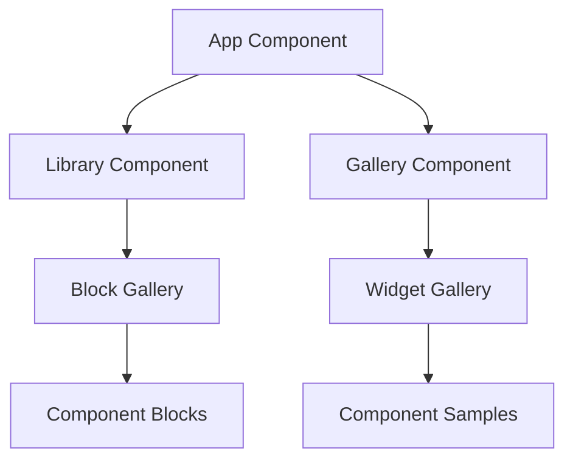
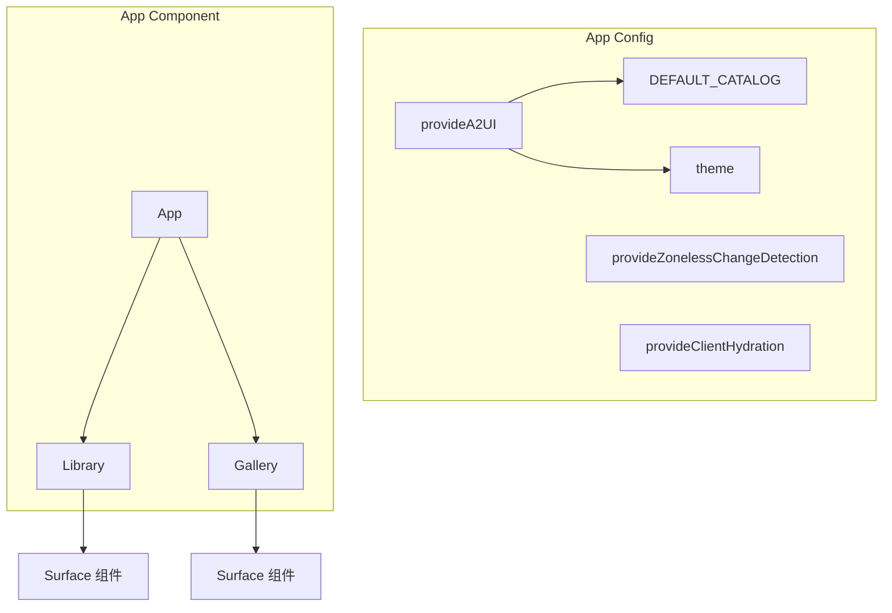
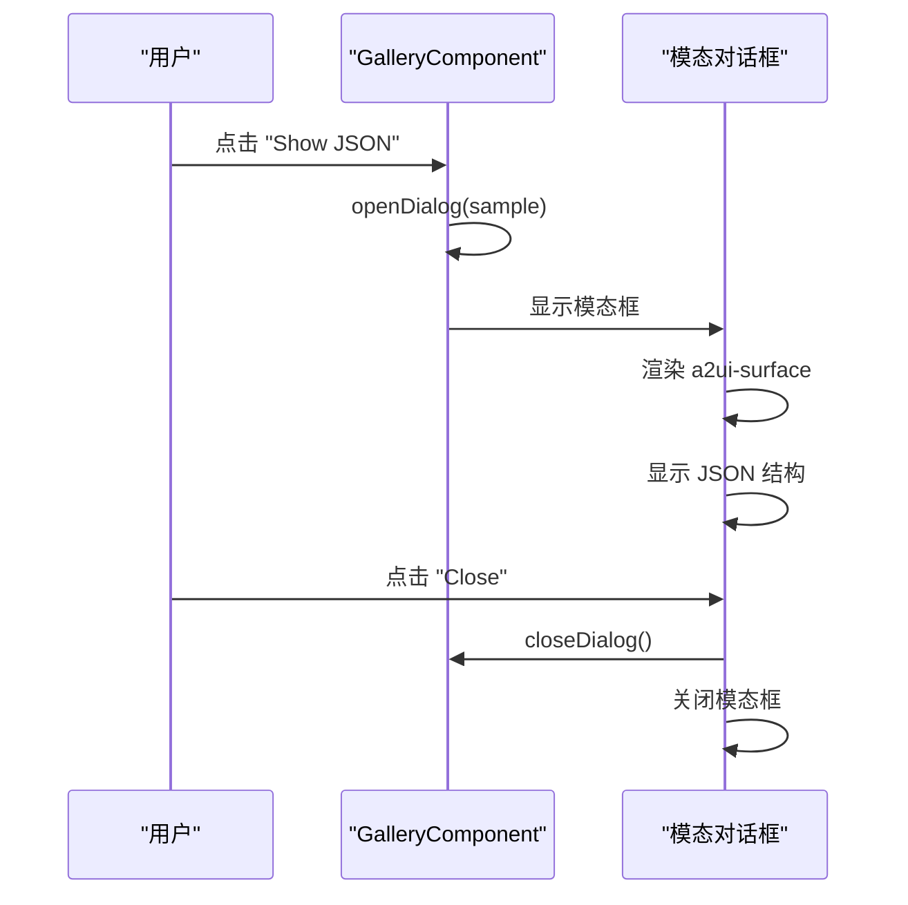
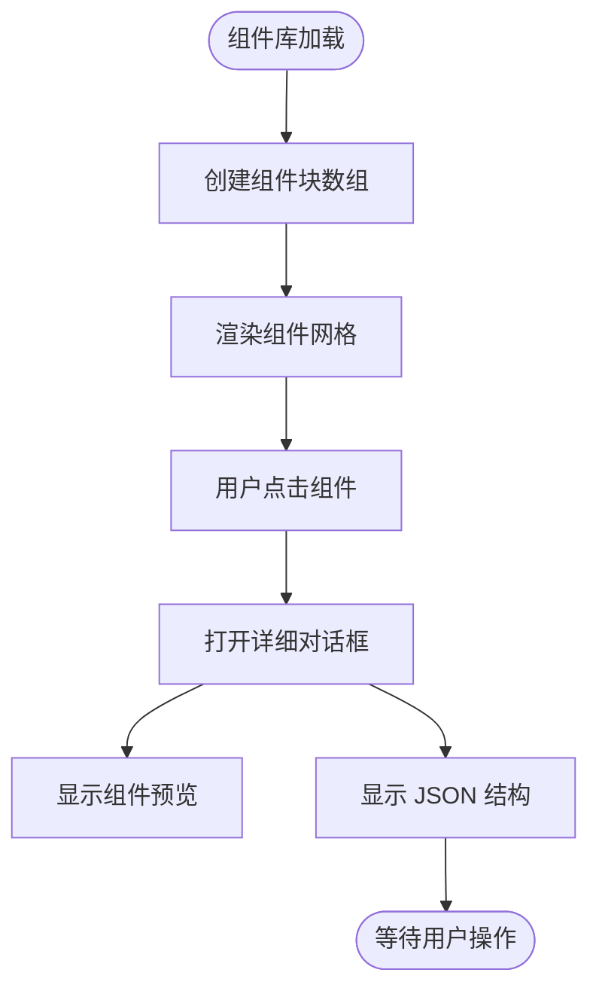

# 组件展示库

<cite>
**本文档中引用的文件**  
- [app.config.ts](file://samples/client/angular/projects/gallery/src/app/app.config.ts)
- [app.ts](file://samples/client/angular/projects/gallery/src/app/app.ts)
- [gallery.component.ts](file://samples/client/angular/projects/gallery/src/app/features/gallery/gallery.component.ts)
- [library.component.ts](file://samples/client/angular/projects/gallery/src/app/features/library/library.component.ts)
- [app.html](file://samples/client/angular/projects/gallery/src/app/app.html)
- [gallery.html](file://samples/client/angular/projects/gallery/src/app/features/gallery/gallery.html)
- [library.html](file://samples/client/angular/projects/gallery/src/app/features/library/library.html)
</cite>

## 目录
1. [简介](#简介)
2. [项目结构](#项目结构)
3. [核心组件](#核心组件)
4. [架构概述](#架构概述)
5. [详细组件分析](#详细组件分析)
6. [依赖分析](#依赖分析)
7. [性能考虑](#性能考虑)
8. [故障排除指南](#故障排除指南)
9. [结论](#结论)

## 简介
`samples/client/angular/projects/gallery/` 项目是一个用于展示 A2UI 所有标准组件的 UI 画廊。该项目作为纯客户端演示，无需后端 Agent 即可运行，是学习 A2UI 组件视觉效果和基础用法的最佳起点。通过 `ng serve --project=gallery` 命令即可启动该应用，用户可以直观地查看 `audio`、`button`、`card` 等 22 个组件的独立演示页面。

## 项目结构
该项目采用 Angular 模块化设计，主要由两个功能视图组成：`Library` 和 `Gallery`，分别通过独立的 Angular 组件实现。项目结构清晰，遵循 Angular 最佳实践，将不同功能模块分离在 `features/` 目录下。



**Diagram sources**
- [app.ts](file://samples/client/angular/projects/gallery/src/app/app.ts#L17-L33)
- [library.component.ts](file://samples/client/angular/projects/gallery/src/app/features/library/library.component.ts#L17-L26)
- [gallery.component.ts](file://samples/client/angular/projects/gallery/src/app/features/gallery/gallery.component.ts#L17-L34)

**Section sources**
- [app.ts](file://samples/client/angular/projects/gallery/src/app/app.ts#L1-L34)
- [app.html](file://samples/client/angular/projects/gallery/src/app/app.html#L1-L39)

## 核心组件
本项目的核心在于 `gallery.component.ts` 和 `library.component.ts` 两个组件，它们共同实现了 A2UI 组件的可视化展示。`App` 组件作为根组件，通过信号（signal）控制当前视图在 `library` 和 `gallery` 之间切换。

**Section sources**
- [app.ts](file://samples/client/angular/projects/gallery/src/app/app.ts#L17-L33)
- [gallery.component.ts](file://samples/client/angular/projects/gallery/src/app/features/gallery/gallery.component.ts#L17-L34)
- [library.component.ts](file://samples/client/angular/projects/gallery/src/app/features/library/library.component.ts#L17-L26)

## 架构概述
整个项目基于 Angular 的现代架构构建，使用了 Zoneless Change Detection 和 Client Hydration 等高级特性。`appConfig` 中通过 `provideA2UI` 提供了 A2UI 框架的配置，包括默认组件目录和主题。



**Diagram sources**
- [app.config.ts](file://samples/client/angular/projects/gallery/src/app/app.config.ts#L17-L44)
- [app.ts](file://samples/client/angular/projects/gallery/src/app/app.ts#L17-L33)

## 详细组件分析

### Gallery 组件分析
`GalleryComponent` 是项目的核心展示组件之一，它通过预定义的 `samples` 数组组织了多个组件演示实例。每个示例都包含一个 `Surface` 对象，该对象描述了 A2UI 组件树的结构。

#### 对于 API/Service 组件:


**Diagram sources**
- [gallery.component.ts](file://samples/client/angular/projects/gallery/src/app/features/gallery/gallery.component.ts#L35-L246)
- [gallery.html](file://samples/client/angular/projects/gallery/src/app/features/gallery/gallery.html#L1-L63)

### Library 组件分析
`LibraryComponent` 提供了另一种组件浏览方式，它将组件按类别（Layout、Media、Inputs）组织，便于用户系统性地学习和探索。

#### 对于复杂逻辑组件:


**Diagram sources**
- [library.component.ts](file://samples/client/angular/projects/gallery/src/app/features/library/library.component.ts#L27-L583)
- [library.html](file://samples/client/angular/projects/gallery/src/app/features/library/library.html#L1-L50)

**Section sources**
- [library.component.ts](file://samples/client/angular/projects/gallery/src/app/features/library/library.component.ts#L1-L584)

## 依赖分析
项目依赖于 `@a2ui/angular` 和 `@a2ui/lit/0.8` 两个核心包，前者提供 Angular 集成，后者提供底层类型定义。通过 `provideA2UI` 注入服务，实现了与 A2UI 框架的无缝集成。

```mermaid
graph LR
A[gallery 项目] --> B[@a2ui/angular]
A --> C[@a2ui/lit/0.8]
B --> D[DEFAULT_CATALOG]
B --> E[Surface 组件]
C --> F[Types.Surface]
```

**Diagram sources**
- [app.config.ts](file://samples/client/angular/projects/gallery/src/app/app.config.ts#L17-L44)
- [gallery.component.ts](file://samples/client/angular/projects/gallery/src/app/features/gallery/gallery.component.ts#L20-L21)
- [library.component.ts](file://samples/client/angular/projects/gallery/src/app/features/library/library.component.ts#L19-L20)

## 性能考虑
项目采用了 Angular 的 Zoneless Change Detection 模式，这有助于提升性能，特别是在处理大量组件更新时。同时，通过信号（signal）管理状态，确保了高效的变更检测机制。

## 故障排除指南
如果组件无法正常显示，请检查：
1. 确保已正确安装 `@a2ui` 相关依赖
2. 检查 `app.config.ts` 中的 `provideA2UI` 配置是否正确
3. 确认网络连接正常，因为部分示例使用了外部资源（如图片、音频）

**Section sources**
- [app.config.ts](file://samples/client/angular/projects/gallery/src/app/app.config.ts#L17-L44)
- [gallery.component.ts](file://samples/client/angular/projects/gallery/src/app/features/gallery/gallery.component.ts#L41-L165)

## 结论
`samples/client/angular/projects/gallery/` 项目是学习和探索 A2UI 组件库的理想起点。通过 `ng serve --project=gallery` 命令即可快速启动一个功能完整的组件展示应用。该项目不仅展示了如何使用 Angular 路由和懒加载机制组织组件演示，还提供了查看组件底层 JSON 结构的功能，有助于开发者深入理解 A2UI 的工作原理。