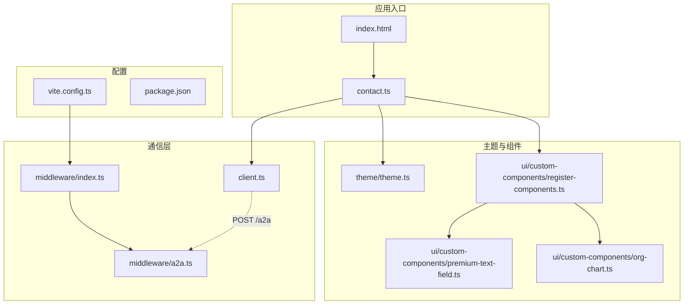
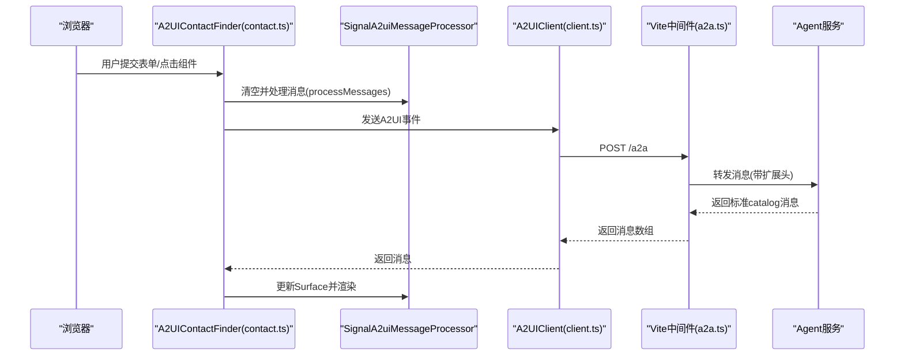
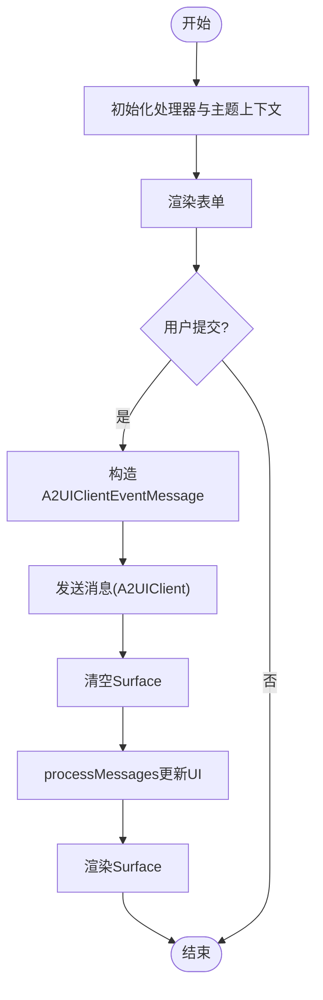
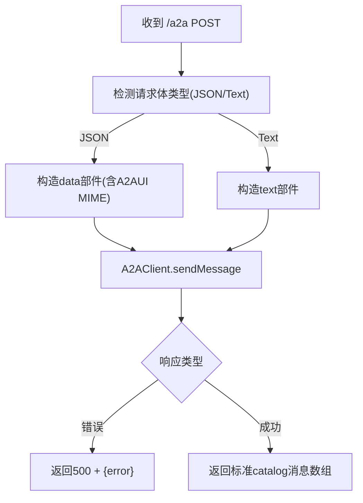
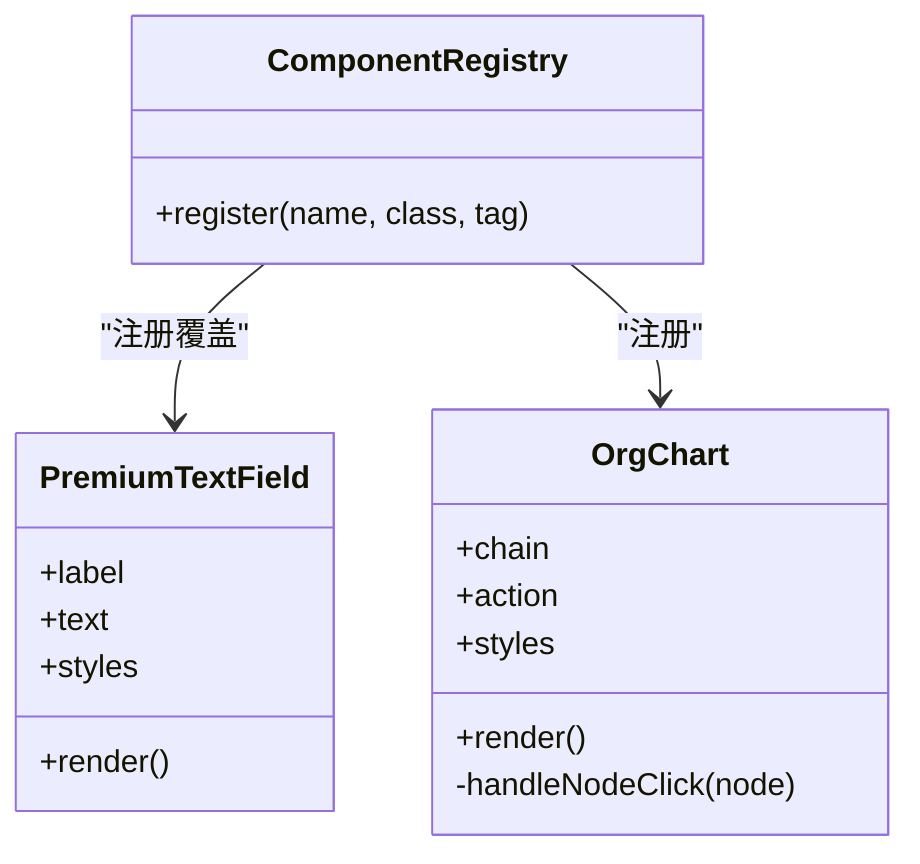
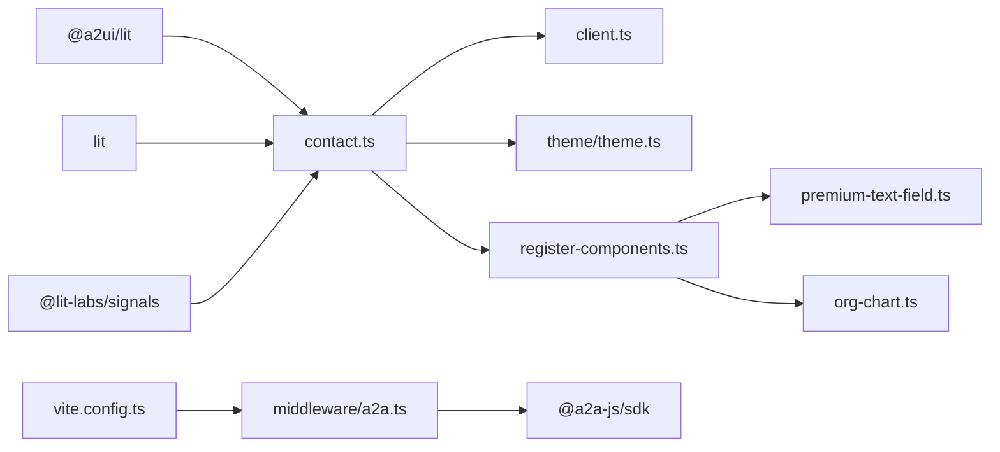

# Contact应用示例

<cite>
**本文引用的文件列表**
- [client.ts](file://samples/client/lit/contact/client.ts)
- [contact.ts](file://samples/client/lit/contact/contact.ts)
- [vite.config.ts](file://samples/client/lit/contact/vite.config.ts)
- [a2a.ts](file://samples/client/lit/contact/middleware/a2a.ts)
- [theme.ts](file://samples/client/lit/contact/theme/theme.ts)
- [register-components.ts](file://samples/client/lit/contact/ui/custom-components/register-components.ts)
- [premium-text-field.ts](file://samples/client/lit/contact/ui/custom-components/premium-text-field.ts)
- [org-chart.ts](file://samples/client/lit/contact/ui/custom-components/org-chart.ts)
- [package.json](file://samples/client/lit/contact/package.json)
- [types.ts](file://samples/client/lit/contact/types/types.ts)
- [ui.ts](file://samples/client/lit/contact/ui/ui.ts)
- [events.ts](file://samples/client/lit/contact/events/events.ts)
- [index.html](file://samples/client/lit/contact/index.html)
</cite>

## 目录
1. [简介](#简介)
2. [项目结构](#项目结构)
3. [核心组件](#核心组件)
4. [架构总览](#架构总览)
5. [组件详解](#组件详解)
6. [依赖关系分析](#依赖关系分析)
7. [性能与可维护性建议](#性能与可维护性建议)
8. [故障排查指南](#故障排查指南)
9. [结论](#结论)
10. [附录：快速上手与运行指南](#附录快速上手与运行指南)

## 简介
本文件面向希望基于A2UI构建Lit客户端的开发者，系统解析samples/client/lit/contact示例项目。该示例展示了如何使用v0.8版本的Lit渲染器创建一个联系人查询界面，演示了以下关键能力：
- 使用createSignalA2uiMessageProcessor初始化信号版消息处理器，并在UI中驱动组件渲染。
- 在主应用入口contact.ts中将处理器与根UI组件绑定，通过上下文注入主题。
- 通过middleware/a2a.ts拦截本地开发服务器的/a2a请求，转发到Agent服务并返回标准catalog消息。
- 自定义组件注册与覆盖：org-chart与premium-text-field的注册与行为。
- 主题扩展：theme/theme.ts对默认主题进行扩展与定制。
- 开发服务器代理与本地调试：vite.config.ts集成A2A中间件，支持npm run dev一键启动。

## 项目结构
该示例采用“按功能分层”的组织方式，核心文件分布如下：
- 根组件与入口：contact.ts、index.html
- 客户端通信：client.ts（封装/a2a调用）
- 中间件与代理：middleware/a2a.ts、middleware/index.ts、vite.config.ts
- 主题：theme/theme.ts
- 自定义组件：ui/custom-components/*（register-components.ts、premium-text-field.ts、org-chart.ts）
- 类型与UI工具：types/types.ts、ui/ui.ts、events/events.ts
- 包管理：package.json

图表来源
- [index.html](file://samples/client/lit/contact/index.html#L190-L196)
- [contact.ts](file://samples/client/lit/contact/contact.ts#L48-L56)
- [client.ts](file://samples/client/lit/contact/client.ts#L42-L63)
- [vite.config.ts](file://samples/client/lit/contact/vite.config.ts#L25-L45)
- [a2a.ts](file://samples/client/lit/contact/middleware/a2a.ts#L63-L153)
- [theme.ts](file://samples/client/lit/contact/theme/theme.ts#L182-L464)
- [register-components.ts](file://samples/client/lit/contact/ui/custom-components/register-components.ts#L21-L33)
- [premium-text-field.ts](file://samples/client/lit/contact/ui/custom-components/premium-text-field.ts#L16-L101)
- [org-chart.ts](file://samples/client/lit/contact/ui/custom-components/org-chart.ts#L16-L161)
- [package.json](file://samples/client/lit/contact/package.json#L1-L85)

章节来源
- [index.html](file://samples/client/lit/contact/index.html#L190-L196)
- [contact.ts](file://samples/client/lit/contact/contact.ts#L48-L56)
- [client.ts](file://samples/client/lit/contact/client.ts#L42-L63)
- [vite.config.ts](file://samples/client/lit/contact/vite.config.ts#L25-L45)
- [a2a.ts](file://samples/client/lit/contact/middleware/a2a.ts#L63-L153)
- [theme.ts](file://samples/client/lit/contact/theme/theme.ts#L182-L464)
- [register-components.ts](file://samples/client/lit/contact/ui/custom-components/register-components.ts#L21-L33)
- [premium-text-field.ts](file://samples/client/lit/contact/ui/custom-components/premium-text-field.ts#L16-L101)
- [org-chart.ts](file://samples/client/lit/contact/ui/custom-components/org-chart.ts#L16-L161)
- [package.json](file://samples/client/lit/contact/package.json#L1-L85)

## 核心组件
- 信号版消息处理器：在contact.ts中通过createSignalA2uiMessageProcessor创建处理器实例，用于接收Agent返回的标准catalog消息并驱动UI渲染。
- 主应用根组件：A2UIContactFinder作为自定义元素，提供表单输入、消息发送、Surface渲染、错误提示与Snackbar反馈。
- A2A客户端：A2UIClient封装/a2a接口调用，负责将用户事件转换为Agent可识别的消息格式并解析返回。
- 自定义组件注册：通过componentRegistry.register完成OrgChart与PremiumTextField的注册与覆盖。
- 主题扩展：theme/theme.ts扩展默认主题，覆盖组件样式与元素样式，满足业务风格需求。
- 开发中间件：Vite中间件拦截/a2a请求，将UI事件转为Agent消息并返回标准catalog消息。

章节来源
- [contact.ts](file://samples/client/lit/contact/contact.ts#L174-L176)
- [contact.ts](file://samples/client/lit/contact/contact.ts#L308-L333)
- [client.ts](file://samples/client/lit/contact/client.ts#L33-L66)
- [register-components.ts](file://samples/client/lit/contact/ui/custom-components/register-components.ts#L21-L33)
- [theme.ts](file://samples/client/lit/contact/theme/theme.ts#L182-L464)
- [a2a.ts](file://samples/client/lit/contact/middleware/a2a.ts#L63-L153)

## 架构总览
下图展示从浏览器到Agent的端到端流程，包括本地开发代理、消息处理器与UI渲染。

图表来源
- [contact.ts](file://samples/client/lit/contact/contact.ts#L308-L333)
- [client.ts](file://samples/client/lit/contact/client.ts#L42-L63)
- [a2a.ts](file://samples/client/lit/contact/middleware/a2a.ts#L63-L153)

## 组件详解

### 1) 信号版消息处理器与根UI绑定
- 初始化：在contact.ts中通过createSignalA2uiMessageProcessor创建处理器实例，并在构造函数中注入主题上下文。
- 消息处理：当收到Agent返回的消息后，清空旧Surface并调用processMessages更新UI。
- 表单交互：表单提交时构造A2UIClientEventMessage并通过#sendAndProcessMessage发送与处理。
- 动作事件：监听a2uiaction事件，收集上下文数据，构造用户动作消息并发送。

图表来源
- [contact.ts](file://samples/client/lit/contact/contact.ts#L174-L176)
- [contact.ts](file://samples/client/lit/contact/contact.ts#L308-L333)
- [contact.ts](file://samples/client/lit/contact/contact.ts#L196-L306)

章节来源
- [contact.ts](file://samples/client/lit/contact/contact.ts#L174-L176)
- [contact.ts](file://samples/client/lit/contact/contact.ts#L196-L306)
- [contact.ts](file://samples/client/lit/contact/contact.ts#L308-L333)

### 2) A2A中间件与本地代理
- 插件注册：vite.config.ts在开发模式下加载A2AMiddleware.plugin()，将中间件挂载到Vite Dev Server。
- 请求拦截：中间件拦截/a2a的POST请求，判断请求体是否为JSON或文本，分别构造消息。
- 代理转发：通过A2AClient.fromCardUrl连接Agent，设置扩展头以启用A2UI v0.8扩展，发送消息并返回标准catalog消息。
- 错误处理：当Agent返回错误时，返回500并包含错误信息；否则返回任务状态中的消息部分。

图表来源
- [vite.config.ts](file://samples/client/lit/contact/vite.config.ts#L25-L45)
- [a2a.ts](file://samples/client/lit/contact/middleware/a2a.ts#L63-L153)

章节来源
- [vite.config.ts](file://samples/client/lit/contact/vite.config.ts#L25-L45)
- [a2a.ts](file://samples/client/lit/contact/middleware/a2a.ts#L63-L153)

### 3) 自定义组件注册与覆盖
- 注册机制：通过componentRegistry.register完成组件注册，第一个参数为组件名，第二个为类，第三个为自定义标签名。
- 覆盖策略：PremiumTextField覆盖默认TextField，实现更丰富的视觉与交互体验。
- 扩展组件：OrgChart提供层级选择能力，点击节点会合并上下文并派发a2ui.action事件，便于后续动作处理。

图表来源
- [register-components.ts](file://samples/client/lit/contact/ui/custom-components/register-components.ts#L21-L33)
- [premium-text-field.ts](file://samples/client/lit/contact/ui/custom-components/premium-text-field.ts#L16-L101)
- [org-chart.ts](file://samples/client/lit/contact/ui/custom-components/org-chart.ts#L16-L161)

章节来源
- [register-components.ts](file://samples/client/lit/contact/ui/custom-components/register-components.ts#L21-L33)
- [premium-text-field.ts](file://samples/client/lit/contact/ui/custom-components/premium-text-field.ts#L16-L101)
- [org-chart.ts](file://samples/client/lit/contact/ui/custom-components/org-chart.ts#L16-L161)

### 4) 主题扩展与样式定制
- 主题结构：theme/theme.ts导出theme对象，包含additionalStyles、components、elements与markdown等字段。
- 组件样式覆盖：对Button、Card、CheckBox、DateTimeInput、Image、Icon、List、Modal、MultipleChoice、Row、Slider、Tabs、Text、TextField、Video等组件进行样式增强。
- 元素样式覆盖：对a、audio、body、button、h1/h2/h3、iframe、input、p、pre、textarea、video等元素进行样式调整。
- Markdown映射：将Markdown各级标题、段落、列表、链接等映射到对应的样式类集合。

章节来源
- [theme.ts](file://samples/client/lit/contact/theme/theme.ts#L182-L464)

### 5) 客户端通信封装
- 请求封装：A2UIClient.send通过fetch向/a2a发起POST请求，序列化消息并解析响应。
- 响应过滤：仅保留kind为"data"且非text的消息，忽略纯文本消息。
- 错误处理：当响应非200或返回error字段时抛出异常，由UI层捕获并显示Snackbar。

章节来源
- [client.ts](file://samples/client/lit/contact/client.ts#L33-L66)

### 6) UI工具与事件
- Snackbar工具：contact.ts中提供snackbar/unsnackbar方法，统一管理消息提示与持久化。
- 事件模型：events/events.ts定义了SnackbarActionEvent，便于组件间传递操作事件。

章节来源
- [contact.ts](file://samples/client/lit/contact/contact.ts#L335-L376)
- [events.ts](file://samples/client/lit/contact/events/events.ts#L19-L36)

## 依赖关系分析
- 运行时依赖：@a2ui/lit、lit、@lit-labs/signals、@lit/context、uuid、dotenv、vite、wireit。
- 开发依赖：typescript、@a2a-js/sdk。
- 关键耦合点：
  - contact.ts依赖v0_8渲染器与主题，依赖A2UIClient与自定义组件注册。
  - client.ts依赖fetch与/a2a路径，与中间件解耦。
  - vite.config.ts依赖middleware/a2a.ts插件，实现本地代理。
  - middleware/a2a.ts依赖@a2a-js/sdk与Agent卡片地址，负责消息转发。

图表来源
- [package.json](file://samples/client/lit/contact/package.json#L70-L84)
- [contact.ts](file://samples/client/lit/contact/contact.ts#L38-L46)
- [client.ts](file://samples/client/lit/contact/client.ts#L17-L23)
- [vite.config.ts](file://samples/client/lit/contact/vite.config.ts#L25-L45)
- [a2a.ts](file://samples/client/lit/contact/middleware/a2a.ts#L17-L26)
- [register-components.ts](file://samples/client/lit/contact/ui/custom-components/register-components.ts#L17-L20)

章节来源
- [package.json](file://samples/client/lit/contact/package.json#L70-L84)
- [contact.ts](file://samples/client/lit/contact/contact.ts#L38-L46)
- [client.ts](file://samples/client/lit/contact/client.ts#L17-L23)
- [vite.config.ts](file://samples/client/lit/contact/vite.config.ts#L25-L45)
- [a2a.ts](file://samples/client/lit/contact/middleware/a2a.ts#L17-L26)
- [register-components.ts](file://samples/client/lit/contact/ui/custom-components/register-components.ts#L17-L20)

## 性能与可维护性建议
- 消息处理批量化：在批量消息到达时，尽量一次性clearSurfaces并processMessages，减少重复渲染。
- 组件懒加载：对于复杂自定义组件，可在首次使用时再注册，降低首屏开销。
- 主题模块化：将主题拆分为多个小模块，按需引入，避免全局样式膨胀。
- 中间件健壮性：在中间件中增加超时与重试逻辑，提升与Agent通信的稳定性。
- 缓存策略：对静态资源与主题变量进行缓存，减少重复计算与DOM更新。

## 故障排查指南
- 无法访问/a2a：
  - 确认vite.config.ts已加载A2AMiddleware.plugin()。
  - 确认Agent卡片地址可达且支持A2UI v0.8扩展头。
- 无消息返回：
  - 检查中间件是否正确解析请求体并转发至Agent。
  - 查看控制台日志，确认返回的消息数组是否为空。
- 组件未生效：
  - 确认register-components.ts已执行并输出注册日志。
  - 检查组件标签名与注册名一致。
- 主题不生效：
  - 确认contact.ts已通过provide注入themeContext。
  - 检查theme/theme.ts导出的theme对象是否被正确使用。

章节来源
- [vite.config.ts](file://samples/client/lit/contact/vite.config.ts#L25-L45)
- [a2a.ts](file://samples/client/lit/contact/middleware/a2a.ts#L63-L153)
- [register-components.ts](file://samples/client/lit/contact/ui/custom-components/register-components.ts#L21-L33)
- [theme.ts](file://samples/client/lit/contact/theme/theme.ts#L182-L196)
- [contact.ts](file://samples/client/lit/contact/contact.ts#L48-L56)

## 结论
本示例以最小实现展示了A2UI在Lit中的典型用法：通过createSignalA2uiMessageProcessor驱动UI、通过A2UIClient与Agent通信、通过中间件实现本地代理、通过自定义组件与主题扩展满足业务需求。开发者可在此基础上进一步扩展Catalog、动作与主题，构建更复杂的业务场景。

## 附录：快速上手与运行指南
- 启动开发服务器：
  - 在项目根目录执行npm run dev，Vite将以开发模式启动并加载中间件。
- 访问应用：
  - 浏览器打开http://localhost:5173，即可看到Contact Finder界面。
- 与Agent交互：
  - 在输入框中输入查询或触发组件动作，消息将经由/a2a转发至Agent并返回标准catalog消息。
- 自定义组件与主题：
  - 修改ui/custom-components/*与theme/theme.ts以适配业务风格。
- 构建与测试：
  - 使用npm run build进行编译；使用npm run test运行测试脚本（如存在）。

章节来源
- [package.json](file://samples/client/lit/contact/package.json#L9-L23)
- [vite.config.ts](file://samples/client/lit/contact/vite.config.ts#L25-L45)
- [index.html](file://samples/client/lit/contact/index.html#L190-L196)