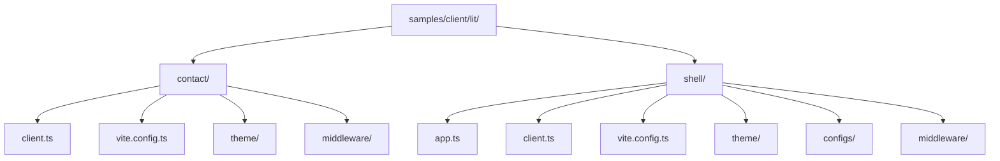
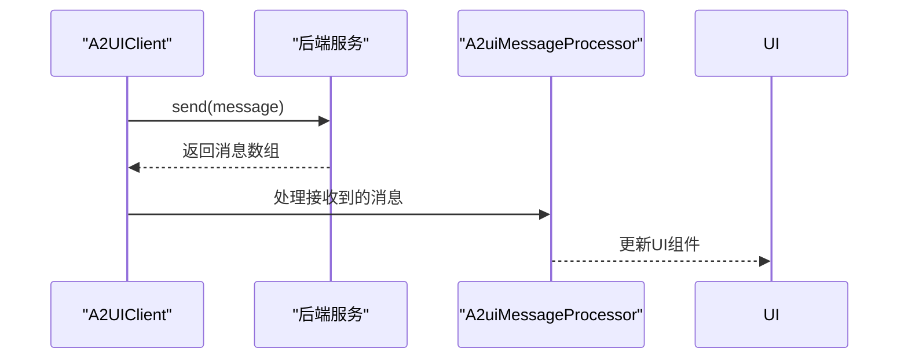
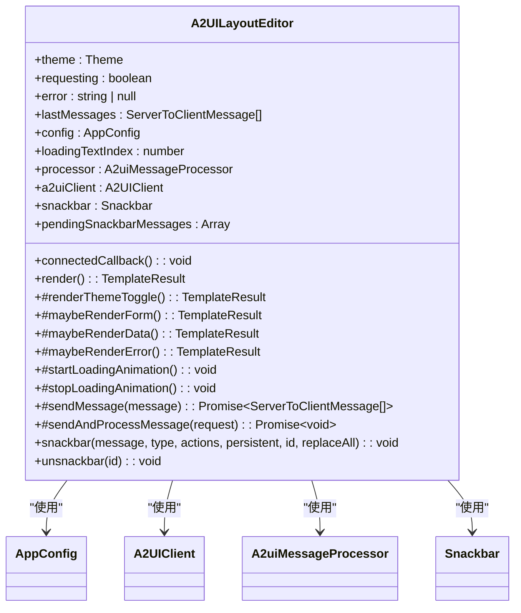
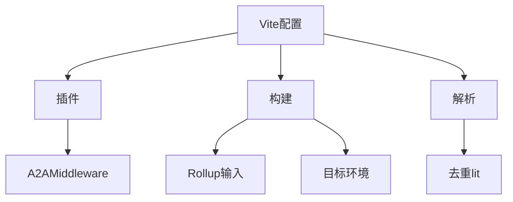
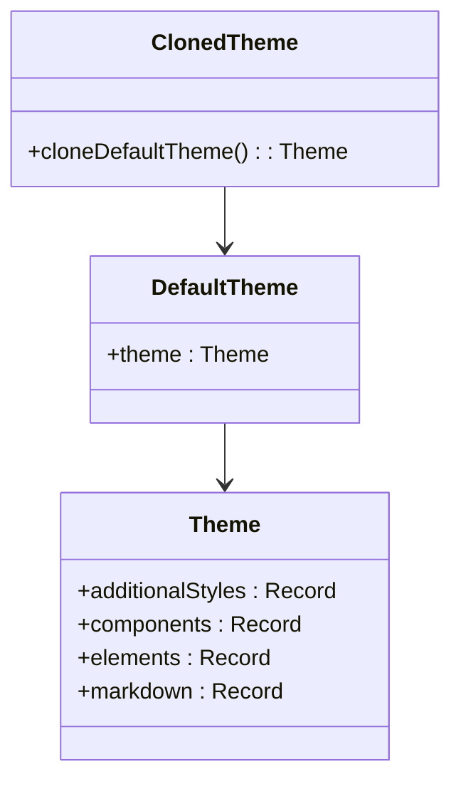

# Lit客户端示例

<cite>
**本文档中引用的文件**  
- [contact/client.ts](file://samples/client/lit/contact/client.ts)
- [contact/vite.config.ts](file://samples/client/lit/contact/vite.config.ts)
- [contact/theme/theme.ts](file://samples/client/lit/contact/theme/theme.ts)
- [contact/middleware/a2a.ts](file://samples/client/lit/contact/middleware/a2a.ts)
- [shell/app.ts](file://samples/client/lit/shell/app.ts)
- [shell/client.ts](file://samples/client/lit/shell/client.ts)
- [shell/vite.config.ts](file://samples/client/lit/shell/vite.config.ts)
- [shell/theme/default-theme.ts](file://samples/client/lit/shell/theme/default-theme.ts)
- [shell/theme/clone-default-theme.ts](file://samples/client/lit/shell/theme/clone-default-theme.ts)
- [shell/configs/restaurant.ts](file://samples/client/lit/shell/configs/restaurant.ts)
- [shell/configs/contacts.ts](file://samples/client/lit/shell/configs/contacts.ts)
- [shell/middleware/a2a.ts](file://samples/client/lit/shell/middleware/a2a.ts)
- [shell/package.json](file://samples/client/lit/shell/package.json)
- [contact/package.json](file://samples/client/lit/contact/package.json)
</cite>

## 目录
1. [简介](#简介)
2. [项目结构](#项目结构)
3. [contact项目分析](#contact项目分析)
4. [shell项目分析](#shell项目分析)
5. [Vite开发服务器配置](#vite开发服务器配置)
6. [主题继承机制](#主题继承机制)
7. [运行方法](#运行方法)
8. [总结](#总结)

## 简介
本文档全面解析`samples/client/lit/`目录下的两个示例项目：`contact/`和`shell/`。首先分析`contact/`项目如何使用Vite构建，`client.ts`中`A2uiMessageProcessor`的初始化流程，以及`app.ts`如何将处理器与UI绑定。其次解读`shell/`项目作为通用Shell的架构，`configs/`目录下的预设配置如何加载，以及`middleware/a2a.ts`如何处理A2A协议消息。文档详细描述`vite.config.ts`中的开发服务器配置，提供`npm run dev`的运行方法，并解释`theme/`目录下的主题继承机制，为开发者提供从零搭建Lit客户端的完整指南。

## 项目结构
`samples/client/lit/`目录包含两个示例项目：`contact/`和`shell/`。两个项目都使用Vite作为构建工具，采用TypeScript编写，基于Lit框架构建用户界面。每个项目都有独立的`package.json`、`vite.config.ts`、`client.ts`和`app.ts`文件，以及各自的`theme/`和`middleware/`目录。



**图源**
- [contact/client.ts](file://samples/client/lit/contact/client.ts)
- [shell/app.ts](file://samples/client/lit/shell/app.ts)

## contact项目分析
`contact/`项目是一个具体的客户端示例，展示了如何使用A2UI Lit渲染器构建一个联系人管理应用。项目通过`client.ts`文件定义了`A2UIClient`类，该类封装了与后端服务通信的逻辑。

`A2UIClient`类的`send`方法通过`fetch`向`/a2a`端点发送消息，并处理响应。响应数据被解析为`ServerToClientMessage`数组，供UI组件使用。项目还通过`registerContactComponents()`函数注册了自定义组件，扩展了UI功能。



**图源**
- [contact/client.ts](file://samples/client/lit/contact/client.ts)

**本节源码**
- [contact/client.ts](file://samples/client/lit/contact/client.ts)
- [contact/theme/theme.ts](file://samples/client/lit/contact/theme/theme.ts)

## shell项目分析
`shell/`项目是一个通用的Shell应用，旨在作为不同应用场景的模板。项目通过`app.ts`文件定义了`A2UILayoutEditor`类，该类使用Lit的装饰器系统管理状态和UI更新。

Shell应用的核心特性是通过URL参数动态加载不同的配置。`connectedCallback`方法在组件连接到DOM时被调用，它解析URL中的`app`参数，从预定义的配置对象中选择相应的配置，并应用到应用中。这种设计使得同一个Shell可以支持多个不同的应用场景，如餐厅查找和联系人管理。



**图源**
- [shell/app.ts](file://samples/client/lit/shell/app.ts)

**本节源码**
- [shell/app.ts](file://samples/client/lit/shell/app.ts)
- [shell/configs/restaurant.ts](file://samples/client/lit/shell/configs/restaurant.ts)
- [shell/configs/contacts.ts](file://samples/client/lit/shell/configs/contacts.ts)

## Vite开发服务器配置
两个项目都使用Vite作为开发服务器和构建工具。`vite.config.ts`文件配置了Vite的插件、构建选项和解析规则。核心配置包括：

- **插件**：使用`middleware/a2a.ts`中的`A2AMiddleware`插件处理`/a2a`端点的请求。
- **构建**：配置Rollup的输入文件和目标环境为`esnext`。
- **解析**：去重`lit`依赖，避免打包时出现多个版本。



**图源**
- [contact/vite.config.ts](file://samples/client/lit/contact/vite.config.ts)
- [shell/vite.config.ts](file://samples/client/lit/shell/vite.config.ts)

**本节源码**
- [contact/vite.config.ts](file://samples/client/lit/contact/vite.config.ts)
- [shell/vite.config.ts](file://samples/client/lit/shell/vite.config.ts)

## 主题继承机制
主题系统允许开发者自定义应用的外观。`shell/`项目通过`theme/`目录下的`default-theme.ts`文件定义了默认主题，并通过`clone-default-theme.ts`文件提供了克隆默认主题的功能。

`contacts.ts`配置文件通过`cloneDefaultTheme()`函数获取默认主题的副本，并在此基础上进行修改，实现了主题的继承和扩展。这种方式既保留了默认主题的基础样式，又允许针对特定应用场景进行定制。



**图源**
- [shell/theme/default-theme.ts](file://samples/client/lit/shell/theme/default-theme.ts)
- [shell/theme/clone-default-theme.ts](file://samples/client/lit/shell/theme/clone-default-theme.ts)

**本节源码**
- [shell/theme/default-theme.ts](file://samples/client/lit/shell/theme/default-theme.ts)
- [shell/theme/clone-default-theme.ts](file://samples/client/lit/shell/theme/clone-default-theme.ts)
- [shell/configs/contacts.ts](file://samples/client/lit/shell/configs/contacts.ts)

## 运行方法
要运行任一项目，首先确保已安装Node.js和npm。然后在项目根目录执行以下命令：

```bash
npm install
npm run dev
```

`npm run dev`命令会启动Vite开发服务器，监听默认端口（通常是3000）。开发者可以通过浏览器访问`http://localhost:3000`来查看应用。对于`shell/`项目，可以通过URL参数`?app=restaurant`或`?app=contacts`来切换不同的应用场景。

**本节源码**
- [shell/package.json](file://samples/client/lit/shell/package.json)
- [contact/package.json](file://samples/client/lit/contact/package.json)

## 总结
本文档详细解析了`samples/client/lit/`目录下的两个示例项目，涵盖了从项目结构、核心组件、开发服务器配置到主题继承机制的各个方面。通过这些示例，开发者可以快速理解如何使用A2UI Lit渲染器构建现代化的Web应用，并根据需要进行定制和扩展。