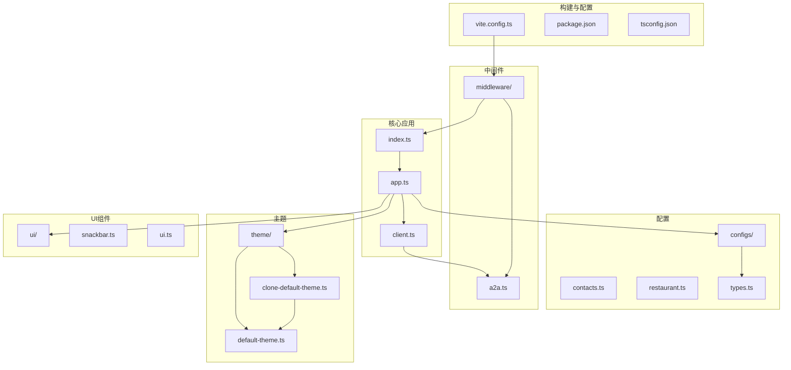
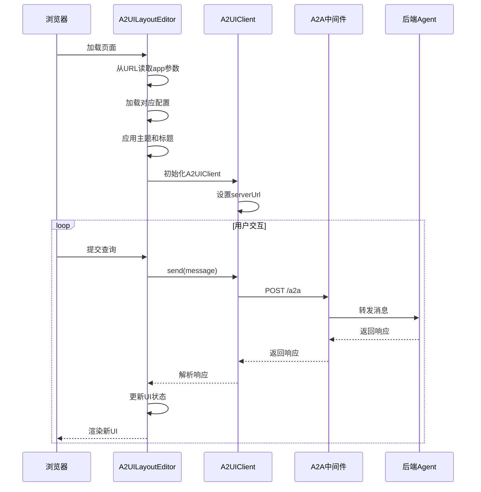

# Shell框架示例

<cite>
**本文档中引用的文件**  
- [client.ts](file://samples/client/lit/shell/client.ts)
- [app.ts](file://samples/client/lit/shell/app.ts)
- [middleware/a2a.ts](file://samples/client/lit/shell/middleware/a2a.ts)
- [theme/default-theme.ts](file://samples/client/lit/shell/theme/default-theme.ts)
- [theme/clone-default-theme.ts](file://samples/client/lit/shell/theme/clone-default-theme.ts)
- [configs/contacts.ts](file://samples/client/lit/shell/configs/contacts.ts)
- [configs/restaurant.ts](file://samples/client/lit/shell/configs/restaurant.ts)
- [vite.config.ts](file://samples/client/lit/shell/vite.config.ts)
- [configs/types.ts](file://samples/client/lit/shell/configs/types.ts)
</cite>

## 目录
1. [简介](#简介)
2. [项目结构](#项目结构)
3. [核心组件](#核心组件)
4. [架构概述](#架构概述)
5. [详细组件分析](#详细组件分析)
6. [依赖分析](#依赖分析)
7. [性能考虑](#性能考虑)
8. [故障排除指南](#故障排除指南)
9. [结论](#结论)

## 简介
本示例项目`samples/client/lit/shell/`提供了一个可复用的客户端Shell框架，旨在作为A2UI（Agent-to-User Interface）系统的通用基础。该框架基于Lit Web组件库构建，展示了如何创建一个灵活、可配置且主题化的客户端应用，能够与不同的Agent后端进行交互。通过动态加载预设配置，开发者可以快速切换不同的Agent场景，如联系人管理和餐厅查找，而无需修改核心代码。此框架还集成了A2A（Agent-to-Agent）协议消息处理中间件，实现了消息的拦截与分发，并提供了完整的主题化解决方案，包括基础主题定义和继承扩展机制。

## 项目结构
该Shell框架的目录结构清晰，遵循模块化设计原则，便于维护和扩展。主要包含配置、中间件、主题、类型定义、UI组件和核心应用逻辑等部分。



**图源**
- [app.ts](file://samples/client/lit/shell/app.ts#L1-L561)
- [client.ts](file://samples/client/lit/shell/client.ts#L1-L113)
- [middleware/a2a.ts](file://samples/client/lit/shell/middleware/a2a.ts#L1-L154)
- [theme/default-theme.ts](file://samples/client/lit/shell/theme/default-theme.ts#L1-L443)
- [theme/clone-default-theme.ts](file://samples/client/lit/shell/theme/clone-default-theme.ts#L1-L23)
- [configs/contacts.ts](file://samples/client/lit/shell/configs/contacts.ts#L1-L347)
- [configs/restaurant.ts](file://samples/client/lit/shell/configs/restaurant.ts#L1-L58)

**本节源码**
- [app.ts](file://samples/client/lit/shell/app.ts#L1-L561)
- [client.ts](file://samples/client/lit/shell/client.ts#L1-L113)
- [middleware/a2a.ts](file://samples/client/lit/shell/middleware/a2a.ts#L1-L154)
- [theme/default-theme.ts](file://samples/client/lit/shell/theme/default-theme.ts#L1-L443)
- [theme/clone-default-theme.ts](file://samples/client/lit/shell/theme/clone-default-theme.ts#L1-L23)
- [configs/contacts.ts](file://samples/client/lit/shell/configs/contacts.ts#L1-L347)
- [configs/restaurant.ts](file://samples/client/lit/shell/configs/restaurant.ts#L1-L58)
- [vite.config.ts](file://samples/client/lit/shell/vite.config.ts#L1-L46)

## 核心组件
`client.ts`文件定义了`A2UIClient`类，它是与后端Agent通信的核心。该类封装了A2A协议的细节，通过`@a2a-js/sdk`库发送消息，并处理响应。`A2UIClient`的构造函数接受一个可选的`serverUrl`参数，用于指定Agent的地址。`send`方法接受一个`A2UIClientEventMessage`或字符串，将其包装成A2A协议所需的格式，并通过`A2AClient`实例发送。消息的MIME类型被设置为`application/json+a2aui`，以标识其为A2UI消息。该类还处理了JSON解析和错误传播，确保了通信的健壮性。

**本节源码**
- [client.ts](file://samples/client/lit/shell/client.ts#L1-L113)

## 架构概述
该Shell框架采用分层架构，将应用逻辑、通信、配置和UI分离。`app.ts`作为应用的主入口，负责初始化和协调各个组件。它通过`A2UILayoutEditor`自定义元素实现，利用Lit的响应式特性管理状态。应用启动时，从URL参数中读取`app`键，动态加载对应的配置（如`contacts`或`restaurant`），并应用相应的主题和服务器URL。`A2UIClient`实例负责与后端Agent进行通信，而`A2uiMessageProcessor`则处理接收到的A2UI消息，更新UI状态。中间件`a2a.ts`在开发服务器中拦截`/a2a`路径的POST请求，充当代理，将前端请求转发给Agent，并将响应返回给前端，实现了前后端的解耦。



**图源**
- [app.ts](file://samples/client/lit/shell/app.ts#L1-L561)
- [client.ts](file://samples/client/lit/shell/client.ts#L1-L113)
- [middleware/a2a.ts](file://samples/client/lit/shell/middleware/a2a.ts#L1-L154)

## 详细组件分析
### A2uiMessageProcessor配置分析
`app.ts`中的`#processor`是`A2uiMessageProcessor`的一个实例，由`@a2ui/lit`库提供。它被配置为信号处理器（`createSignalA2uiMessageProcessor`），能够响应式地处理A2UI消息。当`#sendAndProcessMessage`方法接收到从`A2UIClient`返回的消息数组时，它会调用`#processor.processMessages(messages)`。处理器会解析这些消息，更新其内部状态（如表面和数据），并触发UI更新。`#processor.getSurfaces()`方法返回当前所有活动的表面（surfaces），这些表面由`repeat`指令在模板中渲染为`<a2ui-surface>`组件。处理器还提供了`resolvePath`和`getData`等方法，用于在处理用户操作时解析数据路径和获取上下文数据。

**本节源码**
- [app.ts](file://samples/client/lit/shell/app.ts#L269-L517)

### 动态配置加载机制
`app.ts`通过导入`configs/`目录下的`contacts.ts`和`restaurant.ts`文件，将它们的`config`常量注册到一个`configs`对象中。`connectedCallback`生命周期钩子在组件连接到DOM时执行，它解析URL中的`app`查询参数，如果存在则使用该键从`configs`对象中选择对应的配置，否则默认使用`restaurant`配置。选定的配置被赋值给`this.config`状态属性。此配置不仅决定了应用的标题和占位符文本，还可能包含自定义的`theme`对象，该对象会通过`@provide`装饰器注入到Lit上下文中，从而影响整个应用的视觉样式。

**本节源码**
- [app.ts](file://samples/client/lit/shell/app.ts#L50-L70)
- [app.ts](file://samples/client/lit/shell/app.ts#L286-L294)
- [configs/contacts.ts](file://samples/client/lit/shell/configs/contacts.ts#L329-L346)
- [configs/restaurant.ts](file://samples/client/lit/shell/configs/restaurant.ts#L19-L57)
- [configs/types.ts](file://samples/client/lit/shell/configs/types.ts#L22-L41)

### A2A中间件消息处理
`middleware/a2a.ts`文件定义了一个Vite插件，该插件向开发服务器添加了一个中间件。此中间件监听`/a2a`路径的POST请求。当收到请求时，它会读取请求体。如果请求体是有效的JSON，它会将其解析为一个A2UI客户端事件消息，并将其包装成一个包含`application/json+a2aui` MIME类型的A2A数据部分。如果请求体是纯文本，则将其作为文本部分发送。中间件使用`A2AClient.fromCardUrl`连接到本地运行的Agent（默认为`http://localhost:10002`），并发送消息。它将A2A响应中的`parts`数组（可能包含A2UI消息）作为JSON返回给前端。此中间件通过添加`X-A2A-Extensions`头来声明对A2UI扩展的支持。

**本节源码**
- [middleware/a2a.ts](file://samples/client/lit/shell/middleware/a2a.ts#L1-L154)

### 主题化机制
`theme/`目录下的`default-theme.ts`文件定义了一个名为`theme`的常量，其类型为`v0_8.Types.Theme`。该主题对象包含`additionalStyles`、`components`、`elements`和`markdown`等属性，用于定义全局CSS变量、组件样式、HTML元素样式和Markdown渲染样式。`clone-default-theme.ts`提供了一个`cloneDefaultTheme`函数，该函数使用`structuredClone`安全地复制`default-theme`的完整对象。`contacts.ts`配置文件通过导入并调用`cloneDefaultTheme()`来创建一个基础主题的副本，然后在其上进行覆盖和扩展，例如修改`Card`和`Button`组件的样式。这种机制允许在不修改原始主题的情况下创建定制化主题，实现了主题的继承和复用。

**本节源码**
- [theme/default-theme.ts](file://samples/client/lit/shell/theme/default-theme.ts#L1-L443)
- [theme/clone-default-theme.ts](file://samples/client/lit/shell/theme/clone-default-theme.ts#L1-L23)
- [configs/contacts.ts](file://samples/client/lit/shell/configs/contacts.ts#L17-L68)

## 依赖分析
该项目的依赖关系清晰，主要依赖于Lit生态和A2A协议相关的库。`package.json`文件列出了核心依赖，包括`lit`、`@a2ui/lit`（本地链接的渲染器）、`@a2a-js/sdk`（用于A2A通信）和`@lit/context`（用于状态管理）。开发依赖包括`vite`（构建工具）、`typescript`（类型检查）和`dotenv`（环境变量）。`vite.config.ts`通过`resolve.dedupe`确保`lit`库在打包时不会重复。`middleware/a2a.ts`依赖于Node.js的`http`模块和`uuid`库。`app.ts`和`client.ts`之间存在直接依赖，`app.ts`依赖于`client.ts`提供的客户端功能，而`client.ts`则依赖于外部的A2A SDK。

```mermaid
graph LR
A[app.ts] --> B[client.ts]
B --> C[@a2a-js/sdk]
A --> D[configs/]
A --> E[theme/]
A --> F[ui/]
E --> G[default-theme.ts]
E --> H[clone-default-theme.ts]
H --> G
I[vite.config.ts] --> J[middleware/a2a.ts]
J --> C
J --> K[uuid]
J --> L[http]
```

**图源**
- [package.json](file://samples/client/lit/shell/package.json#L77-L85)
- [vite.config.ts](file://samples/client/lit/shell/vite.config.ts#L1-L46)
- [app.ts](file://samples/client/lit/shell/app.ts#L1-L561)
- [client.ts](file://samples/client/lit/shell/client.ts#L1-L113)
- [middleware/a2a.ts](file://samples/client/lit/shell/middleware/a2a.ts#L1-L154)

**本节源码**
- [package.json](file://samples/client/lit/shell/package.json#L77-L85)
- [vite.config.ts](file://samples/client/lit/shell/vite.config.ts#L1-L46)

## 性能考虑
该框架在性能方面做了基本的优化。使用Lit的响应式系统和`SignalWatcher`可以确保只有当相关状态改变时，UI才会重新渲染，减少了不必要的DOM操作。`A2uiMessageProcessor`的信号实现也保证了高效的状态更新。然而，潜在的性能瓶颈可能出现在网络通信和消息处理上。`A2UIClient`在发送消息时会阻塞UI（通过`#requesting`状态），并显示加载动画。对于复杂或大量的A2UI消息，`processMessages`方法的处理时间可能会影响用户体验。此外，`middleware/a2a.ts`作为开发服务器的中间件，在生产环境中可能需要被更高效的反向代理（如Nginx）替代，以处理高并发请求。

## 故障排除指南
如果应用无法正常工作，请按以下步骤排查：
1.  **构建依赖**：确保已先构建`renderers/lit`包，如`README.md`中所述。
2.  **启动顺序**：必须先启动后端Agent服务器（如`restaurant_finder`），然后再运行`npm run dev`启动前端。
3.  **端口冲突**：检查`configs/restaurant.ts`和`configs/contacts.ts`中指定的`serverUrl`端口（如10002, 10003）是否已被占用。
4.  **网络请求**：在浏览器开发者工具中检查`/a2a`的POST请求，确认请求体和响应是否符合预期。
5.  **主题应用**：如果自定义主题未生效，请检查`app.ts`中`connectedCallback`的逻辑，确保`this.config.theme`被正确赋值并注入上下文。
6.  **中间件错误**：查看Vite开发服务器的控制台输出，`middleware/a2a.ts`中的`console.error`会输出A2A通信错误。

**本节源码**
- [README.md](file://samples/client/lit/shell/README.md#L1-L38)
- [app.ts](file://samples/client/lit/shell/app.ts#L286-L294)
- [client.ts](file://samples/client/lit/shell/client.ts#L110-L111)
- [middleware/a2a.ts](file://samples/client/lit/shell/middleware/a2a.ts#L124-L128)

## 结论
`samples/client/lit/shell/`示例项目成功地展示了一个功能完整、设计良好的可复用客户端Shell框架。它通过`A2UIClient`实现了与A2A Agent的通信，利用`app.ts`中的动态配置加载机制支持多场景快速切换，并通过`middleware/a2a.ts`中间件优雅地处理了开发环境下的消息代理。其主题化系统，以`default-theme.ts`为基础并通过`clone-default-theme.ts`实现继承扩展，为UI定制提供了强大的灵活性。结合`vite.config.ts`的配置和`npm run dev`的启动流程，开发者可以立即获得一个开箱即用的、高度可定制的Lit客户端基础框架，极大地加速了A2UI应用的开发进程。