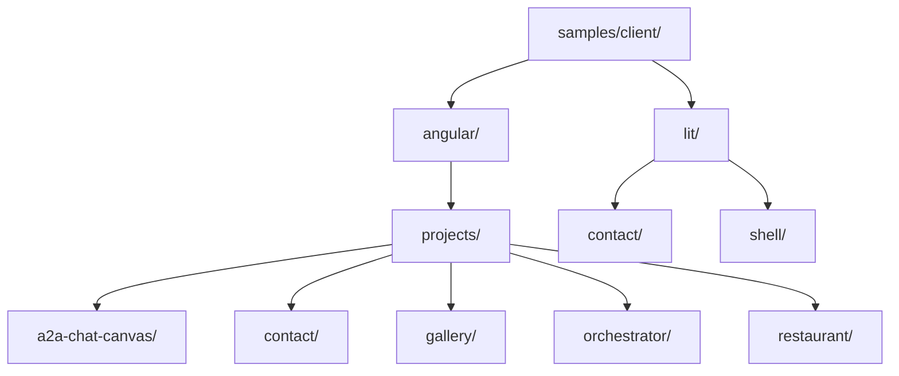
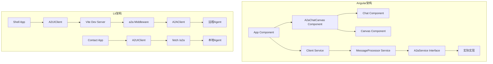
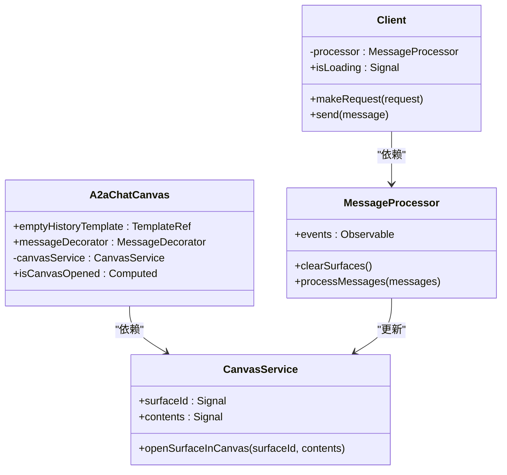
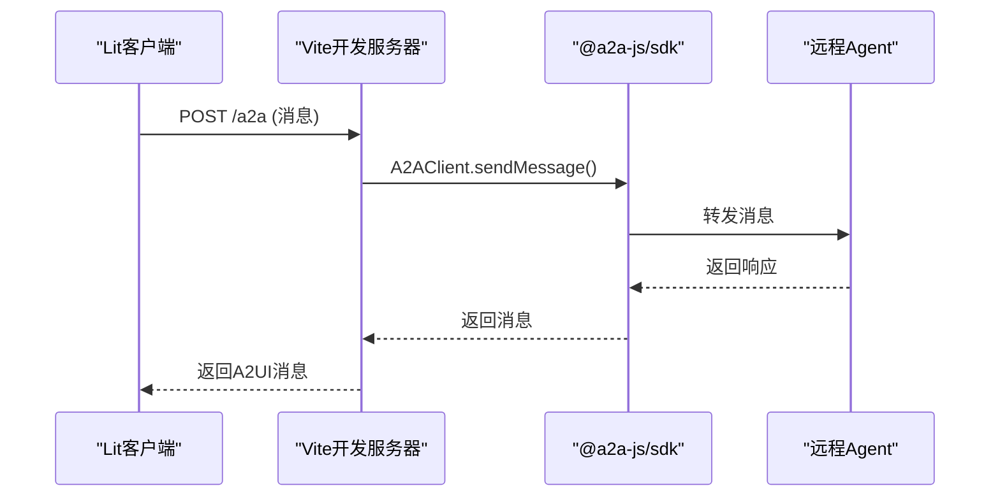
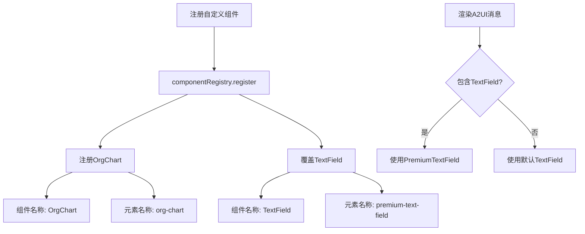

# 客户端示例

<cite>
**本文档中引用的文件**  
- [a2a-chat-canvas.ts](file://samples/client/angular/projects/a2a-chat-canvas/src/lib/a2a-chat-canvas.ts)
- [a2a-service.ts](file://samples/client/angular/projects/a2a-chat-canvas/src/lib/interfaces/a2a-service.ts)
- [client.ts](file://samples/client/angular/projects/contact/src/app/client.ts)
- [client.ts](file://samples/client/lit/contact/client.ts)
- [client.ts](file://samples/client/lit/shell/client.ts)
- [app.ts](file://samples/client/angular/projects/gallery/src/app/app.ts)
- [a2a-service-impl.ts](file://samples/client/angular/projects/orchestrator/src/services/a2a-service-impl.ts)
- [register-components.ts](file://samples/client/lit/contact/ui/custom-components/register-components.ts)
- [a2a.ts](file://samples/client/lit/shell/middleware/a2a.ts)
- [canvas-service.ts](file://samples/client/angular/projects/a2a-chat-canvas/src/lib/services/canvas-service.ts)
- [package.json](file://samples/client/angular/projects/a2a-chat-canvas/package.json)
- [package.json](file://samples/client/lit/contact/package.json)
- [package.json](file://samples/client/lit/shell/package.json)
- [app.ts](file://samples/client/angular/projects/contact/src/app/app.ts)
- [CLAUDE.md](file://samples/CLAUDE.md)
</cite>

## 目录
1. [简介](#简介)
2. [项目结构](#项目结构)
3. [核心组件](#核心组件)
4. [架构概述](#架构概述)
5. [详细组件分析](#详细组件分析)
6. [依赖分析](#依赖分析)
7. [性能考虑](#性能考虑)
8. [故障排除指南](#故障排除指南)
9. [结论](#结论)
10. [附录](#附录)（如有必要）

## 简介
本文档全面解析`samples/client/`目录下的Angular和Lit客户端实现。首先分析Angular示例，重点讲解`projects/gallery/`作为组件展示库的结构，说明`a2a-chat-canvas`组件库的封装方式，以及`contact`、`restaurant`等具体应用如何通过`a2a-service`集成渲染器。其次，深入Lit示例，解读`lit/contact/`和`lit/shell/`项目，说明如何使用Vite构建环境，以及`client.ts`中`A2uiMessageProcessor`的初始化和消息处理流程。文档对比两种框架的集成模式，提供详细的运行指令（如`ng serve`和`npm run dev`），并结合`samples/CLAUDE.md`中的学习路径，为开发者推荐从简单到复杂的实践顺序。

## 项目结构
`samples/client/`目录包含使用不同前端框架实现的客户端应用示例，主要分为Angular和Lit两大类。Angular示例采用Angular CLI项目结构，包含多个独立的Angular应用和一个共享的组件库`a2a-chat-canvas`。Lit示例则采用基于Vite的现代前端构建环境，通过模块化方式组织代码。



**图示来源**
- [CLAUDE.md](file://samples/CLAUDE.md#L17-L60)

**本节来源**
- [CLAUDE.md](file://samples/CLAUDE.md#L17-L60)

## 核心组件
Angular客户端的核心是`a2a-chat-canvas`组件库，它封装了聊天界面和画布渲染功能。该库通过`A2aChatCanvas`组件协调`Chat`和`Canvas`两个子组件，根据`CanvasService`中的`surfaceId`状态决定是否显示画布。`A2aService`接口定义了与Agent通信的契约，包括发送消息和获取Agent卡片信息的方法。

Lit客户端的核心是`A2UIClient`类，它封装了与Agent的HTTP通信逻辑。`contact`和`shell`项目都实现了自己的`A2UIClient`，通过`fetch` API发送POST请求到`/a2a`端点，并处理返回的A2UI消息。`shell`项目还使用了`@a2a-js/sdk`中的`A2AClient`来简化Agent通信。

**本节来源**
- [a2a-chat-canvas.ts](file://samples/client/angular/projects/a2a-chat-canvas/src/lib/a2a-chat-canvas.ts#L17-L43)
- [a2a-service.ts](file://samples/client/angular/projects/a2a-chat-canvas/src/lib/interfaces/a2a-service.ts#L17-L43)
- [client.ts](file://samples/client/lit/contact/client.ts#L17-L65)
- [client.ts](file://samples/client/lit/shell/client.ts#L17-L112)

## 架构概述
Angular客户端采用典型的Angular应用架构，使用依赖注入（DI）管理服务，通过组件树组织UI。`a2a-chat-canvas`库作为可复用的UI组件库，被`contact`、`restaurant`等具体应用引用。`MessageProcessor`服务负责处理来自Agent的A2UI消息，并更新应用状态。

Lit客户端采用更轻量级的架构，基于原生ES模块和Web Components。`shell`项目通过Vite插件`a2a.ts`在开发服务器中拦截`/a2a`请求，使用`A2AClient`与远程Agent通信。`contact`项目则直接在客户端处理通信，更适合嵌入到现有应用中。



**图示来源**
- [a2a-chat-canvas.ts](file://samples/client/angular/projects/a2a-chat-canvas/src/lib/a2a-chat-canvas.ts#L17-L43)
- [client.ts](file://samples/client/lit/shell/client.ts#L17-L112)
- [a2a.ts](file://samples/client/lit/shell/middleware/a2a.ts#L17-L153)

## 详细组件分析

### Angular组件分析
`a2a-chat-canvas`库的`A2aChatCanvas`组件是整个聊天界面的核心。它通过`input`装饰器接收`emptyHistoryTemplate`和`messageDecorator`等可选输入，通过`computed`信号`isCanvasOpened`监控画布的打开状态。`CanvasService`服务使用`signal`管理`surfaceId`和`contents`状态，实现了响应式的数据流。

`contact`应用的`App`组件注入`Client`和`MessageProcessor`服务，通过表单提交事件触发`makeRequest`方法。`Client`服务订阅`MessageProcessor`的事件流，处理Agent响应并更新UI。



**图示来源**
- [a2a-chat-canvas.ts](file://samples/client/angular/projects/a2a-chat-canvas/src/lib/a2a-chat-canvas.ts#L17-L43)
- [canvas-service.ts](file://samples/client/angular/projects/a2a-chat-canvas/src/lib/services/canvas-service.ts#L17-L41)
- [client.ts](file://samples/client/angular/projects/contact/src/app/client.ts#L17-L82)
- [app.ts](file://samples/client/angular/projects/contact/src/app/app.ts#L17-L50)

### Lit组件分析
Lit客户端的`A2UIClient`类封装了与Agent的通信逻辑。`contact`项目的`A2UIClient`直接使用`fetch` API，而`shell`项目的`A2UIClient`则使用`@a2a-js/sdk`的`A2AClient`，提供了更高级的Agent交互功能。

`shell`项目的Vite插件`a2a.ts`是其架构的关键。它在开发服务器中注册了一个中间件，拦截所有`/a2a`路径的POST请求，将其转发给远程Agent，并将响应返回给客户端。这种方式使得前端应用可以像调用本地API一样与远程Agent通信。



**图示来源**
- [client.ts](file://samples/client/lit/shell/client.ts#L17-L112)
- [a2a.ts](file://samples/client/lit/shell/middleware/a2a.ts#L17-L153)

### 自定义组件注册
Lit客户端支持自定义组件的注册和覆盖。`contact`项目通过`registerContactComponents`函数注册了`OrgChart`和`PremiumTextField`组件。`PremiumTextField`被注册为`TextField`的覆盖，这意味着当A2UI消息中包含`TextField`组件时，将使用`PremiumTextField`进行渲染。



**图示来源**
- [register-components.ts](file://samples/client/lit/contact/ui/custom-components/register-components.ts#L17-L33)

**本节来源**
- [register-components.ts](file://samples/client/lit/contact/ui/custom-components/register-components.ts#L17-L33)

## 依赖分析
Angular客户端依赖于`@angular/core`、`@angular/common`等Angular核心包，以及`@a2ui/angular`渲染器。`a2a-chat-canvas`库作为独立的npm包，通过`peerDependencies`声明对Angular的依赖。

Lit客户端依赖于`lit`、`@lit/context`等Lit生态包，以及`@a2ui/lit`渲染器。`shell`项目额外依赖`@a2a-js/sdk`用于Agent通信，而`contact`项目则直接使用原生`fetch` API。

```mermaid
graph TD
subgraph Angular依赖
A[@a2a-chat-canvas] --> B[@angular/core]
A --> C[@angular/common]
A --> D[@a2ui/angular]
end
subgraph Lit依赖
E[@a2ui/contact] --> F[lit]
E --> G[@a2ui/lit]
H[@a2ui/shell] --> I[lit]
H --> J[@a2ui/lit]
H --> K[@a2a-js/sdk]
end
```

**图示来源**
- [package.json](file://samples/client/angular/projects/a2a-chat-canvas/package.json#L1-L12)
- [package.json](file://samples/client/lit/contact/package.json#L1-L84)
- [package.json](file://samples/client/lit/shell/package.json#L1-L85)

**本节来源**
- [package.json](file://samples/client/angular/projects/a2a-chat-canvas/package.json#L1-L12)
- [package.json](file://samples/client/lit/contact/package.json#L1-L84)
- [package.json](file://samples/client/lit/shell/package.json#L1-L85)

## 性能考虑
Angular客户端由于其框架特性，包体积相对较大，但提供了强大的变更检测和依赖注入系统。`a2a-chat-canvas`库的设计考虑了复用性，避免了在多个应用中重复实现相同的UI逻辑。

Lit客户端更加轻量，适合需要快速加载的场景。Vite的开发服务器提供了快速的热模块替换（HMR），提升了开发体验。`shell`项目通过代理远程Agent的通信，减少了前端应用的复杂性，但增加了网络延迟。

## 故障排除指南
常见问题包括Agent通信失败、组件渲染错误和自定义组件未注册。对于通信问题，应检查`/a2a`端点是否可达，以及请求和响应的格式是否正确。对于渲染问题，应验证A2UI消息的JSON结构是否符合规范。对于自定义组件，应确保`componentRegistry.register`被正确调用。

**本节来源**
- [client.ts](file://samples/client/angular/projects/contact/src/app/client.ts#L42-L80)
- [client.ts](file://samples/client/lit/contact/client.ts#L47-L62)
- [a2a.ts](file://samples/client/lit/shell/middleware/a2a.ts#L124-L127)

## 结论
`samples/client/`目录提供了Angular和Lit两种框架的A2UI客户端实现。Angular实现适合大型企业应用，提供了完整的组件库和类型安全。Lit实现更加灵活轻量，适合嵌入到现有应用或需要高性能的场景。开发者应根据项目需求选择合适的框架，并遵循`samples/CLAUDE.md`中的学习路径，从简单的`contact`示例开始，逐步掌握复杂的`shell`和`orchestrator`模式。

## 附录
### 运行指令
- **Angular应用**: `cd samples/client/angular && npm install && ng serve`
- **Lit应用**: `cd samples/client/lit && npm install && npm run dev`

### 学习路径
1. **初学者**: 运行`contact`示例，理解基本的A2UI消息流
2. **进阶开发者**: 研究`a2a-chat-canvas`库，学习组件封装
3. **高级开发者**: 探索`shell`项目，掌握Vite中间件和SDK集成

**本节来源**
- [CLAUDE.md](file://samples/CLAUDE.md#L254-L266)
- [CLAUDE.md](file://samples/CLAUDE.md#L268-L283)