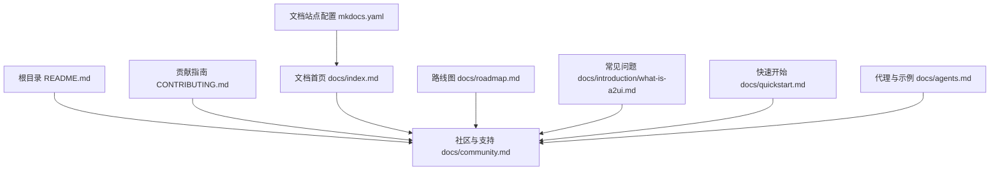
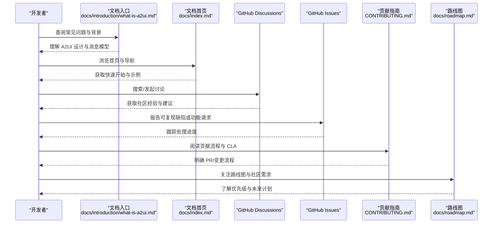
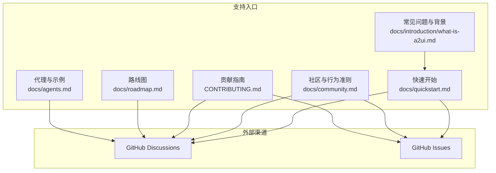

# 社区支持

<cite>
**本文引用的文件**
- [README.md](file://README.md)
- [CONTRIBUTING.md](file://CONTRIBUTING.md)
- [docs/community.md](file://docs/community.md)
- [docs/index.md](file://docs/index.md)
- [docs/introduction/what-is-a2ui.md](file://docs/introduction/what-is-a2ui.md)
- [docs/quickstart.md](file://docs/quickstart.md)
- [docs/roadmap.md](file://docs/roadmap.md)
- [docs/agents.md](file://docs/agents.md)
- [mkdocs.yaml](file://mkdocs.yaml)
</cite>

## 目录
1. [引言](#引言)
2. [项目结构](#项目结构)
3. [核心组件](#核心组件)
4. [架构总览](#架构总览)
5. [详细组件分析](#详细组件分析)
6. [依赖关系分析](#依赖关系分析)
7. [性能考虑](#性能考虑)
8. [故障排查指南](#故障排查指南)
9. [结论](#结论)
10. [附录](#附录)

## 引言
本页旨在为开发者提供全面的社区支持信息，帮助您在遇到问题时快速获得帮助与方向。A2UI 是一个面向代理驱动界面的开源协议与实现集合，当前处于早期公开预览阶段（v0.8）。社区是推动项目演进的重要力量，我们鼓励通过以下官方渠道参与讨论、贡献与反馈：
- 首先，建议阅读详细的[文档](file://docs/introduction/what-is-a2ui.md)，以系统理解 A2UI 的设计目标、核心价值与常见问题背景；
- 其次，前往 [GitHub Discussions](https://github.com/google/A2UI/discussions) 进行技术探讨、分享用例与寻求建议；
- 最后，若确认为可复现的缺陷或需要新增能力，请在 [GitHub Issues](https://github.com/google/A2UI/issues) 中报告 Bug 或提交功能请求。

同时，文档强调社区准则与行为规范，鼓励积极贡献，并对所有社区成员表示感谢，共同维护健康、包容的开源生态。

**章节来源**
- file://docs/community.md#L1-L87
- file://docs/index.md#L1-L120

## 项目结构
从仓库组织看，社区支持相关的关键入口主要分布在：
- 根级说明与贡献指南：README.md、CONTRIBUTING.md
- 文档站点入口与导航：docs/index.md、mkdocs.yaml
- 社区与支持：docs/community.md
- 常见问题与使用指引：docs/introduction/what-is-a2ui.md、docs/quickstart.md
- 路线图与社区协作：docs/roadmap.md
- 代理与示例：docs/agents.md

下图给出社区支持相关文件的结构化概览与关联关系。

**图表来源**
- [README.md](file://README.md#L1-L169)
- [CONTRIBUTING.md](file://CONTRIBUTING.md#L1-L50)
- [docs/index.md](file://docs/index.md#L1-L158)
- [docs/community.md](file://docs/community.md#L1-L87)
- [docs/roadmap.md](file://docs/roadmap.md#L1-L230)
- [docs/introduction/what-is-a2ui.md](file://docs/introduction/what-is-a2ui.md#L1-L96)
- [docs/quickstart.md](file://docs/quickstart.md#L1-L271)
- [docs/agents.md](file://docs/agents.md#L1-L51)
- [mkdocs.yaml](file://mkdocs.yaml#L1-L120)

**章节来源**
- file://README.md#L1-L169
- file://docs/index.md#L1-L158
- file://docs/community.md#L1-L87

## 核心组件
围绕社区支持，以下文件构成关键支撑点：
- 官方文档与入门：docs/introduction/what-is-a2ui.md、docs/quickstart.md
- 社区与行为准则：docs/community.md
- 贡献流程与 CLA：CONTRIBUTING.md
- 路线图与社区协作：docs/roadmap.md
- 代理与示例：docs/agents.md
- 文档站点与外部链接：docs/index.md、mkdocs.yaml

这些文件共同提供了“如何提问、如何查找答案、如何参与贡献”的完整路径。

**章节来源**
- file://docs/introduction/what-is-a2ui.md#L1-L96
- file://docs/quickstart.md#L1-L271
- file://docs/community.md#L1-L87
- file://CONTRIBUTING.md#L1-L50
- file://docs/roadmap.md#L1-L230
- file://docs/agents.md#L1-L51
- file://docs/index.md#L1-L158
- file://mkdocs.yaml#L1-L120

## 架构总览
下面的序列图展示了“开发者在遇到问题时”的典型求助路径，映射到仓库中的实际入口与外部链接。

**图表来源**
- [docs/introduction/what-is-a2ui.md](file://docs/introduction/what-is-a2ui.md#L1-L96)
- [docs/index.md](file://docs/index.md#L1-L158)
- [docs/community.md](file://docs/community.md#L70-L87)
- [CONTRIBUTING.md](file://CONTRIBUTING.md#L1-L50)
- [docs/roadmap.md](file://docs/roadmap.md#L176-L230)

## 详细组件分析

### 组件一：官方文档与常见问题
- 目标：帮助开发者快速定位问题背景与解决方案
- 关键入口：
  - [什么是 A2UI？](file://docs/introduction/what-is-a2ui.md#L1-L96)
  - [快速开始](file://docs/quickstart.md#L1-L271)
- 使用建议：
  - 在提问前先通读“常见问题”与“快速开始”，确认是否为已知场景或已有示例可参考
  - 若仍需帮助，再进入 Discussions 或 Issues

**章节来源**
- file://docs/introduction/what-is-a2ui.md#L1-L96
- file://docs/quickstart.md#L1-L271

### 组件二：GitHub 讨论区（Questions & Ideas）
- 目标：技术探讨、用例分享、寻求建议
- 入口与提示：
  - [社区页面中的讨论入口](file://docs/community.md#L70-L87)
  - [路线图中的讨论入口](file://docs/roadmap.md#L212-L230)
- 行为建议：
  - 搜索现有讨论，避免重复
  - 提供最小可复现实例与上下文（版本、平台、重现步骤）

**章节来源**
- file://docs/community.md#L70-L87
- file://docs/roadmap.md#L212-L230

### 组件三：GitHub Issues（Bug 报告与功能请求）
- 目标：报告缺陷、提出新功能
- 入口与提示：
  - [社区页面中的 Issues 入口](file://docs/community.md#L70-L87)
  - [快速开始中的问题排查与 Issues 链接](file://docs/quickstart.md#L224-L271)
- 行为建议：
  - 使用模板化的标题与描述，包含环境信息、版本、日志片段
  - 提供最小可复现实例，便于维护者快速定位

**章节来源**
- file://docs/community.md#L70-L87
- file://docs/quickstart.md#L224-L271

### 组件四：贡献流程与社区准则
- 目标：规范贡献行为，降低协作成本
- 入口与提示：
  - [贡献指南（含 CLA 与评审流程）](file://CONTRIBUTING.md#L1-L50)
  - [社区行为准则与认可机制](file://docs/community.md#L44-L87)
- 行为建议：
  - 提交 PR 前先阅读贡献指南与社区准则
  - 保持尊重、包容与建设性沟通

**章节来源**
- file://CONTRIBUTING.md#L1-L50
- file://docs/community.md#L44-L87

### 组件五：路线图与社区协作
- 目标：了解未来方向与社区优先级，指导贡献与反馈
- 入口与提示：
  - [路线图与社区请求](file://docs/roadmap.md#L176-L230)
- 行为建议：
  - 对感兴趣的功能投票或发起讨论
  - 结合路线图规划自己的贡献与使用场景

**章节来源**
- file://docs/roadmap.md#L176-L230

### 组件六：代理与示例（辅助定位问题）
- 目标：通过官方示例验证环境与流程
- 入口与提示：
  - [代理与示例](file://docs/agents.md#L1-L51)
- 行为建议：
  - 先运行官方示例，确认环境与依赖无误后再迁移至自定义项目
  - 将示例作为最小复现实例的起点

**章节来源**
- file://docs/agents.md#L1-L51

## 依赖关系分析
社区支持体系与文档/示例/路线图之间的依赖关系如下：

**图表来源**
- [docs/introduction/what-is-a2ui.md](file://docs/introduction/what-is-a2ui.md#L1-L96)
- [docs/quickstart.md](file://docs/quickstart.md#L1-L271)
- [docs/community.md](file://docs/community.md#L1-L87)
- [docs/roadmap.md](file://docs/roadmap.md#L1-L230)
- [CONTRIBUTING.md](file://CONTRIBUTING.md#L1-L50)
- [docs/agents.md](file://docs/agents.md#L1-L51)

**章节来源**
- file://docs/introduction/what-is-a2ui.md#L1-L96
- file://docs/quickstart.md#L1-L271
- file://docs/community.md#L1-L87
- file://docs/roadmap.md#L1-L230
- file://CONTRIBUTING.md#L1-L50
- file://docs/agents.md#L1-L51

## 性能考虑
- 在 Issues 中报告问题时，尽量附带性能相关指标（如渲染耗时、内存占用、网络延迟等），以便维护者快速定位瓶颈
- 参考路线图中的性能优化计划，关注未来版本的性能改进与最佳实践

[本节为通用建议，不直接分析具体文件]

## 故障排查指南
- 快速自检
  - 确认已阅读[常见问题与背景](file://docs/introduction/what-is-a2ui.md#L1-L96)与[快速开始](file://docs/quickstart.md#L1-L271)
  - 在[社区页面](file://docs/community.md#L70-L87)查看是否有类似问题的讨论
- 复现实例
  - 参考[代理与示例](file://docs/agents.md#L1-L51)运行官方示例，排除环境差异
- 寻求帮助
  - 在[GitHub Discussions](https://github.com/google/A2UI/discussions)搜索或发起讨论
  - 在[GitHub Issues](https://github.com/google/A2UI/issues)提交缺陷或功能请求
- 贡献与跟进
  - 遵循[贡献指南](file://CONTRIBUTING.md#L1-L50)准备 PR
  - 关注[路线图](file://docs/roadmap.md#L176-L230)了解优先级与未来计划

**章节来源**
- file://docs/introduction/what-is-a2ui.md#L1-L96
- file://docs/quickstart.md#L224-L271
- file://docs/community.md#L70-L87
- file://CONTRIBUTING.md#L1-L50
- file://docs/roadmap.md#L176-L230
- file://docs/agents.md#L1-L51

## 结论
A2UI 的社区支持体系以“文档先行、讨论在前、问题闭环、贡献有序”为核心原则。请优先查阅官方文档与示例，再通过 Discussions 与 Issues 获得帮助与反馈。遵循贡献指南与社区准则，共同推动项目稳健发展。

[本节为总结性内容，不直接分析具体文件]

## 附录
- 官方文档入口与导航：[文档首页](file://docs/index.md#L1-L158)、[mkdocs.yaml](file://mkdocs.yaml#L1-L120)
- 社区与支持：[社区页面](file://docs/community.md#L1-L87)
- 路线图与社区协作：[路线图](file://docs/roadmap.md#L176-L230)
- 代理与示例：[代理与示例](file://docs/agents.md#L1-L51)