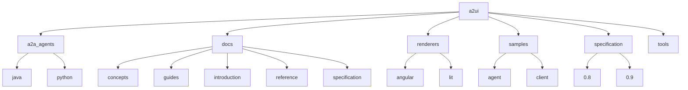
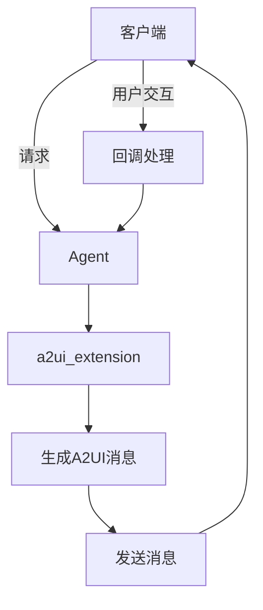
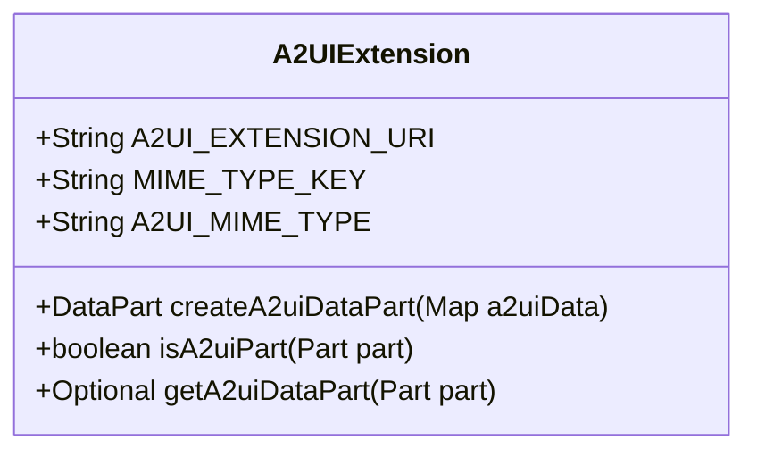
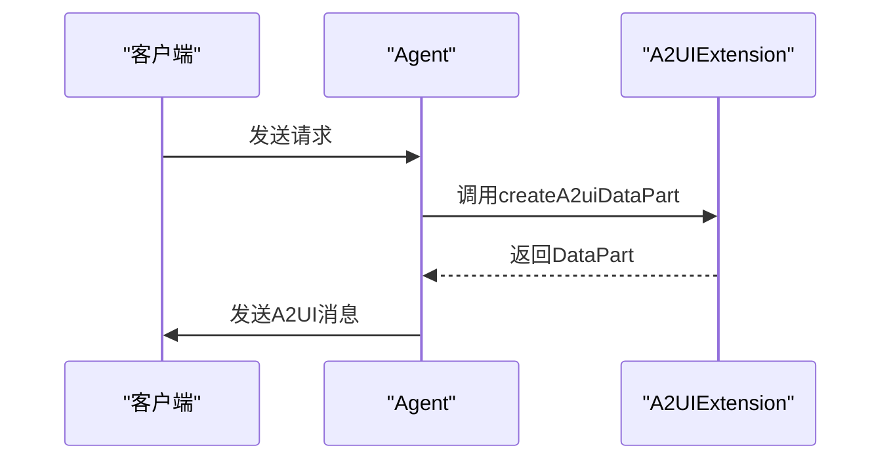
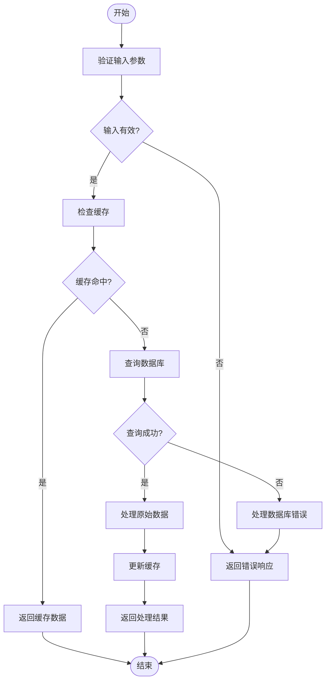
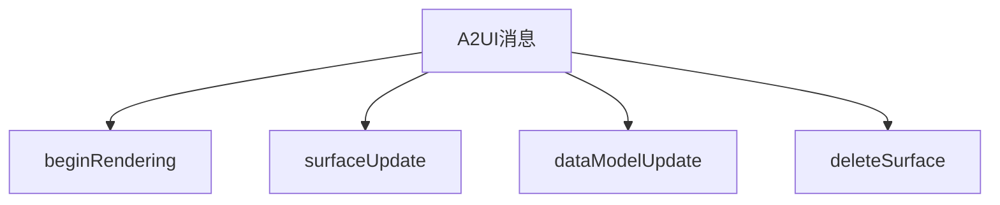
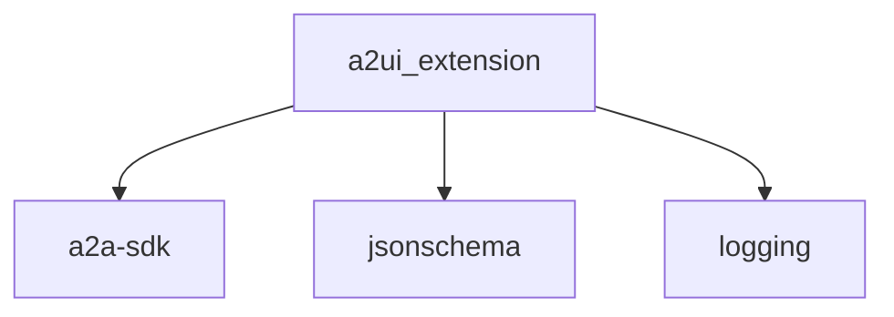

# Agent开发

<cite>
**本文档中引用的文件**   
- [a2ui_extension.py](file://a2a_agents/python/a2ui_extension/src/a2ui/a2ui_extension.py)
- [A2uiExtension.java](file://a2a_agents/java/src/main/java/org/a2ui/A2uiExtension.java)
- [agent.py](file://samples/agent/adk/contact_lookup/agent.py)
- [rizzcharts/agent.py](file://samples/agent/adk/rizzcharts/agent.py)
- [test_extension.py](file://a2a_agents/python/a2ui_extension/tests/test_extension.py)
- [A2uiExtensionTest.java](file://a2a_agents/java/src/test/java/org/a2ui/A2uiExtensionTest.java)
- [a2ui_examples.py](file://samples/agent/adk/contact_lookup/a2ui_examples.py)
- [a2ui_schema.py](file://samples/agent/adk/contact_lookup/a2ui_schema.py)
- [a2ui_toolset.py](file://samples/agent/adk/rizzcharts/a2ui_toolset.py)
- [agent-development.md](file://docs/guides/agent-development.md)
- [messages.md](file://docs/reference/messages.md)
- [a2ui_extension_specification.md](file://specification/0.8/docs/a2ui_extension_specification.md)
- [a2ui_protocol.md](file://specification/0.9/docs/a2ui_protocol.md)
</cite>

## 目录
1. [简介](#简介)
2. [项目结构](#项目结构)
3. [核心组件](#核心组件)
4. [架构概述](#架构概述)
5. [详细组件分析](#详细组件分析)
6. [依赖分析](#依赖分析)
7. [性能考虑](#性能考虑)
8. [故障排除指南](#故障排除指南)
9. [结论](#结论)

## 简介
本指南旨在为开发者提供全面的Agent开发指导，重点介绍如何使用Python和Java构建能够生成A2UI消息的AI代理。文档详细阐述了`a2ui_extension`库的使用方法，包括创建`A2UIExtension`实例、构建组件树、管理数据模型以及发送`surfaceUpdate`和`dataModelUpdate`消息。通过完整的代码示例，展示了从接收用户请求到生成复杂UI（如表单、图表）的完整流程，并解释了如何处理用户交互事件的回调。同时，介绍了与A2A协议的集成方法，以及如何确保生成的消息符合v0.8或v0.9规范。最后，提供了调试技巧和最佳实践，如消息批处理和错误恢复。

## 项目结构
A2UI项目是一个多语言的Agent开发框架，主要包含Python和Java两种语言的实现。项目结构清晰，分为多个模块，每个模块负责不同的功能。

**图源**
- [a2ui_extension.py](file://a2a_agents/python/a2ui_extension/src/a2ui/a2ui_extension.py)
- [A2uiExtension.java](file://a2a_agents/java/src/main/java/org/a2ui/A2uiExtension.java)

**本节源码**
- [a2ui_extension.py](file://a2a_agents/python/a2ui_extension/src/a2ui/a2ui_extension.py)
- [A2uiExtension.java](file://a2a_agents/java/src/main/java/org/a2ui/A2uiExtension.java)

## 核心组件
本节将深入分析A2UI框架的核心组件，包括`a2ui_extension`库的使用方法和关键功能。

**本节源码**
- [a2ui_extension.py](file://a2a_agents/python/a2ui_extension/src/a2ui/a2ui_extension.py)
- [A2uiExtension.java](file://a2a_agents/java/src/main/java/org/a2ui/A2uiExtension.java)

## 架构概述
A2UI框架的架构设计旨在提供一个灵活且可扩展的Agent开发平台。通过`a2ui_extension`库，开发者可以轻松地创建和管理A2UI消息，实现与客户端的交互。

**图源**
- [a2ui_extension.py](file://a2a_agents/python/a2ui_extension/src/a2ui/a2ui_extension.py)
- [A2uiExtension.java](file://a2a_agents/java/src/main/java/org/a2ui/A2uiExtension.java)

## 详细组件分析
本节将详细分析A2UI框架中的各个关键组件，包括`A2UIExtension`类、`create_surface`方法、`add_component`方法、数据模型管理以及消息发送机制。

### A2UIExtension类分析
`A2UIExtension`类是A2UI框架的核心，负责创建和管理A2UI消息。该类提供了多种方法，用于生成不同类型的A2UI消息。

#### 对于面向对象的组件：

**图源**
- [A2uiExtension.java](file://a2a_agents/java/src/main/java/org/a2ui/A2uiExtension.java)

#### 对于API/服务组件：

**图源**
- [a2ui_extension.py](file://a2a_agents/python/a2ui_extension/src/a2ui/a2ui_extension.py)

#### 对于复杂逻辑组件：

**图源**
- [agent.py](file://samples/agent/adk/contact_lookup/agent.py)

**本节源码**
- [a2ui_extension.py](file://a2a_agents/python/a2ui_extension/src/a2ui/a2ui_extension.py)
- [A2uiExtension.java](file://a2a_agents/java/src/main/java/org/a2ui/A2uiExtension.java)

### 概念概述
本节将介绍A2UI框架的一些基本概念，包括A2UI消息的格式、组件树的构建方法以及数据模型的管理。

[无源码，因为此图展示的是概念性工作流，而非实际代码结构]

[无源码，因为此节不分析特定源文件]

## 依赖分析
本节将分析A2UI框架中各组件之间的依赖关系，包括直接和间接依赖。

**图源**
- [pyproject.toml](file://a2a_agents/python/a2ui_extension/pyproject.toml)
- [pom.xml](file://a2a_agents/java/pom.xml)

**本节源码**
- [pyproject.toml](file://a2a_agents/python/a2ui_extension/pyproject.toml)
- [pom.xml](file://a2a_agents/java/pom.xml)

## 性能考虑
本节将讨论A2UI框架在性能方面的考虑，包括消息批处理、错误恢复和缓存策略。

[无源码，因为此节提供一般性指导]

## 故障排除指南
本节将分析错误处理代码和调试工具，帮助开发者解决常见问题。

**本节源码**
- [agent.py](file://samples/agent/adk/contact_lookup/agent.py)
- [a2ui_toolset.py](file://samples/agent/adk/rizzcharts/a2ui_toolset.py)

## 结论
本指南详细介绍了如何使用Python和Java构建能够生成A2UI消息的AI代理。通过`a2ui_extension`库，开发者可以轻松地创建和管理A2UI消息，实现与客户端的交互。文档还提供了完整的代码示例，展示了从接收用户请求到生成复杂UI的完整流程，并解释了如何处理用户交互事件的回调。希望本指南能帮助开发者快速上手A2UI框架，开发出高质量的Agent应用。

[无源码，因为此节总结而不分析特定文件]