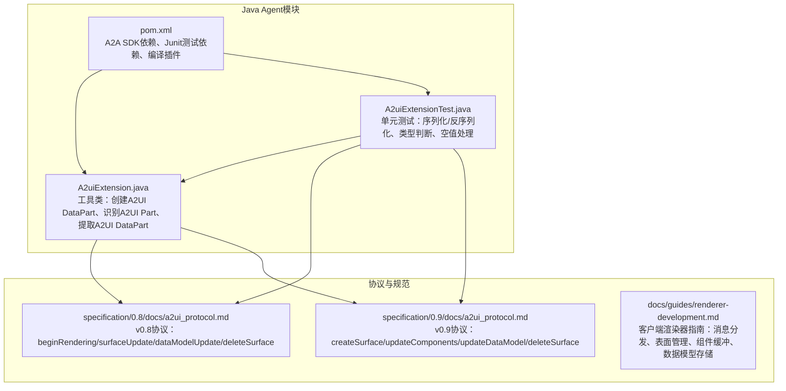
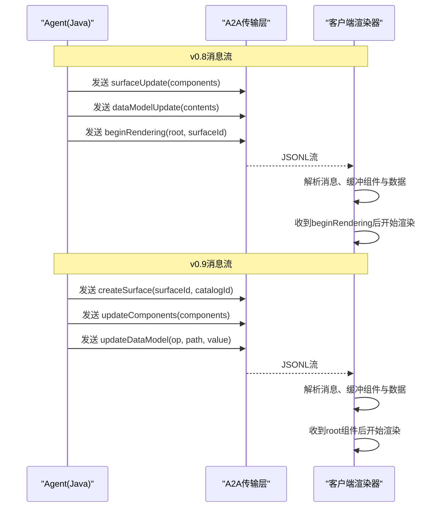
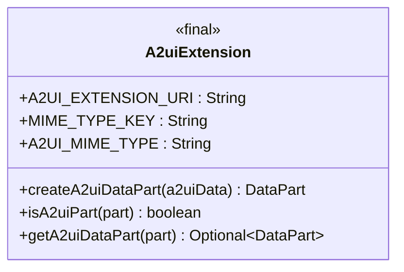
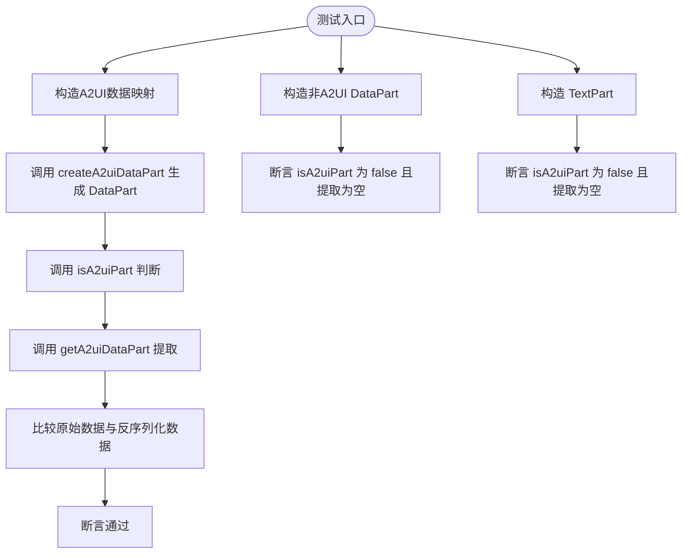
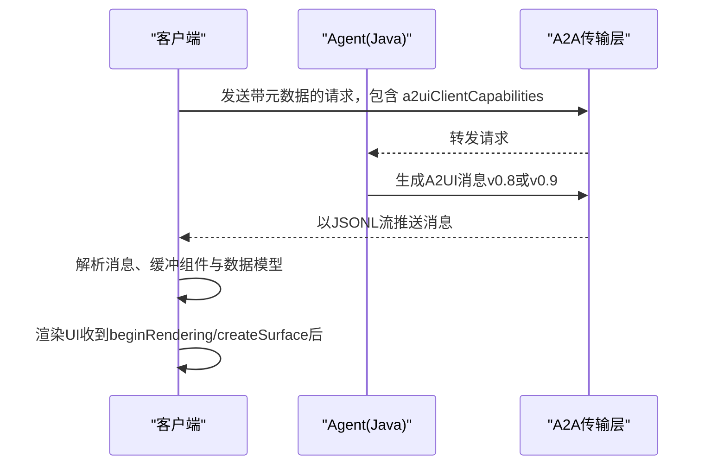
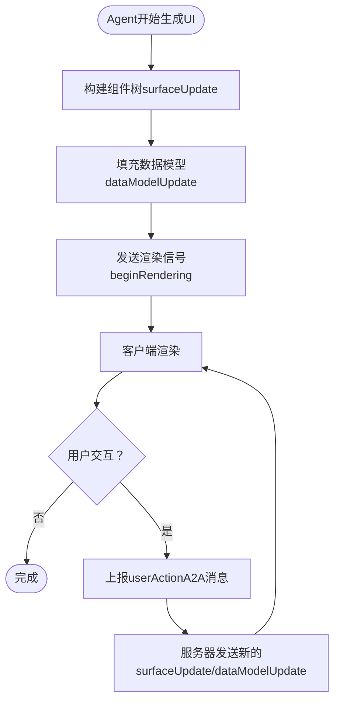
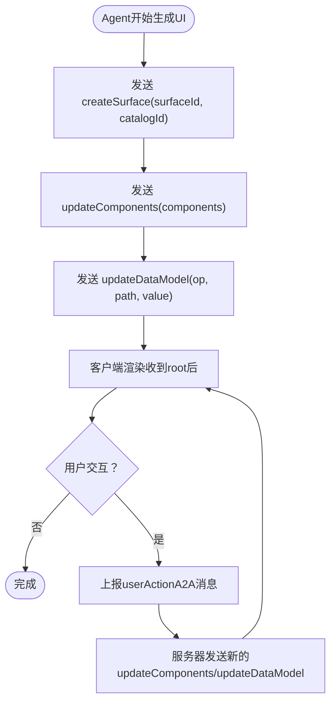
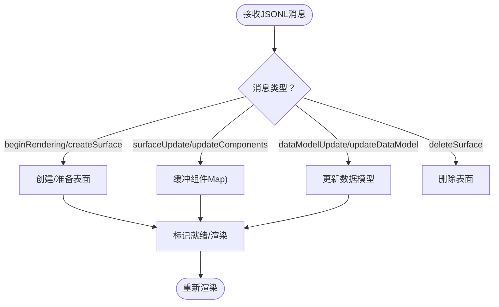
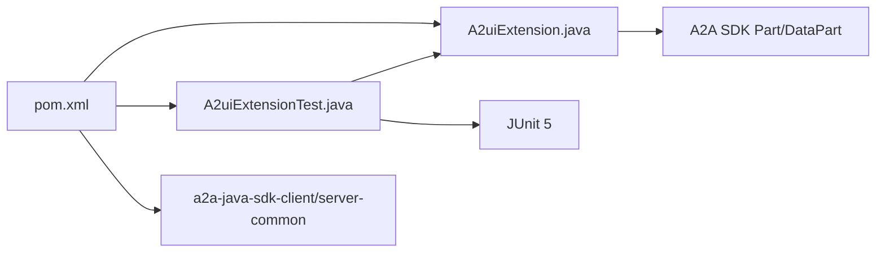

# Java Agent开发

<cite>
**本文引用的文件**
- [A2uiExtension.java](file://a2a_agents/java/src/main/java/org/a2ui/A2uiExtension.java)
- [A2uiExtensionTest.java](file://a2a_agents/java/src/test/java/org/a2ui/A2uiExtensionTest.java)
- [pom.xml](file://a2a_agents/java/pom.xml)
- [a2a_agents/CLAUDE.md](file://a2a_agents/CLAUDE.md)
- [specification/0.8/docs/a2ui_protocol.md](file://specification/0.8/docs/a2ui_protocol.md)
- [specification/0.9/docs/a2ui_protocol.md](file://specification/0.9/docs/a2ui_protocol.md)
- [docs/guides/renderer-development.md](file://docs/guides/renderer-development.md)
- [docs/concepts/overview.md](file://docs/concepts/overview.md)
- [docs/reference/messages.md](file://docs/reference/messages.md)
- [renderers/lit/src/0.8/data/model-processor.ts](file://renderers/lit/src/0.8/data/model-processor.ts)
- [renderers/lit/src/0.8/model.test.ts](file://renderers/lit/src/0.8/model.test.ts)
</cite>

## 目录
1. [引言](#引言)
2. [项目结构](#项目结构)
3. [核心组件](#核心组件)
4. [架构总览](#架构总览)
5. [详细组件分析](#详细组件分析)
6. [依赖关系分析](#依赖关系分析)
7. [性能考虑](#性能考虑)
8. [故障排查指南](#故障排查指南)
9. [结论](#结论)
10. [附录](#附录)

## 引言
本文件面向Java Agent开发者，围绕A2uiExtension类在Java环境中的实现与集成展开，目标是帮助你在Agent逻辑中正确生成A2UI v0.8/v0.9规范的消息，并与A2A协议栈协同工作。文档涵盖以下要点：
- 如何实例化扩展、构建组件树（如createSurface、surfaceUpdate）、管理数据模型状态以及生成surfaceUpdate和dataModelUpdate消息；
- 如何在Agent中嵌入A2UI消息生成，包括创建动态UI元素、处理用户交互回调；
- 结合A2uiExtensionTest.java中的测试用例，解释关键方法的预期输入输出与异常处理机制；
- 与Java生态中A2A协议栈的集成方式；
- 性能优化与线程安全注意事项。

## 项目结构
Java Agent相关代码位于a2a_agents/java目录，核心文件为A2uiExtension.java与单元测试A2uiExtensionTest.java；pom.xml声明了A2A SDK依赖与测试框架。

图表来源
- [A2uiExtension.java](file://a2a_agents/java/src/main/java/org/a2ui/A2uiExtension.java#L1-L84)
- [A2uiExtensionTest.java](file://a2a_agents/java/src/test/java/org/a2ui/A2uiExtensionTest.java#L1-L79)
- [pom.xml](file://a2a_agents/java/pom.xml#L1-L71)
- [specification/0.8/docs/a2ui_protocol.md](file://specification/0.8/docs/a2ui_protocol.md#L1-L120)
- [specification/0.9/docs/a2ui_protocol.md](file://specification/0.9/docs/a2ui_protocol.md#L1-L120)
- [docs/guides/renderer-development.md](file://docs/guides/renderer-development.md#L11-L24)

章节来源
- [A2uiExtension.java](file://a2a_agents/java/src/main/java/org/a2ui/A2uiExtension.java#L1-L84)
- [A2uiExtensionTest.java](file://a2a_agents/java/src/test/java/org/a2ui/A2uiExtensionTest.java#L1-L79)
- [pom.xml](file://a2a_agents/java/pom.xml#L1-L71)

## 核心组件
- A2uiExtension：提供A2UI扩展的工具方法，用于创建A2UI DataPart、判断Part是否为A2UI、从Part中提取A2UI DataPart。
- A2uiExtensionTest：验证A2UI Part的序列化/反序列化、类型识别与空值处理等行为。

关键点
- MIME类型与扩展URI：A2uiExtension定义了A2UI MIME类型与扩展URI常量，用于标识A2UI数据。
- DataPart封装：createA2uiDataPart将A2UI数据映射包装为DataPart，并设置元数据mimeType为A2UI类型。
- 类型判定：isA2uiPart根据元数据判断Part是否为A2UI；getA2uiDataPart在满足条件时返回Optional<DataPart>。

章节来源
- [A2uiExtension.java](file://a2a_agents/java/src/main/java/org/a2ui/A2uiExtension.java#L35-L84)
- [A2uiExtensionTest.java](file://a2a_agents/java/src/test/java/org/a2ui/A2uiExtensionTest.java#L33-L79)

## 架构总览
下图展示了Agent侧通过A2A协议发送A2UI消息到客户端渲染器的整体流程，包含v0.8与v0.9版本的消息差异。

图表来源
- [specification/0.8/docs/a2ui_protocol.md](file://specification/0.8/docs/a2ui_protocol.md#L60-L120)
- [specification/0.9/docs/a2ui_protocol.md](file://specification/0.9/docs/a2ui_protocol.md#L105-L175)
- [docs/guides/renderer-development.md](file://docs/guides/renderer-development.md#L11-L24)

## 详细组件分析

### A2uiExtension类分析
A2uiExtension是一个静态工具类，提供以下能力：
- createA2uiDataPart：将A2UI数据映射封装为DataPart，并设置mimeType为A2UI类型。
- isA2uiPart：判断Part是否为A2UI DataPart。
- getA2uiDataPart：在满足条件时返回Optional<DataPart>，否则返回空。

图表来源
- [A2uiExtension.java](file://a2a_agents/java/src/main/java/org/a2ui/A2uiExtension.java#L35-L84)

章节来源
- [A2uiExtension.java](file://a2a_agents/java/src/main/java/org/a2ui/A2uiExtension.java#L35-L84)

### A2uiExtensionTest测试用例分析
测试覆盖以下场景：
- A2UI Part序列化/反序列化：构造A2UI数据映射，创建DataPart，断言其为A2UI Part，提取DataPart并比较原始数据。
- 非A2UI DataPart：设置非A2UI mimeType，断言isA2uiPart为false且getA2uiDataPart为空。
- 非A2UI Part：使用TextPart，断言isA2uiPart为false且getA2uiDataPart为空。

图表来源
- [A2uiExtensionTest.java](file://a2a_agents/java/src/test/java/org/a2ui/A2uiExtensionTest.java#L33-L79)

章节来源
- [A2uiExtensionTest.java](file://a2a_agents/java/src/test/java/org/a2ui/A2uiExtensionTest.java#L33-L79)

### 与A2A协议栈的集成
- 扩展URI与MIME类型：A2uiExtension使用扩展URI与A2UI MIME类型标识A2UI数据，便于A2A传输层识别与路由。
- 客户端能力协商：客户端通过A2A消息元数据携带a2uiClientCapabilities，声明支持的catalogId集合，服务器据此选择catalog并渲染。
- 消息类型差异：
  - v0.8：beginRendering用于初始渲染信号，包含root与可选styles；surfaceUpdate与dataModelUpdate分别更新组件与数据模型。
  - v0.9：createSurface用于创建表面并开始渲染；updateComponents与updateDataModel分别更新组件与数据模型；删除使用deleteSurface。

图表来源
- [a2a_agents/CLAUDE.md](file://a2a_agents/CLAUDE.md#L60-L117)
- [specification/0.8/docs/a2ui_protocol.md](file://specification/0.8/docs/a2ui_protocol.md#L180-L266)
- [specification/0.9/docs/a2ui_protocol.md](file://specification/0.9/docs/a2ui_protocol.md#L105-L175)

章节来源
- [a2a_agents/CLAUDE.md](file://a2a_agents/CLAUDE.md#L60-L117)
- [specification/0.8/docs/a2ui_protocol.md](file://specification/0.8/docs/a2ui_protocol.md#L180-L266)
- [specification/0.9/docs/a2ui_protocol.md](file://specification/0.9/docs/a2ui_protocol.md#L105-L175)

### 在Agent中嵌入A2UI消息生成（v0.8）
- 创建动态UI元素：使用surfaceUpdate消息发送组件列表，采用邻接表模型，通过id引用建立父子关系。
- 管理数据模型状态：使用dataModelUpdate消息更新指定路径的数据，支持增量更新。
- 触发渲染：使用beginRendering消息，声明surfaceId与root组件id，客户端在收到该消息后开始渲染。
- 处理用户交互回调：客户端在用户触发组件动作时，通过A2A消息向服务器上报userAction，服务器据此动态更新UI。

图表来源
- [specification/0.8/docs/a2ui_protocol.md](file://specification/0.8/docs/a2ui_protocol.md#L285-L346)
- [docs/reference/messages.md](file://docs/reference/messages.md#L1-L52)
- [docs/guides/renderer-development.md](file://docs/guides/renderer-development.md#L11-L24)

章节来源
- [specification/0.8/docs/a2ui_protocol.md](file://specification/0.8/docs/a2ui_protocol.md#L285-L346)
- [docs/reference/messages.md](file://docs/reference/messages.md#L1-L52)
- [docs/guides/renderer-development.md](file://docs/guides/renderer-development.md#L11-L24)

### 在Agent中嵌入A2UI消息生成（v0.9）
- 创建动态UI元素：使用createSurface初始化表面并声明catalogId；随后使用updateComponents发送组件列表。
- 管理数据模型状态：使用updateDataModel消息，支持op（add/replace/remove）、path与value。
- 触发渲染：客户端在收到root组件后开始渲染。
- 处理用户交互回调：客户端上报userAction，服务器据此动态更新UI。

图表来源
- [specification/0.9/docs/a2ui_protocol.md](file://specification/0.9/docs/a2ui_protocol.md#L105-L208)
- [docs/guides/renderer-development.md](file://docs/guides/renderer-development.md#L11-L24)

章节来源
- [specification/0.9/docs/a2ui_protocol.md](file://specification/0.9/docs/a2ui_protocol.md#L105-L208)
- [docs/guides/renderer-development.md](file://docs/guides/renderer-development.md#L11-L24)

### 客户端渲染器处理流程（参考）
- JSONL解析与消息分发：按消息类型（beginRendering/createSurface、surfaceUpdate/updateComponents、dataModelUpdate、deleteSurface）路由处理。
- 表面管理：维护每个surfaceId对应的组件缓冲区与数据模型，支持新增、更新与删除。
- 数据模型更新：支持增量更新与路径解析，保证渲染一致性。

图表来源
- [docs/guides/renderer-development.md](file://docs/guides/renderer-development.md#L11-L24)
- [renderers/lit/src/0.8/data/model-processor.ts](file://renderers/lit/src/0.8/data/model-processor.ts#L60-L124)
- [renderers/lit/src/0.8/model.test.ts](file://renderers/lit/src/0.8/model.test.ts#L45-L93)

章节来源
- [docs/guides/renderer-development.md](file://docs/guides/renderer-development.md#L11-L24)
- [renderers/lit/src/0.8/data/model-processor.ts](file://renderers/lit/src/0.8/data/model-processor.ts#L60-L124)
- [renderers/lit/src/0.8/model.test.ts](file://renderers/lit/src/0.8/model.test.ts#L45-L93)

## 依赖关系分析
- A2uiExtension依赖A2A SDK中的Part/DataPart类型，用于封装A2UI数据。
- 测试依赖JUnit，验证A2UI Part的序列化/反序列化、类型识别与空值处理。
- Maven插件配置确保Java 21编译与测试运行。

图表来源
- [A2uiExtension.java](file://a2a_agents/java/src/main/java/org/a2ui/A2uiExtension.java#L19-L27)
- [A2uiExtensionTest.java](file://a2a_agents/java/src/test/java/org/a2ui/A2uiExtensionTest.java#L19-L29)
- [pom.xml](file://a2a_agents/java/pom.xml#L34-L54)

章节来源
- [A2uiExtension.java](file://a2a_agents/java/src/main/java/org/a2ui/A2uiExtension.java#L19-L27)
- [A2uiExtensionTest.java](file://a2a_agents/java/src/test/java/org/a2ui/A2uiExtensionTest.java#L19-L29)
- [pom.xml](file://a2a_agents/java/pom.xml#L34-L54)

## 性能考虑
- 消息体积控制：优先使用增量更新（如dataModelUpdate），避免重复发送完整组件树。
- 组件缓冲与数据模型：客户端应采用高效的数据结构（如Map）缓存组件与数据，减少查找与重建成本。
- 渲染策略：v0.9建议在收到root组件后再渲染，避免“不完整内容闪烁”，提升用户体验。
- 并发与线程安全：在多线程环境下，确保对组件缓冲与数据模型的访问同步，避免竞态条件；必要时使用不可变数据结构或锁保护共享状态。

## 故障排查指南
- A2UI Part未被识别为A2UI：检查mimeType是否设置为A2UI类型，确认元数据键名一致。
- 提取A2UI DataPart为空：确认isA2uiPart返回true后再尝试提取，避免对非A2UI Part进行解包。
- 测试失败定位：
  - 序列化/反序列化失败：核对A2UI数据映射结构与字段名称。
  - 类型判断错误：检查Part类型与元数据完整性。
- 协议版本差异：
  - v0.8：关注beginRendering的root与styles字段。
  - v0.9：关注createSurface的catalogId与updateDataModel的op/path/value字段。

章节来源
- [A2uiExtensionTest.java](file://a2a_agents/java/src/test/java/org/a2ui/A2uiExtensionTest.java#L33-L79)
- [specification/0.8/docs/a2ui_protocol.md](file://specification/0.8/docs/a2ui_protocol.md#L90-L100)
- [specification/0.9/docs/a2ui_protocol.md](file://specification/0.9/docs/a2ui_protocol.md#L105-L175)

## 结论
A2uiExtension为Java Agent提供了简洁而强大的A2UI数据封装与识别能力，配合A2A协议栈可在v0.8与v0.9两个版本间灵活切换。通过遵循邻接表模型、增量更新与正确的消息顺序，Agent可以高效地生成动态UI并与客户端协同完成渲染与交互。测试用例为关键行为提供了可靠保障，建议在生产环境中持续完善边界与异常场景的覆盖。

## 附录
- 常用消息类型与职责
  - surfaceUpdate/updateComponents：定义或更新UI组件
  - dataModelUpdate/updateDataModel：更新应用状态
  - beginRendering/createSurface：触发渲染
  - deleteSurface：移除UI表面
- 参考文档
  - [A2UI v0.8协议](file://specification/0.8/docs/a2ui_protocol.md#L60-L120)
  - [A2UI v0.9协议](file://specification/0.9/docs/a2ui_protocol.md#L105-L175)
  - [渲染器开发指南](file://docs/guides/renderer-development.md#L11-L24)
  - [核心概念概览](file://docs/concepts/overview.md#L25-L34)