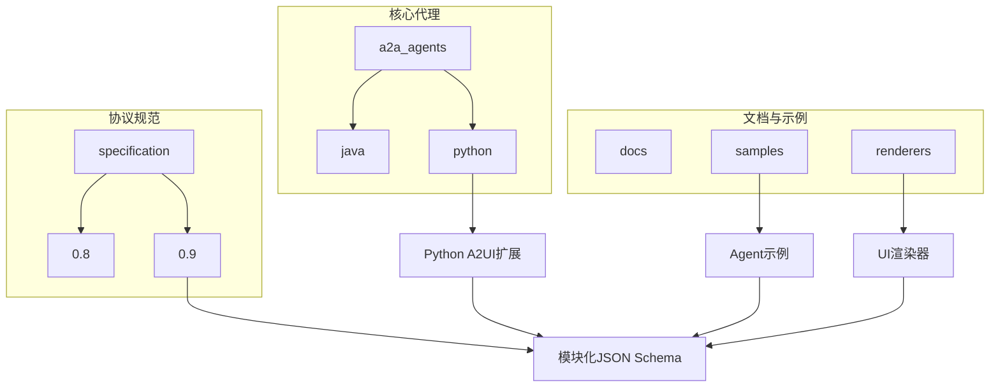
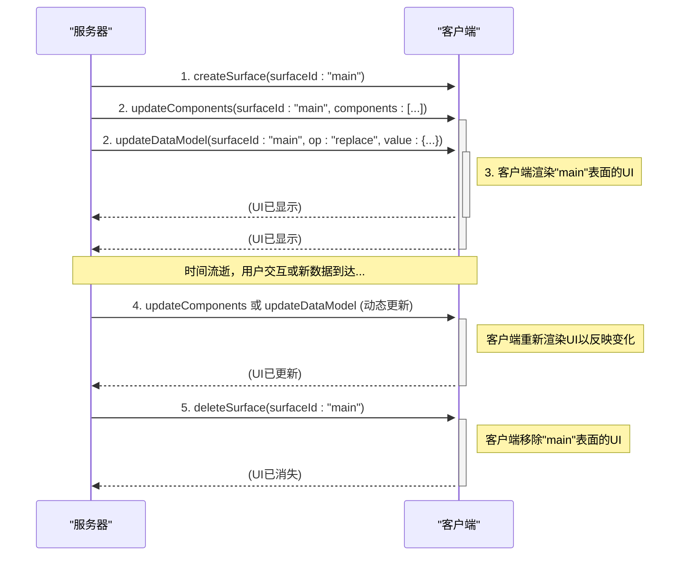
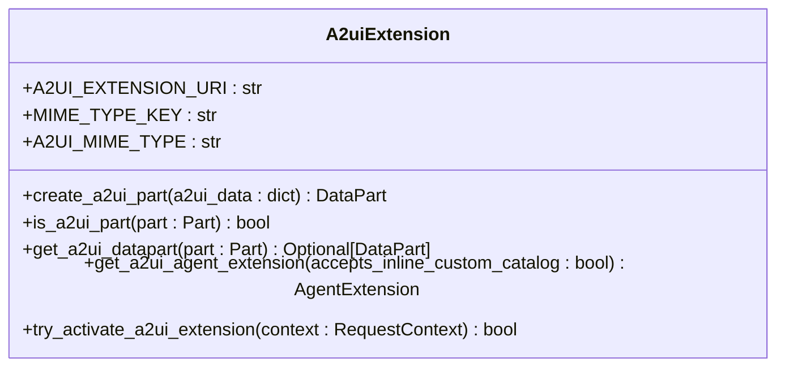
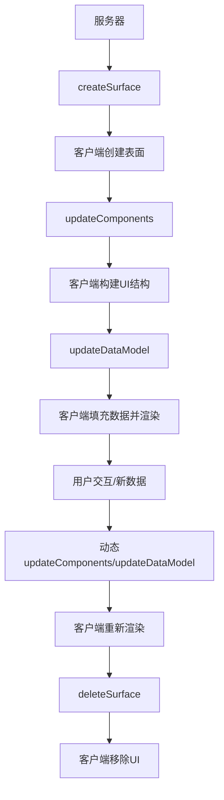
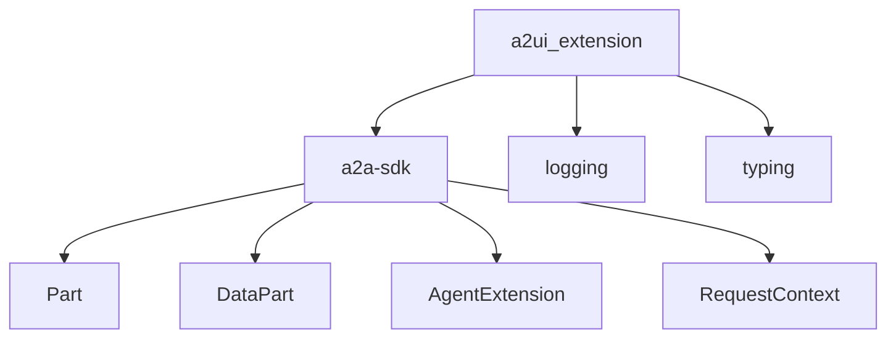

# Python Agent开发

<cite>
**本文档引用的文件**   
- [a2ui_extension.py](file://a2a_agents/python/a2ui_extension/src/a2ui/a2ui_extension.py)
- [test_extension.py](file://a2a_agents/python/a2ui_extension/tests/test_extension.py)
- [a2ui_protocol.md](file://specification/0.9/docs/a2ui_protocol.md)
- [server_to_client.json](file://specification/0.9/json/server_to_client.json)
- [standard_catalog_definition.json](file://specification/0.9/json/standard_catalog_definition.json)
- [agent.py](file://samples/agent/adk/contact_lookup/agent.py)
- [a2ui_examples.py](file://samples/agent/adk/contact_lookup/a2ui_examples.py)
</cite>

## 目录
1. [简介](#简介)
2. [项目结构](#项目结构)
3. [核心组件](#核心组件)
4. [A2UI协议详解](#a2ui协议详解)
5. [详细组件分析](#详细组件分析)
6. [依赖分析](#依赖分析)
7. [性能考虑](#性能考虑)
8. [故障排除指南](#故障排除指南)
9. [结论](#结论)

## 简介
本文档旨在为开发者提供一份全面的Python Agent开发指南，重点介绍如何使用`a2ui_extension`库构建符合A2UI协议的AI代理。文档将详细说明`A2uiExtension`类的初始化、配置和使用方法，包括如何调用`create_surface`创建UI画布、使用`add_component`添加标准组件（如text、button、form等）、管理数据模型的绑定与更新。通过完整的代码示例，展示从用户请求解析到生成复杂UI结构（如多步骤表单、数据图表）的全流程。同时，文档将解释如何通过`generate_surface_update`和`generate_data_model_update`方法生成合规的v0.8/v0.9协议消息，并通过A2A协议发送。涵盖错误处理、消息验证、调试日志记录等最佳实践，并结合`test_extension.py`中的单元测试用例说明预期行为。

## 项目结构
A2UI项目是一个多语言代理开发框架，其核心是`a2a_agents`目录，其中包含了Java和Python两种语言的A2UI扩展实现。Python实现位于`a2a_agents/python/a2ui_extension`目录下，是本文档的重点。该目录包含`src/a2ui`源代码和`tests`测试代码，通过`pyproject.toml`进行包管理。项目的协议规范定义在`specification`目录中，分为v0.8和v0.9两个版本，其中v0.9是当前推荐的版本，采用了模块化的JSON Schema设计。`docs`目录提供了全面的文档，`renderers`目录包含了Angular和Lit等UI渲染器的实现，而`samples`目录则提供了多个Agent开发的示例，是学习和参考的最佳实践。

**Diagram sources**
- [a2ui_extension.py](file://a2a_agents/python/a2ui_extension/src/a2ui/a2ui_extension.py)
- [a2ui_protocol.md](file://specification/0.9/docs/a2ui_protocol.md)

**Section sources**
- [a2ui_extension.py](file://a2a_agents/python/a2ui_extension/src/a2ui/a2ui_extension.py)
- [pyproject.toml](file://a2a_agents/python/a2ui_extension/pyproject.toml)

## 核心组件
`a2ui_extension`库的核心功能围绕着A2UI协议的实现。它提供了`create_a2ui_part`函数来创建包含A2UI数据的A2A Part，`is_a2ui_part`函数来检查一个Part是否为A2UI类型，以及`get_a2ui_datapart`函数来提取A2UI数据。`get_a2ui_agent_extension`函数用于配置Agent的A2UI扩展能力。这些函数共同构成了Python Agent与A2UI协议交互的基础。库的设计遵循了简洁和实用的原则，将复杂的协议细节封装在简单的函数调用中，使开发者能够专注于业务逻辑的实现，而无需深入协议的底层细节。

**Section sources**
- [a2ui_extension.py](file://a2a_agents/python/a2ui_extension/src/a2ui/a2ui_extension.py)
- [test_extension.py](file://a2a_agents/python/a2ui_extension/tests/test_extension.py)

## A2UI协议详解
A2UI (Agent to UI) 协议是一个基于JSON的流式UI协议，旨在实现从服务器到客户端的动态UI渲染。该协议的核心哲学是将UI结构与应用数据清晰地分离，从而支持渐进式渲染。通信通过一个JSON对象流进行，客户端将每个对象解析为一条独立的消息，并逐步构建或更新UI。v0.9版本的协议定义了四种消息类型：`createSurface`、`updateComponents`、`updateDataModel`和`deleteSurface`。`createSurface`用于创建新的UI表面，`updateComponents`用于更新UI组件，`updateDataModel`用于更新数据模型，而`deleteSurface`则用于删除表面。这种设计允许服务器通过流式消息逐步构建复杂的UI。

**Diagram sources**
- [a2ui_protocol.md](file://specification/0.9/docs/a2ui_protocol.md)

## 详细组件分析

### A2UI扩展类分析
`a2ui_extension`库中的函数是构建A2UI兼容Agent的基石。`create_a2ui_part`函数接收一个包含A2UI数据的字典，并将其包装成一个带有特定MIME类型元数据的A2A Part。`is_a2ui_part`函数通过检查Part的元数据中的MIME类型来判断其是否为A2UI类型。`get_a2ui_datapart`函数则在确认是A2UI Part后，提取出其中的DataPart。`get_a2ui_agent_extension`函数用于配置Agent的A2UI扩展，可以指定是否接受内联自定义目录。这些函数的设计使得开发者可以轻松地在Agent中集成A2UI功能。

**Diagram sources**
- [a2ui_extension.py](file://a2a_agents/python/a2ui_extension/src/a2ui/a2ui_extension.py)

**Section sources**
- [a2ui_extension.py](file://a2a_agents/python/a2ui_extension/src/a2ui/a2ui_extension.py)
- [test_extension.py](file://a2a_agents/python/a2ui_extension/tests/test_extension.py)

### 协议消息流分析
A2UI协议的消息流遵循一个清晰的生命周期。首先，服务器发送`createSurface`消息来初始化一个新表面。接着，通过`updateComponents`消息发送组件定义，构建UI的结构。然后，`updateDataModel`消息用于填充数据，使UI内容具体化。在用户交互或数据更新时，可以再次发送`updateComponents`或`updateDataModel`消息进行动态更新。最后，当UI不再需要时，发送`deleteSurface`消息将其移除。这种流式设计允许UI的渐进式加载和实时更新。

**Diagram sources**
- [a2ui_protocol.md](file://specification/0.9/docs/a2ui_protocol.md)

### 标准组件目录分析
A2UI协议定义了一套丰富的标准组件，这些组件通过`standard_catalog_definition.json`文件进行描述。核心组件包括`Text`、`Image`、`Button`等显示和交互组件，以及`Row`、`Column`、`List`等布局容器。每个组件都有其特定的属性，例如`Text`组件有`text`和`usageHint`属性，`Button`组件有`child`和`action`属性。组件通过ID引用的方式形成树状结构，实现了灵活的UI组合。这种基于JSON Schema的组件定义方式，使得协议具有良好的可扩展性，可以轻松地添加自定义组件。

**Section sources**
- [standard_catalog_definition.json](file://specification/0.9/json/standard_catalog_definition.json)

## 依赖分析
`a2ui_extension`库的依赖关系清晰明了。其主要依赖于`a2a-sdk`，这是一个提供A2A协议基础功能的SDK。`a2a-sdk`为`a2ui_extension`提供了`Part`、`DataPart`、`AgentExtension`和`RequestContext`等核心类型和类。`a2ui_extension`库本身不依赖于任何特定的UI框架，这使得它可以与任何能够解析A2UI JSON的渲染器（如Angular或Lit）配合使用。这种设计实现了逻辑与表现的分离，提高了库的通用性和可移植性。

**Diagram sources**
- [a2ui_extension.py](file://a2a_agents/python/a2ui_extension/src/a2ui/a2ui_extension.py)
- [pyproject.toml](file://a2a_agents/python/a2ui_extension/pyproject.toml)

**Section sources**
- [a2ui_extension.py](file://a2a_agents/python/a2ui_extension/src/a2ui/a2ui_extension.py)
- [pyproject.toml](file://a2a_agents/python/a2ui_extension/pyproject.toml)

## 性能考虑
在使用A2UI协议时，应考虑以下性能因素。首先，由于UI是通过流式消息构建的，因此应尽量减少不必要的`updateComponents`调用，以避免频繁的UI重渲染。其次，`updateDataModel`消息应只发送发生变化的数据，而不是每次都发送完整的数据模型，以减少网络传输量。此外，对于大型数据集，应考虑使用分页或懒加载等策略。最后，客户端的渲染性能也至关重要，应确保渲染器能够高效地处理A2UI消息并快速更新UI。

## 故障排除指南
当开发A2UI Agent时，可能会遇到各种问题。最常见的问题是生成的A2UI JSON不符合协议规范。这通常可以通过在发送消息前使用`jsonschema`库进行验证来避免。另一个常见问题是数据绑定失败，这通常是由于数据模型中的路径与组件中定义的路径不匹配造成的。此外，应确保`createSurface`消息在`updateComponents`消息之前发送，并且`surfaceId`在整个会话中保持唯一。如果遇到问题，应首先检查日志，查看是否有验证错误或协议违规的提示。

**Section sources**
- [agent.py](file://samples/agent/adk/contact_lookup/agent.py)
- [a2ui_examples.py](file://samples/agent/adk/contact_lookup/a2ui_examples.py)

## 结论
本文档详细介绍了如何使用`a2ui_extension`库开发符合A2UI协议的Python Agent。我们探讨了库的核心组件、A2UI协议的详细规范、标准组件的使用方法以及最佳实践。通过遵循本文档中的指南，开发者可以构建出功能强大、交互丰富的AI代理，为用户提供卓越的用户体验。A2UI协议的流式特性和数据与结构分离的设计，为构建动态、响应式的UI提供了坚实的基础。