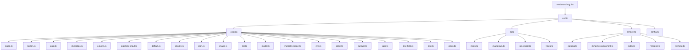
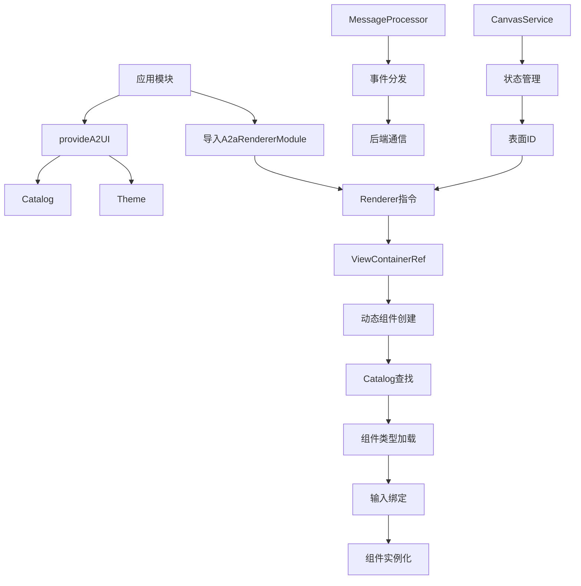
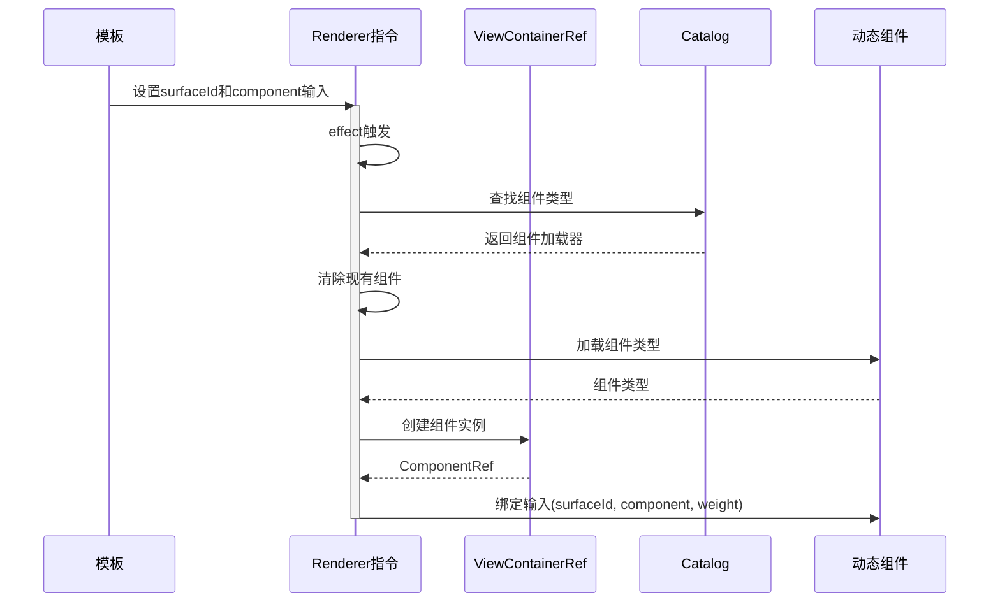
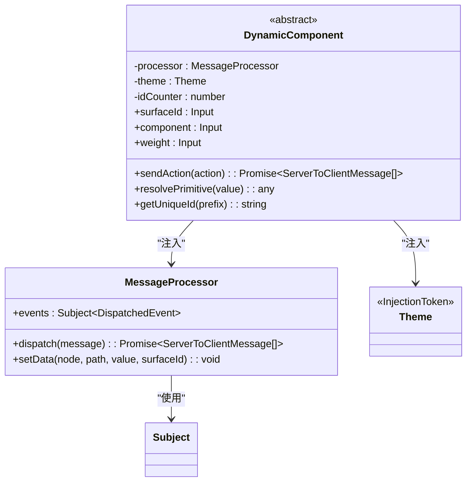
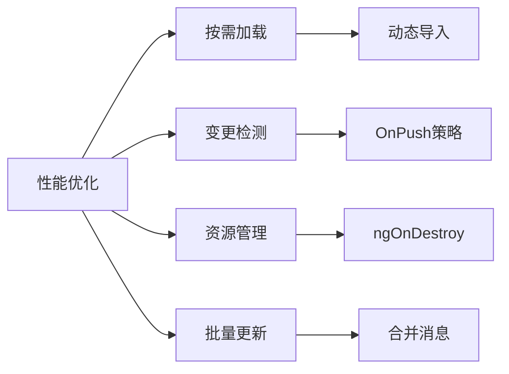

# Angular集成

<cite>
**本文档中引用的文件**   
- [config.ts](file://renderers/angular/src/lib/config.ts)
- [renderer.ts](file://renderers/angular/src/lib/rendering/renderer.ts)
- [dynamic-component.ts](file://renderers/angular/src/lib/rendering/dynamic-component.ts)
- [catalog.ts](file://renderers/angular/src/lib/rendering/catalog.ts)
- [theming.ts](file://renderers/angular/src/lib/rendering/theming.ts)
- [processor.ts](file://renderers/angular/src/lib/data/processor.ts)
- [default.ts](file://renderers/angular/src/lib/catalog/default.ts)
- [public-api.ts](file://renderers/angular/src/public-api.ts)
- [a2a-renderer.ts](file://samples/client/angular/projects/a2a-chat-canvas/src/lib/a2a-renderer/a2a-renderer.ts)
- [canvas.ts](file://samples/client/angular/projects/a2a-chat-canvas/src/lib/components/canvas/canvas.ts)
- [canvas-service.ts](file://samples/client/angular/projects/a2a-chat-canvas/src/lib/services/canvas-service.ts)
- [a2a_service.ts](file://samples/client/angular/projects/rizzcharts/src/services/a2a_service.ts)
</cite>

## 目录
1. [简介](#简介)
2. [项目结构](#项目结构)
3. [核心组件](#核心组件)
4. [架构概述](#架构概述)
5. [详细组件分析](#详细组件分析)
6. [依赖分析](#依赖分析)
7. [性能考虑](#性能考虑)
8. [故障排除指南](#故障排除指南)
9. [结论](#结论)

## 简介
本文档提供了在Angular应用中集成A2UI渲染器的详细指南。文档涵盖了从模块配置到组件使用的完整流程，重点介绍了`provideA2UI`注入配置、`A2aRendererModule`模块导入、`<a2a-renderer>`组件模板使用、主题注入和依赖服务处理等关键方面。同时，文档还解释了`A2uiConfig`配置对象的结构，包括`catalog`、`theme`和`clientCapabilities`的设置方式，并提供了完整的代码示例来展示模块配置、组件绑定、事件处理和错误边界。此外，文档还涵盖了通过`A2aService`连接后端消息流的实现方法，以及性能优化建议和常见问题排查方法。

## 项目结构
A2UI渲染器的Angular实现位于`renderers/angular`目录下，采用标准的Angular库项目结构。该结构组织清晰，将核心功能模块化，便于维护和扩展。



**图示来源**
- [catalog](file://renderers/angular/src/lib/catalog)
- [data](file://renderers/angular/src/lib/data)
- [rendering](file://renderers/angular/src/lib/rendering)

**本节来源**
- [renderers/angular](file://renderers/angular)

## 核心组件
A2UI Angular渲染器的核心组件包括配置注入、渲染指令、动态组件基类和数据处理器。这些组件共同构成了渲染器的基础架构，实现了从配置注入到UI渲染的完整流程。

**本节来源**
- [config.ts](file://renderers/angular/src/lib/config.ts#L20-L25)
- [renderer.ts](file://renderers/angular/src/lib/rendering/renderer.ts#L39-L109)
- [dynamic-component.ts](file://renderers/angular/src/lib/rendering/dynamic-component.ts#L29-L100)
- [processor.ts](file://renderers/angular/src/lib/data/processor.ts#L27-L47)

## 架构概述
A2UI Angular渲染器采用模块化架构，通过依赖注入系统将配置、主题和组件目录注入到应用中。渲染过程由`Renderer`指令驱动，该指令监听输入变化并动态创建相应的UI组件。



**图示来源**
- [config.ts](file://renderers/angular/src/lib/config.ts#L20-L25)
- [renderer.ts](file://renderers/angular/src/lib/rendering/renderer.ts#L39-L109)
- [processor.ts](file://renderers/angular/src/lib/data/processor.ts#L27-L47)
- [canvas-service.ts](file://samples/client/angular/projects/a2a-chat-canvas/src/lib/services/canvas-service.ts#L26-L41)

## 详细组件分析

### 配置注入分析
`provideA2UI`函数是A2UI渲染器的配置注入入口，它使用Angular的环境提供者模式将目录和主题配置注入到应用的依赖注入系统中。

```mermaid
classDiagram
class provideA2UI {
+provideA2UI(config : {catalog : Catalog, theme : Theme}) : EnvironmentProviders
}
class Catalog {
<<interface>>
[key : string] CatalogEntry~AnyComponentNode~
}
class Theme {
<<type>>
Types.Theme
}
class EnvironmentProviders {
<<interface>>
}
provideA2UI --> Catalog : "使用"
provideA2UI --> Theme : "使用"
provideA2UI --> EnvironmentProviders : "返回"
```

**图示来源**
- [config.ts](file://renderers/angular/src/lib/config.ts#L20-L25)
- [catalog.ts](file://renderers/angular/src/lib/rendering/catalog.ts#L32-L36)
- [theming.ts](file://renderers/angular/src/lib/rendering/theming.ts#L20-L22)

**本节来源**
- [config.ts](file://renderers/angular/src/lib/config.ts#L17-L26)

### 渲染器指令分析
`Renderer`指令是A2UI渲染器的核心，负责根据输入的组件节点动态创建和销毁UI组件。它使用Angular的`ViewContainerRef`和`effect`系统来响应式地管理组件生命周期。



**图示来源**
- [renderer.ts](file://renderers/angular/src/lib/rendering/renderer.ts#L39-L109)
- [catalog.ts](file://renderers/angular/src/lib/rendering/catalog.ts#L32-L36)
- [dynamic-component.ts](file://renderers/angular/src/lib/rendering/dynamic-component.ts#L29-L100)

**本节来源**
- [renderer.ts](file://renderers/angular/src/lib/rendering/renderer.ts#L36-L109)

### 动态组件基类分析
`DynamicComponent`是所有A2UI组件的基类，提供了通用的功能如消息处理、数据解析和主题注入。它通过依赖注入获取`MessageProcessor`和`Theme`服务。



**图示来源**
- [dynamic-component.ts](file://renderers/angular/src/lib/rendering/dynamic-component.ts#L29-L100)
- [processor.ts](file://renderers/angular/src/lib/data/processor.ts#L27-L47)
- [theming.ts](file://renderers/angular/src/lib/rendering/theming.ts#L20-L22)

**本节来源**
- [dynamic-component.ts](file://renderers/angular/src/lib/rendering/dynamic-component.ts#L24-L100)

### 组件目录分析
A2UI渲染器使用组件目录（Catalog）来映射组件类型到具体的Angular组件实现。目录支持两种注册方式：直接函数和包含绑定配置的对象。

```mermaid
flowchart TD
A[组件类型字符串] --> B{目录查找}
B --> C[CatalogEntry]
C --> D{类型检查}
D --> |函数| E[直接调用返回组件]
D --> |对象| F[调用type()获取组件]
F --> G[调用bindings()获取绑定]
G --> H[创建组件实例]
E --> H
H --> I[应用输入绑定]
I --> J[组件渲染]
```

**图示来源**
- [catalog.ts](file://renderers/angular/src/lib/rendering/catalog.ts#L21-L36)
- [default.ts](file://renderers/angular/src/lib/catalog/default.ts#L24-L185)
- [renderer.ts](file://renderers/angular/src/lib/rendering/renderer.ts#L73-L102)

**本节来源**
- [catalog.ts](file://renderers/angular/src/lib/rendering/catalog.ts#L17-L36)
- [default.ts](file://renderers/angular/src/lib/catalog/default.ts#L1-L185)

## 依赖分析
A2UI Angular渲染器依赖于多个内部和外部模块，这些依赖关系构成了渲染器的功能基础。

```mermaid
graph TD
A[A2UI Angular渲染器] --> B[@angular/core]
A --> C[@angular/common]
A --> D[@angular/cdk/a11y]
A --> E[@a2ui/lit/0.8]
A --> F[rxjs]
B --> G[依赖注入]
B --> H[指令]
B --> I[输入绑定]
C --> J[NgComponentOutlet]
D --> K[可访问性检查]
E --> L[类型定义]
E --> M[样式]
F --> N[响应式编程]
```

**图示来源**
- [package.json](file://renderers/angular/package.json)
- [renderer.ts](file://renderers/angular/src/lib/rendering/renderer.ts#L17-L31)
- [dynamic-component.ts](file://renderers/angular/src/lib/rendering/dynamic-component.ts#L17-L18)

**本节来源**
- [renderers/angular/package.json](file://renderers/angular/package.json)

## 性能考虑
为了优化A2UI渲染器的性能，建议采用以下策略：

1. **按需加载**：使用延迟加载的目录条目，避免一次性加载所有组件
2. **变更检测优化**：在静态组件上使用`ChangeDetectionStrategy.OnPush`
3. **资源管理**：确保在组件销毁时正确清理订阅和资源
4. **批量更新**：合并多个表面更新以减少重渲染次数



**本节来源**
- [renderer.ts](file://renderers/angular/src/lib/rendering/renderer.ts#L51-L55)
- [canvas.ts](file://samples/client/angular/projects/a2a-chat-canvas/src/lib/components/canvas/canvas.ts#L36-L37)

## 故障排除指南
在集成A2UI渲染器时可能会遇到一些常见问题，以下是排查方法：

**本节来源**
- [renderer.ts](file://renderers/angular/src/lib/rendering/renderer.ts#L78-L83)
- [a2a-renderer.ts](file://samples/client/angular/projects/a2a-chat-canvas/src/lib/a2a-renderer/a2a-renderer.ts#L43-L45)
- [canvas-service.ts](file://samples/client/angular/projects/a2a-chat-canvas/src/lib/services/canvas-service.ts#L37-L39)

### 组件未注册
当组件类型在目录中找不到时，渲染器将无法创建组件实例。

**解决方案**：
- 确保组件类型已正确添加到目录中
- 检查组件类型名称是否匹配
- 验证目录是否已通过`provideA2UI`正确注入

### 样式冲突
A2UI组件的样式可能与应用的全局样式发生冲突。

**解决方案**：
- 使用ViewEncapsulation隔离组件样式
- 检查CSS特异性问题
- 确保A2UI的结构样式已正确插入

### 变更检测失效
由于使用了`effect`系统，变更检测可能不会按预期工作。

**解决方案**：
- 确保输入属性正确标记为`input.required`
- 检查`untracked`调用是否阻止了必要的变更检测
- 验证`ViewContainerRef`是否正确更新

## 结论
A2UI Angular渲染器提供了一套完整的解决方案，用于在Angular应用中集成动态UI渲染功能。通过`provideA2UI`配置注入、模块化组件目录和响应式渲染指令，开发者可以轻松地将A2UI功能集成到现有应用中。文档详细介绍了核心组件的工作原理、架构设计和最佳实践，为开发者提供了全面的集成指导。通过遵循性能优化建议和故障排除指南，可以确保A2UI渲染器在生产环境中稳定高效地运行。