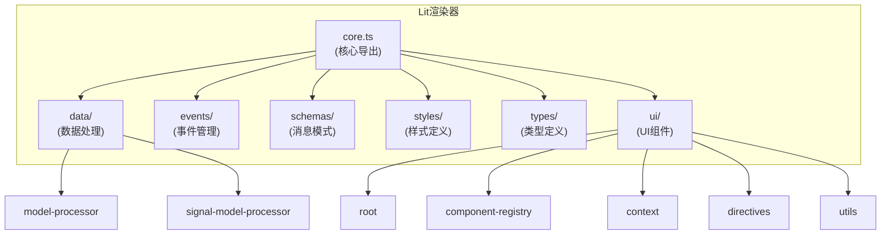
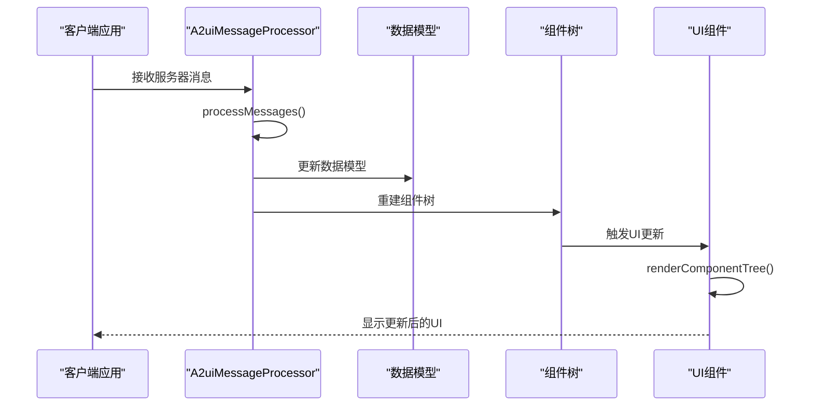
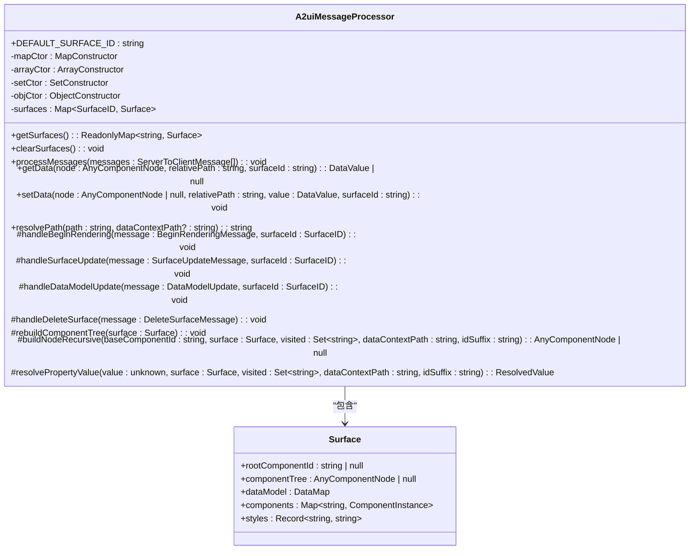
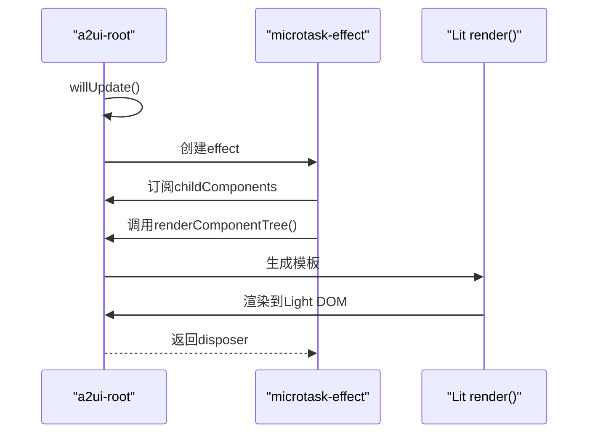
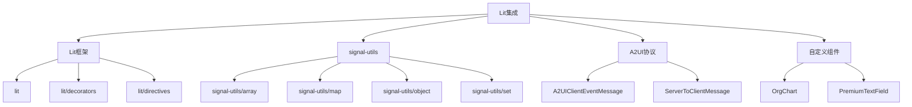

# Lit集成

<cite>
**本文档中引用的文件**  
- [core.ts](file://renderers/lit/src/0.8/core.ts)
- [signal-model-processor.ts](file://renderers/lit/src/0.8/data/signal-model-processor.ts)
- [model-processor.ts](file://renderers/lit/src/0.8/data/model-processor.ts)
- [root.ts](file://renderers/lit/src/0.8/ui/root.ts)
- [ui.ts](file://renderers/lit/src/0.8/ui/ui.ts)
- [component-registry.ts](file://renderers/lit/src/0.8/ui/component-registry.ts)
- [types.ts](file://renderers/lit/src/0.8/types/types.ts)
- [client.ts](file://samples/client/lit/contact/client.ts)
- [register-components.ts](file://samples/client/lit/contact/ui/custom-components/register-components.ts)
- [index.html](file://samples/client/lit/contact/index.html)
</cite>

## 目录
1. [简介](#简介)
2. [项目结构](#项目结构)
3. [核心组件](#核心组件)
4. [架构概述](#架构概述)
5. [详细组件分析](#详细组件分析)
6. [依赖分析](#依赖分析)
7. [性能考虑](#性能考虑)
8. [故障排除指南](#故障排除指南)
9. [结论](#结论)

## 简介
本指南详细介绍了如何在Lit框架中集成A2UI渲染器。文档涵盖了消息处理器的初始化、数据模型配置、组件注册表管理以及如何将处理器连接到WebSocket或A2A服务的消息流。同时，解释了如何在LitElement组件中使用`<a2ui-root>`或直接调用渲染API来显示UI，并提供了完整的代码示例，包括处理器初始化、消息订阅、错误处理和组件树更新。

## 项目结构
A2UI项目的Lit渲染器实现位于`renderers/lit`目录下，其结构遵循模块化设计原则。核心功能分布在`src/0.8`目录中，包含数据处理、事件管理、UI组件和类型定义等子模块。这种组织方式使得代码易于维护和扩展。



**图示来源**
- [core.ts](file://renderers/lit/src/0.8/core.ts#L1-L36)
- [model-processor.ts](file://renderers/lit/src/0.8/data/model-processor.ts#L1-L856)
- [root.ts](file://renderers/lit/src/0.8/ui/root.ts#L1-L533)

**本节来源**
- [core.ts](file://renderers/lit/src/0.8/core.ts#L1-L36)
- [project_structure](file://#L1-L100)

## 核心组件
Lit集成的核心在于`A2uiMessageProcessor`类和`createSignalA2uiMessageProcessor`函数。`A2uiMessageProcessor`负责处理和整合A2UI协议消息，将其转换为结构化的UI表面层次模型。`createSignalA2uiMessageProcessor`函数则创建一个使用信号（signals）的特殊消息处理器实例，实现响应式数据绑定。

**本节来源**
- [core.ts](file://renderers/lit/src/0.8/core.ts#L23-L31)
- [signal-model-processor.ts](file://renderers/lit/src/0.8/data/signal-model-processor.ts#L1-L32)

## 架构概述
A2UI Lit渲染器采用分层架构，从消息处理到UI渲染形成清晰的数据流。消息处理器接收来自服务器的消息，更新内部数据模型，然后触发UI组件的重新渲染。整个过程通过Lit的响应式系统和信号机制实现高效更新。



**图示来源**
- [model-processor.ts](file://renderers/lit/src/0.8/data/model-processor.ts#L97-L124)
- [root.ts](file://renderers/lit/src/0.8/ui/root.ts#L131-L142)

## 详细组件分析

### 消息处理器分析
`A2uiMessageProcessor`是整个系统的核心，负责处理四种类型的消息：`beginRendering`、`surfaceUpdate`、`dataModelUpdate`和`deleteSurface`。处理器维护一个表面（surface）映射，每个表面包含根组件ID、组件树、数据模型、组件映射和样式。

#### 消息处理器类图


**图示来源**
- [model-processor.ts](file://renderers/lit/src/0.8/data/model-processor.ts#L64-L803)
- [types.ts](file://renderers/lit/src/0.8/types/types.ts#L526-L532)

**本节来源**
- [model-processor.ts](file://renderers/lit/src/0.8/data/model-processor.ts#L1-L856)
- [types.ts](file://renderers/lit/src/0.8/types/types.ts#L1-L533)

### UI根组件分析
`<a2ui-root>`组件是Lit集成的入口点，它使用Lit的SignalWatcher来监听数据变化并自动更新UI。该组件通过`childComponents`属性接收组件树，并使用`renderComponentTree`方法将其渲染为DOM元素。

#### UI根组件序列图


**图示来源**
- [root.ts](file://renderers/lit/src/0.8/ui/root.ts#L97-L114)
- [ui.ts](file://renderers/lit/src/0.8/ui/ui.ts#L1-L120)

**本节来源**
- [root.ts](file://renderers/lit/src/0.8/ui/root.ts#L1-L533)
- [ui.ts](file://renderers/lit/src/0.8/ui/ui.ts#L1-L120)

### 组件注册表分析
组件注册表允许应用程序注册自定义组件或覆盖默认组件。通过`componentRegistry`实例，可以将自定义元素构造函数与组件类型关联起来，实现灵活的UI定制。

#### 组件注册流程图
```mermaid
flowchart TD
Start([开始注册]) --> Validate["验证类型名称\n是否为字母数字"])
Validate --> |有效| Register["在注册表中\n注册构造函数"]
Register --> Check["检查是否已定义"]
Check --> |未定义| Define["使用自定义标签名\n定义元素"]
Check --> |已定义| CheckName["检查标签名是否匹配"]
CheckName --> |匹配| End([注册完成])
CheckName --> |不匹配| Error["抛出错误"]
Validate --> |无效| Error
Define --> End
```

**图示来源**
- [component-registry.ts](file://renderers/lit/src/0.8/ui/component-registry.ts#L1-L59)
- [register-components.ts](file://samples/client/lit/contact/ui/custom-components/register-components.ts#L1-L34)

**本节来源**
- [component-registry.ts](file://renderers/lit/src/0.8/ui/component-registry.ts#L1-L59)
- [register-components.ts](file://samples/client/lit/contact/ui/custom-components/register-components.ts#L1-L34)

## 依赖分析
Lit集成依赖于多个核心库和模块，形成复杂的依赖网络。主要依赖包括Lit框架本身、信号工具库和A2UI协议定义。



**图示来源**
- [core.ts](file://renderers/lit/src/0.8/core.ts#L1-L36)
- [package.json](file://renderers/lit/package.json#L1-L20)

**本节来源**
- [core.ts](file://renderers/lit/src/0.8/core.ts#L1-L36)
- [package.json](file://renderers/lit/package.json#L1-L20)

## 性能考虑
为了确保Lit集成的高性能，需要考虑以下几个方面：

1. **信号优化**：使用`signal-utils`库中的信号类型（SignalArray, SignalMap等）来实现细粒度的响应式更新，避免不必要的重渲染。
2. **内存泄漏预防**：在`disconnectedCallback`中清理effect disposer，防止内存泄漏。
3. **批量更新处理**：通过`processMessages`方法批量处理消息，减少UI更新次数。
4. **路径规范化**：使用`#normalizePath`方法将不同格式的路径统一为标准格式，提高查找效率。
5. **循环引用检测**：在`#buildNodeRecursive`方法中使用visited集合检测循环引用，防止无限递归。

## 故障排除指南
在使用Lit集成时可能会遇到一些常见问题，以下是排查方法：

**本节来源**
- [model-processor.ts](file://renderers/lit/src/0.8/data/model-processor.ts#L488-L490)
- [root.ts](file://renderers/lit/src/0.8/ui/root.ts#L150-L151)
- [client.ts](file://samples/client/lit/contact/client.ts#L47-L62)

### 消息解析失败
当服务器返回的消息格式不符合预期时，会导致解析失败。检查：
- 消息是否符合`ServerToClientMessage`类型定义
- JSON字符串是否正确解析
- 数据路径是否有效

### 组件注册缺失
如果自定义组件未正确注册，会导致渲染失败。确保：
- 使用`componentRegistry.register()`正确注册组件
- 标签名符合规范（字母数字）
- 构造函数未被重复注册

### 渲染阻塞
当组件树过于复杂或数据更新频繁时，可能导致渲染阻塞。优化方法：
- 使用信号实现细粒度更新
- 批量处理消息更新
- 避免在渲染过程中执行耗时操作

## 结论
本指南详细介绍了A2UI Lit集成的各个方面，从核心组件到架构设计，再到性能优化和故障排除。通过理解`A2uiMessageProcessor`的工作原理和`<a2ui-root>`的渲染机制，开发者可以有效地在Lit应用中集成A2UI渲染器，实现高效、响应式的用户界面。