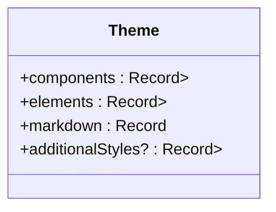
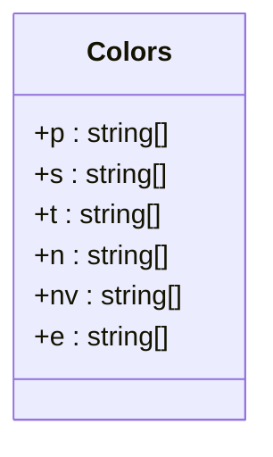
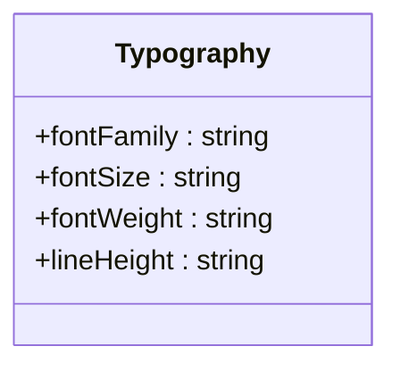
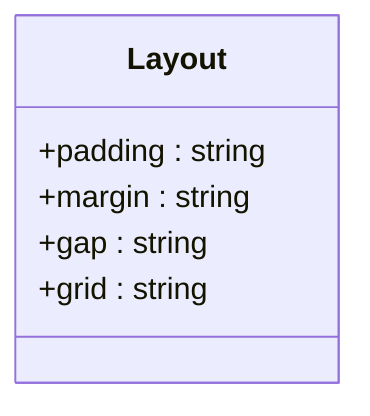
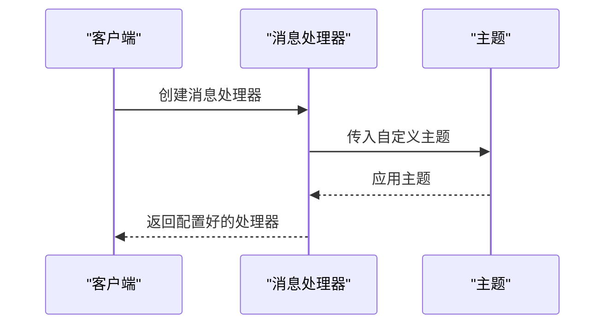
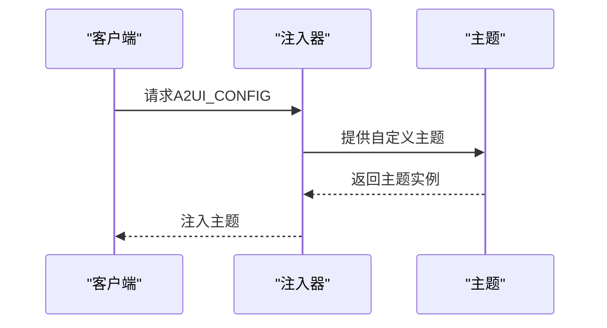
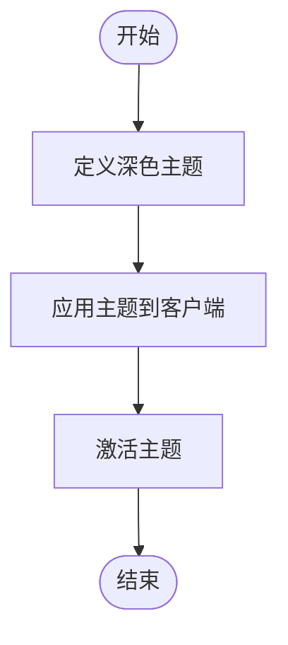
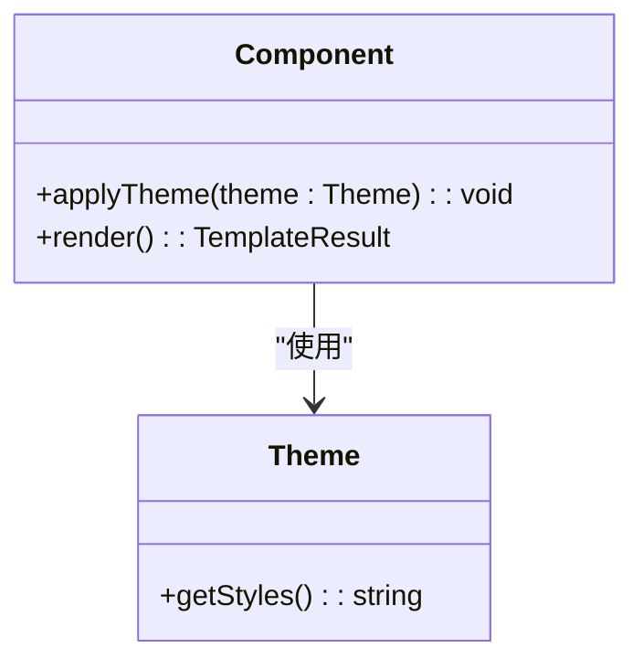

# 主题化

<cite>
**本文档中引用的文件**   
- [theme.ts](file://renderers/lit/src/0.8/ui/context/theme.ts)
- [theme.ts](file://samples/client/angular/projects/contact/src/app/theme.ts)
- [colors.ts](file://renderers/lit/src/0.8/styles/colors.ts)
- [type.ts](file://renderers/lit/src/0.8/styles/type.ts)
- [layout.ts](file://renderers/lit/src/0.8/styles/layout.ts)
- [theming.ts](file://renderers/angular/src/lib/rendering/theming.ts)
- [types.ts](file://renderers/lit/src/0.8/types/types.ts)
- [index.ts](file://renderers/lit/src/0.8/styles/index.ts)
- [theme.ts](file://samples/client/angular/projects/a2a-chat-canvas/src/lib/a2ui-catalog/theme.ts)
- [default-theme.ts](file://samples/client/lit/shell/theme/default-theme.ts)
- [theming.md](file://docs/guides/theming.md)
- [app.ts](file://samples/client/lit/shell/app.ts)
</cite>

## 目录
1. [简介](#简介)
2. [主题化设计理念](#主题化设计理念)
3. [主题结构详解](#主题结构详解)
4. [样式维度](#样式维度)
5. [在Lit中应用自定义主题](#在lit中应用自定义主题)
6. [在Angular中应用自定义主题](#在angular中应用自定义主题)
7. [创建深色主题示例](#创建深色主题示例)
8. [主题与组件样式的集成](#主题与组件样式的集成)
9. [结论](#结论)

## 简介
主题化系统允许通过集中管理样式变量（如颜色、字体、间距）来实现UI外观的全局定制。本指南将详细介绍如何在Lit和Angular渲染器中定义和应用自定义主题，以及如何确保自定义组件遵循当前主题。

## 主题化设计理念
主题化的设计理念是通过`Theme`对象集中管理样式变量，从而实现UI外观的全局定制。这种设计确保了品牌一致性、安全性和可访问性，同时允许平台原生的感觉。代理描述要显示的内容，而客户端决定其外观。

**Section sources**
- [theming.md](file://docs/guides/theming.md#L5-L17)

## 主题结构详解
`Theme`对象包含多个部分，用于定义不同方面的样式。主要结构包括组件、元素、Markdown和附加样式。

**Diagram sources **
- [types.ts](file://renderers/lit/src/0.8/types/types.ts#L65-L195)

## 样式维度
主题化系统涵盖了所有可定制的样式维度，包括颜色调色板、字体排版和布局间距。

### 颜色调色板
颜色调色板定义了各种颜色及其变体，用于背景、边框和文本颜色。

**Diagram sources **
- [colors.ts](file://renderers/lit/src/0.8/styles/colors.ts#L84-L90)

### 字体排版
字体排版定义了字体家族、大小、权重和行高。

**Diagram sources **
- [type.ts](file://renderers/lit/src/0.8/styles/type.ts#L17-L157)

### 布局间距
布局间距定义了填充、边距、间隙和网格系统。

**Diagram sources **
- [layout.ts](file://renderers/lit/src/0.8/styles/layout.ts#L19-L236)

## 在Lit中应用自定义主题
在Lit中，通过创建新的`Theme`实例并传入`createSignalA2uiMessageProcessor`来应用自定义主题。

**Diagram sources **
- [app.ts](file://samples/client/lit/shell/app.ts#L269)
- [signal-model-processor.ts](file://renderers/lit/src/0.8/data/signal-model-processor.ts#L24-L31)

## 在Angular中应用自定义主题
在Angular中，通过提供`A2UI_CONFIG`令牌来注入主题配置。

**Diagram sources **
- [theming.ts](file://renderers/angular/src/lib/rendering/theming.ts#L20-L23)

## 创建深色主题示例
以下是一个创建深色主题的完整示例，并在客户端应用中激活。

**Diagram sources **
- [default-theme.ts](file://samples/client/lit/shell/theme/default-theme.ts#L161-L442)
- [app.ts](file://samples/client/lit/shell/app.ts#L58)

## 主题与组件样式的集成
主题与组件样式的集成机制确保了自定义组件也能遵循当前主题。通过使用CSS类和变量，组件可以动态地应用主题样式。

**Diagram sources **
- [root.ts](file://renderers/lit/src/0.8/ui/root.ts#L34-L35)
- [styles.ts](file://renderers/lit/src/0.8/styles/index.ts#L27-L37)

## 结论
主题化系统通过集中管理样式变量，实现了UI外观的全局定制。无论是Lit还是Angular渲染器，都可以通过简单的配置来应用自定义主题，确保品牌一致性和用户体验的一致性。