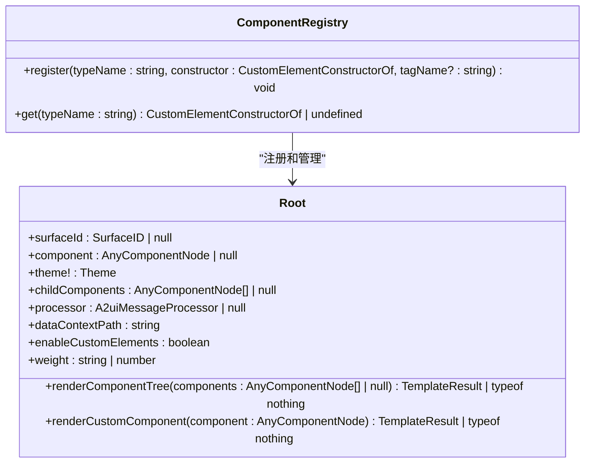
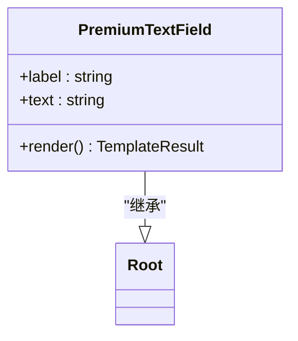
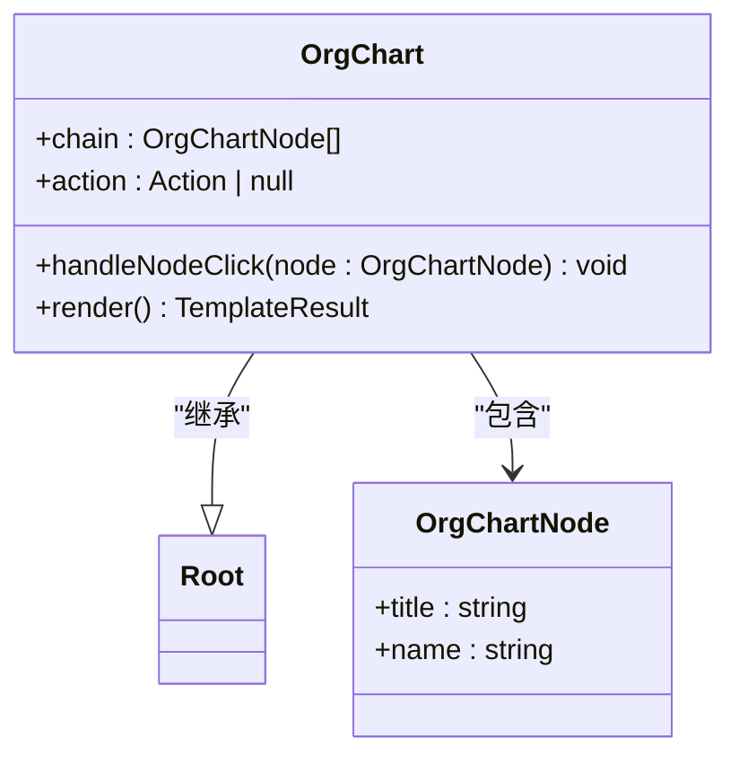
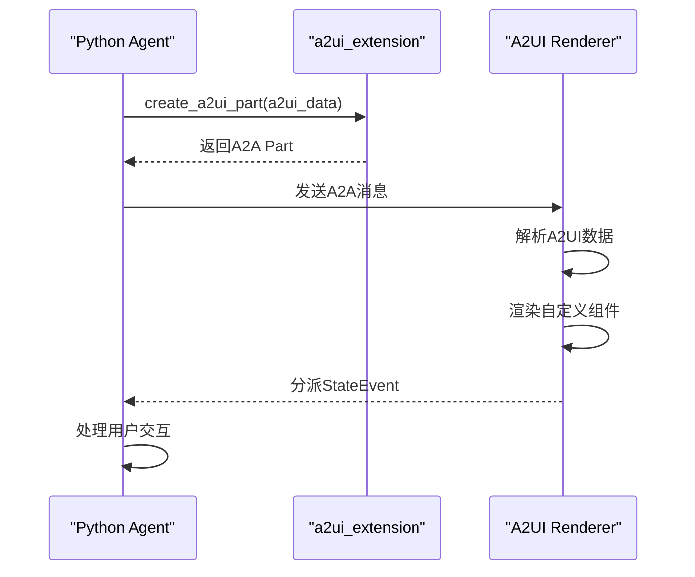
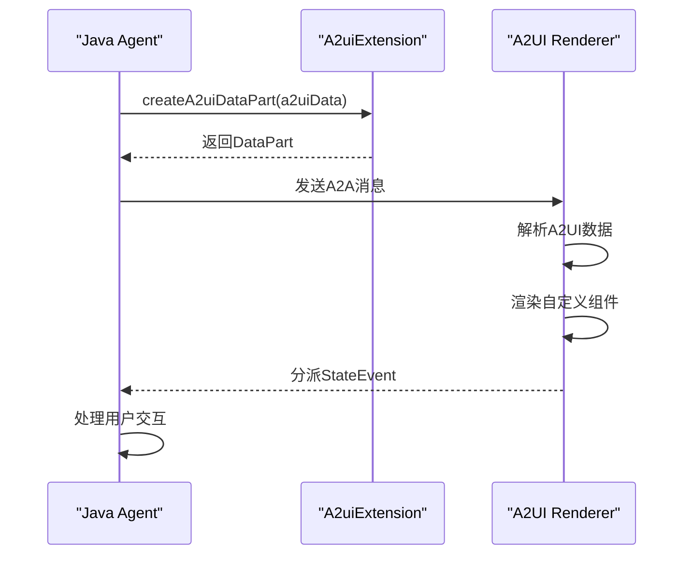

# 自定义组件

<cite>
**本文档中引用的文件**  
- [component-registry.ts](file://renderers/lit/src/0.8/ui/component-registry.ts)
- [root.ts](file://renderers/lit/src/0.8/ui/root.ts)
- [premium-text-field.ts](file://samples/client/lit/contact/ui/custom-components/premium-text-field.ts)
- [org-chart.ts](file://samples/client/lit/contact/ui/custom-components/org-chart.ts)
- [register-components.ts](file://samples/client/lit/contact/ui/custom-components/register-components.ts)
- [a2ui_extension.py](file://a2a_agents/python/a2ui_extension/src/a2ui/a2ui_extension.py)
- [A2uiExtension.java](file://a2a_agents/java/src/main/java/org/a2ui/A2uiExtension.java)
- [custom-components.md](file://docs/guides/custom-components.md)
</cite>

## 目录
1. [简介](#简介)
2. [组件注册机制](#组件注册机制)
3. [自定义组件开发流程](#自定义组件开发流程)
4. [简单组件示例：premium-text-field](#简单组件示例premium-text-field)
5. [复杂组件示例：org-chart](#复杂组件示例org-chart)
6. [Agent端A2UI消息生成](#agent端a2ui消息生成)
7. [常见问题排查](#常见问题排查)
8. [总结](#总结)

## 简介
A2UI框架支持通过自定义组件扩展标准UI组件库，以满足特定应用需求。自定义组件允许开发者创建领域专用的小部件、集成第三方组件或实现品牌特定的UI元素。本技术文档详细说明了`componentRegistry.register()` API的设计原理、调用方式以及自定义组件的完整开发流程。

**Section sources**
- [custom-components.md](file://docs/guides/custom-components.md#L1-L80)

## 组件注册机制

### `componentRegistry.register()` API设计原理
`componentRegistry.register()`是A2UI框架中用于注册自定义组件的核心API。该API接受三个参数：组件类型名、构造函数和可选的标签名。组件类型名必须是字母数字组合，用于在A2UI消息中标识组件。构造函数是自定义组件类的引用，而标签名用于在DOM中定义自定义元素。

注册过程首先验证类型名的格式，然后将组件构造函数存储在内部映射中。如果未指定标签名，则使用默认命名约定`a2ui-custom-{typeName}`。系统会检查构造函数是否已注册，以防止重复注册冲突。

**Diagram sources**
- [component-registry.ts](file://renderers/lit/src/0.8/ui/component-registry.ts#L19-L58)
- [root.ts](file://renderers/lit/src/0.8/ui/root.ts#L45-L532)

### 组件注册生命周期
组件注册的生命周期始于调用`register`方法，该方法将组件类型与构造函数关联。当渲染器遇到具有已注册类型的组件节点时，它会实例化相应的自定义元素，并将A2UI组件属性映射到元素属性。组件的属性更新会触发Lit的响应式更新机制，确保UI与数据模型保持同步。

**Section sources**
- [component-registry.ts](file://renderers/lit/src/0.8/ui/component-registry.ts#L19-L58)
- [root.ts](file://renderers/lit/src/0.8/ui/root.ts#L131-L167)

## 自定义组件开发流程

### 继承Root基类
所有自定义组件必须继承`Root`基类，该类提供了A2UI框架所需的核心功能，包括属性绑定、数据上下文管理和事件处理。`Root`类本身继承自LitElement，因此自定义组件可以利用Lit的所有功能，如响应式属性、模板渲染和阴影DOM。

### 模板与样式集成
自定义组件使用Lit的`html`和`css`标签函数定义模板和样式。样式应包含在组件的`static styles`属性中，并通过扩展`Root.styles`来继承基础样式。这确保了自定义组件与标准组件具有一致的视觉风格。

### 属性定义
组件属性使用Lit的`@property`装饰器定义。这些属性对应于A2UI消息中的组件属性，框架会自动将消息中的属性值绑定到组件实例。属性可以是简单类型（如字符串、数字）或复杂类型（如对象、数组），并支持类型转换和默认值。

### 事件处理
自定义组件可以通过分派`StateEvent`与其他组件或Agent进行通信。当用户与组件交互时（如点击按钮或输入文本），组件应创建包含动作信息的事件并分派它。Agent可以监听这些事件并执行相应的业务逻辑。

**Section sources**
- [root.ts](file://renderers/lit/src/0.8/ui/root.ts#L45-L532)
- [premium-text-field.ts](file://samples/client/lit/contact/ui/custom-components/premium-text-field.ts#L21-L100)
- [org-chart.ts](file://samples/client/lit/contact/ui/custom-components/org-chart.ts#L33-L160)

## 简单组件示例：premium-text-field

### 组件实现
`premium-text-field`是一个简单的自定义组件，它扩展了标准的文本字段功能，提供了增强的视觉效果和品牌标识。该组件继承`Root`类，并定义了`label`和`text`两个属性，分别对应于文本字段的标签和值。

**Diagram sources**
- [premium-text-field.ts](file://samples/client/lit/contact/ui/custom-components/premium-text-field.ts#L21-L100)

### 样式定制
该组件的样式包括一个带有阴影和圆角的容器，以及一个具有焦点效果的输入框。当用户将鼠标悬停在组件上时，会应用轻微的提升效果，增强交互体验。组件还包含一个"Custom"徽章，以突出其自定义性质。

### 属性绑定
在A2UI消息中，`premium-text-field`组件通过其类型名"TextField"被引用（因为它注册为标准组件的覆盖）。属性绑定使用JSON指针语法，将组件的`text`属性绑定到数据模型中的特定路径。

**Section sources**
- [premium-text-field.ts](file://samples/client/lit/contact/ui/custom-components/premium-text-field.ts#L21-L100)
- [register-components.ts](file://samples/client/lit/contact/ui/custom-components/register-components.ts#L26-L30)

## 复杂组件示例：org-chart

### 组件实现
`org-chart`是一个复杂的自定义组件，用于可视化组织结构图。它接受一个`chain`属性，该属性是一个包含职位和姓名的对象数组。组件使用Lit的`map`指令动态渲染组织结构中的每个节点。

**Diagram sources**
- [org-chart.ts](file://samples/client/lit/contact/ui/custom-components/org-chart.ts#L33-L160)

### 嵌套数据处理
该组件通过遍历`chain`数组来处理嵌套数据，为每个节点创建一个按钮元素。节点之间的连接使用箭头符号可视化。当前节点（数组中的最后一个）被突出显示，以指示组织结构的末端。

### 动态渲染
组件的渲染逻辑根据`chain`数组的长度动态调整。如果数组为空，组件会显示一个"无层次数据"的消息。否则，它会渲染整个组织结构，包括节点和连接箭头。

### 用户交互
当用户点击一个节点时，`handleNodeClick`方法会被调用。该方法创建一个新的动作，其中包含被点击节点的上下文信息，并分派一个`StateEvent`。这允许Agent响应用户交互并执行相应的操作。

**Section sources**
- [org-chart.ts](file://samples/client/lit/contact/ui/custom-components/org-chart.ts#L33-L160)
- [register-components.ts](file://samples/client/lit/contact/ui/custom-components/register-components.ts#L23-L24)

## Agent端A2UI消息生成

### Python实现
在Python Agent中，使用`a2ui_extension`模块生成A2UI消息。`create_a2ui_part`函数创建包含A2UI数据的A2A部分，而`get_a2ui_agent_extension`函数配置Agent以支持A2UI扩展。

**Diagram sources**
- [a2ui_extension.py](file://a2a_agents/python/a2ui_extension/src/a2ui/a2ui_extension.py#L34-L118)

### Java实现
在Java Agent中，`A2uiExtension`类提供了类似的功能。`createA2uiDataPart`方法创建包含A2UI数据的DataPart，而`isA2uiPart`和`getA2uiDataPart`方法用于检查和提取A2UI数据。

**Diagram sources**
- [A2uiExtension.java](file://a2a_agents/java/src/main/java/org/a2ui/A2uiExtension.java#L49-L83)

### 类型安全与目录协商
为了确保类型安全，Agent和客户端必须就使用的组件目录达成一致。客户端通过`beginRendering`消息中的`catalogId`指定支持的目录，而Agent则根据该目录生成A2UI消息。这防止了客户端尝试渲染未注册的组件，确保了系统的安全性和稳定性。

**Section sources**
- [a2ui_extension.py](file://a2a_agents/python/a2ui_extension/src/a2ui/a2ui_extension.py#L34-L118)
- [A2uiExtension.java](file://a2a_agents/java/src/main/java/org/a2ui/A2uiExtension.java#L49-L83)

## 常见问题排查

### 组件未注册错误
当尝试渲染未注册的组件时，会显示"Unknown element"错误。解决此问题的步骤包括：
1. 确认组件已通过`componentRegistry.register()`正确注册
2. 检查组件类型名是否与A2UI消息中的类型匹配
3. 验证注册代码是否在渲染器初始化之前执行

### 属性绑定失败
如果组件属性未正确更新，可能的原因包括：
1. 属性名在组件类和A2UI消息中不匹配
2. 数据模型路径在JSON指针语法中不正确
3. 组件未正确继承`Root`类，导致属性绑定机制失效

**Section sources**
- [root.ts](file://renderers/lit/src/0.8/ui/root.ts#L508-L509)
- [premium-text-field.ts](file://samples/client/lit/contact/ui/custom-components/premium-text-field.ts#L22-L23)
- [org-chart.ts](file://samples/client/lit/contact/ui/custom-components/org-chart.ts#L34-L35)

## 总结
自定义组件是A2UI框架的核心扩展机制，允许开发者创建满足特定需求的UI元素。通过理解`componentRegistry.register()` API的设计原理和调用方式，以及遵循正确的开发流程，可以创建出功能丰富、交互性强的自定义组件。Agent端的A2UI消息生成和类型安全的目录协商确保了组件在不同平台间的互操作性和安全性。