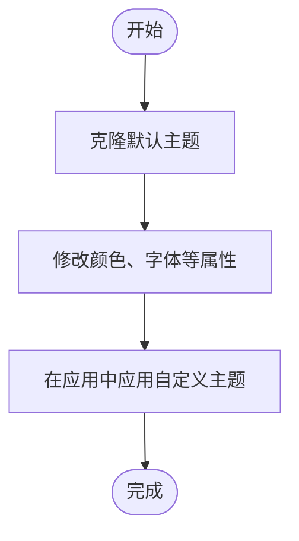

# 高级功能

<cite>
**本文档中引用的文件**  
- [component-registry.ts](file://renderers/lit/src/0.8/ui/component-registry.ts)
- [register-components.ts](file://samples/client/lit/contact/ui/custom-components/register-components.ts)
- [premium-text-field.ts](file://samples/client/lit/contact/ui/custom-components/premium-text-field.ts)
- [org-chart.ts](file://samples/client/lit/contact/ui/custom-components/org-chart.ts)
- [default-theme.ts](file://samples/client/lit/shell/theme/default-theme.ts)
- [clone-default-theme.ts](file://samples/client/lit/shell/theme/clone-default-theme.ts)
- [theming.ts](file://renderers/angular/src/lib/rendering/theming.ts)
- [custom-components.md](file://docs/guides/custom-components.md)
</cite>

## 目录
1. [简介](#简介)
2. [自定义组件](#自定义组件)
3. [主题化](#主题化)
4. [自定义组件目录](#自定义组件目录)
5. [跨平台兼容性](#跨平台兼容性)

## 简介
A2UI 框架提供了强大的扩展机制，允许开发者通过自定义组件和主题化来满足特定应用需求。本指南详细说明如何注册和使用自定义组件，以及如何定制应用的视觉样式。

## 自定义组件

A2UI 支持通过 `componentRegistry.register()` 方法注册自定义组件，从而扩展标准组件库。开发者可以创建从简单输入框到复杂组织结构图的各类组件。

### 注册机制

组件注册通过 `ComponentRegistry` 类实现，该类维护一个组件类型名称到构造函数的映射。当调用 `register()` 方法时，系统会验证类型名称的合法性，并将组件定义到浏览器的自定义元素注册表中。

**Diagram sources**
- [component-registry.ts](file://renderers/lit/src/0.8/ui/component-registry.ts#L19-L58)

**Section sources**
- [component-registry.ts](file://renderers/lit/src/0.8/ui/component-registry.ts#L1-L59)

### 简单组件示例：PremiumTextField

`PremiumTextField` 是一个增强型文本输入组件，它通过覆盖标准 `TextField` 组件来提供更丰富的视觉效果和交互体验。

该组件继承自 `Root` 基类，使用 Lit 框架的装饰器定义属性，并通过 CSS 定义样式。组件包含标签、输入框和提示信息，支持悬停和聚焦状态的视觉反馈。

**Diagram sources**
- [premium-text-field.ts](file://samples/client/lit/contact/ui/custom-components/premium-text-field.ts#L21-L100)

**Section sources**
- [premium-text-field.ts](file://samples/client/lit/contact/ui/custom-components/premium-text-field.ts#L1-L101)

### 复杂组件示例：OrgChart

`OrgChart` 组件用于展示组织结构层次，支持点击节点触发操作。该组件接收一个包含职位和姓名的节点数组作为数据链，并渲染为垂直排列的卡片序列。

组件实现了交互逻辑，当用户点击某个节点时，会创建一个包含节点上下文信息的操作事件并分发出去，供代理端处理。这种设计模式实现了组件与业务逻辑的解耦。

**Diagram sources**
- [org-chart.ts](file://samples/client/lit/contact/ui/custom-components/org-chart.ts#L33-L160)

**Section sources**
- [org-chart.ts](file://samples/client/lit/contact/ui/custom-components/org-chart.ts#L1-L161)

### 组件注册流程

在应用程序启动时，通过调用 `registerContactComponents()` 函数来注册自定义组件。该函数使用 `componentRegistry` 实例将组件构造函数与类型名称关联起来。

值得注意的是，`PremiumTextField` 被注册为 `TextField` 类型的替代品，这意味着当代理请求渲染 `TextField` 组件时，系统将使用自定义的 `PremiumTextField` 组件。

**Diagram sources**
- [register-components.ts](file://samples/client/lit/contact/ui/custom-components/register-components.ts#L21-L33)

**Section sources**
- [register-components.ts](file://samples/client/lit/contact/ui/custom-components/register-components.ts#L1-L34)

## 主题化

A2UI 的主题系统允许开发者定制应用的颜色、字体、间距等视觉属性，实现品牌一致性。

### 主题系统架构

主题系统基于 `Theme` 接口实现，该接口定义了组件样式、元素样式和附加样式的结构。在 Angular 项目中，主题通过 `InjectionToken` 提供，实现了依赖注入机制。

**Diagram sources**
- [default-theme.ts](file://samples/client/lit/shell/theme/default-theme.ts#L161-L442)
- [theming.ts](file://renderers/angular/src/lib/rendering/theming.ts#L20-L22)

**Section sources**
- [default-theme.ts](file://samples/client/lit/shell/theme/default-theme.ts#L1-L443)
- [theming.ts](file://renderers/angular/src/lib/rendering/theming.ts#L1-L23)

### 主题定制方法

开发者可以通过两种方式定制主题：扩展 `Theme` 接口或覆盖 `default-theme.ts` 文件。推荐使用 `cloneDefaultTheme()` 函数创建默认主题的副本，然后在此基础上进行修改，以保留基础样式并仅覆盖需要更改的部分。

**Diagram sources**
- [clone-default-theme.ts](file://samples/client/lit/shell/theme/clone-default-theme.ts#L20-L22)

**Section sources**
- [clone-default-theme.ts](file://samples/client/lit/shell/theme/clone-default-theme.ts#L1-L23)

## 自定义组件目录

自定义组件目录是组件注册和协商的核心机制。客户端应用程序定义包含标准和自定义组件的目录，并向代理宣布支持的目录列表。

### 目录协商流程

1. **客户端定义目录**：创建包含组件列表的目录定义
2. **客户端注册目录**：将目录及其组件实现注册到应用中
3. **客户端宣布支持**：通知代理支持的目录ID
4. **代理选择目录**：根据功能需求选择合适的目录
5. **代理生成UI**：使用所选目录中的组件生成界面

这种机制确保了安全性和类型安全性，同时允许灵活的组件扩展。

**Section sources**
- [custom-components.md](file://docs/guides/custom-components.md#L1-L80)

## 跨平台兼容性

为确保自定义组件在不同平台间的兼容性，应遵循以下最佳实践：

- **使用标准Web组件**：基于 Custom Elements 和 Shadow DOM 标准
- **避免平台特定API**：确保组件逻辑不依赖特定框架的私有API
- **统一数据绑定**：使用JSON Pointer语法进行数据绑定
- **标准化事件系统**：通过 `StateEvent` 分发操作事件
- **响应式设计**：确保组件在不同屏幕尺寸下正常显示

通过遵循这些原则，可以创建在 Angular、Lit 和其他支持 Web Components 的框架中都能正常工作的自定义组件。