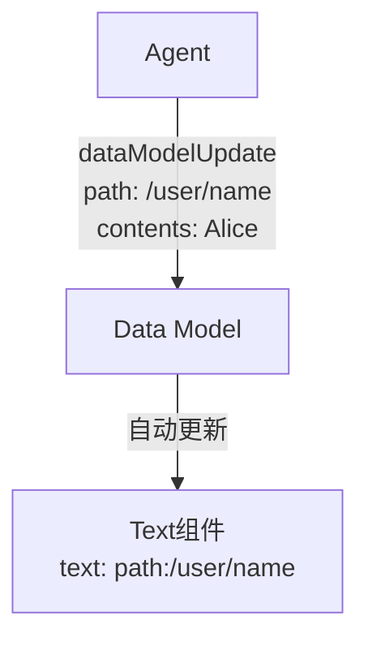
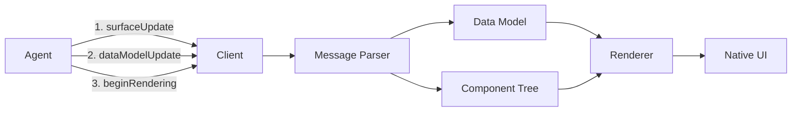

# 核心概念

<cite>
**本文档中引用的文件**   
- [overview.md](file://docs/concepts/overview.md)
- [components.md](file://docs/concepts/components.md)
- [data-binding.md](file://docs/concepts/data-binding.md)
- [data-flow.md](file://docs/concepts/data-flow.md)
- [messages.md](file://docs/reference/messages.md)
- [what-is-a2ui.md](file://docs/introduction/what-is-a2ui.md)
- [surface.ts](file://renderers/lit/src/0.8/ui/surface.ts)
- [root.ts](file://renderers/lit/src/0.8/ui/root.ts)
- [model-processor.ts](file://renderers/lit/src/0.8/data/model-processor.ts)
- [components.ts](file://renderers/lit/src/0.8/types/components.ts)
- [primitives.ts](file://renderers/lit/src/0.8/types/primitives.ts)
- [standard_catalog_definition.json](file://specification/0.9/json/standard_catalog_definition.json)
</cite>

## 目录
1. [声明式UI与命令式UI](#声明式ui与命令式ui)
2. [四大核心概念](#四大核心概念)
   1. [组件（Component）](#组件component)
   2. [画布（Surface）](#画布surface)
   3. [数据模型（Data Model）](#数据模型data-model)
   4. [消息流（Message Flow）](#消息流message-flow)
3. [数据流示意图](#数据流示意图)

## 声明式UI与命令式UI

A2UI的核心是**声明式UI**（Declarative UI）范式，这与传统的**命令式UI**（Imperative UI）有着根本性的区别。

在命令式UI中，开发者通过编写代码来直接操作和修改用户界面。例如，使用JavaScript来获取一个DOM元素并改变其文本内容。这种方式要求开发者精确地描述“如何”（how）完成一个任务，即一步步地告诉计算机执行哪些操作。

而声明式UI则完全不同。开发者不再描述“如何”构建界面，而是描述“什么”（what）是界面应该呈现的状态。A2UI正是基于这一理念，它将UI描述为数据，而不是可执行的代码。AI代理（Agent）生成的是一个描述UI结构的JSON消息序列，而不是直接操作DOM的JavaScript代码。

这种范式带来了显著的优势：
- **安全性**：传输的是数据而非可执行代码，客户端只从其信任的组件目录中渲染组件，从根本上避免了代码注入等安全风险。
- **平台无关性**：同一份JSON消息可以在Web、移动端（Flutter、SwiftUI）、桌面端等不同平台上，由各自的渲染器映射为原生的UI组件，实现“一次编写，处处运行”。
- **LLM友好**：生成结构化的JSON数据比生成复杂的、语法正确的HTML/JavaScript代码对大语言模型（LLM）来说要容易得多，也更可靠。
- **渐进式渲染**：UI可以以消息流的形式增量式地发送和渲染，用户无需等待整个响应生成完毕，即可看到部分内容，提升了用户体验。

**Section sources**
- [what-is-a2ui.md](file://docs/introduction/what-is-a2ui.md#L3-L39)
- [overview.md](file://docs/concepts/overview.md#L10-L11)

## 四大核心概念

### 组件（Component）

组件是A2UI中构建用户界面的基本单元。A2UI定义了一个包含22个标准组件的**标准目录**（Standard Catalog），这些组件被组织成不同的类别，每个组件都有其通用的属性和行为。

#### 组件分类
标准组件主要分为四类：
1.  **布局组件**（Layout）：用于排列其他组件。
    -   `Row`：水平布局容器。
    -   `Column`：垂直布局容器。
    -   `List`：可滚动的项目列表。
2.  **显示组件**（Display）：用于展示信息。
    -   `Text`：显示文本内容。
    -   `Image`：显示图片。
    -   `Icon`：显示图标。
    -   `Video`：显示视频。
    -   `Divider`：视觉分隔线。
3.  **交互组件**（Interactive）：用于用户输入。
    -   `Button`：可点击的按钮。
    -   `TextField`：文本输入框。
    -   `CheckBox`：复选框。
    -   `DateTimeInput`：日期时间输入。
    -   `Slider`：滑块。
    -   `MultipleChoice`：多选组件。
4.  **容器组件**（Container）：用于分组和组织内容。
    -   `Card`：带边框和内边距的容器。
    -   `Tabs`：标签页界面。
    -   `Modal`：模态对话框。

#### 通用属性与行为
所有组件都具备以下核心属性：
-   **ID**：组件的唯一标识符，用于在消息中引用。
-   **类型**（Type）：组件的种类，如`Text`、`Button`等。
-   **属性**（Properties）：组件的配置项，如`Text`组件的`text`属性，`Button`组件的`action`属性。

组件通过**ID引用**来建立父子关系，形成一个扁平的**邻接表模型**（Adjacency List Model），而非传统的嵌套JSON树。这种设计使得LLM可以增量式地生成和更新UI，极大地提高了灵活性和容错性。

**Section sources**
- [components.md](file://docs/concepts/components.md#L50-L58)
- [components.ts](file://renderers/lit/src/0.8/types/components.ts#L17-L212)
- [standard_catalog_definition.json](file://specification/0.9/json/standard_catalog_definition.json#L23-L43)

### 画布（Surface）

画布（Surface）是UI渲染的容器，可以理解为一个独立的UI“画布”或“窗口”，例如一个对话框、侧边栏或主视图。它作为UI组件的宿主，管理着一组相关的组件和它们的状态。

#### 生命周期
画布的生命周期由特定的消息控制：
1.  **创建**：当客户端接收到第一个针对某个`surfaceId`的`surfaceUpdate`消息时，该画布即被创建。
2.  **更新**：通过发送`surfaceUpdate`消息来添加、修改或删除画布内的组件。
3.  **渲染**：当客户端收到`beginRendering`消息时，它会开始渲染该画布。此消息指定了画布的`surfaceId`和UI树的根组件ID。
4.  **销毁**：通过发送`deleteSurface`消息来移除整个画布及其所有组件和数据。

在渲染器代码中，`a2ui-surface`是一个自定义Web组件，它负责管理一个`Surface`实例，该实例包含了组件树、数据模型和样式等信息。

**Section sources**
- [overview.md](file://docs/concepts/overview.md#L28-L31)
- [surface.ts](file://renderers/lit/src/0.8/ui/surface.ts#L1-L135)

### 数据模型（Data Model）

数据模型（Data Model）是A2UI中用于存储应用状态的JSON对象。它与UI结构完全分离，这种分离是实现数据绑定和响应式更新的关键。

#### 数据绑定与JSON Pointer
组件通过**JSON Pointer**（RFC 6901）路径与数据模型中的值进行绑定。例如，一个`Text`组件的`text`属性可以设置为`{"path": "/user/name"}`，这意味着该文本将显示数据模型中`/user/name`路径对应的值。

当数据模型中的值发生变化时，所有绑定到该路径的组件会自动重新渲染，从而实现**响应式更新**。这种机制允许UI高效地处理大量数据，例如动态列表。

**`dataModelUpdate`消息**用于更新数据模型。它可以：
-   **初始化整个模型**：当`path`属性省略时，`contents`将替换整个数据模型。
-   **更新特定路径**：当指定`path`时，`contents`将更新该路径下的数据，而不会影响其他部分。

**Diagram sources**
- [data-binding.md](file://docs/concepts/data-binding.md#L28-L35)
- [messages.md](file://docs/reference/messages.md#L217-L300)
- [model-processor.ts](file://renderers/lit/src/0.8/data/model-processor.ts#L178-L346)

### 消息流（Message Flow）

A2UI基于**JSON Lines**（JSONL）格式，通过一系列增量更新的消息来驱动UI。这些消息从代理（Agent）流向客户端，形成一个清晰的数据流。

#### 核心消息类型
1.  **`surfaceUpdate`**：定义或更新一个画布中的组件。它包含一个组件数组，每个组件都有一个ID和类型。
2.  **`dataModelUpdate`**：更新与画布关联的数据模型。它使用JSON Pointer路径来指定更新位置。
3.  **`beginRendering`**：通知客户端，它已经收到了足够的信息，可以开始渲染指定的画布。此消息必须在`surfaceUpdate`之后发送。
4.  **`deleteSurface`**：请求删除一个画布。

#### 消息序列与作用
一个典型的UI构建流程如下：
1.  **定义结构**：代理发送一个或多个`surfaceUpdate`消息，逐步构建UI的组件树。
2.  **填充数据**：代理发送一个或多个`dataModelUpdate`消息，为组件绑定数据。
3.  **触发渲染**：代理发送`beginRendering`消息，客户端开始渲染UI。
4.  **用户交互**：用户与UI交互（如点击按钮），客户端根据组件的`action`属性生成用户动作消息并发送回代理。
5.  **更新UI**：代理根据用户动作，发送新的`surfaceUpdate`或`dataModelUpdate`消息来更新UI。

这种基于消息流的机制支持**渐进式渲染**，即客户端可以在消息流到达时就立即渲染已收到的部分UI，而不是等待整个响应完成。

**Section sources**
- [data-flow.md](file://docs/concepts/data-flow.md#L17-L23)
- [messages.md](file://docs/reference/messages.md#L1-L356)
- [model-processor.ts](file://renderers/lit/src/0.8/data/model-processor.ts#L97-L124)

## 数据流示意图

以下图表说明了数据从代理（Agent）到客户端（Client）的流动过程。

**Diagram sources**
- [data-flow.md](file://docs/concepts/data-flow.md#L7-L11)
- [root.ts](file://renderers/lit/src/0.8/ui/root.ts#L45-L532)
- [model-processor.ts](file://renderers/lit/src/0.8/data/model-processor.ts#L64-L800)