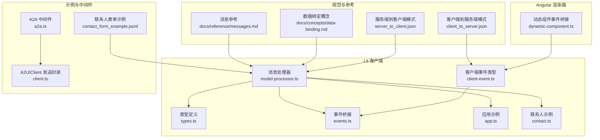
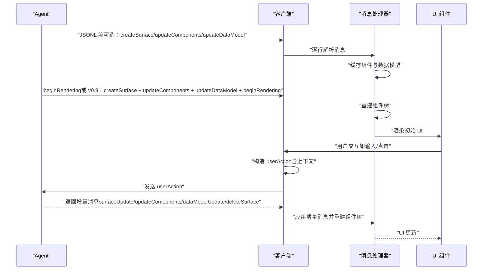
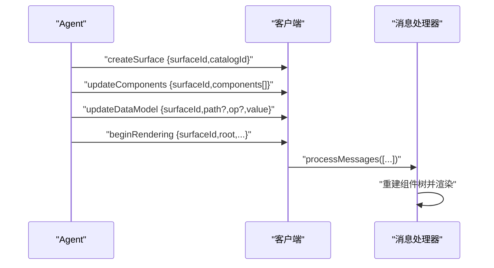
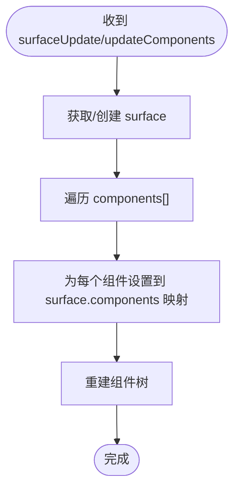
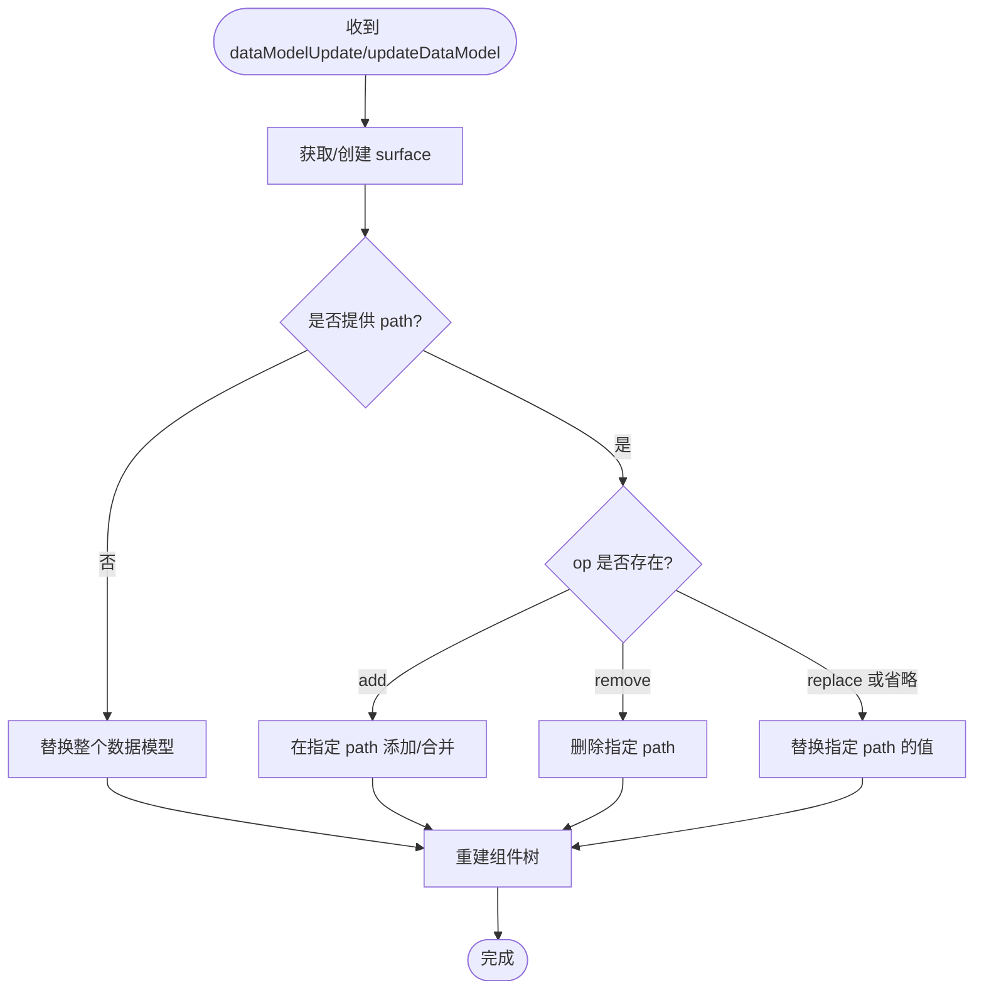
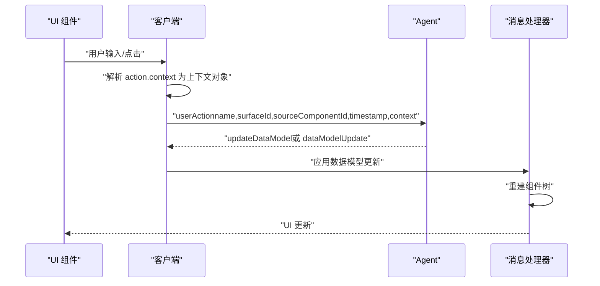
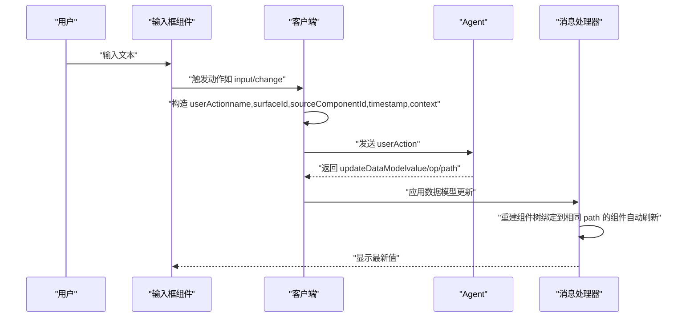
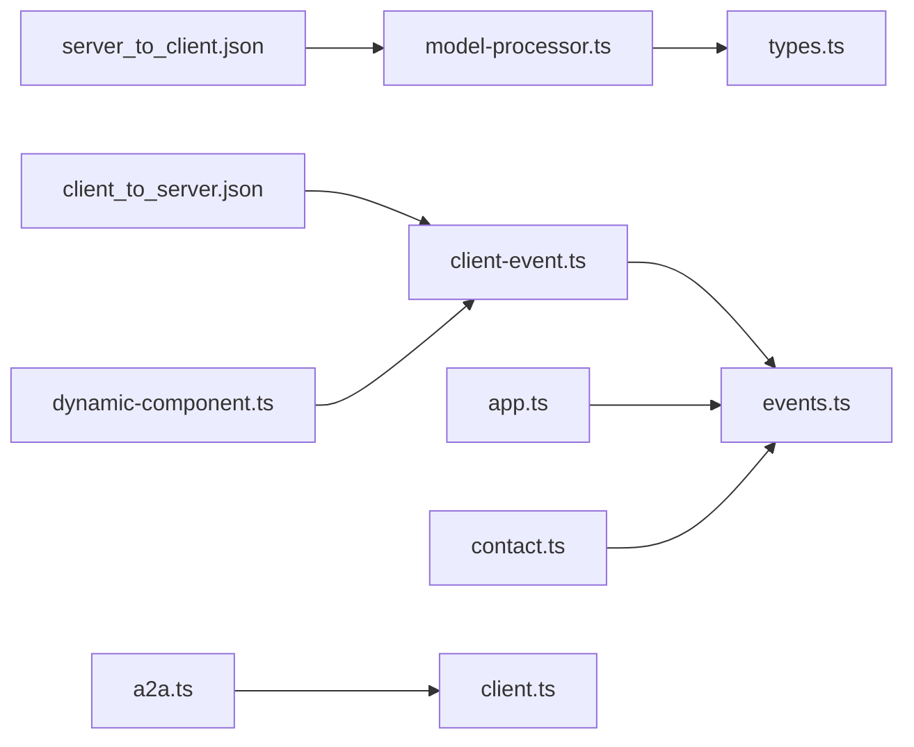

# 消息流与数据绑定

<cite>
**本文引用的文件**
- [messages.md](file://docs/reference/messages.md)
- [data-binding.md](file://docs/concepts/data-binding.md)
- [a2ui_protocol.md](file://specification/0.8/docs/a2ui_protocol.md)
- [server_to_client.json](file://specification/0.9/json/server_to_client.json)
- [client_to_server.json](file://specification/0.9/json/client_to_server.json)
- [model-processor.ts](file://renderers/lit/src/0.8/data/model-processor.ts)
- [types.ts](file://renderers/lit/src/0.8/types/types.ts)
- [events.ts](file://renderers/lit/src/0.8/events/events.ts)
- [client-event.ts](file://renderers/lit/src/0.8/types/client-event.ts)
- [contact_form_example.jsonl](file://specification/0.9/json/contact_form_example.jsonl)
- [a2a.ts](file://samples/client/lit/shell/middleware/a2a.ts)
- [client.ts](file://samples/client/lit/shell/client.ts)
- [app.ts](file://samples/client/lit/shell/app.ts)
- [contact.ts](file://samples/client/lit/contact/contact.ts)
- [dynamic-component.ts](file://renderers/angular/src/lib/rendering/dynamic-component.ts)
- [evolution_guide.md](file://specification/0.9/docs/evolution_guide.md)
</cite>

## 目录
1. [引言](#引言)
2. [项目结构](#项目结构)
3. [核心组件](#核心组件)
4. [架构总览](#架构总览)
5. [详细组件分析](#详细组件分析)
6. [依赖关系分析](#依赖关系分析)
7. [性能考量](#性能考量)
8. [故障排查指南](#故障排查指南)
9. [结论](#结论)
10. [附录](#附录)

## 引言
本文件系统性阐述 A2UI 的消息驱动架构与双向数据绑定机制。A2UI 采用 JSON Lines（JSONL）作为消息格式，每行一条消息，支持按行独立处理，从而实现增量与渐进式渲染。核心消息类型包括：
- 初始化：beginRendering、createSurface（v0.9）
- 组件树变更：surfaceUpdate（v0.8）、updateComponents（v0.9）
- 数据模型更新：dataModelUpdate（v0.8）、updateDataModel（v0.9）
- 资源清理：deleteSurface（v0.8）

同时，A2UI 实现了双向数据绑定：客户端组件通过 userAction 将用户交互上报给 Agent；Agent 则通过 updateDataModel（或旧版 dataModelUpdate）将新状态推回客户端，驱动 UI 渐进式更新。

## 项目结构
围绕消息驱动与数据绑定的关键位置如下：
- 规范与参考文档：docs/reference/messages.md、docs/concepts/data-binding.md、specification/0.9/json/*.json
- 客户端处理器与类型：renderers/lit/src/0.8/data/model-processor.ts、types/types.ts、events/events.ts、types/client-event.ts
- 示例与中间件：samples/client/lit/shell/*、specification/0.9/json/contact_form_example.jsonl
- Angular 渲染器事件桥接：renderers/angular/src/lib/rendering/dynamic-component.ts

图表来源
- [messages.md](file://docs/reference/messages.md#L1-L397)
- [data-binding.md](file://docs/concepts/data-binding.md#L1-L133)
- [server_to_client.json](file://specification/0.9/json/server_to_client.json#L1-L115)
- [client_to_server.json](file://specification/0.9/json/client_to_server.json#L1-L98)
- [model-processor.ts](file://renderers/lit/src/0.8/data/model-processor.ts#L1-L439)
- [types.ts](file://renderers/lit/src/0.8/types/types.ts#L197-L299)
- [events.ts](file://renderers/lit/src/0.8/events/events.ts#L1-L54)
- [client-event.ts](file://renderers/lit/src/0.8/types/client-event.ts#L1-L81)
- [app.ts](file://samples/client/lit/shell/app.ts#L462-L496)
- [contact.ts](file://samples/client/lit/contact/contact.ts#L261-L295)
- [dynamic-component.ts](file://renderers/angular/src/lib/rendering/dynamic-component.ts#L42-L70)
- [contact_form_example.jsonl](file://specification/0.9/json/contact_form_example.jsonl#L1-L4)
- [a2a.ts](file://samples/client/lit/shell/middleware/a2a.ts#L1-L154)
- [client.ts](file://samples/client/lit/shell/client.ts#L1-L113)

章节来源
- [messages.md](file://docs/reference/messages.md#L1-L397)
- [server_to_client.json](file://specification/0.9/json/server_to_client.json#L1-L115)
- [client_to_server.json](file://specification/0.9/json/client_to_server.json#L1-L98)

## 核心组件
- 消息处理器（A2uiMessageProcessor）：负责解析并应用服务端消息，维护每个 surface 的组件映射、数据模型与根节点，按需重建组件树。
- 类型系统：定义 beginRendering、surfaceUpdate、dataModelUpdate、deleteSurface 等消息结构，以及 UserAction、ClientCapabilities 等客户端事件类型。
- 事件桥接：将组件触发的动作转换为 userAction 并发送至服务端。
- 参考规范：消息参考文档与协议文档明确消息格式、顺序与增量渲染要求。

章节来源
- [model-processor.ts](file://renderers/lit/src/0.8/data/model-processor.ts#L97-L124)
- [types.ts](file://renderers/lit/src/0.8/types/types.ts#L248-L299)
- [client-event.ts](file://renderers/lit/src/0.8/types/client-event.ts#L37-L81)
- [messages.md](file://docs/reference/messages.md#L1-L397)

## 架构总览
A2UI 的消息驱动架构以 JSONL 流为核心，客户端按行解析消息，缓冲组件与数据，直到收到 beginRendering（或 v0.9 的 createSurface + updateComponents + updateDataModel + beginRendering）才开始渲染。用户交互通过 userAction 上报，Agent 处理后返回增量消息，驱动 UI 渐进式更新。

图表来源
- [a2ui_protocol.md](file://specification/0.8/docs/a2ui_protocol.md#L102-L142)
- [messages.md](file://docs/reference/messages.md#L358-L384)
- [server_to_client.json](file://specification/0.9/json/server_to_client.json#L1-L115)
- [client_to_server.json](file://specification/0.9/json/client_to_server.json#L1-L98)

## 详细组件分析

### 消息类型与序列
- beginRendering（v0.8）：指示客户端已具备渲染条件，应等待 surfaceUpdate 与 dataModelUpdate 缓冲完成后再构建 UI 树。
- createSurface（v0.9）：声明新 surface 的 catalogId，后续需配合 updateComponents 与 updateDataModel。
- surfaceUpdate（v0.8）：向指定 surface 增量添加或更新组件，组件以邻接列表形式组织，可通过 children/explicitList/child 等建立父子关系。
- updateComponents（v0.9）：与 v0.8 的 surfaceUpdate 同义，但消息名统一为 updateComponents。
- dataModelUpdate（v0.8）：以“键值对邻接列表”更新数据模型，适合 LLM 生成；支持按路径局部更新。
- updateDataModel（v0.9）：v0.9 的标准消息，value 为标准 JSON 对象，支持 op（add/replace/remove），path 为 JSON Pointer。
- deleteSurface：删除 surface 及其组件与数据模型。

章节来源
- [messages.md](file://docs/reference/messages.md#L1-L397)
- [server_to_client.json](file://specification/0.9/json/server_to_client.json#L1-L115)
- [model-processor.ts](file://renderers/lit/src/0.8/data/model-processor.ts#L97-L124)

### 初始化流程：beginRendering 与 createSurface
- v0.8：客户端在收到 beginRendering 前，缓冲 surfaceUpdate 与 dataModelUpdate；收到 beginRendering 后，以 root 为根重建组件树。
- v0.9：先 createSurface（声明 catalogId），再 updateComponents 与 updateDataModel，最后 beginRendering（或直接由 Agent 在同一 JSONL 流中发送上述序列）。

图表来源
- [server_to_client.json](file://specification/0.9/json/server_to_client.json#L1-L115)
- [contact_form_example.jsonl](file://specification/0.9/json/contact_form_example.jsonl#L1-L4)
- [model-processor.ts](file://renderers/lit/src/0.8/data/model-processor.ts#L405-L413)

章节来源
- [messages.md](file://docs/reference/messages.md#L1-L69)
- [a2ui_protocol.md](file://specification/0.8/docs/a2ui_protocol.md#L102-L110)
- [contact_form_example.jsonl](file://specification/0.9/json/contact_form_example.jsonl#L1-L4)

### 组件树增删改：surfaceUpdate 与 updateComponents
- 处理器会将组件映射到 surface 的组件集合，并在收到 surfaceUpdate/updateComponents 后重建组件树。
- 组件以邻接列表组织，容器组件通过 children/explicitList/child 等字段引用子组件 ID。
- 支持增量添加与覆盖更新，避免重复发送完整树。

图表来源
- [model-processor.ts](file://renderers/lit/src/0.8/data/model-processor.ts#L415-L424)
- [messages.md](file://docs/reference/messages.md#L72-L205)

章节来源
- [model-processor.ts](file://renderers/lit/src/0.8/data/model-processor.ts#L415-L424)
- [messages.md](file://docs/reference/messages.md#L72-L205)

### 数据模型更新：dataModelUpdate 与 updateDataModel
- v0.8：dataModelUpdate 使用 contents 邻接列表，按 path 局部更新；未提供 path 或 path="/" 时替换整个模型。
- v0.9：updateDataModel 使用标准 JSON 对象 value，支持 op（默认 replace），path 为 JSON Pointer。
- 处理器根据 path 写入数据模型并在必要时重建组件树。

图表来源
- [model-processor.ts](file://renderers/lit/src/0.8/data/model-processor.ts#L426-L435)
- [server_to_client.json](file://specification/0.9/json/server_to_client.json#L64-L94)
- [evolution_guide.md](file://specification/0.9/docs/evolution_guide.md#L175-L200)

章节来源
- [model-processor.ts](file://renderers/lit/src/0.8/data/model-processor.ts#L426-L435)
- [server_to_client.json](file://specification/0.9/json/server_to_client.json#L64-L94)
- [evolution_guide.md](file://specification/0.9/docs/evolution_guide.md#L175-L200)

### 资源清理：deleteSurface
- 删除 surface 及其组件与数据模型，安全幂等。
- 客户端在收到 deleteSurface 后移除对应 surface。

章节来源
- [messages.md](file://docs/reference/messages.md#L303-L355)
- [model-processor.ts](file://renderers/lit/src/0.8/data/model-processor.ts#L437-L439)

### 双向数据绑定与事件上报
- 读写契约：输入组件（如 TextField、CheckBox、Slider、MultipleChoice、DateTimeInput）建立双向绑定：从模型读取值，用户交互即时更新本地数据模型；随后 Agent 可通过 updateDataModel 推送新状态。
- 事件上报：组件触发动作时，客户端构造 userAction，包含 name、sourceComponentId、surfaceId、timestamp、context（action.context 解析后的键值对），并通过 A2A 通道发送至 Agent。
- Agent 处理后返回增量消息，驱动 UI 更新。

图表来源
- [a2ui_protocol.md](file://specification/0.8/docs/a2ui_protocol.md#L342-L351)
- [client_to_server.json](file://specification/0.9/json/client_to_server.json#L1-L98)
- [client-event.ts](file://renderers/lit/src/0.8/types/client-event.ts#L37-L81)
- [app.ts](file://samples/client/lit/shell/app.ts#L462-L496)
- [contact.ts](file://samples/client/lit/contact/contact.ts#L261-L295)
- [dynamic-component.ts](file://renderers/angular/src/lib/rendering/dynamic-component.ts#L42-L70)

章节来源
- [a2ui_protocol.md](file://specification/0.8/docs/a2ui_protocol.md#L342-L351)
- [client_to_server.json](file://specification/0.9/json/client_to_server.json#L1-L98)
- [client-event.ts](file://renderers/lit/src/0.8/types/client-event.ts#L37-L81)
- [app.ts](file://samples/client/lit/shell/app.ts#L462-L496)
- [contact.ts](file://samples/client/lit/contact/contact.ts#L261-L295)
- [dynamic-component.ts](file://renderers/angular/src/lib/rendering/dynamic-component.ts#L42-L70)

### 事件消息中的 dataPath 与 value 字段
- v0.9 的 userAction 结构包含：
  - name：动作名称
  - surfaceId：事件来源 surface
  - sourceComponentId：触发组件 ID
  - timestamp：ISO 时间戳
  - context：从 action.context 解析出的键值对（支持字面量与路径解析）
- dataPath 与 value 的使用场景：
  - dataPath：在组件定义中通过 path 指定绑定的数据路径（JSON Pointer），用于读取/写入数据模型。
  - value：在 v0.9 的 updateDataModel 中，value 为标准 JSON 对象，op 控制操作类型（add/replace/remove）。

章节来源
- [client_to_server.json](file://specification/0.9/json/client_to_server.json#L1-L98)
- [server_to_client.json](file://specification/0.9/json/server_to_client.json#L64-L94)
- [evolution_guide.md](file://specification/0.9/docs/evolution_guide.md#L175-L200)

### 完整交互循环示例
用户在输入框中输入文本 -> 客户端发送 userAction -> Agent 处理逻辑 -> Agent 发送 updateDataModel -> 客户端更新其他组件。

图表来源
- [a2ui_protocol.md](file://specification/0.8/docs/a2ui_protocol.md#L342-L351)
- [client_to_server.json](file://specification/0.9/json/client_to_server.json#L1-L98)
- [server_to_client.json](file://specification/0.9/json/server_to_client.json#L64-L94)
- [app.ts](file://samples/client/lit/shell/app.ts#L462-L496)

## 依赖关系分析
- 消息处理器依赖类型系统提供的消息接口与数据模型结构。
- 客户端事件类型定义 userAction，供事件桥接模块使用。
- Angular 渲染器通过动态组件桥接，复用 userAction 的构造与分发逻辑。
- 示例中间件将前端请求转换为 A2A 消息，便于调试与演示。

图表来源
- [server_to_client.json](file://specification/0.9/json/server_to_client.json#L1-L115)
- [client_to_server.json](file://specification/0.9/json/client_to_server.json#L1-L98)
- [model-processor.ts](file://renderers/lit/src/0.8/data/model-processor.ts#L1-L439)
- [types.ts](file://renderers/lit/src/0.8/types/types.ts#L197-L299)
- [events.ts](file://renderers/lit/src/0.8/events/events.ts#L1-L54)
- [client-event.ts](file://renderers/lit/src/0.8/types/client-event.ts#L1-L81)
- [app.ts](file://samples/client/lit/shell/app.ts#L462-L496)
- [contact.ts](file://samples/client/lit/contact/contact.ts#L261-L295)
- [dynamic-component.ts](file://renderers/angular/src/lib/rendering/dynamic-component.ts#L42-L70)
- [a2a.ts](file://samples/client/lit/shell/middleware/a2a.ts#L1-L154)
- [client.ts](file://samples/client/lit/shell/client.ts#L1-L113)

章节来源
- [model-processor.ts](file://renderers/lit/src/0.8/data/model-processor.ts#L1-L439)
- [types.ts](file://renderers/lit/src/0.8/types/types.ts#L197-L299)
- [client-event.ts](file://renderers/lit/src/0.8/types/client-event.ts#L1-L81)
- [events.ts](file://renderers/lit/src/0.8/events/events.ts#L1-L54)
- [dynamic-component.ts](file://renderers/angular/src/lib/rendering/dynamic-component.ts#L42-L70)
- [a2a.ts](file://samples/client/lit/shell/middleware/a2a.ts#L1-L154)
- [client.ts](file://samples/client/lit/shell/client.ts#L1-L113)

## 性能考量
- JSONL 增量：按行独立处理，利于流式输出与快速首帧渲染。
- 局部更新：优先使用按路径的 granular updates，减少重绘范围。
- 组件邻接列表：扁平存储 + ID 引用，便于增量插入与更新。
- 双向绑定：输入组件即时更新本地数据模型，降低延迟；Agent 仅推送必要变更。

## 故障排查指南
- 消息顺序错误：确保 beginRendering（或 v0.9 的 createSurface + updateComponents + updateDataModel + beginRendering）在组件与数据可用后发出。
- 组件 ID 冲突：同一 surface 内组件 ID 必须唯一；更新同 ID 即为覆盖。
- 路径解析失败：检查 JSON Pointer 路径是否正确，相对路径在模板中按数组项作用域解析。
- 事件上下文缺失：确认 action.context 的键值来源与解析逻辑，确保 context 正确填充。
- 中间件配置：示例中间件需设置正确的 MIME 类型与扩展头，保证 A2A SDK 正确识别 A2UI 消息。

章节来源
- [messages.md](file://docs/reference/messages.md#L358-L384)
- [a2ui_protocol.md](file://specification/0.8/docs/a2ui_protocol.md#L102-L110)
- [a2a.ts](file://samples/client/lit/shell/middleware/a2a.ts#L28-L36)

## 结论
A2UI 通过 JSONL 消息流实现了高效的增量渲染与渐进式构建；借助分离的组件与数据模型，结合双向数据绑定，用户交互与状态更新得以低延迟、高内聚地协同工作。v0.9 在消息命名与数据模型结构上进一步标准化，提升了 LLM 生成与 Agent 开发效率。

## 附录
- 参考示例：contact_form_example.jsonl 展示了 v0.9 的完整消息序列。
- 客户端发送封装：A2UIClient 提供统一的发送接口，兼容字符串与对象两种输入。
- Angular 渲染器桥接：动态组件模块复用 userAction 构造与分发逻辑，保持跨渲染器一致性。

章节来源
- [contact_form_example.jsonl](file://specification/0.9/json/contact_form_example.jsonl#L1-L4)
- [client.ts](file://samples/client/lit/shell/client.ts#L55-L111)
- [dynamic-component.ts](file://renderers/angular/src/lib/rendering/dynamic-component.ts#L42-L70)