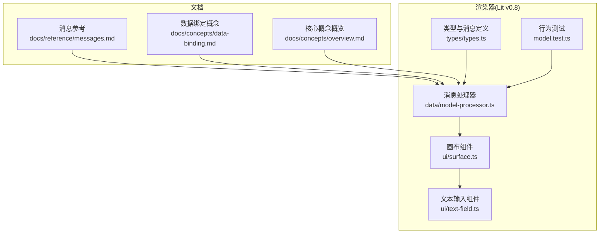
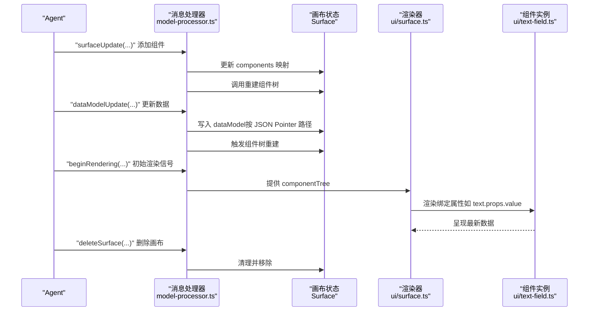
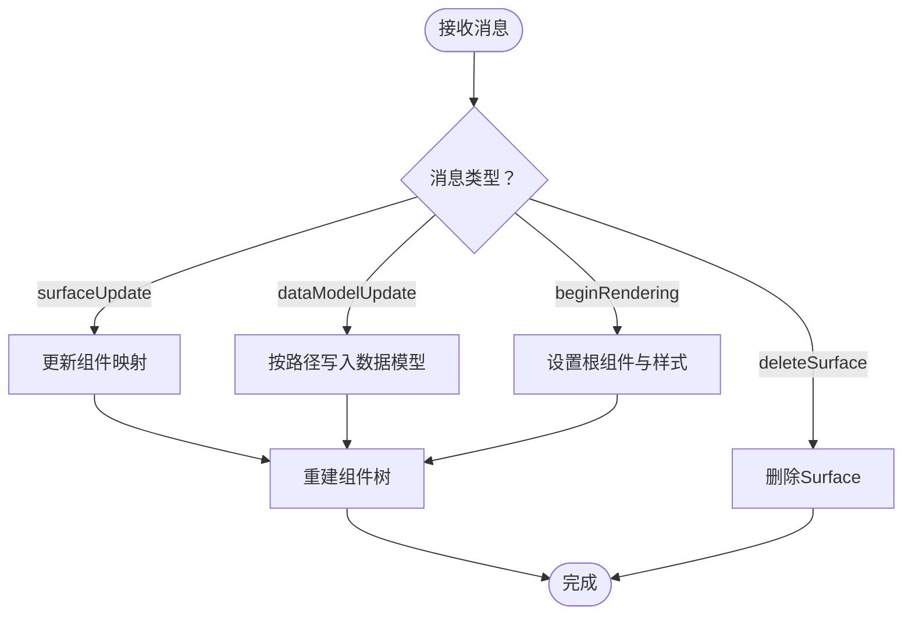
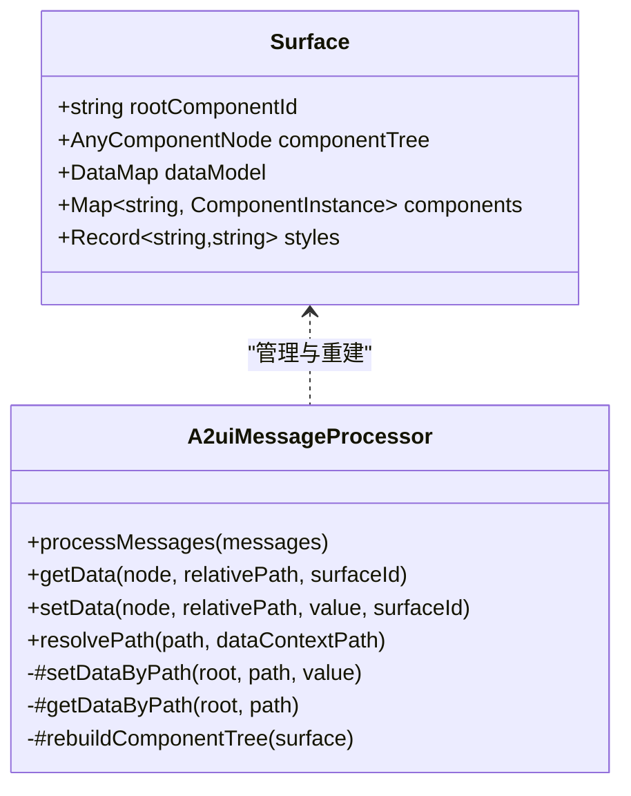
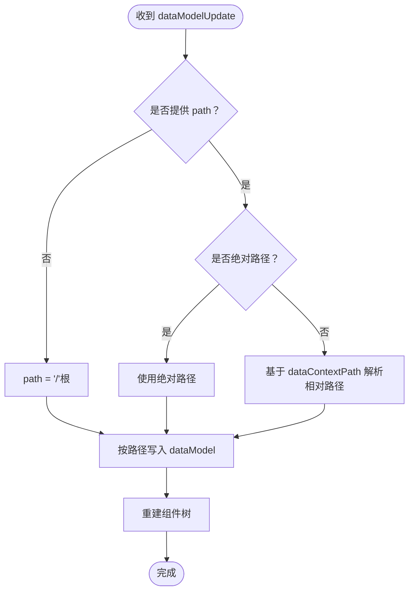
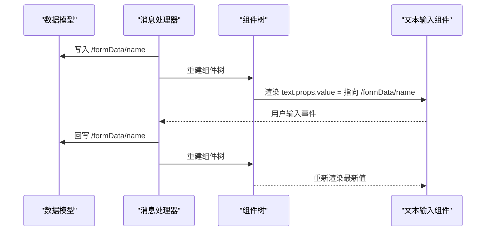
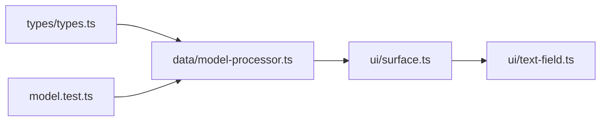

# 画布与数据模型

<cite>
**本文引用的文件**
- [docs/reference/messages.md](file://docs/reference/messages.md)
- [docs/concepts/data-binding.md](file://docs/concepts/data-binding.md)
- [docs/concepts/overview.md](file://docs/concepts/overview.md)
- [renderers/lit/src/0.8/types/types.ts](file://renderers/lit/src/0.8/types/types.ts)
- [renderers/lit/src/0.8/data/model-processor.ts](file://renderers/lit/src/0.8/data/model-processor.ts)
- [renderers/lit/src/0.8/ui/surface.ts](file://renderers/lit/src/0.8/ui/surface.ts)
- [renderers/lit/src/0.8/ui/text-field.ts](file://renderers/lit/src/0.8/ui/text-field.ts)
- [renderers/lit/src/0.8/model.test.ts](file://renderers/lit/src/0.8/model.test.ts)
</cite>

## 目录
1. [引言](#引言)
2. [项目结构](#项目结构)
3. [核心组件](#核心组件)
4. [架构总览](#架构总览)
5. [详细组件分析](#详细组件分析)
6. [依赖关系分析](#依赖关系分析)
7. [性能考量](#性能考量)
8. [故障排查指南](#故障排查指南)
9. [结论](#结论)

## 引言
本文件围绕 A2UI 运行时中“画布（Surface）”与“数据模型（Data Model）”的协同工作机制展开，目标是帮助读者理解：
- 画布作为独立 UI 渲染上下文的概念与生命周期（通过 createSurface 语义化消息创建、deleteSurface 消息销毁）
- 画布的两大核心组成：组件树（Component Tree）与数据模型（Data Model）
- dataModelUpdate 如何通过 JSON Pointer 精确更新模型中的特定字段
- 数据绑定如何将组件属性（如 text.props.value）链接到数据模型路径（如 /formData/name）

为便于非技术背景读者理解，本文采用分层讲解方式，从高层概念到代码级细节逐步展开，并辅以图示帮助建立整体认知。

## 项目结构
本仓库包含多语言渲染器与文档，其中与“画布与数据模型”直接相关的核心实现位于 Lit 渲染器的 v0.8 版本中，类型定义与消息处理器集中于以下文件：
- 类型与消息定义：renderers/lit/src/0.8/types/types.ts
- 消息处理与组件树重建：renderers/lit/src/0.8/data/model-processor.ts
- 画布渲染入口：renderers/lit/src/0.8/ui/surface.ts
- 文档参考：docs/reference/messages.md、docs/concepts/data-binding.md、docs/concepts/overview.md
- 组件绑定示例：renderers/lit/src/0.8/ui/text-field.ts
- 行为验证测试：renderers/lit/src/0.8/model.test.ts

图表来源
- [docs/reference/messages.md](file://docs/reference/messages.md#L1-L397)
- [docs/concepts/data-binding.md](file://docs/concepts/data-binding.md#L1-L133)
- [docs/concepts/overview.md](file://docs/concepts/overview.md#L1-L34)
- [renderers/lit/src/0.8/types/types.ts](file://renderers/lit/src/0.8/types/types.ts#L248-L299)
- [renderers/lit/src/0.8/data/model-processor.ts](file://renderers/lit/src/0.8/data/model-processor.ts#L97-L124)
- [renderers/lit/src/0.8/ui/surface.ts](file://renderers/lit/src/0.8/ui/surface.ts#L1-L135)
- [renderers/lit/src/0.8/ui/text-field.ts](file://renderers/lit/src/0.8/ui/text-field.ts#L104-L131)
- [renderers/lit/src/0.8/model.test.ts](file://renderers/lit/src/0.8/model.test.ts#L1203-L1253)

章节来源
- [docs/reference/messages.md](file://docs/reference/messages.md#L1-L397)
- [docs/concepts/data-binding.md](file://docs/concepts/data-binding.md#L1-L133)
- [docs/concepts/overview.md](file://docs/concepts/overview.md#L1-L34)
- [renderers/lit/src/0.8/types/types.ts](file://renderers/lit/src/0.8/types/types.ts#L248-L299)
- [renderers/lit/src/0.8/data/model-processor.ts](file://renderers/lit/src/0.8/data/model-processor.ts#L97-L124)
- [renderers/lit/src/0.8/ui/surface.ts](file://renderers/lit/src/0.8/ui/surface.ts#L1-L135)
- [renderers/lit/src/0.8/ui/text-field.ts](file://renderers/lit/src/0.8/ui/text-field.ts#L104-L131)
- [renderers/lit/src/0.8/model.test.ts](file://renderers/lit/src/0.8/model.test.ts#L1203-L1253)

## 核心组件
- 画布（Surface）：每个 Surface 是一个独立的 UI 渲染上下文，包含：
  - 组件树（Component Tree）：由 rootComponentId 指向的根节点开始，递归解析组件属性与子节点，形成可渲染的树结构
  - 数据模型（Data Model）：一个键值对对象（DataMap），用于存储动态数据
- 消息协议：
  - surfaceUpdate：在指定 Surface 中添加或更新组件
  - dataModelUpdate：更新指定 Surface 的数据模型
  - beginRendering：信号客户端已具备初始渲染条件
  - deleteSurface：删除指定 Surface 及其组件与数据

章节来源
- [docs/reference/messages.md](file://docs/reference/messages.md#L72-L355)
- [renderers/lit/src/0.8/types/types.ts](file://renderers/lit/src/0.8/types/types.ts#L525-L533)
- [renderers/lit/src/0.8/data/model-processor.ts](file://renderers/lit/src/0.8/data/model-processor.ts#L405-L439)

## 架构总览
下图展示了从消息到渲染的整体流程，以及画布与数据模型之间的协作关系。

图表来源
- [docs/reference/messages.md](file://docs/reference/messages.md#L72-L355)
- [renderers/lit/src/0.8/data/model-processor.ts](file://renderers/lit/src/0.8/data/model-processor.ts#L97-L124)
- [renderers/lit/src/0.8/ui/surface.ts](file://renderers/lit/src/0.8/ui/surface.ts#L117-L125)
- [renderers/lit/src/0.8/ui/text-field.ts](file://renderers/lit/src/0.8/ui/text-field.ts#L104-L131)

## 详细组件分析

### 画布生命周期与消息处理
- 创建与销毁
  - 创建：首次收到 surfaceUpdate 或 beginRendering 即隐式创建 Surface；随后 beginRendering 会设置 rootComponentId 并触发组件树重建
  - 销毁：deleteSurface 会从内存中移除该 Surface
- 关键处理逻辑
  - 处理 surfaceUpdate：将组件加入 Surface.components 映射，然后重建组件树
  - 处理 dataModelUpdate：根据 path（默认根路径）写入 dataModel，再重建组件树
  - 处理 beginRendering：设置 root 与样式，重建组件树
  - 处理 deleteSurface：删除对应 Surface

图表来源
- [renderers/lit/src/0.8/data/model-processor.ts](file://renderers/lit/src/0.8/data/model-processor.ts#L97-L124)
- [renderers/lit/src/0.8/data/model-processor.ts](file://renderers/lit/src/0.8/data/model-processor.ts#L405-L439)

章节来源
- [docs/reference/messages.md](file://docs/reference/messages.md#L72-L355)
- [renderers/lit/src/0.8/data/model-processor.ts](file://renderers/lit/src/0.8/data/model-processor.ts#L97-L124)
- [renderers/lit/src/0.8/data/model-processor.ts](file://renderers/lit/src/0.8/data/model-processor.ts#L405-L439)

### 组件树与数据模型
- 组件树（Component Tree）
  - 由 rootComponentId 指向的根节点开始，递归解析组件属性与子节点
  - 支持显式列表与模板两种子节点扩展方式
  - 模板渲染时，会根据 dataBinding 指定的数据路径读取数组或映射，生成多个子节点
- 数据模型（Data Model）
  - 以 DataMap 形式存储，支持对象与数组
  - 支持 JSON Pointer 路径访问与写入
  - 支持将字符串值解析为 JSON 对象或数组，便于复杂数据传递

图表来源
- [renderers/lit/src/0.8/types/types.ts](file://renderers/lit/src/0.8/types/types.ts#L525-L533)
- [renderers/lit/src/0.8/data/model-processor.ts](file://renderers/lit/src/0.8/data/model-processor.ts#L126-L201)
- [renderers/lit/src/0.8/data/model-processor.ts](file://renderers/lit/src/0.8/data/model-processor.ts#L257-L346)
- [renderers/lit/src/0.8/data/model-processor.ts](file://renderers/lit/src/0.8/data/model-processor.ts#L441-L470)

章节来源
- [renderers/lit/src/0.8/types/types.ts](file://renderers/lit/src/0.8/types/types.ts#L525-L533)
- [renderers/lit/src/0.8/data/model-processor.ts](file://renderers/lit/src/0.8/data/model-processor.ts#L126-L201)
- [renderers/lit/src/0.8/data/model-processor.ts](file://renderers/lit/src/0.8/data/model-processor.ts#L257-L346)
- [renderers/lit/src/0.8/data/model-processor.ts](file://renderers/lit/src/0.8/data/model-processor.ts#L441-L470)

### JSON Pointer 路径与数据模型更新
- dataModelUpdate 的 contents 使用“键值对邻接表”格式，每项包含 key 与一个 value* 字段（valueString/valueNumber/valueBoolean/valueMap）
- 当 path 省略时，默认写入根路径；当提供 path 时，按 JSON Pointer 路径定位并更新相应位置
- 路径解析支持绝对路径与相对路径（基于节点 dataContextPath），并能将点号/方括号等表示法标准化为标准 JSON Pointer

图表来源
- [docs/reference/messages.md](file://docs/reference/messages.md#L217-L301)
- [renderers/lit/src/0.8/data/model-processor.ts](file://renderers/lit/src/0.8/data/model-processor.ts#L181-L196)
- [renderers/lit/src/0.8/data/model-processor.ts](file://renderers/lit/src/0.8/data/model-processor.ts#L257-L346)

章节来源
- [docs/reference/messages.md](file://docs/reference/messages.md#L217-L301)
- [renderers/lit/src/0.8/data/model-processor.ts](file://renderers/lit/src/0.8/data/model-processor.ts#L181-L196)
- [renderers/lit/src/0.8/data/model-processor.ts](file://renderers/lit/src/0.8/data/model-processor.ts#L257-L346)

### 数据绑定：从模型到组件
- 组件属性可通过“路径值”或“字面量值”进行绑定
- 路径值使用 JSON Pointer 定位数据模型中的字段
- 特殊路径“.”表示使用节点自身的 dataContextPath，常用于模板渲染时的局部绑定
- 文本输入组件（TextField）等交互组件支持双向绑定：用户输入会回写到数据模型对应路径

图表来源
- [docs/concepts/data-binding.md](file://docs/concepts/data-binding.md#L45-L133)
- [renderers/lit/src/0.8/ui/text-field.ts](file://renderers/lit/src/0.8/ui/text-field.ts#L104-L131)
- [renderers/lit/src/0.8/data/model-processor.ts](file://renderers/lit/src/0.8/data/model-processor.ts#L126-L179)

章节来源
- [docs/concepts/data-binding.md](file://docs/concepts/data-binding.md#L45-L133)
- [renderers/lit/src/0.8/ui/text-field.ts](file://renderers/lit/src/0.8/ui/text-field.ts#L104-L131)
- [renderers/lit/src/0.8/data/model-processor.ts](file://renderers/lit/src/0.8/data/model-processor.ts#L126-L179)

### 表单场景示例：Agent 发送 dataModelUpdate 更新用户姓名
- 场景描述
  - Agent 发送 dataModelUpdate，将 /formData/name 更新为新值
  - 客户端收到后写入数据模型并重建组件树
  - 绑定到该路径的文本字段自动刷新显示最新值
- 验证依据
  - 文档明确指出：当数据变化时，绑定到该路径的组件会自动更新
  - 测试覆盖了多表面场景，确保不同 Surface 的数据与组件相互隔离

章节来源
- [docs/concepts/data-binding.md](file://docs/concepts/data-binding.md#L60-L106)
- [renderers/lit/src/0.8/model.test.ts](file://renderers/lit/src/0.8/model.test.ts#L1255-L1331)

## 依赖关系分析
- 消息处理器依赖类型定义（消息体、Surface 结构、组件节点类型）
- 画布组件依赖消息处理器提供的组件树与样式信息
- 文本输入组件依赖消息处理器的路径解析与数据读取能力
- 行为测试覆盖了模板渲染、多表面隔离、路径解析等关键路径

图表来源
- [renderers/lit/src/0.8/types/types.ts](file://renderers/lit/src/0.8/types/types.ts#L248-L299)
- [renderers/lit/src/0.8/data/model-processor.ts](file://renderers/lit/src/0.8/data/model-processor.ts#L97-L124)
- [renderers/lit/src/0.8/ui/surface.ts](file://renderers/lit/src/0.8/ui/surface.ts#L117-L125)
- [renderers/lit/src/0.8/ui/text-field.ts](file://renderers/lit/src/0.8/ui/text-field.ts#L104-L131)
- [renderers/lit/src/0.8/model.test.ts](file://renderers/lit/src/0.8/model.test.ts#L1203-L1253)

章节来源
- [renderers/lit/src/0.8/types/types.ts](file://renderers/lit/src/0.8/types/types.ts#L248-L299)
- [renderers/lit/src/0.8/data/model-processor.ts](file://renderers/lit/src/0.8/data/model-processor.ts#L97-L124)
- [renderers/lit/src/0.8/ui/surface.ts](file://renderers/lit/src/0.8/ui/surface.ts#L117-L125)
- [renderers/lit/src/0.8/ui/text-field.ts](file://renderers/lit/src/0.8/ui/text-field.ts#L104-L131)
- [renderers/lit/src/0.8/model.test.ts](file://renderers/lit/src/0.8/model.test.ts#L1203-L1253)

## 性能考量
- 增量更新优先：尽量使用 granular updates（针对具体路径）而非替换整个数据模型，减少不必要的重建
- 模板渲染：当数据到达较晚时，组件树会在 dataModelUpdate 后重建，避免提前渲染空列表
- 多表面隔离：不同 Surface 的组件与数据相互独立，避免跨表面的无谓重建

章节来源
- [docs/reference/messages.md](file://docs/reference/messages.md#L293-L301)
- [renderers/lit/src/0.8/model.test.ts](file://renderers/lit/src/0.8/model.test.ts#L478-L541)

## 故障排查指南
- 常见问题与定位
  - 组件未渲染：确认已收到 beginRendering 且 rootComponentId 已设置
  - 绑定无效：检查组件属性的 path 是否正确，以及 dataModel 中是否存在对应路径
  - 路径错误：使用 resolvePath 规则（绝对路径优先、相对路径基于 dataContextPath）
  - 循环引用：组件树构建过程中检测到循环引用会抛出错误
- 建议步骤
  - 先发送 surfaceUpdate 定义组件，再发送 dataModelUpdate 注入数据，最后发送 beginRendering
  - 在测试中使用多表面隔离场景验证不同 Surface 的独立性

章节来源
- [docs/reference/messages.md](file://docs/reference/messages.md#L358-L397)
- [renderers/lit/src/0.8/data/model-processor.ts](file://renderers/lit/src/0.8/data/model-processor.ts#L441-L470)
- [renderers/lit/src/0.8/model.test.ts](file://renderers/lit/src/0.8/model.test.ts#L1255-L1331)

## 结论
A2UI 的画布与数据模型通过消息驱动的方式实现了高内聚、低耦合的 UI 渲染体系：
- 画布（Surface）承载组件树与数据模型，生命周期由消息驱动
- dataModelUpdate 以 JSON Pointer 精准更新模型，配合数据绑定实现组件的自动刷新
- 组件树的构建与重建保证了模板渲染与增量更新的灵活性
- 多表面隔离与路径解析规则共同保障了复杂场景下的稳定性与可维护性