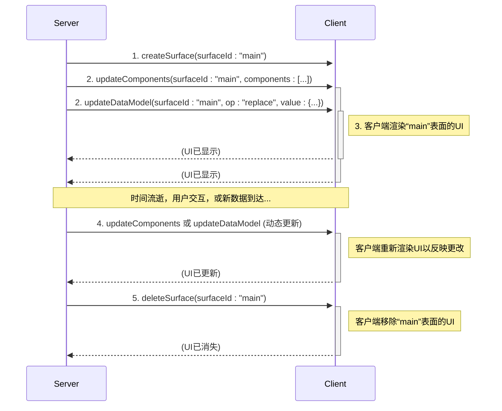

# 项目概述

<cite>
**本文档中引用的文件**  
- [README.md](file://README.md)
- [what-is-a2ui.md](file://docs/introduction/what-is-a2ui.md)
- [overview.md](file://docs/concepts/overview.md)
- [a2ui_protocol.md](file://specification/0.9/docs/a2ui_protocol.md)
- [messages.md](file://docs/reference/messages.md)
- [agent.py](file://samples/agent/adk/restaurant_finder/agent.py)
- [app.ts](file://samples/client/lit/shell/app.ts)
- [a2ui_extension.py](file://a2a_agents/python/a2ui_extension/src/a2ui/a2ui_extension.py)
- [client-setup.md](file://docs/guides/client-setup.md)
- [agent-development.md](file://docs/guides/agent-development.md)
- [renderer.ts](file://renderers/angular/src/lib/rendering/renderer.ts)
- [core.ts](file://renderers/lit/src/0.8/core.ts)
- [server_to_client.json](file://specification/0.9/json/server_to_client.json)
</cite>

## 目录
1. [引言](#引言)
2. [核心目的与架构设计](#核心目的与架构设计)
3. [跨框架UI渲染机制](#跨框架ui渲染机制)
4. [主要功能详解](#主要功能详解)
5. [AI代理生态系统中的角色](#ai代理生态系统中的角色)
6. "Hello World"式UI生成示例
7. [设计原则](#设计原则)
8. [与A2A协议的集成](#与a2a协议的集成)
9. [结论](#结论)

## 引言

A2UI（Agent to UI）是一个开源项目，旨在解决生成式AI代理在创建丰富、交互式用户界面时面临的挑战。该项目提供了一种声明式的JSON格式，使AI代理能够生成可更新的用户界面，并通过客户端的原生组件库进行渲染。A2UI的核心理念是让代理生成的UI既像数据一样安全，又像代码一样富有表现力。

A2UI目前处于v0.8公开预览版阶段，其规范和实现仍在不断演进。项目旨在通过开放协作，收集反馈并鼓励贡献，特别是在客户端渲染器方面。A2UI的设计哲学强调安全性、LLM友好性、框架无关性和灵活性，使其成为构建跨平台、生成式或基于模板的UI响应的理想选择。

**Section sources**
- [README.md](file://README.md#L1-L169)
- [what-is-a2ui.md](file://docs/introduction/what-is-a2ui.md#L1-L96)

## 核心目的与架构设计

A2UI的核心目的是为AI代理提供一种安全、高效且跨平台的方式来生成用户界面。传统的文本交互方式效率低下，而直接在客户端执行由代理生成的任意代码（如HTML/JavaScript）则存在严重的安全风险。A2UI通过将UI描述为声明式的数据而非可执行代码，解决了这一难题。

其架构设计围绕三个核心概念展开：**流式消息**、**声明式组件**和**数据绑定**。UI的更新以一系列从代理到客户端的JSON消息流形式进行。这些消息描述了UI的意图，而不是具体的实现方式。客户端接收到这些消息后，使用其自身的原生组件库（如Angular、Lit、Flutter等）来渲染UI，从而确保了UI的安全性和原生体验。

A2UI协议定义了四种主要的消息类型：`createSurface`、`updateComponents`、`updateDataModel`和`deleteSurface`。这些消息共同构成了一个单向的UI更新流。服务器（代理）发送消息来创建、更新或删除UI表面，而客户端负责解析这些消息并相应地构建和更新UI。用户交互则通过单独的通道（如`userAction`消息）处理，这保持了数据流的清晰和单向性。



**Diagram sources**
- [a2ui_protocol.md](file://specification/0.9/docs/a2ui_protocol.md#L43-L74)

**Section sources**
- [what-is-a2ui.md](file://docs/introduction/what-is-a2ui.md#L1-L96)
- [overview.md](file://docs/concepts/overview.md#L1-L34)
- [a2ui_protocol.md](file://specification/0.9/docs/a2ui_protocol.md#L1-L473)

## 跨框架UI渲染机制

A2UI通过其声明式的JSON格式和组件目录（Catalog）机制，实现了真正的跨框架UI渲染。代理生成的JSON消息不包含任何特定于框架的代码，而是描述了UI的抽象结构和所需的数据。这个JSON消息中的`catalogId`字段指定了客户端应使用的组件目录，该目录定义了所有可用的UI组件（如`Text`、`Button`、`Card`等）及其属性。

当客户端接收到`updateComponents`消息时，其渲染器会解析消息中的组件列表。对于列表中的每个组件，渲染器会根据其`component`类型（如`"Text"`）在本地的组件目录中查找对应的实现。例如，在Angular渲染器中，`Text`组件类型可能映射到一个名为`A2uiTextComponent`的Angular组件；而在Lit渲染器中，则可能映射到一个名为`A2uiText`的Web组件。这种映射完全由客户端控制，确保了安全性和与应用整体风格的一致性。

这种机制的关键在于**分离了UI的结构与实现**。代理只关心“要显示什么”，而客户端则负责“如何显示”。这使得同一个A2UI JSON消息可以在基于Angular的Web应用、基于Lit的Web应用、基于Flutter的移动应用，甚至是基于SwiftUI的iOS应用上被正确渲染，而无需为每个平台重新生成UI。

**Section sources**
- [what-is-a2ui.md](file://docs/introduction/what-is-a2ui.md#L30-L38)
- [a2ui_protocol.md](file://specification/0.9/docs/a2ui_protocol.md#L99-L103)
- [renderer.ts](file://renderers/angular/src/lib/rendering/renderer.ts#L73-L103)

## 主要功能详解

### 动态界面生成

A2UI的核心功能之一是动态界面生成。AI代理可以根据用户的查询实时生成完全定制的UI。例如，当用户请求“预订明天晚上7点的两人桌”时，代理可以生成一个包含日期选择器、时间选择器和提交按钮的表单，而不是通过多轮文本问答来收集信息。这种能力极大地提升了用户体验和交互效率。

动态生成是通过`updateComponents`消息实现的。代理可以发送一个包含`Column`、`DateTimeInput`和`Button`等组件的组件列表，客户端会立即渲染出相应的UI。这种生成是增量的，代理可以分批发送组件定义，实现渐进式渲染，让用户感觉UI是即时生成的。

### 增量更新

A2UI支持高效的增量更新，这对于响应式和动态的UI至关重要。代理无需在每次更改时都发送整个UI的完整快照。相反，它可以发送`updateComponents`消息来添加、修改或删除单个组件，或发送`updateDataModel`消息来更新底层数据。

例如，一个餐厅搜索代理可以先发送组件定义来渲染一个空的列表，然后在获取到餐厅数据后，再发送`updateDataModel`消息来填充列表内容。如果用户更改了搜索条件，代理可以只发送新的`updateDataModel`消息，而无需重新发送整个组件树。这种机制减少了网络传输量，并使UI更新更加流畅。

### 组件化架构

A2UI采用了一种基于**邻接表模型**（adjacency list model）的组件化架构。UI被定义为一个扁平的组件列表，组件之间的父子关系通过ID引用来建立。例如，一个`Column`组件会有一个`children`属性，其值是一个包含子组件ID的数组。

这种扁平结构比传统的嵌套JSON树更易于LLM生成和增量更新。代理可以按任意顺序发送组件定义，只要在触发渲染前所有必要的组件都已定义即可。客户端在渲染时，会将这些扁平的组件列表重新构建成一个树状结构。这种设计还简化了组件的更新和删除操作。

### 主题化支持

A2UI支持主题化，允许开发者自定义UI的外观和感觉。虽然A2UI本身不提供一个复杂的样式系统，但它通过`catalogId`和客户端的样式控制来实现主题化。开发者可以创建自定义的组件目录（如`material_catalog.json`或`cupertino_catalog.json`），这些目录中的组件实现可以应用Material Design或Cupertino等设计语言的样式。

此外，客户端应用可以使用其自身的CSS或样式系统来覆盖和定制A2UI组件的外观。例如，`a2ui-shell`示例应用就通过CSS变量（如`--p-40`、`--n-100`）来定义主题颜色，并允许用户通过按钮在亮色和暗色主题之间切换。

**Section sources**
- [what-is-a2ui.md](file://docs/introduction/what-is-a2ui.md#L88-L93)
- [overview.md](file://docs/concepts/overview.md#L15-L23)
- [a2ui_protocol.md](file://specification/0.9/docs/a2ui_protocol.md#L238-L247)
- [app.ts](file://samples/client/lit/shell/app.ts#L28-L59)

## AI代理生态系统中的角色

在AI代理生态系统中，A2UI扮演着连接代理智能与用户交互的关键桥梁角色。它允许远程或跨信任边界的代理安全地生成和更新UI，而无需直接访问或控制客户端应用。

A2UI与A2A（Agent-to-Agent）协议紧密集成。A2A协议定义了代理之间的通信标准，而A2UI则作为A2A消息中的一种特定数据类型（MIME类型为`application/json+a2ui`），用于承载UI描述。当一个主代理需要委托一个子代理（如一个专门的旅行预订代理）时，它可以使用A2A协议与子代理通信，子代理则通过A2A消息返回一个A2UI有效载荷。主代理再将这个A2UI有效载荷转发给客户端，从而在主聊天窗口中嵌入一个由子代理生成的UI。

这种架构使得复杂的、多代理的工作流成为可能。例如，一个“组织者代理”可以协调多个“专家代理”（如餐厅代理、酒店代理、交通代理），并将它们生成的UI无缝地组合在一起，为用户提供一个统一的、自适应的交互体验。

**Section sources**
- [README.md](file://README.md#L96-L97)
- [a2ui_extension.py](file://a2a_agents/python/a2ui_extension/src/a2ui/a2ui_extension.py#L23-L50)
- [agent-development.md](file://docs/guides/agent-development.md#L1-L183)

## "Hello World"式UI生成示例

以下是一个简单的“Hello World”式UI生成示例，展示了A2UI的工作流程。代理将生成一个包含标题和按钮的简单界面。

1.  **创建表面**：代理首先发送一个`createSurface`消息来初始化一个名为`"hello_world"`的UI表面。
    ```json
    {"createSurface": {"surfaceId": "hello_world", "catalogId": "https://a2ui.dev/specification/0.9/standard_catalog_definition.json"}}
    ```

2.  **更新组件**：接着，代理发送一个`updateComponents`消息，定义一个`Column`作为根组件，其下包含一个`Text`组件和一个`Button`组件。
    ```json
    {"updateComponents": {"surfaceId": "hello_world", "components": [
      {"id": "root", "component": "Column", "children": ["title", "btn"]},
      {"id": "title", "component": "Text", "text": "Hello, World!"},
      {"id": "btn", "component": "Button", "child": "btn_label"},
      {"id": "btn_label", "component": "Text", "text": "Click Me"}
    ]}}
    ```

3.  **触发渲染**：最后，代理发送一个`beginRendering`消息，指示客户端开始渲染该表面。
    ```json
    {"beginRendering": {"surfaceId": "hello_world", "root": "root"}}
    ```

客户端接收到这些消息后，会创建一个表面，解析组件列表，并使用其原生组件库渲染出一个垂直布局，其中包含一个“Hello, World!”的文本和一个“Click Me”的按钮。当用户点击按钮时，客户端会捕获`userAction`事件并将其发送回代理，代理可以据此生成新的响应。

**Section sources**
- [what-is-a2ui.md](file://docs/introduction/what-is-a2ui.md#L43-L60)
- [messages.md](file://docs/reference/messages.md#L1-L397)

## 设计原则

A2UI的设计遵循了几个关键原则，这些原则是其成功和安全性的基础。

### 安全性

安全性是A2UI的首要原则。通过使用声明式的数据格式而非可执行代码，A2UI从根本上消除了远程代码执行的风险。客户端维护一个“目录”（catalog），其中只包含预先批准和信任的UI组件。代理只能请求渲染目录中的组件，而不能引入新的、潜在恶意的代码。这确保了即使代理被恶意利用，也无法直接危害客户端应用。

### 可扩展性

A2UI具有高度的可扩展性。其模块化的架构允许轻松添加新的渲染器（如React、SwiftUI）和新的传输协议（如REST、gRPC）。组件目录的设计也支持扩展，开发者可以定义自己的“智能包装器”（Smart Wrapper），将现有的UI组件（包括安全的iframe容器）连接到A2UI的数据绑定和事件系统，从而在保持安全的同时实现功能扩展。

### 框架无关性

框架无关性是A2UI的核心优势。通过将UI的抽象描述与具体实现分离，A2UI实现了真正的跨平台兼容性。代理生成的JSON是平台中立的，可以被任何实现了A2UI规范的客户端渲染器所理解。这使得开发者可以自由选择最适合其应用的技术栈，而无需担心UI的兼容性问题。

**Section sources**
- [README.md](file://README.md#L38-L64)
- [what-is-a2ui.md](file://docs/introduction/what-is-a2ui.md#L72-L78)

## 与A2A协议的集成

A2UI与A2A协议的集成是其在代理生态系统中发挥作用的关键。A2A协议为代理之间的通信提供了标准化的框架，而A2UI则作为其承载UI数据的有效载荷格式。

在Python的A2A代理扩展中，通过`create_a2ui_part`函数将A2UI数据包装成一个A2A `Part`对象，并设置其MIME类型为`application/json+a2ui`。当客户端请求A2UI扩展时，代理会通过`try_activate_a2ui_extension`函数激活该扩展。这使得A2A消息能够无缝地携带A2UI指令，实现了代理间通信与UI生成的统一。

这种集成方式确保了A2UI可以作为更广泛的代理通信标准的一部分，而不是一个孤立的解决方案。它允许开发者构建复杂的、由多个代理协同工作的应用，其中UI的生成和逻辑处理可以分布在不同的代理上。

**Section sources**
- [a2ui_extension.py](file://a2a_agents/python/a2ui_extension/src/a2ui/a2ui_extension.py#L1-L118)
- [client-setup.md](file://docs/guides/client-setup.md#L66-L77)

## 结论

A2UI是一个创新的、以安全为核心的声明式UI协议，它为AI代理生成动态、交互式用户界面提供了一个强大而灵活的解决方案。通过将UI描述为可验证的JSON数据，并将其与客户端的原生组件实现分离，A2UI成功地在表现力和安全性之间取得了平衡。

其核心功能——动态界面生成、增量更新、组件化架构和主题化支持——共同构建了一个能够适应复杂、多代理工作流的现代UI系统。与A2A协议的深度集成使其成为构建下一代AI驱动应用的理想选择。尽管目前仍处于预览阶段，但A2UI的设计原则和架构已经展现出巨大的潜力，有望成为AI代理与用户交互的标准方式。